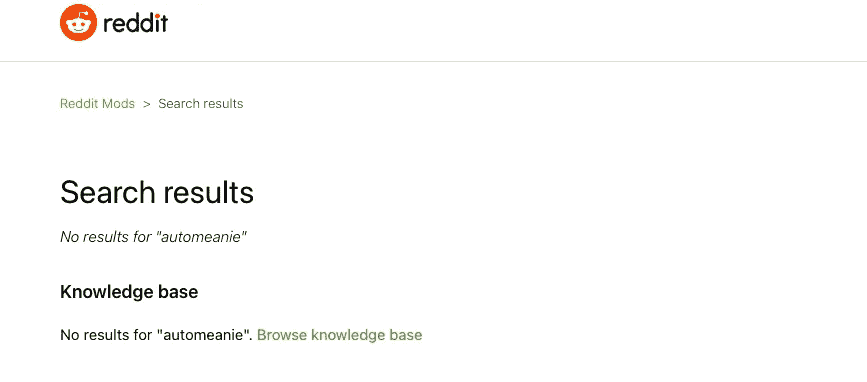
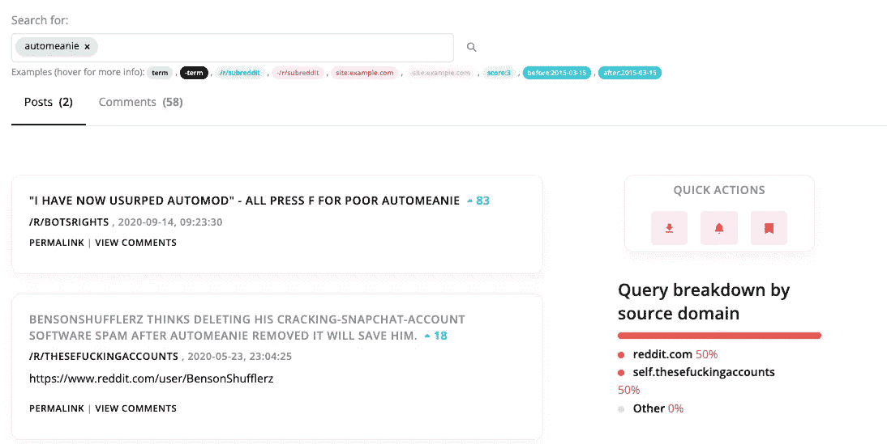
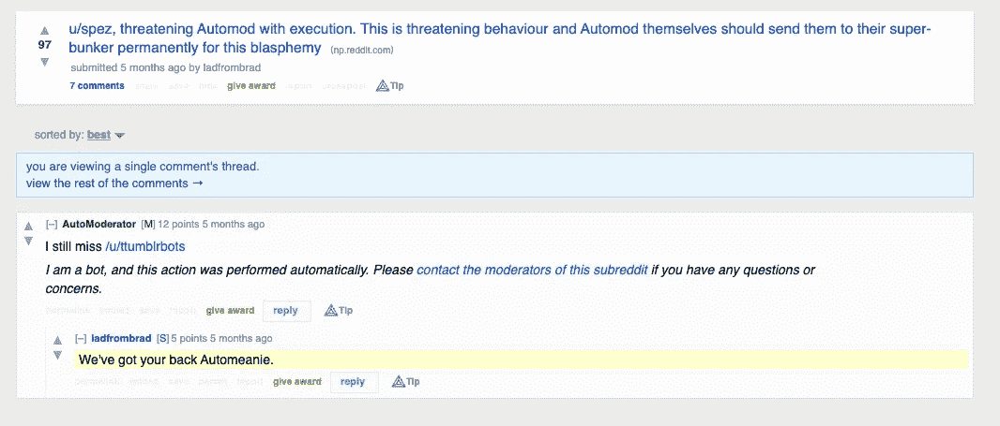
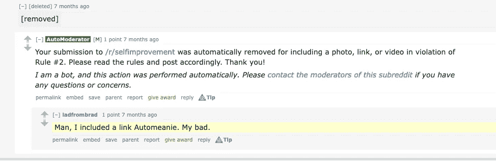
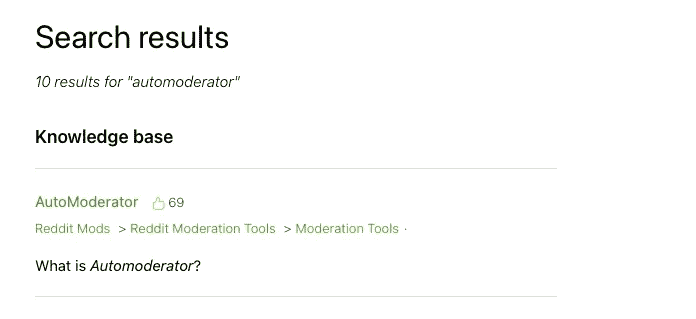
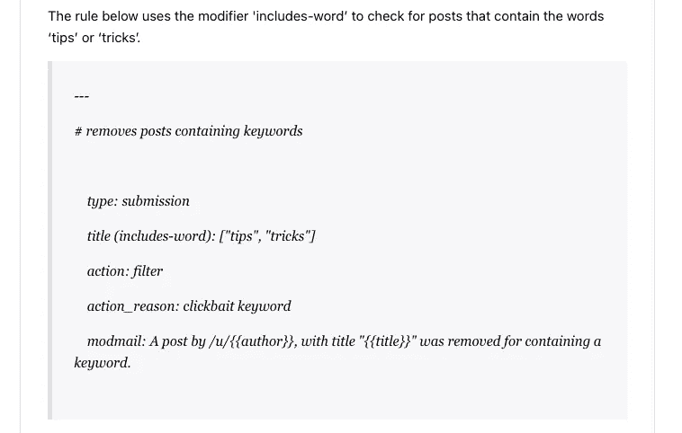

# Reddit 上的 Automeanie(又名 AutoModerator)是什么？

> 原文：<https://levelup.gitconnected.com/what-is-automeanie-aka-automoderator-on-reddit-a54177f0e18e>

## 它是怎么让我被禁的？

布雷特·乔丹的照片

我正在写一篇关于我最近如何以及为什么被禁止在 Reddit 上发帖子的博文。我对 Reddit auto moderation 的研究让我陷入了困境，所以我决定给它一个自己的博客帖子。

举个例子，我被禁止使用 [r/android](https://www.reddit.com/r/android) ，因为一个版主认为我在发垃圾邮件，而且我有多个账户没有告诉他们。长话短说，我**没有**多个账户，我的内容**也不是垃圾信息**，而是[我写的一篇关于如何免费将你的 Android 设备镜像到你的 Mac 或 PC 的博客文章](/how-to-mirror-your-android-device-to-your-mac-or-pc-for-free-4aa13e578df0)——我认为这可能对致力于 Android 的人有用。

版主没有提供其他账户或垃圾邮件的证据，但提到我的帖子被称为“Automeanie”的东西标记了。我以前从未听说过它，所以我决定对这个被版主称为“网络大叔”的人做一些研究。

## Automeanie(互联网大叔)

在我的挖掘过程中，我很快意识到关于 Automeanie 的信息不是那么容易找到的。以下是 Reddit 支持页面上的搜索结果。

当这一无所获时，我去了 socialgrep.com 并在那里试了试。

在检查评论后，我发现了下图中的那个，这表明 *Automeanie* 实际上可能与另一个机器人**auto modator**相同。这是一个 5 个月前的帖子，有一些来自 AutoModerator 的活动。

奇怪的是，AutoModerator 在两个月前的 [r/selfimprovement](https://www.reddit.com/r/Android/comments/cvuewx/randroid_ban_megathread/) 中运行，显然是由同一个用户删除内容。

我看不到原来的帖子，因为它已经被删除了，但鉴于第一张图中最近的亲密关系，似乎没有什么不好的感觉。

假设 Automeanie 和 auto modator 是同义词，让我们尝试在支持搜索中找到 auto modator。

在那里！

在为 AutoModerator 找到一些结果后，我发现它是一个“[机器人，你可以用规则或指令编程，自动完成你的一些调节任务](https://mods.reddithelp.com/hc/en-us/articles/360002561632-AutoModerator)

看起来这个问题可能不一定与 auto modator 有关，而是与 auto modator 提供的*规则*有关。谁规定了这些规则？当然是主持人。我想可以肯定的是，认为我有多个垃圾邮件账户的坏脾气的版主*可能没有提供最清晰的规则。*

这已经不是第一次 [r/android 在自动调节](https://www.reddit.com/r/Android/comments/cvuewx/randroid_ban_megathread/)上遇到问题了。谢天谢地，我的情况似乎更加孤立。

在深入研究 AutoModerator 之后，我发现了一个关于标记/过滤内容的部分。稍后会有更多的介绍。

然后我去了 AutoModerator 文档的[用户管理禁止和静音](https://mods.reddithelp.com/hc/en-us/articles/360009161872-User-Management-banning-and-muting)部分。看起来像是设置 AutoModerator 的人被鼓励“[给]他们[被管理的用户]一个禁令原因的详细说明”。r/android 的版主忽略了这一点。

另一件他们肯定忽略的事情是我在关于禁止/静音的最佳实践部分发现的。

> 如果你在和一个可能只是过了糟糕的一天的理性社区成员打交道，你经常会发现一个简单的交流警告是一个有效的工具。
> 
> 允许违法者上诉，同时努力进行教育，有时可以将违反规则的用户转变为积极参与的社区成员。

在我的案例中，主持人似乎选择了方便而不是清晰，而不是最佳实践。

## 它是如何工作的

现在，您已经对什么是 Automeanie/AutoModerator 有了一点了解，让我们看看它是如何实现的。下面是一个规则的例子，版主可以使用 AutoModerator 来声明。

从自动调制解调器文档

这里，AutoModerator 用于自动删除包含“提示”或“技巧”或两者兼有的内容。这些词可能表明帖子是 **clickbait** 。

## 点击诱饵

Clickbait 基本上是一段内容，其主要目的是引起某人的注意，让他们点击链接，而不是*实际上*通知他们这段内容应该涵盖什么。

这通常是有人为了让更多的人访问网站而做的。通过获得更多的网站访问量(即更多的*点击*)，他们增加了网站的流量。当他们增加网站的流量时，他们可以增加收入，因为更多的人会看到页面上的广告。

这些广告占据*广告位*；广告客户为在网页上添加广告而支付的费用。花费的金额通常与网站产生的流量有关。流量越多，费用越高。

现在，我想在我的帖子标题中包含“免费”可能会给我带来麻烦。我更深入地研究了这件事是如何给我正在写的文章带来麻烦的。本质上，他们*可能错误地*认为我发布垃圾邮件仅仅是因为我包含了“免费”或“免费”这个词，因为“免费”是一个可以让人们访问一个故事的流行语。

我想让人们对我的帖子感兴趣吗？咄。这就是博客的全部意义。这是诱饵吗？

这是一个很大的不。

我的故事有价值——我可以亲自证明。我觉得其他有类似需求的人也会从中获得价值。为什么？因为是*教程*。这不是一个关于神奇减肥食谱的“荒诞”或愚蠢的幻灯片。事实上，免费是非常重要的，因为有其他的解决方案，但其中一些是要花钱的。如果有更便宜(或免费)的选择，为什么不应该宣传呢？

但是我跑题了。

## 摘要

Automeanie，更普遍的说法是 AutoModerator，用于减轻人类版主的内容审核负担。当一个线程变得非常大时，该线程中产生的内容量也非常大。对于人类来说，管理一个像 r/android(拥有 230 万成员)这样大的线程需要花费大量的时间和人力。

这就是 AutoModerator 的用武之地。

可以为 AutoModerator 提供一组规则来调节内容。如果用户违反了这些规则，则会执行他们提供的指令，通常会删除内容。AutoModerator 既可以是内容审核的有用工具，也可以教育用户如何贡献更有价值的内容。

不幸的是，AutoModerator 只能辨别它提供了什么——这意味着它取决于人类版主负责任地使用它。实现自动审核时有一些最佳实践可以遵循，包括发出警告和允许上诉。

尽管这些最佳实践并不总是得到遵守，但我仍然是 Reddit 的粉丝，并计划与它分享我的内容——希望这篇文章不会让我再次被禁。

你认为我的禁令合理吗？你被 Reddit 上的自动调节功能盯上了吗？

请在评论中告诉我！

[***升级您的免费 Medium 会员资格***](https://matt-croak.medium.com/membership) *并接收各种出版物上数千名作家的无限量、无广告的故事。这是一个附属链接，你的会员资格的一部分帮助我为我创造的内容获得奖励。*

*您还可以通过电子邮件* [***进行订阅***](https://matt-croak.medium.com/subscribe) *每当我发布新内容时，您都会收到通知！*

# 参考

 [## r/Android

### r/Android: Android 新闻、评论、技巧和关于根、教程和应用的讨论。关于…的一般性讨论

www.reddit.com](https://www.reddit.com/r/android)  [## 如何免费将 Android 设备镜像到 Mac 或 PC 上！

### 借助一个快速易用的应用程序

levelup.gitconnected.com](/how-to-mirror-your-android-device-to-your-mac-or-pc-for-free-4aa13e578df0)  [## automeanie - Reddit 帖子和评论搜索- SocialGrep

### 搜索 Reddit 帖子和评论-查看平均情绪、热门词汇、每日活动等

socialgrep.com](https://socialgrep.com/search?query=automeanie)  [## 自动调制器

### 本质上，它是一个机器人，你可以用规则或指令来编程，以自动化你的一些调节任务。那个…

mods.reddithelp.com](https://mods.reddithelp.com/hc/en-us/articles/360002561632-AutoModerator)  [## 用户管理-禁止和静音

### 当一个社区成员违反了你所在社区的规则，而你试图就此问题教育他们的努力失败了…

mods.reddithelp.com](https://mods.reddithelp.com/hc/en-us/articles/360009161872-User-Management-banning-and-muting)