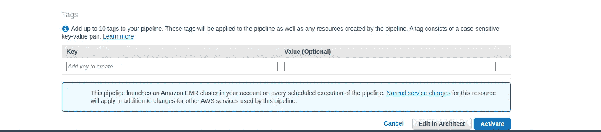

# 什么是 AWS 数据管道及其使用方式？

> 原文：<https://levelup.gitconnected.com/what-is-aws-data-pipeline-and-how-it-can-be-used-810fdfe96d30>

[昆腾·德格拉夫](https://unsplash.com/@quinten149)在[号航天飞机](https://unsplash.com/photos/L4gN0aeaPY4)上拍摄的照片

我列出了一些我没有亲自接触过的 AWS 网络服务，这就是我偶然发现 AWS 数据管道的时候。因此，我将对我所掌握的这项服务做一个基本的介绍，并提供一个实际的场景，我这样做是为了理解它的用法。

# 什么是 AWS 数据管道

摘自 AWS 文档本身:

> AWS 数据管道是一项 web 服务，可帮助您在指定的时间间隔内在不同的 AWS 计算和存储服务以及内部数据源之间可靠地处理和卸载数据。

在这篇特别的文章中，我将演示如何使用 AWS 数据管道，将数据从 DynamoDB 卸载到 S3。该 web 服务也可用于其他 AWS 存储服务，如 RDS 和红移。这些转换主要可以通过使用 AWS EC2 或 AWS EMR 来完成。

# AWS 数据管道组件

*   管道定义:基本上是如何将业务逻辑传递给 AWS 数据管道服务。它包含以下信息:
    - **数据节点:**数据源的名称、位置、格式等
    - **活动:**应该对数据进行的转换或操作。例如，将数据从一个源移动到另一个源，对数据执行查询我们为什么需要它
    - **计划:**上述活动应该多长时间运行一次
    - **先决条件:**在计划的活动可以运行之前必须满足的条件列表。例如，如果有一项活动要将数据从某个 AWS S3 存储桶移动到某个其他目标，则先决条件应在允许计划运行之前验证数据在 S3 的可用性。
    - **资源:**计算资源的详细信息，例如 EC2 实例或 EMR 集群。
    - **动作**:通知 AWS 数据管道的状态。例如通过 SES 发送电子邮件或触发警报等。
*   管道:调度和运行任务以执行预定义的活动。它包含以下内容的详细信息:
    - **管道组件**:这是为了定义将业务逻辑传递给 AWS 数据管道的方式。我们为什么需要它
    - **实例**:当 AWS 数据管道运行一个管道时，它会编译所有的管道组件，以便创建一组可操作的实例。这些实例将包含与特定任务相关的所有信息。
    - **尝试**:这是 AWS 数据管道允许您重试失败操作的地方。您还可以选择指定重试失败活动的次数。
*   Task Runner:这是一个应用程序，其中 AWS 数据管道将被轮询任务，然后这些任务将以有效的方式执行。任务运行器的示例工作流如下所示:

任务运行器工作流

# 本文的使用案例:

工作流程图

# 步骤:

1.创建两个 S3 桶，我们需要用它们来保存从 DynamoDB 导出的数据(datapipe-data-test ),并存储管道的日志文件(datapipe-store-logs)。

S3 水桶

2.当管道成功或失败时，我们还需要一个 SNS 主题来发送通知电子邮件。如果您在此之前尚未创建主题，请访问 AWS [文档](https://docs.aws.amazon.com/AmazonCloudWatch/latest/monitoring/US_SetupSNS.html)来设置 SNS 主题并添加电子邮件订阅。对于这个用例，我已经创建了一个 SNS 主题和一个订阅电子邮件，它处于确认状态，如下所示。

社交网络话题

3.从控制台创建数据管道。创建时，给定合适的名称后，请从“使用模板构建”列表中选择**“将 DynamoDB 表导出到 S3”**。对于本教程，我们将坚持使用**“将 DynamoDB 表导出到 S3”**模板**、**。

创建数据管道

在上面的**参数**部分，您必须给出适当的 DynamoDB 表的名称，您将使用它导出到我们的 S3 桶(在步骤 1 中创建)。我已经用 bookid、bookname 和 genre 属性创建了一个 DynamoDB 表(下面提供了截图)。你可以检查 AWS 文档来[创建](https://docs.aws.amazon.com/amazondynamodb/latest/developerguide/SampleData.CreateTables.html)一个表，然后添加必要的属性，最后向其中添加条目。

DynamoDB 表

4.一旦一切都设置好并准备好了，下一步进入在 Architect 中的**编辑选项，同时创建数据管道(在步骤 3 中)。**

5.您应该会看到如下界面:

在建筑师界面中编辑

确保所有参数都是正确的，如迪纳摩数据库表名，地区，S3 出口桶等。

6.作为下一步，应该向上述工作流添加两个新节点，以满足成功和失败 SNS 通知的需要。为了添加一个新的节点，您应该展开 **DataNodes** 部分，并点击最后的**添加一个可选字段**(我在下面的截图中已经指出了)。单击后，您应该会在列表中看到两个选项，如成功时的**和失败时的**。****

****

**选择每个选项后，您必须再次单击与其相邻的下拉菜单，以便为该节点创建一个新的**操作**。然后展开**其他**部分，依次填写 SNS 相关属性，如每个动作的 SNS 主题 Arn、消息、主题等。我已经为这两个新节点定义了属性，如下图所示。**

****

**我已经划掉了 ARN；请务必在这两个地方输入您的 SNS 主题的 ARN，并根据管道的状态，提供适用的主题和您希望在电子邮件中作为通知发送给订户的消息。在上面的截图中也可以看到，在界面中可以看到重命名的两个节点(失败时和成功时)。**

**您有时可能会在屏幕截图中看到一条警告，位于管道界面的底部，提示 **terminateAfter 缺失。**您可能需要在激活管道之前解决这个问题。事实上，在运行管道之前，请确保解决底部可能出现的所有警告和错误。**

****

**我通过在 **Resources** 部分下添加 Terminate After 选项解决了该警告。再次单击添加可选字段下拉列表，并从列表中选择终止时间。你可以设置任何你喜欢的值，但是为了安全起见，我设置了一个小时。**

****

**完成上述更改后，您可以继续并保存更改。“保存”按钮位于“添加”按钮旁边的左上角。之后，您应该会看到警告/错误应该会消失。一旦一切都清除了，你就可以激活管道。这应该可以启动并创建 EMR 集群，这是执行导出工作所必需的。您应该会看到类似下面的内容:**

****

**如您所见，EMR 集群正在创建，因此运行程序仍在等待依赖项完成。一旦 EMR 准备好并完成了这些步骤，您应该能够查看导出到 S3 存储桶中的 DynamoDB 数据。我附上下面的截屏，以显示 EMR 步骤的完成、完成活动的数据管道和变为**完成**状态的状态，以及相应地在 S3 可用的数据。**

****

**完成电子病历步骤**

****

**数据管道活动的完成**

****

**DynamoDB 数据正被导出到 S3**

**假设管道的最终状态是成功的，您应该会收到如下电子邮件，该邮件用于订阅 SNS 主题:**

****

**让我下载数据文件并向您展示数据。它应该包含我在前面的步骤中在 DynamoDB 表中得到的那两行。**

****

**从 S3 下载的文件**

**差不多就是这样！！现在，您应该已经简单了解了什么是 AWS 数据管道，以及如何使用它在 AWS 存储服务之间导出数据。**

# **参考:**

** [## 什么是 AWS 数据管道？

### AWS 数据管道是一个 web 服务，您可以使用它来自动移动和转换数据。使用 AWS 数据…

docs.aws.amazon.com](https://docs.aws.amazon.com/datapipeline/latest/DeveloperGuide/what-is-datapipeline.html)**