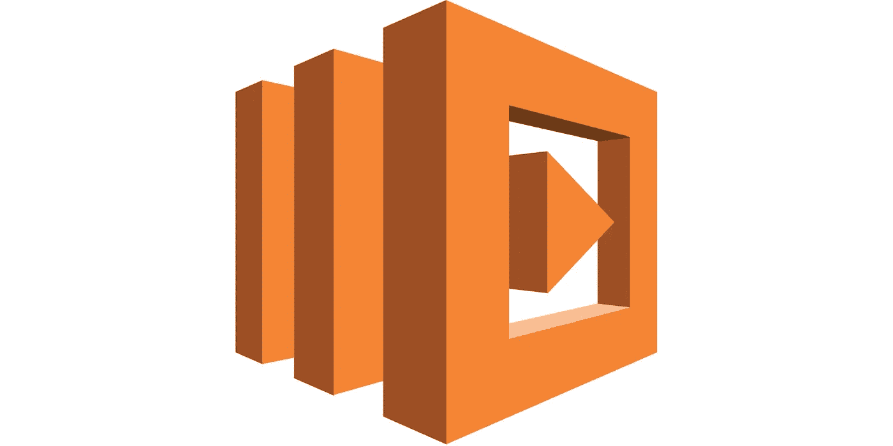
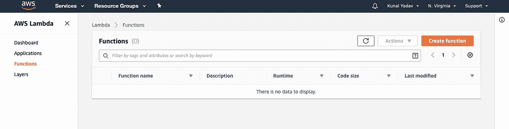
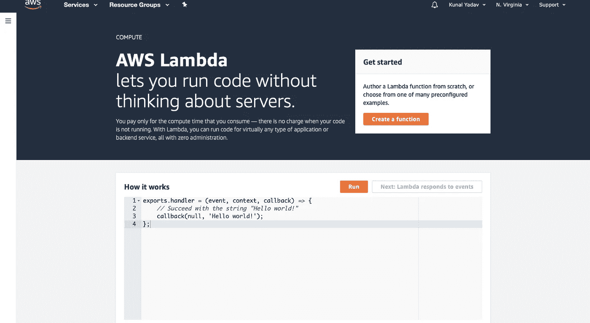
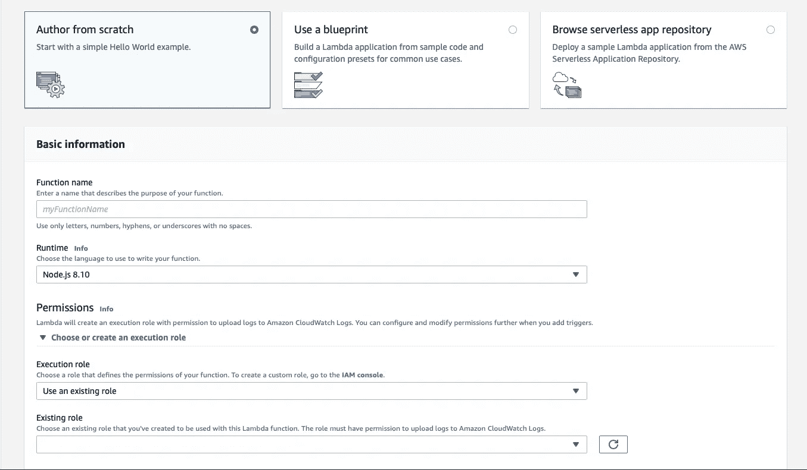
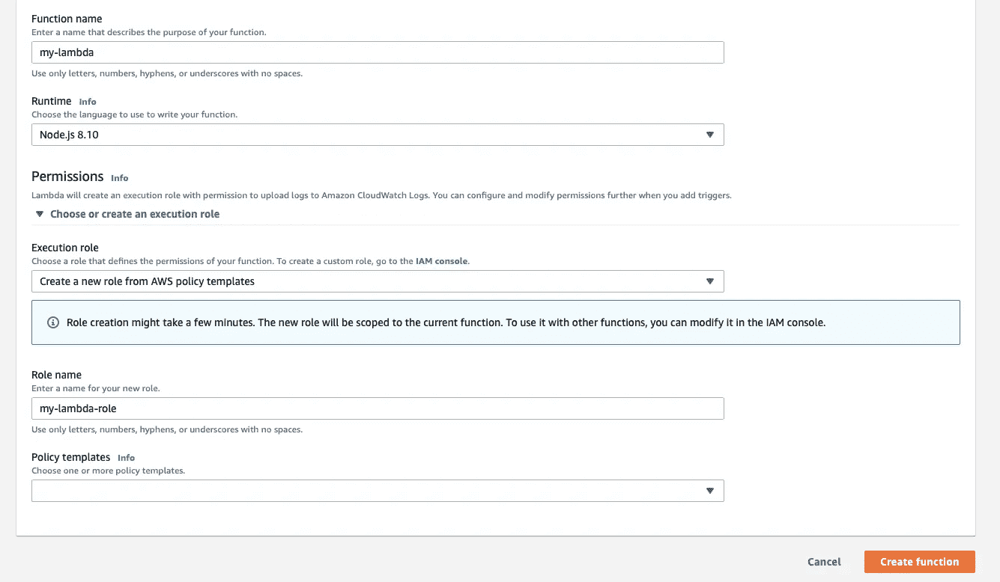
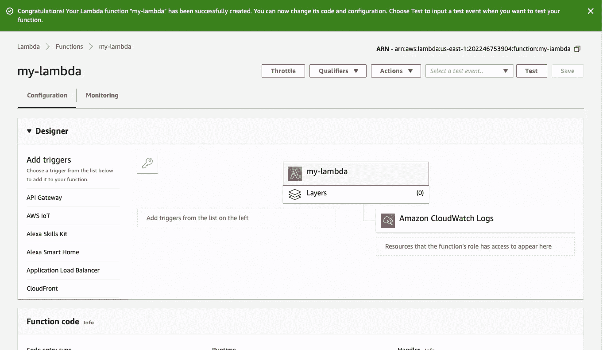
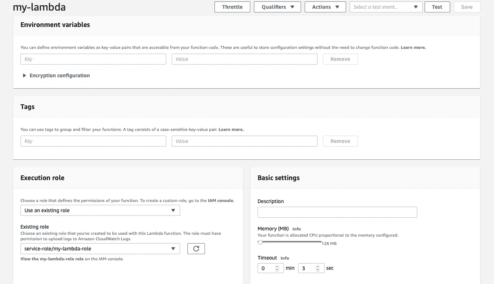
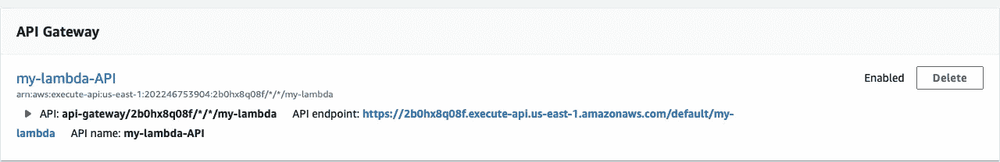
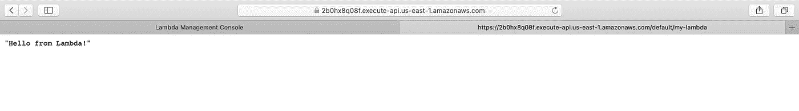

# 什么是 AWS Lambda 和无服务器？

> 原文：<https://levelup.gitconnected.com/what-is-aws-lambda-or-serverless-f0a006e9d56c>

AWS Lambda 徽标

最近有很多关于无服务器和 AWS lambda 的讨论。越来越多的公司和团队正在转向他们的应用程序的无服务器架构。

在这篇文章中，我将解释无服务器，我们将部署我们的第一个 hello world lambda 函数！

## 什么是无服务器？

无服务器意味着您不必管理运行应用程序的服务器。

你不必负责修补系统，安装防病毒软件或配置防火墙。此外，您不必担心随着负载的增加而扩展应用程序。它是自动处理的！

因此，它允许您更多地关注应用程序的功能。

## 为什么更好？

通常，当你创建一个动态的 web 应用程序时，你通常用 PHP、Nodejs、Ruby 或 Python 创建一个服务器，它与数据库交互以获取信息并将其发送到前端。

然后，您将这个后端服务器托管在 AWS 或 Azure 等托管提供商上。这种方法的问题在于您的服务器是全天候运行的。即使没有人与您的应用程序交互，它也在运行。

因此，你甚至不再为空闲时间付费。除此之外，大部分时间你还要负责修补系统漏洞，更新杀毒软件，设置自动缩放。

# 什么是 AWS Lambda？

这是 AWS 提供的构建无服务器应用程序。在这种情况下，您可以创建 lambda 函数，这些函数仅在执行某些操作时执行。

执行的操作可能是有人访问您的网站，因此您的函数从数据库中获取一些数据并返回响应。你可以用很多语言来创建这些函数，比如 Python，Nodejs，Java，Go，Ruby，C#。网络等。

最好的部分是，您只需为函数的执行时间付费。**当您的功能不运行时，您无需支付任何费用。**

与 lambda 类似，其他云提供商也有自己的无服务器产品，如微软 Azure 提供 Azure 功能，谷歌云平台提供云功能。

# Lambda 的特性

1.  按执行付费。
2.  创建事件驱动的架构。一旦一张图片上传到亚马逊 S3，触发你的 lambda 函数，为图片添加水印或改变其格式。
3.  内置容错功能。
4.  自动缩放。
5.  集成安全模型(行业合规性)。

现在介绍完毕，让我们创建你的第一个 lambda 函数。

# 创建 lambda 函数

1.登录你的 AWS 控制台，在计算选项卡下选择**λ**。您将被带到 lambda 仪表板。你会看到下面两张图片中的任何一张。

λ仪表板

λ仪表板

2.现在，让我们点击**创建功能**按钮。它将打开一个表单，您必须在其中输入 lambda 函数的一些基本细节。

3.你有三种方法来创建 lambda 函数

**一个**。从头开始创建，从头开始编写所有代码。
bT3。使用常见用例
**c** 中 lambda 函数的蓝图。从 AWS 无服务器存储库中选择一个示例函数。

如果你正在构建一个被其他人普遍使用的东西，那么你可能会在最后两个选项中找到一个相似的函数。使用它们可能会减少开发时间。

在这里，我将从头开始创建一个函数。让我们补充一些细节。

创建 lambda 函数

4.给你的函数起一个你自己选择的名字。然后，您可以选择想要运行此功能的**语言**。我在这里选择的是 **Node.js 8.10** 。

现在您指定一个 **IAM 角色**，它定义了您的 lambda 函数拥有的权限。例如，如果你的职能将与 S3 互动，只需给 S3 访问其分配的角色。因此，您的功能仅限于访问 S3，不能与任何其他 AWS 服务进行交互(#Security！).

现在选择**创建一个新角色**选项，并为您的角色命名。

完成后，点击**创建功能**按钮。

创建 lambda 函数形式

5.您的 lambda 函数现在将被创建。默认情况下，lambda 函数可以访问 **CloudWatch 日志**，其中**记录函数的所有执行**以及任何基于 **STDOUT** 的事件，如 Nodejs 的 **console.log** 和 python **的 **print** 。**

lambda 函数已创建

如果你向下滚动，你可以看到你的功能代码。默认情况下，它只输出“你好，来自 Lambda！”。

如果您进一步滚动，您可以向函数添加环境变量、描述和分配的内存，以及帮助您计费和过滤的标记。

你的函数超时意味着在这段时间后，如果你的函数继续运行，它将自动停止。

我们的函数现在已经创建好了，但是要运行它，我们需要给它添加一些触发器。

lambda 功能设置

6.滚动到顶部并从左侧面板中选择 **API 网关**。你会在底部看到一个表格。在 API 字段选择**创建新的 API** ，在安全字段选择**打开**。开放意味着任何人都可以通过生成的 URL 访问这个 API。

完成后，点击**添加按钮**，然后点击页面右上方的**保存按钮**保存您的功能。

API 端点已创建

您的 API 已经创建，可以通过给定的链接进行访问。如果你点击链接，它会打开一个新的标签，你会看到“你好，来自 Lambda！”。

在新标签中打开的 API 链接

尝试将此文本更改为其他内容，保存您的函数并重新加载 API 页面。您将看到更新的文本。

恭喜你！您已经使用 API Gateway 创建了第一个 lambda 函数和 API。

我将会写更多关于 lambda 和无服务器的文章，敬请关注！

感谢阅读这篇文章。如果你喜欢它，请给它一些掌声，让更多的人喜欢它！