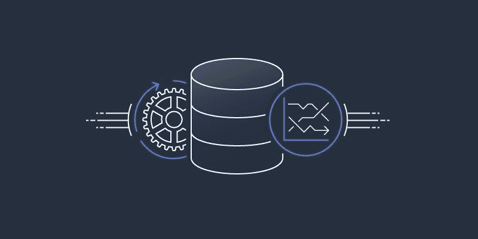
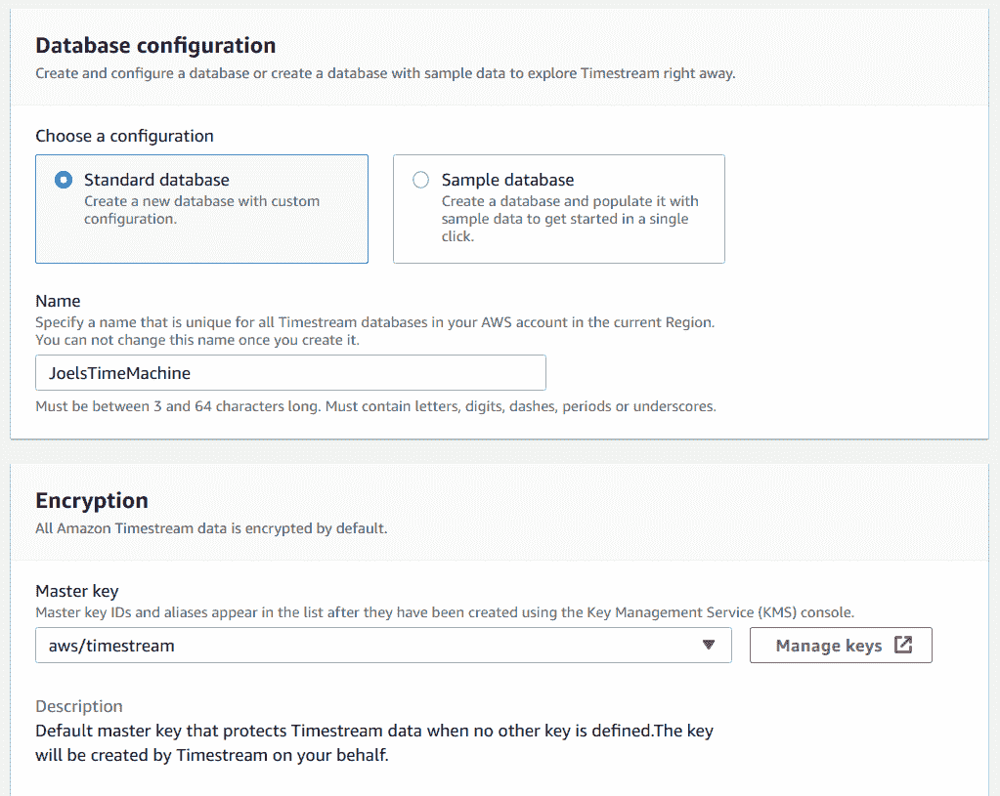
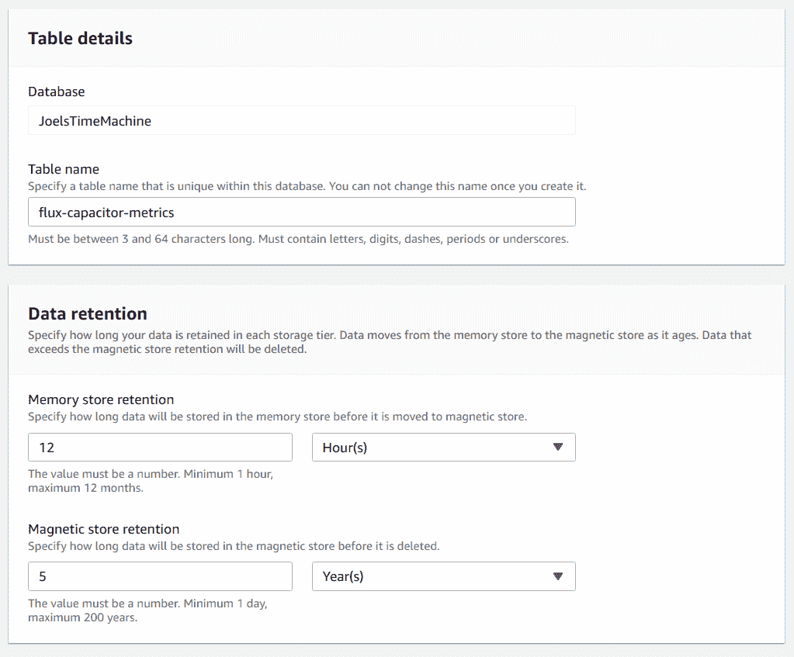
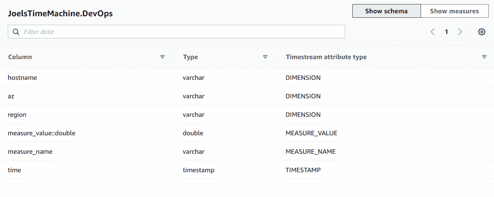
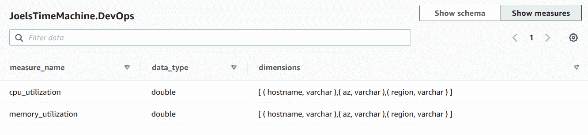
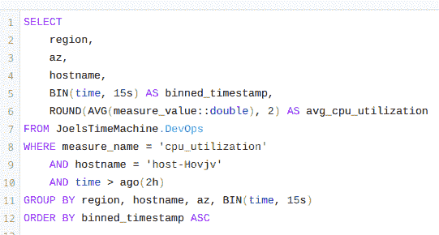
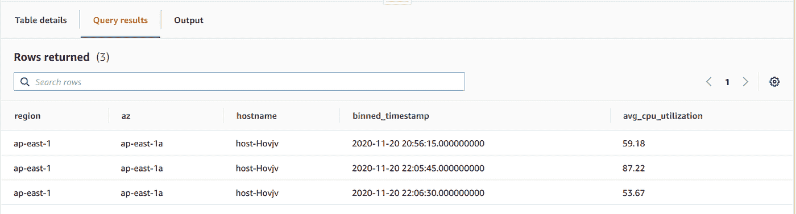
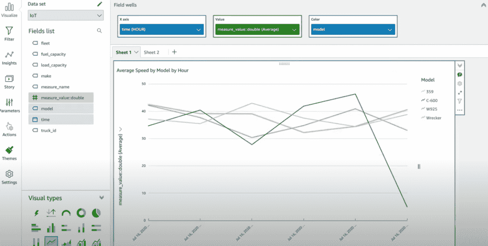

# 深入探究亚马逊时间流

> 原文：<https://levelup.gitconnected.com/what-is-aws-timestream-1828c8883eb0>

新型数据存储的时代到了

Amazon Timestream 是 AWS 存储产品的最新成员。这是一个快速、可伸缩、无服务器的时间序列数据库；以我的经验来看，这是社区和企业都渴望的。

最近，我花了一个下午的时间测试 Timestream，我想我应该分享一下我在这段时间里学到的东西和我的初步印象。

**什么是时间序列数据库？**

时间序列数据库是为存储和提供时间序列数据而优化的系统。时间序列是一段时间间隔内表示为数据点的记录序列。虽然时间序列数据可以存储在传统的关系数据库中，但这些数据经常会遇到伸缩问题。

典型的时间序列用例包括任何类型的数据，其中我们定期重复测量值或度量，这包括；

*   物联网数据(例如，天气读数、设备状态)
*   DevOps 分析(例如，CPU 利用率、内存分配、网络传输)
*   应用分析(例如点击流数据、页面加载时间、运行状况检查、响应时间)

Timestream 瞄准了这些用例——事实上，他们甚至提供了一些样本物联网和 DevOps 数据来玩，这正是我所做的。

**安全无服务器基础设施❤**

设置 Timestream 非常简单。

作为完全无服务器的产品，几乎不需要配置，也不需要担心规模或吞吐量设置。此外，由于是无服务器的，它遵循一个滚动的发布时间表，这意味着您可以利用新功能，而不必担心版本升级。此外，与其他 AWS 托管解决方案一样，您只需为使用付费，而不是底层基础设施。

数据库配置示例

您指定的少数设置之一是加密密钥。Timestream 强制数据加密，幸好这个设置不能关闭。您在此处的选项允许您指定如何使用存储在 AWS KMS 中的 CMK 对您的数据进行加密(静态和动态)。

**智能数据存储**

另一个主要设置是您的数据在 Timestream 的每个存储选项中保留多长时间。

Timestream 目前有两种存储类型:

1.  写优化的存储器存储；数据最初到达并自动进行重复数据消除的位置，稍后我会详细介绍这一点。
2.  读取优化磁存储器；成本效益的长期储存。

存储类型示例

设置时间流表时，您需要设置一个保留策略，以指定数据在移动到下一个存储(从内存、到磁存储、到删除)之前在每个存储中应存在多长时间，内存存储的最小值为 1 小时(最长 1 年)，磁存储的最小值为 1 天(最长 200 年)。

**再也不用担心重复记录了**

我简单地提到了数据重复，我想重点谈谈这一点。数据重复是传统关系数据库中的一个大问题。如果模式没有强制唯一性，大型 CRM 系统通常会发现相同的数据点有多个条目。

Timestream 采用了一种有趣的方法来处理这一问题，如果收到一条相同的记录，写优化内存存储会将其重复删除为一条记录。这使用了“第一个写入者获胜”的方法，因此无论哪个记录先被发送，都将被写入磁盘，重复的记录将被丢弃。

就我所能测试的而言，这些重复的记录必须是 100%相同的，但是我希望在未来看到一个选项，将这个调整到一个更低的相似性阈值(例如，如果两个记录 90%相似，则被视为重复)。

**时间流数据模型**

作为一种 NoSQL 数据库，Timestream 有自己的数据模型类型，与传统的 SQL 数据模型和许多其他 NoSQL 数据模型都不同。Timestream 被认为是一个无模式数据库，因为它没有强制模式。但是，它仍然使用数据库和表等概念，以及特定于时间流的概念，所以让我们来定义这些概念:

*   **数据库:**表的集合；
*   **表:**一个保存我们的时间序列记录的加密容器；
*   **记录:**时间戳、1 个或多个维度、单个度量的组合；
*   **维度:**描述记录元数据的属性(例如，区域、AZ、vpc、DevOps 度量数据的主机名)—始终存储为 varchar
*   **Measure:** 代表度量的单个命名数据值(如 cpu 使用率、DevOps 度量数据的内存分配)——可以是 boolean、bigint、varchar 或 double

表格尺寸示例

表格度量的示例

Timestream UI 以一种熟悉的列式结构呈现这个模型，但是由于数据模型的原因，它不支持您可能期望的标准 CRUD 操作。虽然可以创建和回读记录，但不能更新或删除它们。相反，只有当记录达到磁存储器上的保留限制时，才能将其删除。

**类固醇上的无模式 SQL**

尽管 Timestream 是一个无模式的 NoSQL 数据库，但如上所述，它确实将其数据模型呈现为一个列式结构，任何熟悉 SQL 的人都会觉得很熟悉。

SQL 查询的示例

Timestream 支持使用标准 SQL(支持 CTE、过滤和聚合)查询数据，具有大量标量和聚合函数，以及针对传输中可能缺失或丢失的数据点的额外时间序列插值。这意味着您可以轻松地将数据分组到不同的时间块并执行聚合，即使某些时间点丢失了数据。这里的一个限制是，虽然 Timestream 支持表连接，但这些只能在同一个表上(连接回自身)，尽管当您记住表是无模式的时，这是有意义的。

SQL 查询结果示例

**集成**

虽然拥有一个方便的 SQL 界面很好，但对于许多人来说，这不是向用户和利益相关者呈现数据的最佳方式，尤其是当试图突出显示一段时间内的趋势或模式时。幸运的是，Timestream 提供了许多内置集成，包括 AWS 生态系统和第三方工具。其中包括:

*   通过 Amazon QuickSight 或 Grafana 获得仪表盘和图表
*   通过物联网规则从 AWS 物联网、从 Kinesis 数据分析流或从 Telegraf 获取数据
*   通过 JDBC 连接传统的 SQL 工作台工具

连接到 Timestream 的 QuickSight 图表示例

**关闭思路**

总的来说，玩 Timestream 非常有趣。我认为这是一项强大的服务，进一步完善了 AWS 的存储产品，并提供了一些针对 Timestream 的令人兴奋的功能。如前所述，重复数据删除给我留下了深刻的印象，我很希望看到这一功能得到进一步发展，或者作为其他存储服务的可配置选项推出——我认为 AWS 真的可以利用这一功能。最重要的是，它既没有模式，又给了我们一个 SQL 接口，对于那些不完全相信 NoSQL 数据模型的人来说，这是一个很好的折中方案。

Timestream 有很多令人喜欢的地方，我认为它可能非常适合许多用例。而亚马逊提到 DevOps 度量和物联网数据等用例；我认为它在点击流、股票市场、货币和资产管理数据方面也有很大的潜力——实际上是我们希望随着时间的推移进行重复测量的任何东西。

**你怎么看？**

我确信有比我上面提到的更多的用例，所以让我知道你能想到什么用例，或者可能已经在使用 Timestream 了。

我也很想知道 Timestream 对大型数据集的伸缩性如何——在我使用它的几个小时里，我无法对它进行严格的测试。因此，任何关于性能和可伸缩性的见解都是非常好的。

要了解更多技术见解和博客，请在 Twitter 上关注我，地址:[@ JoelLutman](https://twitter.com/joellutman)；我在这里发布关于 AWS、无服务器、大数据和软件最佳实践的推文和博客。