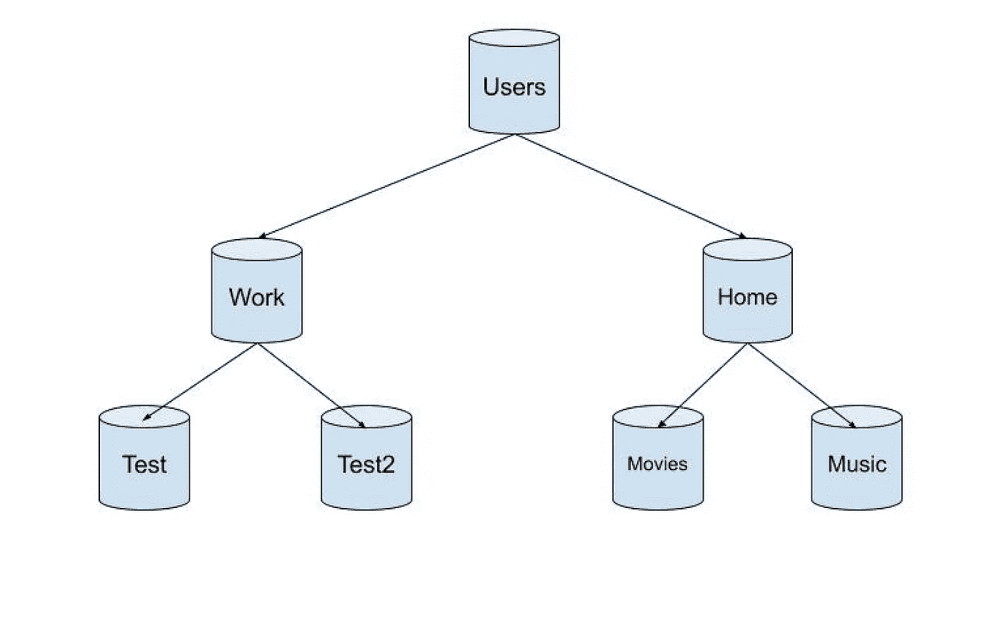

# 什么是 Bash，作为一名开发人员为什么要学习它

> 原文：<https://levelup.gitconnected.com/what-is-bash-and-why-should-you-learn-it-as-a-developer-fabff568f971>

## 最常用命令的深度视图


凯文·Ku 在 [Unsplash](https://unsplash.com/photos/w7ZyuGYNpRQ) 上的照片

Bash 是一个命令行界面，这意味着它是一个你输入指令，操作系统就会执行的程序。在我的第一份工作中，在最初的几个月里，我试图主要专注于编程，但后来，我意识到，为了成为一名更好的开发人员，你还需要学习其他一些技能，而不能仅仅依靠编程。

如果您正在考虑何时需要使用 Bash，这确实是一个非常好的问题。嗯，当安装包管理器和帮助其他开发人员时，你可能需要很好地理解它，尤其是当你进入一个更 DevOps 的角色时。最重要的是，互联网和大多数服务器都运行 Linux，它没有用户界面，你只能通过命令行访问它们。

如果你使用 Ubuntu 或 macOS，你会在系统中包含 Bash，但如果你使用 Windows，你可能没有它，尽管它在 Windows 10 的新版本中有。如果没有，你可以下载 [Git Bash](https://git-scm.com/downloads) ，这样你就可以继续使用这些例子了。

## 命令

让我们从一些命令开始:

```
Ivans-MacBook-Pro:~ izstoev$
```

当您导航到您的 Bash 时，它应该看起来像这样，您的 PC 名称和用户名后面跟着美元符号' $ '，这意味着您准备好输入命令。

```
Ivans-MacBook-Pro:~ izstoev$ echo Testing Bash!Testing Bash!
```

如果我们键入“echo”后跟一段文本，我们可以看到文本返回。Echo 相当于 PHP 中的“echo”或 Python 中的“print”。

```
Ivans-MacBook-Pro:~ izstoev$ python3>>> print(“Testing Bash”);Testing Bash
```

您还可以使用 Bash 来执行您已经安装的程序，比如 Python，从类似上面例子的命令中执行。

```
Ivans-MacBook-Pro:~ izstoev$ history1 echo Testing Bash!2 clear3 python34 clear5 history
```

如果您想查看已经执行的命令的最近历史，您可以输入“历史”来查看所有命令，或者按下*向上*或*向下*箭头来滚动查看最近的命令。

## 相对和绝对路径

在简要介绍了一些简单的命令之后，让我们进入一些更令人兴奋的东西。众所周知，操作系统是由目录和文件组成的，所有的目录和文件都有一个路径，换句话说，就是文件所在的地址。所以当我们使用 Bash 时，我们总是在一个位于特定路径的目录中。

如果我们想找到工作目录，我们可以使用命令 *pwd，*代表“打印工作目录”。

```
Ivans-MacBook-Pro:music izstoev$ pwd/Users/izstoev/music
```

让我们再多谈谈路径。

您的操作系统将其目录表示为树状结构。



因此，我们拥有的目录和文件越多，这种增长就越大。正如我们所知，树有一个根，在我们的例子中是顶层目录。然后根可以有分支，这些分支可以有它们自己的分支。

因此，从根开始，树的每个分支都是一个目录。因此，无论何时使用 Bash，您都是在一个特定的分支上，其路径表示该位置。

然而，路径可以有两条，绝对**路径**和相对**路径**。绝对路径给出了从根开始的位置。例如，上例中电影的绝对路径是 */Home/Movies* ，第一个斜杠代表根目录。

相对路径从您当前的工作目录开始，所以如果路径不是以'/'开始，Bash 知道您在使用相对路径。

因此，如果我们是用户，我们看电影的路径应该是*家庭/电影。如果我们在家里，那就只是简单的电影了。*

## 航行

正如我们提到的，你可以用命令“pwd”得到你当前的位置。

如果您想查看当前工作目录中的所有目录和文件夹，您可以键入“ls”。

```
Ivans-MacBook-Pro:~ izstoev$ ls
```

当您知道下一步要进入哪个目录时，您可以使用命令“cd”来这样做。

```
Ivans-MacBook-Pro:~ izstoev$ cd MusicIvans-MacBook-Pro:Music izstoev$
```

我们可以看到，在该命令之后，我所在的目录发生了变化。现在，如果您想快速导航回根目录，您可以再次使用“cd”。

```
Ivans-MacBook-Pro:iTunes izstoev$ cdIvans-MacBook-Pro:~ izstoev$
```

那么，如果您导航到一个目录，并希望在那里创建一个新文件夹，会发生什么呢？您可以使用命令“mkdir ”,后跟您希望为目录指定的名称(名称中不能有空格)。

```
Ivans-MacBook-Pro:~ izstoev$ cd Movies/Ivans-MacBook-Pro:Movies izstoev$ mkdir ComedyIvans-MacBook-Pro:Movies izstoev$ lsComedy TV
```

如你所见，我进入了电影，创建了一个名为“Comedy”的目录，并使用“ls”验证了它确实已被创建。

如果我们现在想后退一个目录，而不是导航到根目录，我们可以使用“cd”后跟两个点来实现。

```
Ivans-MacBook-Pro:Comedy izstoev$ cd ..Ivans-MacBook-Pro:Movies izstoev$
```

如果我们想删除我们刚刚创建的目录，我们可以很容易地做到这一点。

```
Ivans-MacBook-Pro:Movies izstoev$ rmdir ComedyIvans-MacBook-Pro:Movies izstoev$ lsTV
```

## 旗帜

命令也有标志，允许发布者改变命令的行为。标志是将*真*或*假*作为值的命令选项，默认情况下，所有标志都设置为假。要添加旗帜，我们在旗帜前使用连字符。

```
Ivans-MacBook-Pro:Movies izstoev$ ls -authortotal 24-rw-r — r — 1 izstoev 0B 29 Oct 2019 .localized-rw-r — r — 1 izstoev 160B 8 Jun 2020 .htaccess-rw-r — r — @ 1 izstoev 6.0K 17 Aug 2020 .DS_Storedrwxr-xr-x 5 izstoev 160B 9 Dec 23:56 TVdrwxr-xr-x+ 61 izstoev 1.9K 25 Jan 15:34 ..drwx — — — + 6 izstoev 192B 25 Jan 16:24 .Ivans-MacBook-Pro:Movies izstoev$
```

执行' ls -author '向我们显示了所有预期的目录和文件，还显示了创建它们的作者。

## **隐藏文件**

你可能已经知道操作系统和许多程序在你的电脑上以隐藏文件的形式存储数据。如果我们想查看隐藏的文件，我们可以将标志“-a”与“ls”结合使用，其中“a”代表全部。

如果我们想创建一个隐藏文件，我们可以使用命令“触摸”。

```
Ivans-MacBook-Pro:Movies izstoev$ touch .bashIvans-MacBook-Pro:Movies izstoev$ ls -a. .. .DS_Store .bash .htaccess .localized TV
```

我创造了。bash 隐藏文件，然后用“ls -a”进行验证。

## 管道

竖线字符“|”称为管道，我们可以用它将一个命令的输出作为输入传递给另一个命令。很困惑，我知道。我们来演示一下。

如果我们输入:

```
Ivans-MacBook-Pro:Movies izstoev$ ls | less
```

我们得到一个类似这样的结果:

```
ActionAnimationComedyTV(END)
```

“less”的作用是显示文件或命令输出的内容。在我们的例子中，我们知道' ls '显示了所有的目录，然后我们使用' less '在 less 程序中打开一个文本文件(按 q 退出 less)。

## 用户

操作系统可以有多个用户，并且通常为每个用户分配一个用户名和密码，使他们能够登录到系统，并且还具有允许他们执行的各种权限集。若要查看当前用户，请键入“whoami”。

```
Ivans-MacBook-Pro:~ izstoev$ whoamiizstoev
```

通常，您的用户是在您安装操作系统时创建的，然而，该用户并不是最强大的。拥有最多权限的最高级别用户称为 *root。*每个系统都有一个 root 用户，但出于安全考虑，您通常不会以 root 用户身份登录。但是如果我们使用著名的' sudo '命令，我们可以利用他的权限。Sudo 允许您以 root 用户的身份发布命令，而不会影响系统的安全性。Sudo 移除了防止你损害操作系统的安全措施，所以除非你对自己正在做的事情有信心，否则永远不要发出命令。

## **正则表达式**

操作系统也支持*正则表达式。*正则表达式是定义一种搜索模式的字符序列。它们很有用，因为您可以使用它们来搜索文件或数据。

我创建了一个简单的文本文件，如下所示:

```
Iron ManIron Man 2Avengers: Infinity WarAvengers: End GameStar Wars
```

为了使用正则表达式，我们将使用“grep”命令，该命令接受两个参数—正则表达式和文件的文件路径，以搜索定义的模式。

例如，如果我们想得到复仇者联盟的所有电影-

```
Ivans-MacBook-Pro:Movies izstoev$ grep Avengers Movies.txtAvengers: Infinity WarAvengers: End Game
```

同样值得一提的是，这个命令是区分大小写的，所以如果我们把大写的 A 改成小写的 A，我们不会得到任何结果。

默认情况下，grep 将打印所有找到匹配的行，但是如果我们只需要匹配的单词，我们可以添加'-o '标志。

```
Ivans-MacBook-Pro:Movies izstoev$ grep -o Avengers Movies.txtAvengersAvengers
```

我们只得到两个匹配的单词。

## 匹配开始或结束

正则表达式可以变得更加复杂，虽然我们不会深入讨论，但在我们继续之前，我只想再举一个例子。

如果我更新了。txt 文件到此:

```
Iron ManIron Man 2Avengers: Infinity WarAvengers: End GameStar WarsCivil War: Iron Man vs Captain America
```

然后运行以下命令:

```
Ivans-MacBook-Pro:Movies izstoev$ grep Iron Movies.txtIron ManIron Man 2Civil War: Iron Man vs Captain America
```

我们得到了三个正确的结果，但是如果我们只想检索单人版的钢铁侠电影，会发生什么呢？嗯，我们可以使用'ˇ'字符，它允许我们只在模式出现在开头时才匹配该模式。

```
Ivans-MacBook-Pro:Movies izstoev$ grep ^Iron Movies.txtIron ManIron Man 2
```

现在我们只得到我们想要的两个结果。

## 结论

我们只是触及了 Bash 和您经常使用的命令的表面，但是我鼓励您在空闲时间深入了解 Bash。使用 Bash 是提高开发人员水平和变得更加多才多艺的关键，而不仅仅是编码，而是承担更多的责任、培训人员等等，因此了解一点 Bash 对于任何人脱颖而出都是非常有益的。