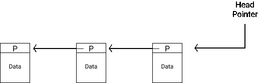

# 什么是区块链，它是如何防篡改的？

> 原文：<https://levelup.gitconnected.com/what-is-blockchain-and-how-it-is-tamper-proof-f86744cb7787>

[摄](https://unsplash.com/@jjying?utm_source=medium&utm_medium=referral)在 [Unsplash](https://unsplash.com?utm_source=medium&utm_medium=referral)

## 了解比特币和其他加密货币背后的技术

每个人都还在试图理解加密货币以及它的未来。但是加密货币背后的技术非常有前途。加密货币最重要的组成部分之一是一个全球分类账，它基于区块链维护所有交易的记录。

要理解区块链，我们必须首先理解几个基本概念

*   混杂
*   两颗北极指极星
*   哈希指针
*   链表

## 混杂

哈希是一个简单的函数，它对任何输入都给出固定长度的字符串输出，这样

*   我们无法从哈希中获得输入
*   利用我们可用的计算，我们不能找到两条具有相同散列的消息(实际上不能)

一些常见的哈希示例有 SHA256、SHA512、MD5 等。

SHA256 将给出一个 256 位的固定字符串，SHA512 哈希将为 512 位长。

如果我改变输入消息中的一个比特，散列将完全不同。

因为没有两个输入会有相同的散列(至少理论上我们不会遇到这种情况)，我们可以使用散列来唯一地标识真正大的文件。下一次当我们看到这个文件时，我们只需将它的哈希与我们记忆的哈希进行比较，而无需存储和比较整个文件。

## 指针

当我说`P`是`A`的指针时，这意味着`P`存储了`A`的位置。

假设我们有 5 个编号为 1-5 的盒子，我们将第 3 个盒子命名为 *A* 。那么 P，指针将存储 A 即 3 的地址。

p 指向 A

当然，盒子 P 也会有一个数字地址，但这与此无关。

这些盒子是存储一些数据的内存位置，盒子号是内存中的地址，A，P 是命名变量。

## 哈希指针

散列指针不仅存储变量的地址，还存储该地址上存储的数据的散列。

使用哈希指针，我们不仅可以检索数据，还可以验证数据是否已被更改。

散列指针符号

哈希指针用哈希函数表示，即 *H()* 和箭头。

## 链表

链表是节点的集合，其中每个节点都有前一个节点和/或下一个节点的指针。因为每个节点都有指向前一个节点的指针，所以你只需要存储顶层节点的位置/指针。

人们可以简单地通过一个节点一个节点地移动存储在其相邻节点的每个节点中的位置来遍历整个列表。

链表表示法

现在，每当我们需要指向另一个节点时，我们将把头指针指向这个新节点，这个新节点将有一个指向前一个顶层节点的指针。

# 区块链

区块链是一个链表，使用哈希指针，而不是常规指针。这使区块链的每个节点不仅能够找到下一个节点，还能验证该节点中的数据是否已被更改。

在区块链中，节点被称为一个块，因此我们将使用相同的约定。

头哈希指针将指向添加到区块链的最新块。

区块链表示图

在此图中，我们展示了三个最新的模块。最新的区块(B3)可以使用 Head 定位。B2 是在 B3 之前添加的，所以 B3 将存储一个指向它的指针，以及 B2 内容的散列。

所以区块链的每个区块都有

*   指向添加在它之前的块(前一个块)的指针
*   存储在前一个块上的所有内容的散列(就在它之前添加的那个)
*   需要存储的一些数据(在比特币多次交易的情况下)

任何新的区块将被添加到 B3 旁边，并将存储指向 B3 的指针到这个区块链中。

## **这是如何防篡改的？**

假设一些对手想要改变图中最左边的数据块中的数据。但是如果那个块中的数据发生变化，中间块的哈希指针就会失效。

区块链的块篡改表示

现在为了使散列有效

*   需要更新存储在 B2 的 B1 的散列
*   但是由于它将改变使散列在 B3 无效
*   如果我们改变 B3，这将使头哈希无效

你需要记住的一件事是，当计算一个块**的散列时，它将包括该块**的所有内容。例如，B3 的哈希将是 B2 的所有哈希(即 B2 的哈希、指针以及数据)。

比方说，不改变数据，只是想删除 B1。能做到吗？同样，如果不使下一个块的散列无效，它就不能被删除。

因此，只要我们安全地存储头哈希指针，区块链数据块中的任何更改都不会被忽略。

许多其他基于指针的数据结构也可以被修改来创建防篡改的数据结构，只要其中没有循环。另一个非常著名的数据结构是 **Merkle tree** ，这是一个使用哈希指针而不是常规指针的二叉树。

## **区块链的用例**

区块链和其他基于散列指针的数据结构可以有很多应用。

例如，once 如何确保某些信息的持有者不会随意更改这些信息，这些信息在公共领域是不可用的。可以要求它们发布每天添加的节点的散列指针(即头指针)，这样信息就不会被暴露，但同时将保持可追究性。

区块链不变性的其他使用案例包括智能合同、资产管理、车辆历史、身份管理、法庭记录、大学学位记录、股票交易、数字投票等各种领域的记录保存。这使得伪造记录几乎不可能。

## **比特币中的区块链**

在比特币中，全球分类账以区块链为基础进行维护。区块链每个区块将包含

*   多个交易，每个交易都由硬币的所有者(进行交易的人)签名
*   在它之前添加的块的位置和散列

**现在，既然没有中央信托方，谁来保存这个分类账，并验证所有的交易都是有效的？**

有很多人在运行比特币软件，他们都有一份区块链的拷贝。每当要创建一个新的块时，它们都会为要添加的新块执行一个一致协议(*这是一个过于简化的过程，但详细解释超出了本文的范围*)。这样就不需要任何中央信任方。

虽然区块链是加密货币和智能合约的一个非常重要的部分，但在创建像比特币这样的去中心化账本时，涉及到了许多高超的工程和聪明的技术(*我必须说*)非常有趣。