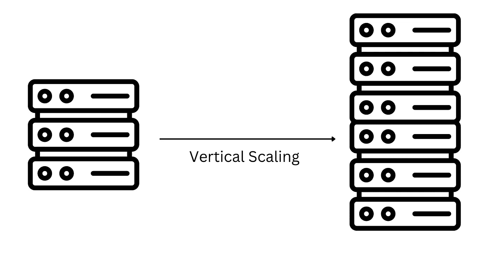
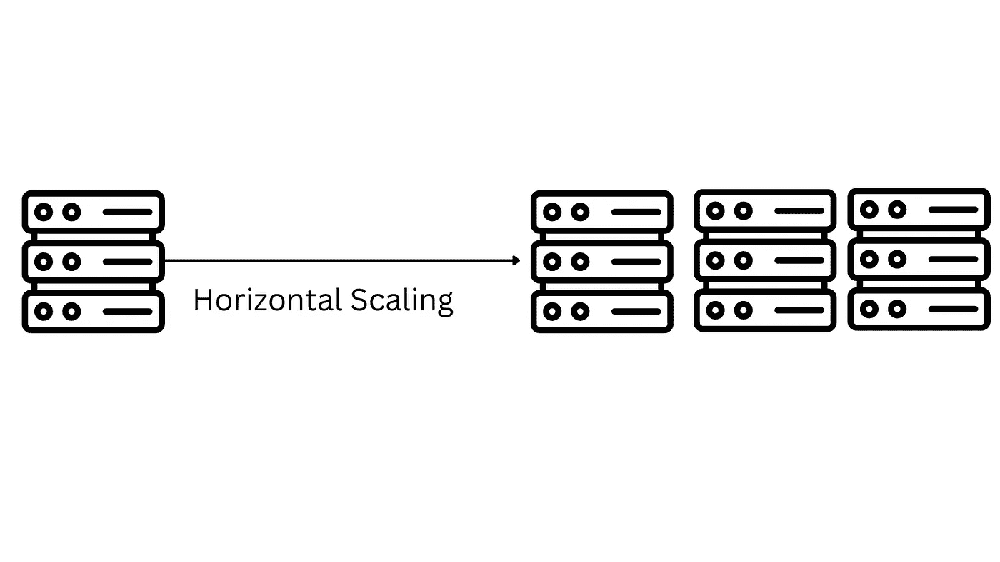
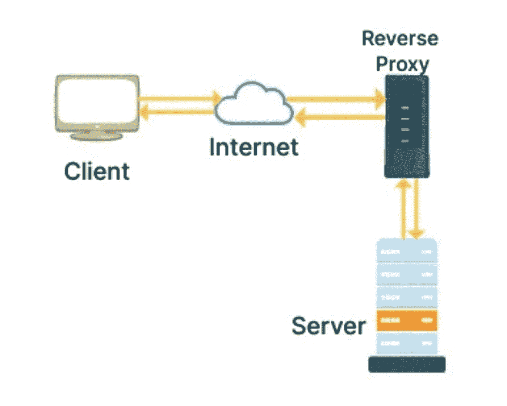
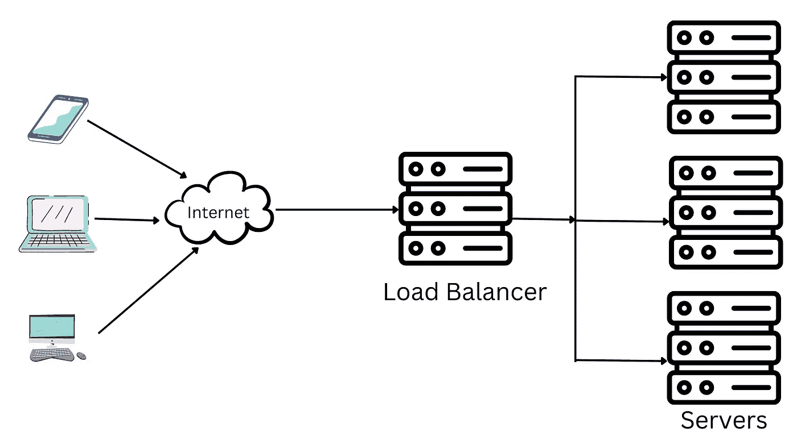

# C10k 问题是什么？你为什么要在乎？

> 原文：<https://levelup.gitconnected.com/what-is-c10k-problem-why-should-you-care-a5396939a68c>

## 提高服务器性能需要考虑的因素

克里斯蒂娜@ wocintechchat.com 在 [Unsplash](https://unsplash.com/s/photos/server?utm_source=unsplash&utm_medium=referral&utm_content=creditCopyText) 上的照片

在最近的一篇文章中，我们讨论了[反向代理](/why-cloudflare-abandoned-nginx-for-pingora-b5c4e5256a4a)如何以闪电般的速度处理数百万个连接。

就是在那段时间我听说了 C10k 的问题。显然，NGINX 是由伊戈尔·塞索耶夫编写的，以解决这一挑战。

我花了一段时间才更深层次地理解这些概念和问题。这篇文章是我重新迭代我的理解的尝试，希望对你也有帮助。

## C10K 是什么？

C10K 这个名字是由软件工程师 Dan Kegel 在 1999 年创造的。

这个缩写中的 c 代表并发连接，10K 代表数字。总之，它表示这个问题是一个 10K 并发连接问题。

C10K 定义了 web 服务器在同时处理大量并发请求时面临的挑战。

当服务器已经足够复杂和现代来处理许多连接并提供更好的吞吐量时，我们中的许多人可能已经开始编写服务器端代码了。

能够通过并行处理和多线程同时处理多个任务的多核处理器已经成为标准。

如果说有什么不同的话，那就是云服务进一步简化了这些流程，并使横向扩展比以往任何时候都更加方便。

随着这些年来服务器变得越来越复杂，消费者的数量也在增加。10K 问题演变成了 10 米问题，然后进一步发展。

更好地理解是什么让服务器每秒处理数千个请求，将有助于我们在服务器必须扩展以处理不断增长的 web 流量时做出正确的决定。

让我们首先尝试理解软件应用程序和服务器扩展的两种常见方式。

所谓伸缩，我们指的是系统根据不断变化的需求而增长或收缩的能力。

1.  垂直缩放
2.  水平缩放

## 垂直缩放

垂直扩展会给现有系统增加更多资源。

这可以包括但不限于提高处理能力、内存、存储或网络速度。

简而言之，垂直扩展通过向现有机器添加更多资源，使其更加强大。

## 水平缩放

水平扩展为我们的基础设施增加了更多的机器。

这意味着，不是向现有机器添加更多资源，而是向现有基础架构添加与旧服务器功能相似的新服务器，以满足不断增长的需求。

在云环境中，添加更多的服务器实例就是水平扩展的一个例子。

当系统不再能够以高效的方式容纳传入流量时，组织决定使用水平或垂直扩展来扩展其 IT 基础架构。

但是，如果提高服务器性能的解决方案并不总是局限于纵向扩展(垂直)或横向扩展(水平)呢？

让我们来看看有助于性能优化的另一个因素。

## 优化网络技术

随着基于云的服务的引入，网络优化变得不那么令人头疼了，但即使在基于云的服务中，如果没有正确的架构，最终也会出现与本地服务器类似的服务器性能问题。更不用说，每增加一项资源都会增加云费用。

在典型的 IT 场景中，使用各种网络优化工具和最佳实践来监控和改进网络技术。

这些用于提高服务器性能的技术包括:

1.  代理服务器和 CDN

代理服务器是一个中间人。它位于应用服务器的前面。

与普通的 web 服务器相比，这些服务器处理传入 web 请求的方式有所不同。代理服务器不是使用单线程处理每个 web 请求，而是遵循多线程或多进程架构来处理多个并发请求。

主要是，这些服务器重用现有的 TCP 连接并提高它们的性能。

另一方面，CDN(内容交付网络)服务器用于缓存 web 资源(静态内容)。这意味着静态内容可以在地理位置上靠近消费者，并且可以更快地提供内容。

2.负载平衡器

像代理服务器一样，负载平衡器位于我们的 web 和应用服务器的前面。

它的主要工作是路由传入的客户端请求，并以一种我们所有的服务器都公平分担工作的方式将它们转发到服务器，并且没有一个服务器因传入的流量而过载。

负载平衡器还可以检测是否添加了新的服务器或有一台服务器关闭，并在联机的服务器之间路由流量。这可以确保我们的资源得到有效利用，并且服务器的性能不会下降。

## 结论

无论您的应用是部署到云还是本地物理服务器，了解服务器性能有助于我们设计更好的系统并降低基础设施成本。