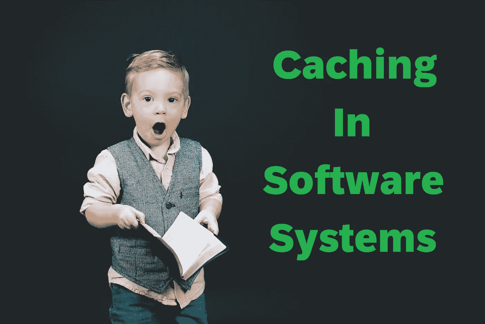
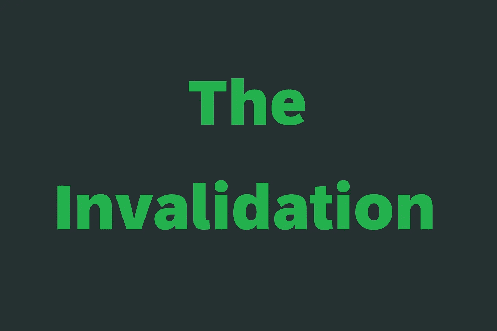
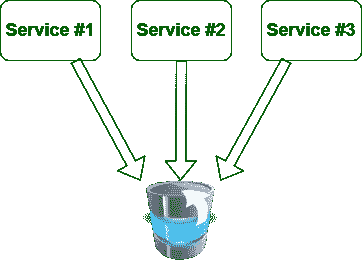
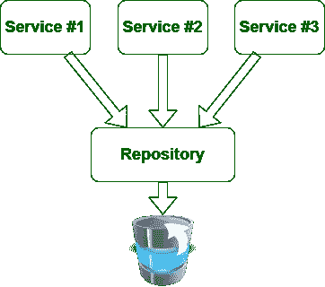
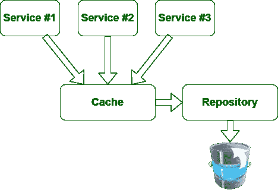
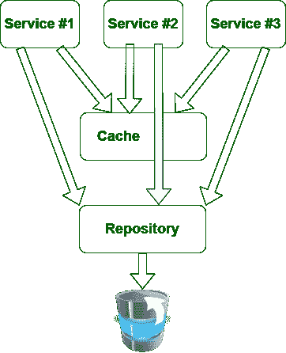
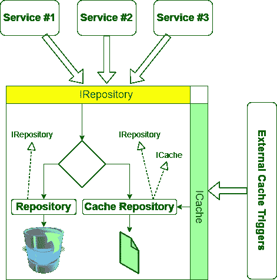

# 什么是软件系统中的缓存

> 原文：<https://levelup.gitconnected.com/what-is-caching-in-software-systems-cfa71c385bfc>

## 回归基础

## 软件系统中缓存的定义和最佳实践。



照片由[本·怀特](https://unsplash.com/@benwhitephotography?utm_source=unsplash&utm_medium=referral&utm_content=creditCopyText)在 [Unsplash](https://unsplash.com/?utm_source=unsplash&utm_medium=referral&utm_content=creditCopyText) 上拍摄，由[艾哈迈德·塔里克](https://medium.com/@eng_ahmed.tarek)修改

每个软件工程师都听说过**缓存**。这是一个你会不时听到的术语，尤其是当你在大型软件系统上工作的时候。

在这些系统上，很可能你会处理大量的数据和不同的服务，这就是**缓存**变得有用的地方。

然而，我不时会遇到一些关于缓存的错误陈述。有时这些陈述是关于缓存的错误目标或用法，其他时候是关于处理缓存，更多时候是关于实现缓存。

这就是为什么我决定写这篇文章来与你分享我对缓存的理解和一些被证明是有效的最佳实践。

[](https://medium.com/subscribe/@eng_ahmed.tarek) [## 🔥订阅艾哈迈德的时事通讯🔥

### 订阅艾哈迈德的时事通讯📰直接获得最佳实践、教程、提示、技巧和许多其他很酷的东西…

medium.com](https://medium.com/subscribe/@eng_ahmed.tarek) 

图片由[艾哈迈德·塔里克](https://medium.com/@eng_ahmed.tarek)拍摄

# 定义

**软件系统中的缓存**是**临时**存储一个**资产**的**副本**供系统模块使用，而不是原始资产，以便获得一些**收益**。这种增益可以有多种形式。

您可能已经注意到，定义中的一些单词用粗体突出显示。这是有原因的。

我相信这些词中的每一个都定义了我们在处理缓存时需要牢记的一个重要方面。

这意味着我们维护的资产副本应该在某个时候被删除/清除/替换。否则，这不是缓存。

这意味着我们不缓存资产本身，而是缓存它的副本。

我知道您希望在定义中看到“数据”这个词。但是，它意味着使用单词 **asset** ，因为缓存不仅仅是缓存从数据库或任何类型的存储系统中检索的数据，它还可以缓存内存对象。

这意味着缓存本身不应该是一个目标。如果您没有明确定义使用缓存的好处和优势，那么您不应该使用它。

在接下来的部分中，我们将详细讨论这些方面。


图片由[艾哈迈德·塔里克](https://medium.com/@eng_ahmed.tarek)拍摄

# 收益

在考虑如何缓存资产之前，您首先需要问自己是否真的需要缓存它。

缓存该资产应该会有所收获。否则，你只会增加系统的复杂性。

缓存的好处可能是:

1.  性能增强:就像在内存对象中缓存从 SQL 数据库中检索的一些数据一样。这将加快访问这些对象的速度，最终提高性能。
2.  更低的成本:比如当你在内存对象甚至数据库中缓存从付费的第三方**货币转换器** REST 服务中获取的货币兑换率。这将为您节省一些钱，您将支付每个请求。
3.  其他优势:这些可能是缓存的一些与业务相关的优势。

我之所以强调这一点，是因为之前我发现有人投入精力和时间缓存从数据库中检索的一些数据**，并将缓存存储到另一个数据库**中**中。**

所以，我对他的问题是:

> 第一个数据库和第二个数据库有什么区别吗？

不幸的是，答案是:

> 不，它们几乎一样。

所以，你可以想象，我的下一个问题是:

> 那你为什么一开始就试图缓存数据呢？

答案是:

> 其实我也不知道更多了。你让我质疑自己。

我可以告诉你更多关于接下来的对话，但我不会让你厌烦得要死。

长话短说，最后我们发现，如果他将数据缓存到内存中的一个对象，他可以利用缓存。

因此，我给你的建议是总是问你自己: ***缓存这个资产我会得到什么？***


图片由[艾哈迈德·塔里克](https://medium.com/@eng_ahmed.tarek)拍摄

# 资产

正如我在定义中所说的，并不是所有你缓存的东西都是数据。有时您会缓存其他资产，如对象。这些物体可能是不同的东西。

就像缓存从 SQL 数据库中检索到的数据**一样。**

而当你缓存从操作系统文件系统中检索到的**文件**和**文件夹**时。

而当你缓存从外部 DLL 文件中检索到的**参数**时。

当你缓存**处理程序**和**委托**的时候，对象创建的代价很高。

所有这些都是可以缓存的示例。



图片由艾哈迈德·塔里克拍摄

# 无效

正如我在定义中所说，缓存应该是暂时的。这意味着在某个时候，我们保留的资产副本应该被无效/删除/清除。然而，需要记住的还有更多。

我们决定使高速缓存无效的因素并不总是相同的。根据业务需求，它们在不同的系统之间有所不同。

例如，您可以决定使缓存无效:

1.  当高速缓存的副本已经存在了一定的时间量时；例如一周或一小时。
2.  当主源中的数据发生变化时。
3.  当调用外部触发器时。
4.  或者这些中的一些/全部的组合。

这些因素中的每一个都会对您的系统设计和实现产生影响。

这就是为什么在开始实施之前先正确地决定这些是明智的。


由[凯利·西克玛](https://unsplash.com/@kellysikkema?utm_source=unsplash&utm_medium=referral&utm_content=creditCopyText)在 [Unsplash](https://unsplash.com/?utm_source=unsplash&utm_medium=referral&utm_content=creditCopyText) 上拍摄，由[艾哈迈德·塔里克](https://medium.com/@eng_ahmed.tarek)修改

# 设计和最佳实践

要为使用缓存的系统提出一个好的设计，我们需要一步一步来。这将有助于我们发现弱点，并努力改进它们。


## 单点访问

在系统中实现缓存之前，需要做一些重要的准备工作。

因此，如果您的系统是这样实现的:



图片来自[艾哈迈德·塔里克](https://medium.com/@eng_ahmed.tarek)

那么你在实现缓存时会遇到很多问题，因为你对数据流没有单点控制。

因此，在这种情况下，最好将设计改为这样:



图片由[艾哈迈德·塔里克](https://medium.com/@eng_ahmed.tarek)拍摄

这样，您只有一个模块负责访问数据源——不管它是什么——并拥有如何处理它的知识。

此外，通过这种方式，您可以确定没有办法在数据源上采取任何可能不被您发现的操作。


## 一致与不一致

现在，在引入了我们的**存储库**层之后，我们就可以添加缓存了。

有些人可能会决定更新设计，如下所示:



图片由[艾哈迈德·塔里克](https://medium.com/@eng_ahmed.tarek)拍摄

然而，这并不好，因为现在我们的服务——业务逻辑所在的地方——知道**缓存**模块以及如何处理它。

其他一些人可能会决定将设计更新成这样:



图片由[艾哈迈德·塔里克](https://medium.com/@eng_ahmed.tarek)拍摄

这就更糟糕了。现在，我们的服务暴露给了**缓存**和**存储库**模块，决定何时使用缓存以及何时使用来自数据源的新数据的逻辑将在不同的服务之间驻留和复制。

这就是为什么设计应该是这样的:



图片由[艾哈迈德·塔里克](https://medium.com/@eng_ahmed.tarek)拍摄

因此，我们会有以下内容:

1.  为我们的业务相关命令和查询定义了一个名为`IRepository`的接口。
2.  与缓存操作相关的动作的定义接口称为`ICache`。
3.  一个实现`IRepository`的模块，作为直接的存储库实现。它可以专门为 SQL 数据库或 XML 文件或任何数据源实现。暂且称之为`Repository`吧。
4.  一个实现`IRepository`和`ICache`的模块，作为我们系统的缓存。它应该专门为我们的系统将使用的特定缓存介质而实现。暂且称之为`CacheRepository`。
5.  一个实现了`IRepository`和`ICache`的模块，它在内部由`Repository`和`CacheRepository`组成，并适当地将调用委托给它们。然而，它还将负责检查数据是否应该从缓存或数据源返回。如果它是数据源，那么它也会更新缓存。
6.  该模块的另一个职责是处理**外部缓存触发器**，如果它们存在的话。
7.  然后，其余的系统服务应该使用这个模块，因为它期望来自任何`IRepository`，而不是`Repository`，也不是`CacheRepository`。

遵循这种设计可以确保:

1.  其他系统服务只知道`IRepository`。
2.  所有外部缓存触发器只知道`ICache`。
3.  有一种执行业务相关查询和命令的一致方式。
4.  除了适当的模块之外，不公开关于缓存的知识。
5.  能够灵活处理不同的缓存失效因素，甚至是取决于业务规则和操作的因素。


## 渴望 VS 懒惰

如前所述，缓存失效可能由不同的因素触发。但是，不管是什么因素，仍然有一个问题需要考虑。

在使缓存失效后，确切地说，何时用新数据刷新缓存中的数据？:
❓我们应该在失效后马上做吗？❓或者我们应该在检索数据的时候做这件事吗？**懒惰**

就个人而言，我对此没有任何偏好，尽管我认为最有可能使用 **Lazy** 方法应该没问题。

在我看来，这取决于两件事:

1.  缓存失效的频率是多少？
2.  性能对查询有多重要？

此外，根据您的系统需求和实际行为来评估这个问题总是明智的。

注:我遇到过一些系统，它们的缓存每天都会在某个时间更新一次。这由运行在调度服务上的独立服务来处理。这种解决方案并不适用于所有系统，但对某些系统来说可能是好的。


## 伪代码

在这一节中，我将提供上面讨论的设计的基本实现。它被呈现在**伪代码**中，以专注于主要思想，而不是某种编程语言的知识。

另外，请注意，一些最佳实践也因为同样的原因而被放弃。

**I 仓库**

```
interface IRepository
{
    AddEmployee(Employee employee): void
    GetAllEmployees(): List<Employees>
}
```

**ICache**

```
interface ICache
{
    LastUpdatedAt: DateTime
    InvalidateCache(): void
}
```

**SQL 仓库**

```
SQLRepository implements IRepository
{
    AddEmployee(Employee employee): void
    {
        // add employee into the database.
    } GetAllEmployees(): List<Employees>
    {
        // get employees from database.
    }
}
```

**缓存存储库**

```
CacheRepository implements IRepository and ICache
{
    LastUpdatedAt: DateTime AddEmployee(Employee employee): void
    {
        // add employee into the cache storage media.
        // update LastUpdatedAt to current date and time.
    } GetAllEmployees(): List<Employees>
    {
        // get employees from the cache storage media.
    } InvalidateCache(): void
    {
        // delete all employees from the cache storage media.
        // update LastUpdatedAt to minimum value of date and time.
    }
}
```

**储存库**

```
Repository implements IRepository and ICache
{
    private IRepository m_SqlRepository;
    private IRepository m_CacheRepository; Repository(IRepository sqlRepository, IRepository cacheRepository)
    {
        m_SqlRepository = sqlRepository;
        m_CacheRepository = cacheRepository;
    } LastUpdatedAt: DateTime => m_CacheRepository.LastUpdatedAt AddEmployee(Employee employee): void
    {
        m_SqlRepository.AddEmployee(employee);
        m_CacheRepository.AddEmployee(employee);
    } GetAllEmployees(): List<Employees>
    {
        return SelectRepository().GetAllEmployees();
    } InvalidateCache(): void
    {
        m_CacheRepository.InvalidateCache();
    } private SelectRepository(): IRepository
    {
        if((DateTimeNow - m_CacheRepository.LastUpdatedAt) <= Minutes(15))
        {
            return m_CacheRepository;
        }

        return m_SqlRepository;
    }
}
```

如你所见，这段伪代码缺少一些细节，比如初始化**库**模块时如何填充缓存，以及缓存何时过期。然而，所有这些都是实现细节，会因系统而异。

因此，我不建议您只是将代码带到您的生产环境中。这个代码的唯一目的是让你的大脑接受一些基本的想法。


由 [Pietro Rampazzo](https://unsplash.com/@peterampazzo?utm_source=unsplash&utm_medium=referral&utm_content=creditCopyText) 在 [Unsplash](https://unsplash.com/?utm_source=unsplash&utm_medium=referral&utm_content=creditCopyText) 上拍摄，由 [Ahmed Tarek](https://medium.com/@eng_ahmed.tarek) 修改

# 最后的想法

在本文中，我们介绍了软件系统中**缓存**的一些基本定义和方面。

我们还经历了一个**缓存**的设计和一些我认为会很有帮助的最佳实践。就这些吗？

不，我们只是触及了表面。您需要阅读更多关于**缓存**及其技术的内容，检查不同的设计，理解它们，分析它们，找出差异、优点、缺点，并最终使它们适应您自己的需求。

就这样，希望你觉得读这个故事和我写它一样有趣。


# 希望这些内容对你有用。如果您想支持:

如果您还不是**中型**会员，您可以使用 [**我的推荐链接**](https://medium.com/@eng_ahmed.tarek/membership) ，这样我就可以从**中型**中获得您的一部分费用，您无需支付任何额外费用。订阅
[**我的简讯**](https://medium.com/subscribe/@eng_ahmed.tarek) 将最佳实践、教程、提示、技巧和许多其他很酷的东西直接发送到您的收件箱。


# 其他资源

这些是你可能会发现有用的其他资源。

[](/chain-of-responsibility-design-pattern-in-net-c-666bb4dc2816) [## 中的责任链设计模式。NET C#

### 学习中的责任链设计模式。带有增强功能的. NET C#。

levelup.gitconnected.com](/chain-of-responsibility-design-pattern-in-net-c-666bb4dc2816) [](/design-best-practices-in-net-c-8e37b7c3500a) [## 在中设计最佳实践。NET C#

### 一些需要遵循的设计最佳实践。NET C#

levelup.gitconnected.com](/design-best-practices-in-net-c-8e37b7c3500a) [](/top-net-developers-contributors-to-follow-a2237f97d5c8) [## 顶端。NET 开发人员和贡献者跟进

### 排行榜。NET 开发人员和贡献者联系，学习和获得新的技能。

levelup.gitconnected.com](/top-net-developers-contributors-to-follow-a2237f97d5c8) 