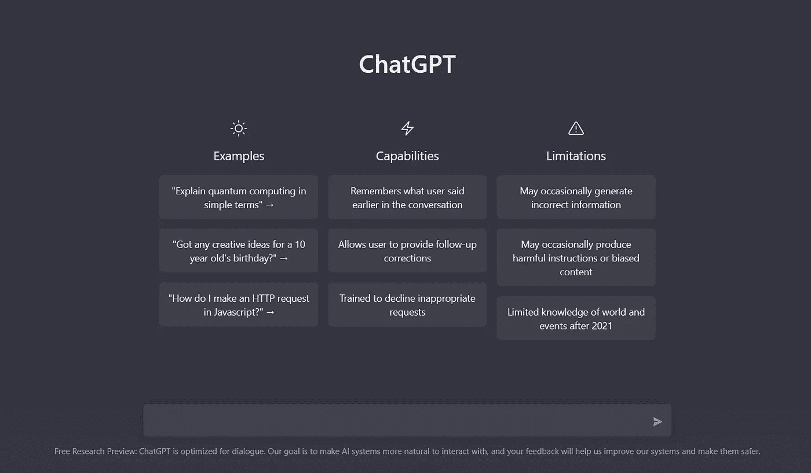
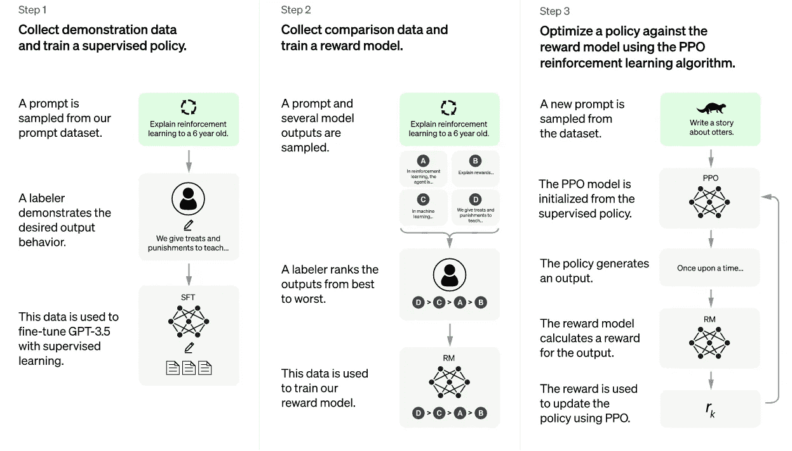

# 什么是 ChatGPT OpenAI，它是如何构建的:背后的方法论

> 原文：<https://levelup.gitconnected.com/what-is-chatgpt-openai-how-it-is-built-the-technology-behind-it-ba3e8acc1e9b>

图片来源:Amarujala

我们都听说过 ChatGPT，这个趋势人工智能程序。一个强大的人工智能可以为你的问题提供一个最优的答案。

我们将看看它是如何工作的——它的方法论。

# 关于 ChatGPT

**ChatGPT** 是由 **OpenAI** 基于 GPT-3.5 开发的大型语言聊天机器人模型。它有一种非凡的能力，能够以对话的形式进行交流，并提供看起来出人意料的回应。

大型语言模型执行预测单词序列中的下一个单词的任务。

带有人类反馈的强化学习(RLHF)是另一层培训，它使用人类反馈来帮助 ChatGPT 学习遵循指令并生成令人类满意的响应的能力。

图片来源:维基百科

# ChatGPT 创建者

ChatGPT 是由旧金山的人工智能公司 OpenAI 创建的。OpenAI Inc .是营利性 OpenAI LP 的非营利性母公司。

OpenAI 因其众所周知的 DALL E 而闻名，这是一种深度学习模型，可以从称为提示的文本指令中生成图像。

首席执行官是萨姆·奥尔特曼，他曾是 Y Combinator 的总裁。

微软是 10 亿美元的合伙人和投资者。他们共同开发了 Azure AI 平台。

# ChatGPT 培训模式

GPT-3.5 接受了来自互联网的大量代码数据和信息的训练，包括 Reddit 讨论等来源，以帮助 ChatGPT 学习对话，并实现类似人类的响应风格。

ChatGPT 还接受了人类反馈的训练(一种称为人类反馈强化学习的技术)，以便人工智能了解人们在提问时的预期。以这种方式训练 LLM 是革命性的，因为它不仅仅是训练 LLM 预测下一个单词。

图片来源:ChatGPT

2022 年 3 月的一篇名为《具有人类反馈的教学培训的语言模型》的研究论文解释了为什么这是一种突破性的方法:

> **这项工作的动机是我们的目标，即通过训练大型语言模型做特定人群希望它们做的事情，来增加它们的积极影响。**
> 
> 默认情况下，语言模型的优化目标是预测下一个单词，这只是我们希望这些模型做的一个代理。
> 
> 我们的结果表明，我们的技术有望使语言模型更加有用、真实和无害。
> 
> **仅仅扩充语言模型不会让它们更好地跟踪用户意图。**
> 
> **例如，大型语言模型会生成错误、有害或对用户毫无用处的输出。**
> 
> **换句话说，这些模型与其用户不一致。**

建造 ChatGPT 的工程师聘请了承包商(称为贴标机)来评估 GPT-3 和新 InstructGPT (ChatGPT 的“兄弟模型”)这两个系统的输出。

根据评估，研究人员得出以下结论:

> 与 GPT-3 输出相比，标签强烈偏好 InstructGPT 输出。
> 
> **InstructGPT 模型显示准确性比 GPT-3 有所提高。**
> 
> **InstructGPT 显示比 GPT-3 在毒性上有小的改善，但没有偏倚。**

研究论文的结论是，InstructGPT 的结果是积极的。尽管如此，他也指出还有改进的空间。

> 总的来说，我们的结果表明，使用人类偏好微调大型语言模型可以显著改善它们在各种任务中的行为，尽管在提高它们的安全性和可靠性方面还有许多工作要做。

ChatGPT 与简单聊天机器人的区别在于，它经过特殊训练，能够理解问题中的人类意图，并提供有用、真实和无害的答案。

由于这种训练，ChatGPT 可能会质疑某些问题，并丢弃问题中没有意义的部分。

另一篇与 ChatGPT 相关的研究论文显示了他们如何训练一个人工智能来预测人们的偏好。

研究人员注意到，用于评估自然语言处理的人工智能输出的指标导致机器在指标上得分很高，但低于人类的预期。

## 研究人员对这个问题解释如下

> **许多机器学习应用程序针对简单的指标进行优化，这些指标只是设计者意图的粗略代表。这可能会导致像 YouTube 推荐推广 clickbait 这样的问题。**

他们提出的解决方案是创建一个人工智能，可以提供针对人们偏好的优化答案。

为此，他们使用不同答案之间的人类比较数据集来训练人工智能，因此机器在预测人们认为满意的答案方面变得更好。

这篇论文分享说，训练是通过总结 Reddit 帖子完成的，也在新闻摘要上进行了测试。

2022 年 2 月的研究论文名为“从人类反馈中学习总结”。

## **研究人员写**

> **在这项工作中，我们证明了通过训练一个模型来优化人类偏好，可以显著提高摘要的质量。**
> 
> **我们收集了大量高质量的人与摘要比较数据集，训练了一个模型来预测人偏好的摘要，并使用该模型作为奖励函数，使用强化学习来微调摘要策略。**

我希望你会发现这篇文章很有见识，在这篇文章的后续部分，我们将了解到—*ChatGPT open ai 的局限性是什么，它能否取代 Google 来自动搜索查询*。

更多此类文章请 ***upvote，关注并与朋友分享*** 此文。

如果你有兴趣学习 Google Apps 脚本和自动化你的 Google Workspace？一定要试试这本**电子书**上的 [**谷歌企业应用套件脚本:初学者指南**](https://www.amazon.com/dp/B0BTJC9X5R)

快乐学习😁✌️

关于本文或任何其他技术建议的任何疑问，您可以发送电子邮件至**dilipkashyap.sd@gmail.com**

# 分级编码

感谢您成为我们社区的一员！在你离开之前:

*   👏为故事鼓掌，跟着作者走👉
*   📰查看[升级编码出版物](https://levelup.gitconnected.com/?utm_source=pub&utm_medium=post)中的更多内容
*   🔔关注我们:[Twitter](https://twitter.com/gitconnected)|[LinkedIn](https://www.linkedin.com/company/gitconnected)|[时事通讯](https://newsletter.levelup.dev)

🚀👉 [**加入升级人才集体，找到一份惊艳的工作**](https://jobs.levelup.dev/talent/welcome?referral=true)