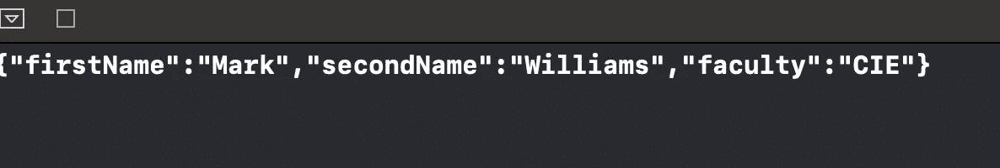

# Swift 中的可编码协议是什么？

> 原文：<https://levelup.gitconnected.com/what-is-codable-protocol-in-swift-50103c2d9d02>

编码和解码您的数据

照片由[德米特里·车尔尼绍夫](https://unsplash.com/@oneor0?utm_source=medium&utm_medium=referral)在 [Unsplash](https://unsplash.com?utm_source=medium&utm_medium=referral) 拍摄

几乎每个应用程序都有自己的用户数据，当用户关闭应用程序时，这些数据必须保存，并且在下次打开应用程序时仍然存在。为此，必须将内存中的信息编码成可以写入文件的数据形式。`Codable`协议通过从对象的属性名创建一个键/值对，并保存它，然后由`Encoder`或`Decoder`对象使用。

# 我们开始吧

标准库中使用的大多数 Swift 类型已经符合 Codable。如果您的所有数据类型都符合 Codable，那么剩下唯一要做的事情就是将 Codable 添加到声明中，一切都会自动生成。

JSONEncoder 上的 encode(_:)方法被认为是一个抛出函数，一种特殊类型的 Swift 函数，可以返回特定类型的错误。语法试试？允许函数返回可选值。如果没有错误，可选的将保存预期的值；否则就是零。

下面的例子将展示如何用 JSONEncoder 编码数据。

在以后的课程中，当您使用保存数据或 web 服务时，可编码协议将会派上用场。

# 包扎

这就是你应该知道的关于可编码协议的全部内容。我希望它是有趣的！

对其他相关协议感兴趣吗？欢迎访问我的其他相关文章:

*   [在 Swift 中创建您自己的协议](/creating-your-own-protocols-in-swift-e266707892b7)
*   [Swift 中的等价协议是什么？](https://medium.com/cleansoftware/what-is-the-equatable-protocol-in-swift-3cced3f28219)
*   [Swift 中的可比协议是什么？](/what-is-comparable-protocol-in-swift-8cb854e30cf7)
*   [Swift 中的 CustomStringConvertible 协议是什么？](/better-programming/what-is-the-customstringconvertible-protocol-in-swift-cbb766afac4d)

如果你有任何批评、问题或建议，欢迎在下面的评论区发表！

感谢阅读。