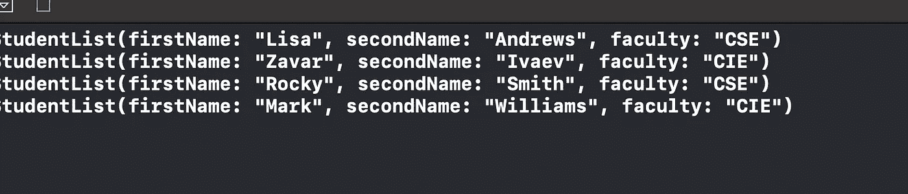

# Swift 中的可比协议是什么

> 原文：<https://levelup.gitconnected.com/what-is-comparable-protocol-in-swift-8cb854e30cf7>

允许您对数据进行排序。

由[诺德伍德主题](https://unsplash.com/@nordwood?utm_source=medium&utm_medium=referral)在 [Unsplash](https://unsplash.com?utm_source=medium&utm_medium=referral) 上拍摄的照片

符合可比协议有助于按照您希望的顺序对信息进行排序。这样，我们可以安排数据，使其最大限度地适合我们的使用。

事不宜迟，让我们在实践中探索一下`Comparable`协议。

# 我们开始吧

假设我们基地有一群学生:

请注意，列表中没有特定的顺序。

Comparable protocol 允许您定义如何使用`<`、`≤`、`>`或 `≥`操作符对对象进行排序。

`Comparable`有两个使用要求:

*   它要求采用类似的协议
*   它需要为< operator. Simply add a static < func that takes 【 (left-hand side) and 【 (right-hand side) parameters and returns a 【

Console Output:

# Wrapping up

This is all you should know about Comparable protocol. I hope it was interesting!

Interested in other relative protocols? Feel free to visit my other relevant articles:

*   [在 Swift 中创建自己的协议](/creating-your-own-protocols-in-swift-e266707892b7)提供一个实现
*   [Swift 中的等价协议是什么？](https://medium.com/cleansoftware/what-is-the-equatable-protocol-in-swift-3cced3f28219)
*   [Swift 中的可编码协议是什么？](/what-is-codable-protocol-in-swift-50103c2d9d02)
*   [Swift 中的 CustomStringConvertible 协议是什么？](/better-programming/what-is-the-customstringconvertible-protocol-in-swift-cbb766afac4d)

如果你有任何批评、问题或建议，欢迎在下面的评论区发表！

感谢阅读。