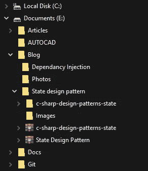
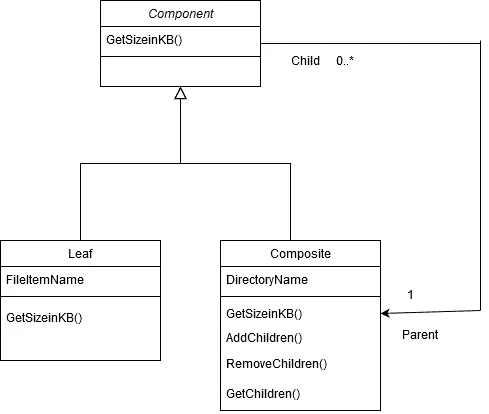
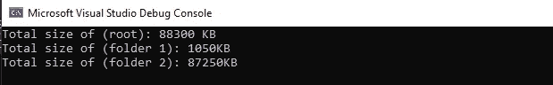

# 什么是复合和生成器设计模式

> 原文：<https://levelup.gitconnected.com/what-is-composite-and-builder-design-pattern-8b2b60783e0>

## 让我们用树来理解这两种模式。

复合模式提供了一种处理树形结构的方法。换句话说，具有父/子关系的数据结构。比如 JSON，HTML，XML 等等。

在。NET framework 中，XElement 是使用复合设计模式开发的。这种模式非常重要，甚至微软也在使用它。

文件系统就是一个真实的例子。

图 1:文件系统

正如您在上面的图像中看到的，该目录可以包含多个目录或文件。但是，文件不能包含更多的文件或目录，因为它们被视为**叶节点**。

复合模式使客户机能够以统一的方式与单个对象或对象的组合进行交互。**(作文遵循“有关系”)**

复合模式不仅仅是对树形结构建模，更重要的是，使客户端能够统一地对这些树形结构进行操作。让我们通过我们的文件结构例子来理解这意味着什么。如果我想得到一个单独的文件的大小，那么我可以在这些单独的文件上使用一个方法来给我它的大小，作为回报，我将得到文件的字节数。但是如果我想知道整个目录的大小，比如说我想从图 1 中得到目录 Blog 的大小。我只需要在目录博客上调用一个方法，作为一个消费者，我不想担心通过内部逻辑得到目录博客的总大小。

**从概念上来说，这就是复合模式的用途，无论我是想在粒度级别还是单个叶节点上操作。复合模式将使我们能够统一处理所有这些问题。**

看一下概念图。

复合设计模式的概念图

# 说够了！！

让我们从添加一个组件类开始。这个类本质上是抽象的，因为它依赖于实际的对象来实现它的梦想。我们需要一个抽象的方法来获取文件或目录的大小。

清单 1:一个组件类

## 下一个！

我们需要照顾叶节点。在我们的例子中，文件是叶节点。因此，为文件节点创建一个类，它将实现我们在清单 1 中创建的抽象类。

清单 2:类 FileItem

## 继续前进，

我们拥有的另一个组件是目录。让我们遵循同样的规则，即实现我们在清单 1 中创建的抽象类。

清单 3:类目录

## 最后，

我们的客户端类也称为调用者类，它将利用这种模式。

清单 4:类程序

现在运行你的程序并检查输出…

输出

## 它完美地工作。

一切都很顺利，甚至迈克尔也在庆祝。

## 除了一件事！！

调用者类相当混乱

我们在没有适当顺序的情况下添加文件，加上每次我们必须初始化一个目录或文件，我们必须使用一个新的关键字，这看起来相当混乱。

我们可以做的是在中间添加一个构建器类。以下是设计构建器模式的方法。你可以在这里详细了解 [Builder 设计模式](https://medium.com/@RikamPalkar/builder-design-pattern-e0cd6b439bdd)[。](https://medium.com/@RikamPalkar/builder-design-pattern-e0cd6b439bdd)

清单 5:类 FileSystemBuilder

另外，请注意，在我们的方法 SetCurrentDirectory()中。我们不执行递归来搜索目录，因为如果目录足够大，这不是最佳解决方案。相反，我们使用了基于堆栈的迭代解决方案。

不知道栈是什么？别担心，我帮你搞定了，阅读[这篇](https://medium.com/@RikamPalkar/builder-design-pattern-e0cd6b439bdd)文章。

现在看看我们的调用类是什么样子的:

清单 6:类程序

我们将以 JSON 格式显示该对象，以查看其树状结构。

现在，当您运行此应用程序时，您将获得以下输出:

最终输出

## 这才是你该做的。

先从概念上理解，那么实现起来就容易了。

我真诚地希望您喜欢这篇文章，并希望您受到启发，将所学知识应用到自己的应用程序中。谢谢你。

干杯，里卡姆！

在 Linkedin 上找到我！！

 [## Rikam Palkar -软件工程师-小天鹅-威德福| LinkedIn

### 通过编写可伸缩的代码让世界变得更美好。我从来没有在大学里发现我对编码的热情，也没有在…

www.linkedin.com](https://www.linkedin.com/in/rikampalkar/) 

# 编码快乐！

照片由 [Max Duzij](https://unsplash.com/@max_duz?utm_source=medium&utm_medium=referral) 在 [Unsplash](https://unsplash.com?utm_source=medium&utm_medium=referral) 上拍摄