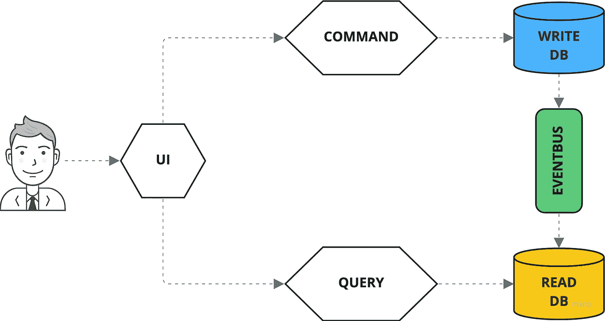

# 深入 CQRS —一个伟大的微服务模式

> 原文：<https://levelup.gitconnected.com/what-is-cqrs-8ddd74ca05bb>

## 什么是 CQRS，为什么它越来越受欢迎？

CQRS 是一种架构模式，经常与领域驱动设计(DDD)和事件源联系在一起。Greg Young 在 2010 年创造了这个术语，CQRS 的内容基于 Bertrand Meyer 的 CQS 设计模式。但是这背后是什么呢？

**CQS** (命令查询分离)设计模式建议将一个对象的方法映射成两类:要么一个方法改变了对象的内部状态，然后不返回任何东西，要么只返回元数据。这样的方法叫做**命令**。或者一个方法返回信息但不改变内部状态。这样的方法叫做**查询**。

根据 CQS 的观点，一个方法不应该同时是两者。比如你看栈的典型数据结构，push 函数是命令，而 top 是查询。最后，pop 函数违反了 CQS 模式，因为它修改了堆栈的内部状态并同时返回信息。

因此，CQS 的核心是将对单个对象的写入和读取分离开来。这一点尤其重要，例如，当代码要并行执行时:由于没有副作用，查询可以被并行化而没有任何问题，但是命令不能。

基于 CQS 模式，Greg Young 在 2010 年创造了 **CQRS** (命令查询责任分离)架构模式。它也把写作和阅读分开了，但是在 API 方面。因此，它提出了独立的 API，一个专用于更改应用程序状态的命令路由，另一个用于查询返回应用程序状态信息的路由。

从技术上来说，这可以在 HTTP 中实现，以便命令 API 专门用 POST routes 实现，而查询 API 专门用 GET routes 实现。实际的语义被转移到 URL。例如，下订单需要向 */submit-order* 路由发出 POST 请求。这与 REST 形成对比，REST 只允许 HTTP 动词作为动词，因此技术语义已经在 API 级别丢失了。

如果你进一步理解 CQRS 的思想，将 API 背后的数据库分成两个数据库也是有意义的。一个应该为写而优化，另一个应该为读而优化——例如，对一个进行高度规范化，而对另一个进行反规范化。这样，在写入时可以确保良好的完整性和一致性，同时在读取时实现高效率和高性能。

# 与 CQRS 一起开发 API

如果您想在 API 中实现 CQRS 模式，通过 POST 和 GET 来分离路由是不够的。您还必须考虑如何确保命令不返回任何内容，或者至少只返回元数据。

情况类似于查询 API。这里，URL 路径描述了所需的查询，但是在这种情况下，参数是使用查询字符串传输的，因为它是一个 GET 请求。由于查询访问读优化的非规范化数据库，因此可以快速有效地执行查询。

然而，问题是，如果不定期提取查询路由，客户端就不会发现命令是否已经被处理以及结果是什么。因此，建议使用第三个 API，即 Events API，它通过 web 套接字、HTTP 流或类似的机制通过推送通知来通知事件。

任何了解 GraphQL 并在描述命令、查询和事件 API 时被提醒了变异、查询和订阅概念的人都是正确的:GraphQL 是实现基于 CQRS 的 API 的理想选择。

# DDD CQRS 和活动采购

如前所述，CQRS 经常与**领域驱动设计** (DDD)和**事件源**一起被提及。虽然这三个概念是独立的，**他们很好地互补！**

发送到基于 CQRS 的应用程序的命令 API 的命令也可以在 DDD 意义上被解释为**用于集合**的命令。然后，聚合**按顺序产生一个或多个域事件**，可以使用事件源将这些域事件**存储在事件存储库**中，并用于聚合的稍后重放。

此外，流程中生成的域事件也被转发到 events API，后者又将它们传递给各种连接的客户端，这些客户端接收关于应用程序内技术流程的准实时更新。

此外，域事件也被转发到应用程序的 read 页面，以更新那里的(预先计算的)视图。为此，使用了所谓的投影，它决定技术领域事件与哪个视图的相关性，然后在 CRUD 语句的帮助下相应地调整受影响的视图。

在这种情况下，事件存储代表真实的单一来源，在它的帮助下，任何视图都可以在以后建立。然而，应该注意的是，写入视图与写入事件存储是分离的，所以开发人员应该熟悉 CAP 定理和最终的一致性。

# 上限和最终一致性

原则上，CAP 定理描述了一个三角形，其角代表**一致性**、**可用性**和**分区容差**。如果在向客户端确认写访问之前，先将写访问复制到所有其他应用程序节点，则分布式应用程序表现一致(一致性)。分布式系统的所有节点总是能够提供一致的响应。

另一方面，可用性描述了分布式系统可以在任何时候对读和写请求做出反应——不会因为系统的状态而有任何等待时间或被拒绝的请求。最后，分区容差要求分布式应用程序即使在单个节点出现故障或它们之间的网络连接中断时也能继续运行。

CAP 定理现在声明这三个方面中只有两个是可能的。特别是，这意味着一个始终一致和可用的系统(CA)只有在您能够排除任何硬件故障的情况下才是可能的，而这实际上是不可能的。因此，在实践中，您只能在 CP 和 AP 之间进行选择，也就是说，如果服务器或网络出现故障，分布式系统是否应该放弃可用性或一致性。

缺乏一致性乍听起来很危险，但这是“没有一致性”，而是一种“延迟一致性”。最后，一旦故障服务器再次可用，一致性就会恢复。

只要您不是为高度安全关键领域(公共基础设施、医疗系统……)开发应用程序，最终的一致性应该不是问题。放弃总是有保证的强一致性会导致更易访问和反应性更强的应用程序，这可能是一个很大的(商业)优势，尤其是在 web 和云环境中。还应该记住，现实只在极少数情况下表现出绝对的一致性。

# 为什么是 CQRS？

最后，问题仍然是为什么要和 CQRS 打交道。一个显而易见的原因是它对其他几个概念如 DDD、事件源和 GraphQL 的补充。此外，通过从一开始就将写作和阅读分开，CQRS 的目标是分布式架构，使其非常适用于运行在网络或云上的基于服务的系统。

因此，CQRS 也提供了**微服务架构**的所有优势，比如单个服务的可伸缩性、可维护性和可测试性。使用 CQRS，不同版本的业务逻辑的操作也很容易，并且可以明确限制单个服务的访问权限，这反过来有利于整个系统的安全性。

然而，缺点在于固有的比传统的客户机-服务器系统更复杂的体系结构——但是应该记住，CQRS 也有几个优点，但这是有代价的。

CQRS 最大的优势之一是将技术代码和业务代码分开的可能性，特别是在 DDD 和事件外包方面。因此，业务逻辑可以在不改变技术基础结构的情况下进行调整。同样适用，更重要的是，反之亦然，有利于商业逻辑的长期稳定和绝对自信。

由于上面提到的复杂性，建议您考虑是否在已经实现了 CQRS 和事件源的合适框架上构建您的应用程序，以便作为开发人员，您可以主要专注于设计和编写技术代码。这种框架可用于许多技术、语言和平台，如 Spring (Java)或 NestJS (TypeScript，NodeJS)。

# 结论

CQRS 是一种令人兴奋的分布式架构方法，可以发挥其优势，特别是 DDD 和事件源。尽管复杂性超过了传统的客户机-服务器体系结构，但您也可以获得一个更具可伸缩性的应用程序，它始终能更好地映射基本功能。

感谢您阅读我关于 CQRS 的文章。我希望你能从中吸取一些东西。关注更多。

干杯！

# 接下来阅读

 [## CQRS 微服务和 NestJS 类型脚本中的事件源

### 基于领域驱动设计、CQRS 和事件源的简单银行 API

levelup.gitconnected.com](/microservices-with-cqrs-in-typescript-and-nestjs-5a8af0a56c3a)  [## 微服务:深入领域驱动的设计

### 软件开发背景下的领域驱动设计

levelup.gitconnected.com](/domain-driven-design-in-software-development-f92c3f58d012)  [## 什么是活动采购(为什么)?

### 深入了解活动采购

levelup.gitconnected.com](/basics-of-event-sourcing-12ebe0b86788) 

# 分级编码

感谢您成为我们社区的一员！升级正在改变技术招聘。 [**在最好的公司**找到你最理想的工作](https://jobs.levelup.dev/talent/welcome?referral=true) **。**

 [## 升级-改变技术招聘

### 升级-改变技术招聘🔥使软件工程师能够找到完美的角色…

作业. levelup.dev](https://jobs.levelup.dev/talent/welcome?referral=true)