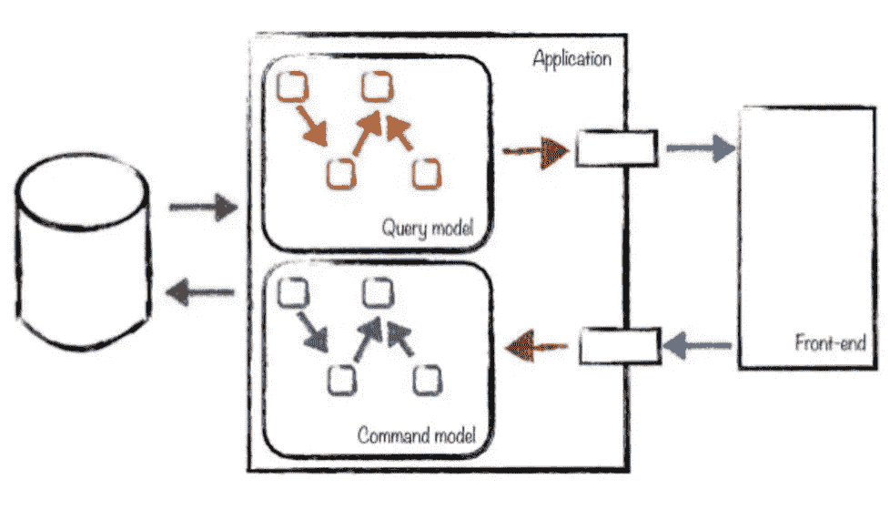

# 什么是 CQRS 和命令设计模式？

> 原文：<https://levelup.gitconnected.com/what-is-cqrs-command-design-pattern-5d400fd9f93a>

## 用 CQRS 和命令模式使代码更加模块化和易读

照片由[汉娜·约书亚](https://unsplash.com/@hannahjoshua?utm_source=unsplash&utm_medium=referral&utm_content=creditCopyText)在 [Unsplash](https://unsplash.com/s/photos/command?utm_source=unsplash&utm_medium=referral&utm_content=creditCopyText) 拍摄

每个系统都有许多状态变化。一些执行的任务往往是可重复的，由不同的独立类来完成。这可能导致代码和逻辑重复。如果我们正在处理一些复杂的或可重复的状态变化，可能值得把它打包到一个单独的类中。

在命令设计模式中，任何类型的请求都可以转换成一个类。它将是一个触发预期行为的“命令”。我们可以从客户端提取与命令相关的逻辑，并使其可重用。这种行为完全符合单一责任原则，因为现在我们的指挥只有一个目标和改变的理由。我们可以在应用程序的其他部分添加可重用的命令，只要它们共享相同的接口，因此这里也支持开放/封闭原则。

让我们考虑一个简单的工作板应用程序。我们希望能够添加和删除工作列表。对于命令模式来说，这似乎是一个不错的工作，因为这样的操作可能非常复杂，并且有很多业务规则和限制。

我们将从命令接口的定义开始。每一个都应该有一个公共方法来触发它的执行。

我们将分开创建和删除列表的机制。还会有一个额外的数据检索和表示模型，但是为了这个例子，我们将只关注改变应用程序状态的命令。我们将数据存储在外部数据库中，并执行非常简单的输入验证。

我们的系统将能够使用`DeleteListing`命令删除现有列表。

`ListingRepository`只是一个虚类。在现实生活中，它将负责存储和更新数据。

我们的命令模式实现的最后一部分是处理命令的创建和执行的客户机。

命令模式的优点是跟踪应用程序的状态变得很容易。我们知道执行了什么命令，并且有可能恢复它。每个命令可能都有`revert`方法，该方法包含所有与撤销其操作相关的逻辑。

## 元素

*   命令(`Command` )—定义命令的接口
*   具体命令(`CreateListing`，`DeleteListing` ) —命令的具体实施
*   客户端(`Client` )—创建具体的命令，并将它们与接收器匹配
*   接收器(`ListingRepository` )—可以执行处理命令所需的操作

## 优势

*   提倡单一责任和开放/封闭原则
*   允许异步命令执行
*   帮助跟踪状态变化，并使其可恢复
*   将调用方与命令接收方分开

## 不足之处

*   会使代码过于复杂
*   我们没有收到命令的直接结果

有一个古老的规则叫做命令-查询分离( **CQS** )。它声明读取数据的方法不应该修改数据。我们可以根据需要多次运行查询，系统的状态和结果应该保持不变。没有副作用。修改状态的方法不应该负责查询和返回数据。命令确实会改变应用程序的状态，并且每个调用可能会有不同的结果。因此，方法可以是命令或查询，但不能同时是两者。这种方法使我们代码的意图更加清晰，并消除了意想不到的副作用。

在许多 CRUD 系统中，我们有一个相当大的模型来表示数据库中的一个表。它由验证规则、安全规则、数据格式和一大堆业务逻辑组成。如果系统很简单，它可能就很好并且易于维护。虽然，当我们处理一些更复杂的事情时，事情会变得混乱。命令查询责任分离( **CQRS** )可以被认为是 CQS 的扩展，在处理复杂系统时非常方便。现在我们不仅仅是像在 CQS 那样讨论方法，而是讨论整个查询或命令类。

在大多数系统中，写入和读取的数量不成比例。我们更新用户数据多少次，查询用户数据多少次(例如，只是为了在导航栏中显示用户名)？这是分别开发和扩展这两种功能的充分理由。在 CQRS，我们使用独立的读写模式。这些相互之间没有任何了解，可以完全独立开发，可能由不同的团队开发。我们还可以在 CQRS 的基础上更进一步，不仅在应用程序中使用多个数据模型，还可以在数据库级别使用多个数据模型(例如，使用物化视图)。在我们的系统中，CQRS 不一定要用在每个地方。它应该只在需要的地方使用。

来源:[维基共享资源](https://commons.wikimedia.org/wiki/File:CQRS_Principe.png)

去 CQRS 有许多不同的方法。大多数都与命令设计模式紧密相关。我们认为，在某些方面，它可以被视为它的延伸。有人可能会说，我们的命令设计模式的简单例子也是 CQRS 的例子。有可能，但是让我们尝试一些更传统的方法。

在 CQRS，我们通常保持命令没有业务逻辑，并将其转移到特殊的命令处理程序中。每个命令处理程序都确切地知道如何管理具体的命令。命令和命令处理程序可以通过一种称为命令总线的机制匹配在一起。当我们向事件总线添加一个新命令时，它将通过匹配一个适当的处理程序来使它工作。有一些库值得考虑，它们使得使用 CQRS 和 PHP 变得更加容易，比如[战术家](https://github.com/thephpleague/tactician)、 [SimpleBus](https://github.com/SimpleBus/SimpleBus) 、[百老汇](https://github.com/broadway/broadway)。

我们将使用一个简单的 CQRS 实现的例子，它使用命令总线和命令处理程序，不需要任何外部库的支持。我们将关注模式的“命令”方面。

我们的命令会很简单。它将没有业务逻辑，只有数据。

命令处理程序将是与命令相关的所有逻辑的位置。

我们的命令总线将向它们的处理程序注册匹配的命令类，并根据请求执行它们。这可以在应用程序级别进行配置，并简化命令的使用。

创建一个新命令并添加到总线就足够了。客户对随后发生的业务规则一无所知。

使用 CQRS 为您的应用程序带来了许多好处，但一切都是有代价的。在这种情况下，代价是增加了复杂性。这种模式在复杂模型的情况下很有用，但是在使用简单的 CRUD 时只会带来不必要的开销。我们应该永远记住为工作选择合适的工具，而不是相反。

## 优势

*   读写模型的独立开发
*   支持应用模块化
*   允许异步命令执行

## 不足之处

*   可能的最终一致性问题
*   会使应用程序过于复杂

# 资源

*   “设计模式”——GoF
*   [《CQRS》——马丁·福勒](https://martinfowler.com/bliki/CQRS.html)
*   [“命令和查询责任分离模式”——微软文档](https://docs.microsoft.com/bs-latn-ba/azure/architecture/patterns/cqrs)
*   [《CQRS》——格雷格·杨](https://cqrs.files.wordpress.com/2010/11/cqrs_documents.pdf)

# 源代码

完整的源代码和其他一些模式可以在这里找到:

 [## jkapuscik 2/设计-模式-php

### 这个项目是一组在现实世界中使用不同设计模式的简单例子。每个人都有一个…

github.com](https://github.com/jkapuscik2/design-patterns-php) 

如果您想了解更多的设计模式，您可以在以下文章中找到它们:

*   [工厂方法](https://medium.com/@j.kapuscik2/getting-started-with-design-patterns-in-php-4d451ccdfb71)
*   [创作模式](https://medium.com/@j.kapuscik2/creational-design-patterns-in-php-db365d3245ce)
*   [观察者](https://medium.com/@j.kapuscik2/observer-pattern-in-php-2ba240f89fb2)
*   [迭代器](https://medium.com/@j.kapuscik2/iterator-pattern-in-php-b7624f6bdbcf)
*   [状态&策略](https://medium.com/@j.kapuscik2/state-strategy-design-patterns-by-example-f57ebd7b6211)
*   [模板方法](https://medium.com/@j.kapuscik2/template-method-pattern-in-php-6116fd7e8ccc?source=friends_link&sk=ac4c483446bd5a5323c09a662bd54116)
*   [飞锤](https://medium.com/swlh/flyweight-design-pattern-in-php-edcda0486fb0?source=friends_link&sk=a0fa3083d5afd7e41af8a4f7a1df05f1)
*   [代理](https://medium.com/better-programming/proxy-design-pattern-and-how-to-use-it-acd0f11e5330)
*   [装饰者](https://medium.com/better-programming/decorator-c04fae63dfff)
*   [依赖注入](https://medium.com/better-programming/dependency-injection-8f09a93ec995)
*   [合成](https://medium.com/swlh/composite-908878748d0e)
*   [适配器](https://medium.com/swlh/building-cloud-storage-application-with-adapter-design-pattern-8b0105a1bda7)
*   [立面](https://medium.com/better-programming/what-is-facade-design-pattern-67cb09ce35d4)
*   [桥](https://medium.com/better-programming/what-is-bridge-design-pattern-89bfa581fbd3)
*   [责任链](https://medium.com/@j.kapuscik2/what-is-chain-of-responsibility-design-pattern-ff4d22abd124)
*   [访客](https://medium.com/@j.kapuscik2/what-is-visitor-design-pattern-8451fb75876)
*   [空对象](https://medium.com/@j.kapuscik2/what-is-null-object-design-pattern-f3b4d3d28636)
*   [流畅的界面](https://medium.com/@j.kapuscik2/what-is-the-fluent-interface-design-pattern-2797645b2a2e)
*   [规格](https://medium.com/@j.kapuscik2/what-is-the-specification-design-pattern-4051dd9e71c3)