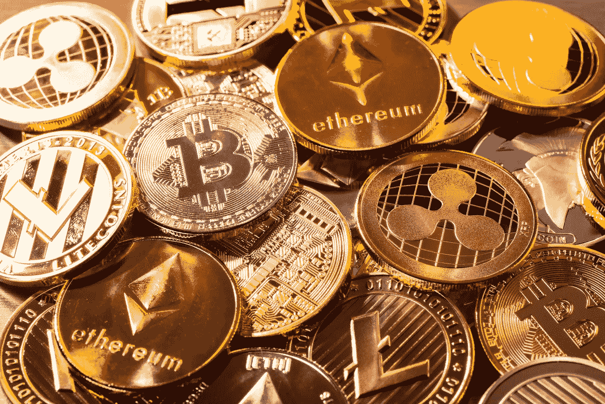
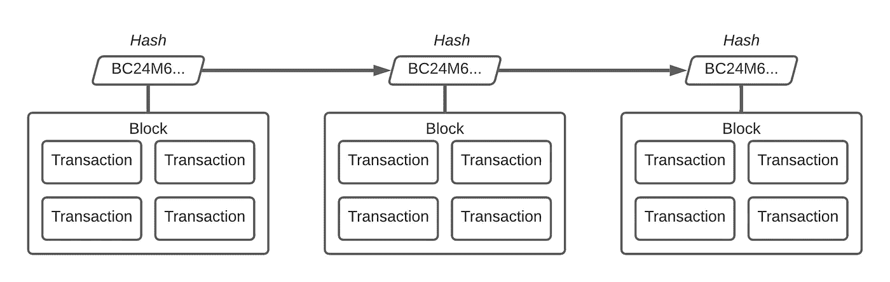
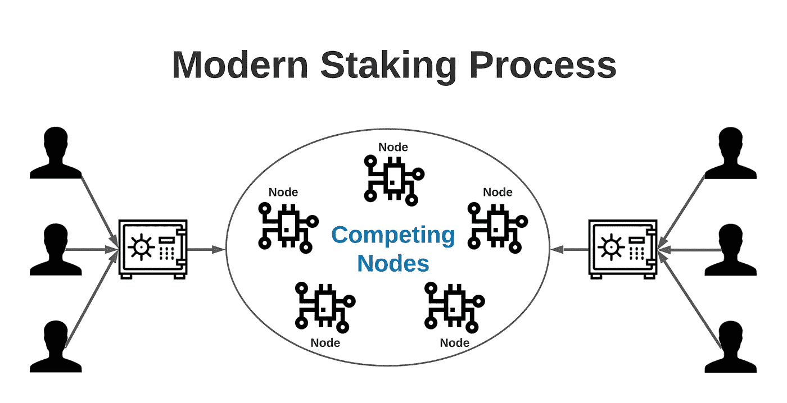

# 什么是加密赌注？

> 原文：<https://levelup.gitconnected.com/what-is-crypto-staking-4dc96347411d>

## 了解这个新技术，学会自己做被动收入。

2021 年已经被证明是加密货币和推动去中心化的一年。比特币和以太坊已经达到了*的历史高点*，大型机构正在参与其中，就连对区块链技术最坚定的怀疑者现在也在照镜子。在这个动荡的时代，除了了解这些技术的工作原理之外，理解术语也很重要。

> 毕竟，如果你不能清楚地说出你投资背后的原因，你就不是在投资——你是在赌博。

最广泛使用但又被误解的术语之一是**加密赌注**。许多人认为这种新趋势是一种简单易行的方式，可以利用你已经拥有的供应来赚取额外的密码。但是实际上是怎么回事呢？免费吗？有风险吗？

在本文中，我们将介绍什么是加密堆栈，以及它的含义和未来的可能性。我们还将介绍**如何开始自己押注加密货币**以及为什么这一最新趋势只是爆炸式增长的加密市场中的又一个机遇。

# 首先是背景

分散的加密货币让人们有机会在没有中央机构的情况下汇款。区块链是一个公开分发的账本，任何人都可以看到比特币的流动以及哪个账户拥有什么。简单来说，你可以把区块链分类账想象成一个无所不知的 excel 表格，列出了自该货币问世以来的每一笔交易。

> 像这样的系统的一个直接缺陷是，有人可能试图花掉他们实际上没有的钱。

通常情况下，你会让银行或机构负责核实这些交易——但由于区块链理工大学的存在，情况并非如此。

**比特币挖矿**就是在账本上验证交易的过程。为了保持效率，在单个**块**下验证数千个交易。为了激励社区验证这些交易块，有一个**块奖励**，你会得到固定金额的比特币。一旦成功，比特币软件就会凭空创造这种奖励，直到达到 2100 万比特币的最大供应量。

比特币通过**区块链**跟踪这些经过验证的区块。区块链通过**哈希**的数学技术来保持彼此的联系。本质上，你给一个哈希函数一个比特币块作为输入，算法会吐出那个块的哈希作为输出。这创建了一个验证块链，每个验证块通过其计算的散列相互连接。随着区块链的增长，计算这些散列变得更加困难，这是一个猜测因素。

成功的块通过哈希(使用 LucidChart)按顺序指向彼此

然而，比特币区块链不是一条直链，而是一棵树。即使这种可能性很小，偶尔也会有两个矿工在完全相同的时间生成下一个区块。这导致树形成两个分支，由采矿社区决定哪个分支值得采矿奖励。真实投票通过**最长链规则**强制执行，拥有最多票数的分支被认为是正式的区块链。计算的块越多，就越难偏离主分支。

> 在撰写本文时，为一个新块计算正确散列的几率大约是宇宙中恒星数量的 1/10。一台标准计算机需要几百万年才能正确计算出一个新的比特币块。这就是为什么整个仓库可以专用于比特币开采——以及为什么通过淫秽的能源消耗对其环境影响的压力越来越大(比特币目前占世界碳排放的约 0.5%，或约 500 万美国家庭)。

## 工作证明

这个浪费的系统是为了防御黑客而设计的。由于整个系统是基于必须进行大量计算工作来验证交易的想法而构建的，因此整个过程被称为**工作证明**。这是一个重要的注意事项，我们将看到这种共识机制和一种流行的替代机制之间的差异。

# 利害关系证明

一种越来越流行的方法是使用产生的加密货币代币/硬币本身，而不是依赖原始计算能力来验证区块链。这在某种程度上可以简化为一个彩票过程，将您的资金存入一个集体池中被称为**下注**。你可以把你的资金比如以太坊的加密货币以太作为你的股份。这些资金将存放在一台被称为节点的网络计算机上。

用 LucidChart 做的

该图描绘了用户如何通过赌注锁定他们的加密货币。保管库表示您的加密在特定时间段内是如何被锁定的。然后，每个人的赌注硬币可以在网络节点内用于产生新的区块和获得奖励的竞争。

> 一旦人们押上了他们的密码，**节点就会竞争继续区块链**。赌注不是使用计算能力来生成新的区块(挖掘)，而是以类似于彩票的方式使用硬币，并选择其中一个节点作为合法的获胜者来生成新的区块。

这个过程被称为**铸币**或**锻造**来代替采矿术语。每种加密货币可以有不同的方法来选择奖励并在整个网络中进行分配，但基本原理是相同的。

## 以太坊的区块链

以太坊最初的区块链是建立在工作机制的基础上的。这个加密巨头现在正在过渡到以太坊 2.0 中的股权证明网络——虽然主网络已经发布，但真正的采用被推迟到 2021 年至 2022 年之间的某个时候。

## 锁定选项

押注自己的加密货币的两种最流行的方法是通过**加密交易所**和**加密赌注池**。各有利弊，交易所是最简单的解决方案，也是收费的弊端。另一方面，加密赌注池是一群在一起下注的人，但通常是赌注的“狂野西部”，需要大量的研究才能知道你在做什么。

# 如何让 Crypto 成为你的赌注

有无数的选择，当谈到赌注自己的密码。通过你自己的研究来找到与你的目标相匹配的东西是非常重要的。你应该问自己的一些基本问题是:

*   我愿意投入多少时间和研究？
*   我对安全和隐私有什么感觉？
*   我是不是被收费抢了？
*   我可以在其他地方获得更好的赌注奖励吗？
*   **在锁定过程中，我的密码安全吗？**

出于这些原因，我个人选择了加密市场上发展最快的交易所之一。我选择了 crypto.com，因为它不仅是加密交易的一站式商店，也是赌博和 visa 借记卡的一站式商店，开创了加密进入日常购物的先河。有了 crypto.com，你所有的密码**都会安全地离线保存在冷库里**。他们的费用是市场上最低的，赌注回报也是一流的。

对 crypto.com 的一个暗示是，他们要求你购买并下注他们自己的加密货币 CRO，以获得最高的赌注回报。在我看来，这并不是一个损失，因为 CRO 有许多自己的好处，并且在过去的六个月里看到了健康的采用。我最初的 25 美元注册奖金已经增长到将近 70 美元。

> 如果你想使用我的注册奖金，让我们都获得 25 美元的奖励，我的推荐代码是 ***w6jyux2vcq。你需要购买额外的 CRO 来获得奖励，但是在使用 crypto.com 5 个月后，我相信这是完全值得的。***

此外，他们有一个我日常使用的获奖移动应用程序:

 [## Crypto.com-立即购买比特币 Google Play 上的应用

### 下载 Crypto.com 应用程序并在几分钟内注册一个帐户。开始赚取高达 6.5%的年利率。成长…

play.google.com](https://play.google.com/store/apps/details?id=co.mona.android) 

即使不下注 CRO，你也可以在以太坊赚取高达 **4.5%的回报，或者在稳定的硬币(总是价值 1 美元)如泰索或 USDC** 上赚取 **10%的回报。这太疯狂了。如果你决定也投资 CRO，你会看到更高的利率。**

如果你的加密货币只是在比特币基地这样的交易所里闲坐着，那就停止吧。将您的加密放入您信任的交易所，让您的加密为您工作，立即享受加密赌注的好处！

*本文仅供参考，不应视为财务或法律建议。在做任何重大财务决定之前，先咨询财务专家。*