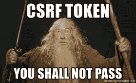

# 什么是 CSRF？它是如何工作的？

> 原文：<https://levelup.gitconnected.com/what-is-csrf-how-does-it-work-af1ae4c227a7>

如果你读过我以前的媒体故事，你可能已经知道这些天我们正在进行 ScholarX 项目。上周，我已经为后端创建了一些 API 端点和单元测试。在做这个的时候，我发现了一个我从未听过的词；**谓 CSRF。所以我决定对此做些研究，并与你们分享我的发现。**

# 这是什么？

那么什么是 CSRF 呢？基本上它是“跨站请求伪造”的缩写。看起来像是非法的。是啊！举个例子，在 CREF，有人可以在没有你确认的情况下通过发送请求从你的银行账户里偷钱。此外，有人甚至可以改变你的重要数据库中的数据。(不要试图做这些**😆**)


> 在 CSRF 攻击中，一个无辜的最终用户被攻击者诱骗提交了一个他们不想要的 web 请求。这可能会导致在网站上执行操作，包括无意中泄露客户端或服务器数据、更改会话状态或操纵最终用户的帐户。— [维基百科](https://en.wikipedia.org/wiki/Cross-site_request_forgery)

所以我们必须防止这种情况。在 spring boot 中，CSRF 保护自动附带 spring-boot-starter-security 包。默认情况下，它是启用的。因此，您只需创建一个`SecurityConfig.java`文件并启用 Web 安全。

在 CSRF 保护中，我们使用令牌来授权 API 请求。

> CSRF 令牌是一个唯一的、秘密的、不可预测的值，它由服务器端应用程序生成，并以某种方式传输到客户端，以便包含在客户端发出的后续 HTTP 请求中。



让我们举一个例子。假设用户想使用表单向数据库添加一些数据。因此，用户登录到仪表板，有一个表单来添加数据。在这里，服务器发送一个秘密的 csrf 令牌，格式如下。并且它还发送另一个 csrf 令牌作为 cookie。这两个都是随机生成的，所以没人能猜到。提交表单后，两个令牌都被再次发送到服务器。服务器检查令牌是否与先前的令牌匹配。如果它们不匹配，请求将被拒绝。事情就是这样发生的。

1.  服务器发送两个令牌(形式为，cookie 形式为)
2.  用户提交表单并发送请求
3.  服务器检查两个令牌
4.  服务器批准或拒绝请求

# 您想禁用它吗？

尽管有风险，但您可以出于测试目的或其他目的禁用 csrf 保护。您唯一需要做的就是像这样更新`SecurityConfig.java`:

```
@EnableWebSecurity
public class SecurityConfig extends WebSecurityConfigurerAdapter{@Override
    protected void configure(HttpSecurity http) throws Exception {
        http.csrf().disable();
    }
}
```

目前就这些。我仍在学习如何在 spring-boot 中使用 csrf 令牌。希望在以后的帖子里告诉你。直到那时…再见！感谢阅读！