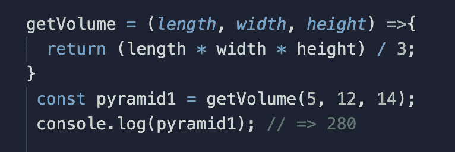
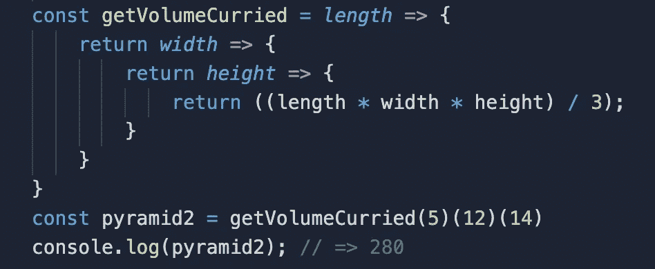
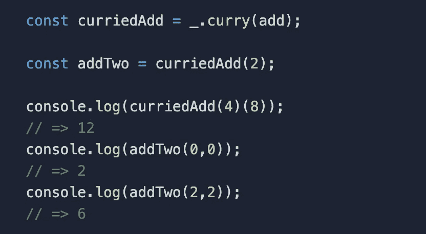

# JavaScript 中的 currying 是什么？

> 原文：<https://levelup.gitconnected.com/what-is-currying-in-javascript-c4eaec6e07b3>

有时候，当编写复杂的程序时，头痛和沮丧会感觉像是开发过程中不可避免的部分。随着我不断地学习和构建我的工具包来编写干净的、结构合理的代码，我不断地发现新的方法来简化我的逻辑并帮助我避免那些讨厌的头痛。我发现的最新工具之一是奉承。

# **那么这到底是什么“阿谀奉承”呢？**

Currying 是一种函数式编程技术，它将一个接受多个参数的函数转换成一系列嵌套函数，每个函数只接受一个参数。

该函数不是预先获取所有参数，而是只获取第一个参数并返回一个接受下一个参数的新函数，重复这个过程直到所有参数都用完。当 currying 链中的最后一个函数被返回时，由于闭包的原因，传入的每个参数都可以被访问并在执行中使用。传递给函数的参数数量被称为函数的 *arity* ，将 arity 保持在最小有几个好处。

# **让我们用一个简单的例子来探讨这个概念。**

我们有一个基本函数 *getPyramidVolume* ，它获取金字塔的长度、宽度和高度，并返回金字塔的体积。

我们可以让这个函数接受一个参数，然后返回一个接受一个参数的函数，然后返回一个接受一个参数的函数🤭).这个循环一直持续到返回最后一个函数，最后一个函数使用它接受的参数以及之前传入的参数来执行计算。

# 所有功能都可以“咖喱化”吗？

原生 Javascript 不包含 curry 函数，但许多库包含。使用 lodash，将函数转换为 curried 版本就像将函数传递给 _.curry 一样简单。

在这个例子中，我通过 _ 传递了 add 函数。创建一个 curriedAdd 函数。我现在可以使用 curriedAdd 作为一个模块来创建其他函数，比如 addTwo，它可以接受我传入的任何参数。

# 酷！那么…为什么这很重要？

currying 的想法是，你的函数可以通过应用程序，逐步接收它需要的参数。这是非常有用的，有几个不同的原因。通过减少 arity，可以减少不必要的副作用。Currying 您的代码允许您传入第一个参数，它将返回一个预期的和无争议的结果，然后继续处理您的下一个参数，以此类推，直到您的所有参数都被接收。这也增强了代码的模块化。通过将一个僵化的功能分解成可以轻松重用和重新配置的更小的组件，您的代码更容易阅读、更容易修复、更容易管理和重用。很难理解为什么会有人不喜欢如此强大的技术。

# 总之，

总而言之，currying 允许我们将一个接受多个参数的笨拙函数转换成一个只接受一个参数的更平滑的函数，这种“神奇”的事情多亏了闭包。就像可以在烹饪过程的不同阶段添加不同的香料来制作美味的咖喱一样，我们新加入的咖喱功能可以更容易地分解成它们的基本部分，然后分散在我们的程序中，以实现我们想要的功能。