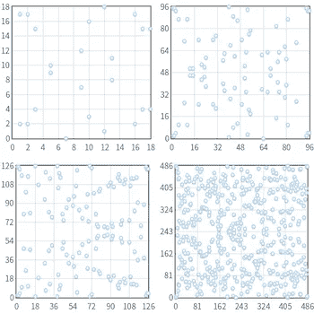

# 什么是 CVE 2020–0601 又名。弧线球，为什么它如此危险？

> 原文：<https://levelup.gitconnected.com/what-is-cve-2020-0601-aka-curveball-and-why-is-it-so-dangerous-8664f8c8e9e9>

1 月 13 日星期一，Brian Krebs 在他的[博客](https://krebsonsecurity.com/2020/01/cryptic-rumblings-ahead-of-first-2020-patch-tuesday/)上发布消息称，他得到消息称，第二天，微软将发布软件更新，修复 Windows Crypto API 中的一个漏洞。

事实上，在 1 月 14 日的第二天，美国国家安全局发布了一个网络安全公告，披露了加密 API 中的一个漏洞。该漏洞允许攻击者在 Windows 10 中击败证书验证，并将影响 TLS、代码签名等。

不到 24 小时后，安全研究员萨利姆·拉希德(Salim Rashid)在他的 twitter 账户上发布了一份概念证明，显示他使用定制的 CA 证书成功“瑞克翻滚”了 github.com 和 nsa.gov。

此后不久，奥利普恩又名。来自丹麦的安全研究员 Oliver Lyak 在 [GitHub](https://github.com/ollypwn/CurveBall) 上发布了一个利用概念验证，供任何人使用。震惊世界的是，这个漏洞只包含不到 10 行代码，任何人都可以做到。

在这篇博客文章的其余部分，我将尝试解释这个漏洞是如何在一个非常高的水平上工作的，并指出为什么这个利用是极其强大的。

# CA 证书

让我们先来看看基本 CA 证书由什么组成。这些类型的证书用于签署其他证书，作为一种信任形式。您有一个证书，并让一个著名的证书颁发机构(CA)签署您的证书。通过签名，他们在某种程度上“证明”你就是你所声称的那个人。


典型的 CA 证书包含诸如主题(颁发者)、有效期、密钥用法(密钥的用途)、公钥和 CA 证书中使用的算法类型声明等信息。

两种最常用的算法是椭圆曲线和 RSA。**重要的是要知道*CVE 2020–0601*又名。曲球只影响椭圆曲线证书。RSA 类型 CA 证书不受影响。**

椭圆曲线是密码学中使用的数学概念。使用椭圆曲线加密时，有许多不同类型的数学曲线可以使用，因此每个椭圆曲线证书必须包括指定证书中使用的曲线类型。


“高效加密标准”中定义的曲线示例

每条曲线都由一系列参数组成，称为 *p* 、 *a* 、 *b、*G 等。通过声明我们想要像 *secp256r1、*这样的预定义曲线，这些值(p，a，b，G)将自动为我们设置，我们的证书将使用该指定曲线。


有时，您希望使用自定义曲线或“尚未实现”的曲线，为此，您可以直接在 CA 证书中包含所有需要的参数，而不是定义预定义的曲线。

```
Curve: parameters p/a/b/G
```

当微软实现这一功能时，你可以提供自己的参数来表示椭圆曲线，这就是 Windows 10 引入漏洞*CVE 2020–0601*的时候。

# 证书用途

在我们研究如何利用*CVE 2020–0601，*之前，我们需要先谈一谈证书在现实世界中是如何使用的。我们将了解一种使用证书来加强信任的方法，那就是在请求网站时。

Windows 10 提供了一个应用程序可以用来验证证书的库。这个库叫做*crypt32.dll*，漏洞就是在这里被发现的。任何依赖该库来验证加密签名的 windows 应用程序(如网络浏览器、文件传输工具或电子邮件客户端)都可能受到*CVE 2020–0601*的影响。


互联网上的大多数可信站点都有自己的签名证书。这用于验证当我们在互联网上请求某样东西时，我们是从我们请求它的实际地方得到它的。这是为了防止中间人攻击、虚假网站等。


假设我们想要连接到*youtube.com*。当我们请求连接到他们的网站时，他们将首先发送他们自己的证书(由某个 CA 签名)。然后，他们还将发送签署他们证书的根 CA(证明他们是他们所声称的那个人的证书)。


浏览器将首先使用 Windows 提供的 crypt32 库验证签名。然后，同一个库将检查包含许多预定义的可信根 CA 的内部注册表，检查 youtube.com 发给我们的 CA 证书是否来自 Windows 信任的人。


如果所有验证都顺利，安全连接就建立了，对于未来的请求，Windows 中的 crypt32 将缓存发送的根 CA，以便它可以加速后续请求。


正是在这里，在缓存之后，存在一个漏洞，使得攻击者能够生成一个恶意的 CA 证书，该证书反过来会被 Windows 信任。

# 漏洞

如果我们研究 Windows 中的 crypt32 如何验证其缓存中的 CA 证书，它会检查所有缓存的证书，并检查所提供的 CA 证书中的公钥是否与任何缓存的 CA 证书公钥相匹配。


另一方面，它没有验证两个证书使用的是同一类型的曲线。如果我们设法猜出曲线和私钥，我们可以成功地生成一个假的 CA 证书，我们可以用它来签署其他证书，游戏就结束了。

但是在我们制作一个假的 CA 证书之前，我们需要知道更多关于椭圆曲线密码的知识。

# 椭圆曲线基础

那么，什么是椭圆曲线密码，简称 ECC？它是一种被称为非对称密码的密码。在非对称密码学中，你有一个*公钥*和*私钥*。公钥可以公开暴露，任何人都可以用它来加密东西。但是私钥是唯一可以解密用那个特定公钥加密的东西。

很常见的是，你在互联网上广泛地共享和存储公钥，这样，如果有人需要与你进行加密通信，他们可以使用你的公钥，然后只有你用匹配的私钥才能解密消息(很好吧？).

我们之前讨论过一组预定义的椭圆曲线，你可以在生成 CA 证书时从中选择。这些曲线由一组被称为 *P* 、 *a、b 等*的预定义值构建而成。如果我们用一个特定的公式定义这些值，我们得到一条椭圆曲线。


椭圆曲线示例

为了从这条曲线开始生成公钥和私钥，我们首先需要在曲线上定义一个起点，我们可以将这个起点称为 *G* (生成器)。从这个起点，我们开始在图上跳“n”次。



椭圆曲线上的运动和产生的点

我不打算解释我们如何在曲线上跳跃，因为这相当复杂，有一整个 [wiki 页面](https://en.wikipedia.org/wiki/Counting_points_on_elliptic_curves)描述这一点，所以我们现在将省略它。但你应该知道的是，在曲线上跳跃数百万次，甚至数十亿次，会产生一系列点(当你移除曲线时)，这最终会成为一个非常大的因素。我们姑且称这个因素*“x”*。最后我们得到一个简单的公式 *x * G* (起点乘以我们的因子)*。*

这个公式等于，所以我们把它加进去，这样我们就能得到这样的结果:


其中 *G* 是我们在图上的起点， *x* 是我们跳跃的结果，乘积是 q

定义时，这个公式中的 x 是我们的*私钥*，Q 是我们的*公钥*。正如前面提到的，我们的公钥可以发送给任何人，但是我们如何得到结果(x 和 G)是我们的“秘密武器”,没有人知道。

试图通过翻转公式来导出密钥是所谓的 [**离散对数问题**](https://www.khanacademy.org/computing/computer-science/cryptography/modern-crypt/v/discrete-logarithm-problem) ，并且众所周知这是一个非常困难的问题，因此当试图对私钥进行逆向工程时是不可能的。


所以，暂时这感觉很安全，对吧？

# CVE 2020–0601

有了这些知识作为先决条件，这就是*CVE 2020–0601*发挥作用的地方。由于 Windows 不会验证证书中提供的曲线，因此我们可以提供这些参数，并根据这个简单的数学公式创建一个恶意证书。

既然我们可以控制参数，我们把私钥设置成 20，100 或者简单的值怎么样…比如数字 1？


**这将导致我们的公钥等于我们在图上的起点，就像我们有了两个秘密参数一样，只是因为知道了公钥！**

有了这些信息，我们现在就可以通过获取公钥来伪造任何椭圆曲线证书。这里有一个例子。我们获得一个公钥，比如 1234，然后将它放入公式中:


通过使用这些信息，我们可以生成一个由我们控制的有效 CA 证书！

概括一下:

**只要从任何来源获取公钥，我们就可以生成一个完全有效的恶意 CA 证书，我们可以用它来签署任何其他证书。该证书将被 Windows 10 信任，因为它将通过对其证书缓存的检查。**

# 奥利普恩的概念证明

Oliver Lyak 在 Github 存储库中演示了如何通过生成虚假的 CA 证书来利用该漏洞，然后继续演示如何使用它来签署其他证书，或者将代码签署为“可信的”。

下面的代码摘自他的[例子](https://github.com/ollypwn/CurveBall/blob/master/main.rb)。

```
require ‘openssl’# Read file provided in the first argument
raw = File.read ARGV[0]# Parse the file as a certificate
ca = OpenSSL::X509::Certificate.new(raw)# Extract the public keyca_key = ca.public_key# Set a private key to 1
ca_key.private_key = 1# Get the group parameters that contains the curve
group = ca_key.group# Set the generator parameters (G in our formula) to the public key
group.set_generator(ca_key.public_key, group.order, group.cofactor)# Ensure we are sending explicit parameters and not a predefined curve
group.asn1_flag = OpenSSL::PKey::EC::EXPLICIT_CURVE# Set our new group with our fake generator G’ = Q
ca_key.group = group# Save this to a file as our new CA
File.open(“spoofed_ca.key”, ‘w’) { |f| f.write ca_key.to_pem }
```

它首先读入一个预定义的 CA 证书，例如 microsoftecproductrootcertificateauthority . cer，这是微软用来签署许多东西的官方证书。

然后它从中读出公共密钥，然后定义一些新的自定义参数、生成器等。我们可以看到，代码显式地将私钥设置为 1，然后将其保存到一个新的假冒 CA 证书中，该证书可用于对代码或其他证书进行签名。

这个新生成的证书可以用来像微软一样操作和签署其他证书。我们基本上可以宣称我们是微软，并为任何人担保。极其强大。

Ollypwn 随后继续演示如何将一些代码签名为“受微软信任”,以及如何生成一个声称由[www.google.com](http://www.google.com)签发的网站证书，然后用精心制作的“微软”证书来签署该证书。

归根结底，通过利用*CVE 2020–0601*，我们可以宣称我们是任何人，我们可以为互联网上的任何人担保。

这反过来可以用来通过防火墙，向任何 Windows 10 机器推送包含恶意软件的虚假更新，声称我们是“微软”。例如，我们可以建立虚假网站，声称我们是任何一家大公司，我们也可以开发恶意程序，windows 10 只会盲目地相信这些程序是“安全软件”。

可能性是无穷无尽的，只有创造力才能阻止你和外面的黑客。


# 摘要

这是 2020 年 1 月 14 日向世界披露的微软加密 API 中*CVE 2020–0601*的高级分解。本文试图证明一个简单的验证失误会对互联网的安全性产生巨大的影响。

这篇文章还试图展示这个漏洞如何被利用来生成恶意的 CA 证书，而这些证书又可以被用来规避许多安全功能，如防火墙、网站流量等。

最后一句话是，永远修补你的系统…总是

# 附录

[https://cve.mitre.org/cgi-bin/cvename.cgi?name=CVE-2020-0601](https://cve.mitre.org/cgi-bin/cvename.cgi?name=CVE-2020-0601)

[https://portal . msrc . Microsoft . com/en-US/security-guidance/advisory/CVE-2020-0601](https://portal.msrc.microsoft.com/en-US/security-guidance/advisory/CVE-2020-0601)

[https://krebsonsecurity . com/2020/01/cryptic-rumblings-2020-patch-Tuesday/](https://krebsonsecurity.com/2020/01/cryptic-rumblings-ahead-of-first-2020-patch-tuesday/)

[https://twitter.com/saleemrash1d/status/1217495681230954506](https://twitter.com/saleemrash1d/status/1217495681230954506)

[https://github.com/ollypwn/CurveBall](https://github.com/ollypwn/CurveBall)

[https://www.secg.org/SEC2-Ver-1.0.pdf](https://www.secg.org/SEC2-Ver-1.0.pdf)