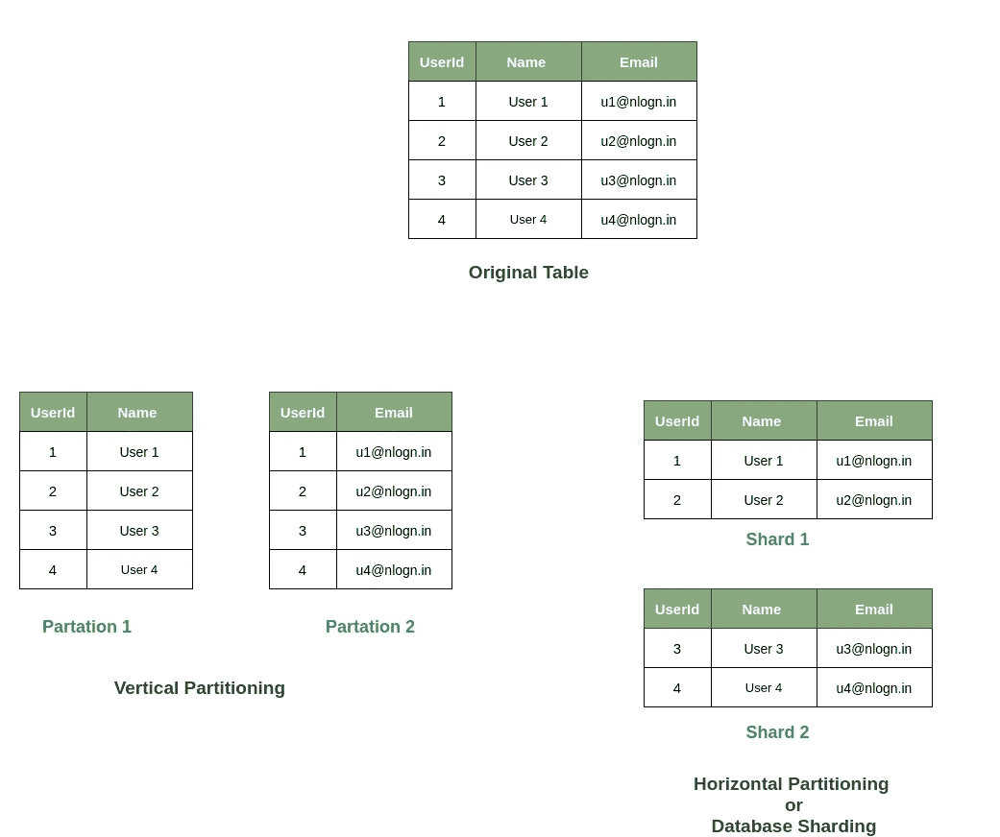
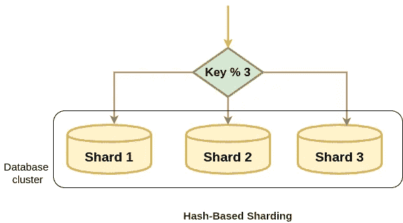
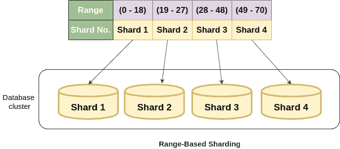

# 什么是数据库分片，是如何实现的

> 原文：<https://levelup.gitconnected.com/what-is-database-sharding-and-how-is-it-done-f36b9cb653e8>

约书亚·索蒂诺在 [Unsplash](https://unsplash.com?utm_source=medium&utm_medium=referral) 上拍摄的照片

数据库分片是将大表分解成多个更小的表或称为分片的块，并将数据分布到多个机器或集群的过程。每个分片都有与原始表相同的模式和列，但是每个分片中存储的数据是唯一的，并且独立于其他分片。

数据库分片

[数据库](https://en.wikipedia.org/wiki/Database)分片非常类似于[水平缩放](https://nlogn.in/horizontal-scaling-and-vertical-scaling/)(横向扩展)。因此，它允许我们向现有集群添加更多的机器，以便分散负载，允许更多的流量和更快的处理。此外，分片有助于使我们的应用程序分布式，从而最大限度地减少单点故障。

# 数据库分片技术

数据库分片需要以这样的方式完成，即将到来的数据应该插入到正确的分片中，不应该有任何数据丢失，结果查询不应该很慢。考虑到所有这些，让我们看看我们有哪些共享数据库的技术。

**1)基于哈希的分片**

在基于哈希的分片(也称为基于密钥的分片)中，我们从新插入的数据中获取一个密钥值(如客户 id、客户 IP 地址或电子邮件 Id 等，基于我们已经确定的标准)，将它传递给哈希函数，并将数据插入到结果分片编号中。

基于哈希的分片

这是最简单的分片算法，可用于在分片之间均匀分布数据，并防止出现**数据库热点**的风险。当一个碎片比所有其他碎片被更多地访问时，数据库热点问题就出现了，因此，在这种情况下，对数据库进行碎片化的任何好处都被变慢和崩溃抵消了。

这种方法的主要问题是动态添加或删除数据库服务器非常困难。每当这种情况发生时，我们都需要重新划分数据库，这意味着我们需要更新哈希函数并重新平衡数据。此外，如果这种情况经常发生，也会导致数据丢失。

上述问题的一个解决方案是使用[一致散列](https://nlogn.in/consistent-hashing-system-design/)。一致散列提供了[可伸缩性](https://en.wikipedia.org/wiki/Scalability)，即使我们在许多服务器(数据库服务器)中拥有大量数据，并且可用服务器的数量不断变化(要么添加新服务器，要么删除服务器)。参见“[一贯哈希法](https://nlogn.in/consistent-hashing-system-design/)”以了解详情。

**2)基于范围的分片**

在基于范围的分片中，分片是根据分片键的范围选择的。分片的范围是这样选择的，即分片密钥可能落入所有可能范围中的任何一个。

假设我们有一个推荐系统，它存储了用户的所有信息，并根据用户的年龄推荐他们的电影。因此，我们可以创建一些不同的碎片，并根据用户所处的年龄范围划分用户信息，如下所示:

基于范围的分片很容易实现，因为我们只需要检查当前数据所在的范围，并从对应于该分片的分片中插入/读取数据。此外，每个碎片保存不同的数据集，但是所有碎片的模式都与原始数据库的模式相同。

这种技术的主要缺点是，如果我们的数据分布不均匀，它会再次导致数据库热点。

**3)基于目录的分片**

在基于目录的分片中有一个**查找表**也称为位置服务。它存储共享密钥来跟踪哪个碎片存储了什么条目。为了读取或写入数据，客户端引擎首先使用 shard-key 查询查找表以找到相应数据的碎片号，然后访问特定的碎片以执行进一步的操作。

这非常类似于基于范围的分片，除了不是确定分片键的数据属于哪个范围，而是每个键绑定到它自己的特定分片。

与使用固定哈希函数的基于哈希的分片和需要我们预先指定范围的基于范围的分片不同，基于目录的分片允许您使用我们想要使用的任何系统或算法来将数据条目分配给分片，并且使用这种方法动态添加分片相对容易。

基于目录的分片的主要问题是，我们需要在每次读写查询之前查阅查找表，因此它会影响应用程序的性能。此外，查找表容易出现单点故障。这个问题的一个解决方案可以是使用负载平衡器，但是频繁地更新每个服务器中的查找表副本将是开销。

查看 FreshWork 如何使用基于目录的分片"[我们如何扩展 Freshdesk](https://freshdesk.com/product-updates/how-freshdesk-scaled-using-sharding-blog/) "。

**4)基于地理的分片**

基于地理的分片类似于基于范围的分片。在基于地理的分片中，数据由对应于用户区域或位置的分片来处理。Tinder 使用基于地理的分片。tinders 对地理分片进行了限制，限制范围为 100 英里，并确保地理分片的生产负载平衡。

# 分片的好处

1.  数据库分片有助于我们实现水平扩展。因此，我们可以向现有的服务器添加更多的机器，并分配负载来扩展应用程序。
2.  更快的查询响应时间。如果没有数据库分片，数据库需要将一个查询与每一行进行比较，这可能是一个巨大的挫折。但是使用分片而不是遍历所有行，我们只需要遍历几行。
3.  分片使得维护变得更加容易。
4.  数据库分片消除了单点故障的问题，并使我们的应用程序更加容错。
5.  降低成本。向单个 is 机器添加更多的 RAM 和存储(垂直扩展)是昂贵的，而拥有几个计算能力较低的节点是便宜的。参见“[为什么垂直伸缩很贵？](https://dba.stackexchange.com/questions/102179/why-is-vertical-scaling-expensive)“多学习。

# 分片的缺点

1.  当涉及到实际实现时，数据库分片变得复杂。此外，如果操作不当，可能会导致数据丢失或损坏表。
2.  分片的另一个主要问题是分片是否变得不平衡。
3.  一旦数据库被分片，就很难返回到原始的未分片版本。
4.  并非所有数据库都支持分片。例如，PostgreSQL 不支持自动分片特性，尽管可以手动分片，但这也会增加复杂性。

**进一步说明:**

1.  **分片与分区:**分区是在同一台机器上跨表或数据库的数据分布。分片是一种特定类型的分区，称为水平分区。在分片中，我们将数据分布在多个不同的服务器上。
2.  **我应该做分片吗？**只有在绝对必要时才应进行分片，因为这会增加额外的操作复杂性。最常见的是当我们处理大量数据时。分片可能有所帮助的一些场景:

*   当数据量超过我们服务器的能力，垂直扩展不可能或过于昂贵时。
*   如果读写请求的数量超过了单个节点的能力，并且通常是均匀分布的。
*   创建多个读取副本或负载平衡也被证明是没有帮助的。

是不是，我们遗漏了什么，或者你想补充一些其他的要点？请评论

*原载于 2020 年 5 月 3 日 https://intmain.co***。**