# DevOps 是什么？

> 原文：<https://levelup.gitconnected.com/what-is-devops-393eed56dea2>

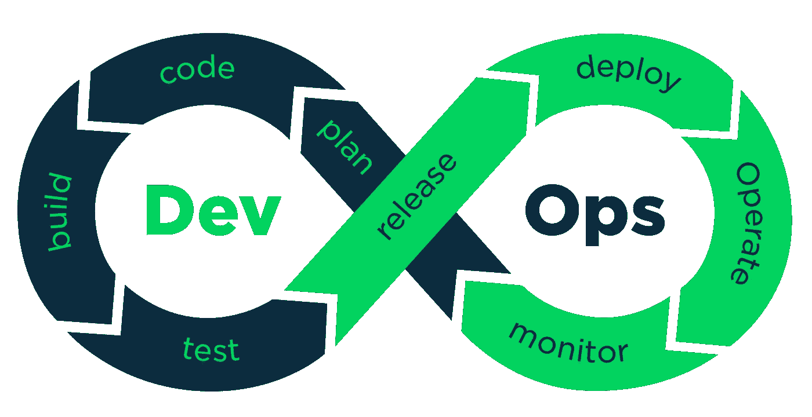

# DevOps 模型

DevOps 是文化哲学、实践和工具的组合，提高了组织高速交付应用程序和服务的能力:以比组织使用传统软件开发和基础设施管理过程更快的速度发展和改进产品。这种速度使组织能够更好地服务于他们的客户，并在市场中更有效地竞争。

# DevOps 如何工作

在开发运维模式下，开发和运营团队不再是“孤岛”有时，这两个团队会合并成一个团队，工程师在整个应用程序生命周期中工作，从开发和测试到部署再到运营，并开发一系列技能，而不仅限于单一功能。

在一些 DevOps 模型中，质量保证和安全团队也可能与开发和运营以及整个应用程序生命周期更加紧密地集成在一起。当安全性是 DevOps 团队中每个人的焦点时，这有时被称为 DevSecOps。

这些团队使用实践来自动化历史上手动且缓慢的过程。他们使用技术堆栈和工具，帮助他们快速可靠地操作和开发应用程序。这些工具还帮助工程师独立完成通常需要其他团队帮助的任务(例如，部署代码或提供基础设施)，这进一步提高了团队的速度。

# DevOps 的优势

## 1.速度

快速行动，以便您能够更快地为客户创新，更好地适应不断变化的市场，并在推动业务成果方面更加高效。DevOps 模型使您的开发人员和运营团队能够实现这些结果。例如，**微服务**和**连续交付**让团队获得服务的所有权，然后更快地发布更新。

## 2.快速交货

增加发布的频率和速度，这样你就可以更快地创新和改进你的产品。您发布新功能和修复错误的速度越快，就能越快地响应客户的需求并建立竞争优势。**持续集成**和**持续交付**是自动化软件发布过程的实践，从构建到部署。

## 3.可靠性

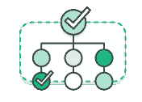

确保应用程序更新和基础架构变更的质量，以便您能够以更快的速度可靠地交付，同时保持最终用户的良好体验。使用像**持续集成**和**持续交付**这样的实践来测试每个变更是功能性的和安全的。**监控和记录**实践帮助您实时了解性能。

## 4.规模

大规模运营和管理您的基础设施和开发流程。自动化和一致性有助于您高效管理复杂或不断变化的系统，同时降低风险。例如， **infrastructure as code** 帮助您以可重复且更高效的方式管理您的开发、测试和生产环境。

## 5.改善协作

在 DevOps 文化模式下建立更有效的团队，该模式强调所有权和责任等价值观。开发人员和运营团队**紧密合作**，分担许多责任，并结合他们的工作流程。这减少了低效率并节省了时间(例如，减少了开发人员和运营人员之间的交接时间，编写的代码考虑到了代码运行的环境)。

## 6.安全性

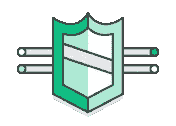

快速行动，同时保持控制和合规性。通过使用自动化合规性策略、细粒度控制和配置管理技术，您可以在不牺牲安全性的情况下采用 DevOps 模型。例如，使用基础设施作为代码，使用**策略作为代码**，您可以定义并跟踪大规模的合规性。

# 为什么 DevOps 很重要

软件和互联网改变了世界及其产业，从购物到娱乐再到银行业。软件不再仅仅支持一项业务；相反，它成为一个企业的每一部分不可分割的组成部分。公司通过以在线服务或应用形式交付的软件在各种设备上与客户互动。他们还使用软件通过改变价值链的每个部分来提高运营效率，如物流、通信和运营。就像实体商品公司在整个 20 世纪使用工业自动化改变了他们设计、构建和交付产品的方式一样，当今世界的公司必须改变他们构建和交付软件的方式。

# 如何采用 DevOps 模型

## DevOps 文化哲学

过渡到 DevOps 需要改变文化和心态。简而言之，DevOps 就是要消除开发和运营这两个传统团队之间的壁垒。在一些组织中，甚至可能没有单独的开发和运营团队；工程师可能两者都做。借助 DevOps，两个团队共同努力，优化开发人员的工作效率和运营的可靠性。他们努力频繁沟通，提高效率，并改善向客户提供的服务质量。他们对自己的服务拥有完全的所有权，通常超越了他们所陈述的角色或头衔的传统范围，考虑最终客户的需求以及他们如何帮助解决这些需求。质量保证和安全团队也可能与这些团队紧密结合。使用 DevOps 模型的组织，无论其组织结构如何，都有团队将整个开发和基础设施生命周期视为其职责的一部分。

## DevOps 实践说明

有几个关键实践可以通过自动化和简化软件开发和基础设施管理过程来帮助组织更快地创新。这些实践中的大部分都是通过适当的工具来完成的。

一个基本的实践是执行非常频繁但很小的更新。这就是组织如何为他们的客户更快地创新。这些更新在本质上通常比传统发布实践下执行的偶尔更新更具递增性。频繁但少量的更新降低了每次部署的风险。它们帮助团队更快地解决错误，因为团队可以识别导致错误的最后一次部署。尽管更新的节奏和规模会有所不同，但是使用 DevOps 模型的组织比使用传统软件开发实践的组织更频繁地部署更新。

组织还可以使用微服务架构来使他们的应用程序更加灵活，并实现更快的创新。微服务架构将大型、复杂的系统分解为简单、独立的项目。应用程序被分解成许多单独的组件(服务),每个服务都有一个单独的目的或功能，并且独立于它的对等服务和应用程序作为一个整体运行。这种架构减少了更新应用程序的协调开销，并且当每个服务与拥有每个服务的小型敏捷团队配对时，组织可以更快地移动。

然而，微服务和更高的发布频率相结合，导致部署数量大幅增加，这可能会带来运营挑战。因此，像持续集成和持续交付这样的 DevOps 实践解决了这些问题，并让组织以安全可靠的方式快速交付。基础设施自动化实践，如基础设施作为代码和配置管理，有助于保持计算资源的弹性和对频繁变化的响应。此外，监控和日志记录的使用有助于工程师跟踪应用和基础设施的性能，以便他们能够对问题做出快速反应。

总之，这些实践帮助组织向他们的客户提供更快、更可靠的更新。以下是重要 DevOps 实践的概述。

# DevOps 实践

以下是 DevOps 最佳实践:

*   ***持续集成***
*   ***连续交货***
*   ***微服务***
*   ***基础设施为代码***
*   ***监控和记录***
*   ***沟通与协作***

下面你可以了解更多关于每一个特定的做法。

## 1)持续集成

持续集成是一种软件开发实践，开发人员定期将他们的代码变更合并到一个中央存储库中，然后运行自动化构建和测试。持续集成的关键目标是更快地发现和解决错误，提高软件质量，减少验证和发布新软件更新的时间。

## 2)连续交付

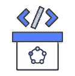

连续交付是一种软件开发实践，其中代码变更被自动构建、测试，并为产品发布做准备。它通过在构建阶段之后将所有代码变更部署到测试环境和/或生产环境中，在持续集成的基础上进行扩展。当连续交付被正确地实现时，开发人员将总是拥有一个已经通过标准化测试过程的部署就绪的构建工件。

例如:持续交付和 AWS 代码管道

## 3)微服务

微服务架构是一种将单个应用程序构建为一组小型服务的设计方法。每个服务都在自己的进程中运行，并使用轻量级机制(通常是基于 HTTP 的应用程序编程接口(API ))通过定义良好的接口与其他服务进行通信。微服务是围绕业务能力构建的；每个服务都有一个特定的目的。您可以使用不同的框架或编程语言来编写微服务并独立部署它们，作为单个服务，或作为一组服务。

比如:亚马逊容器服务(Amazon ECS)，AWS Lambda

## 4)作为代码的基础设施

基础设施即代码是一种实践，其中使用代码和软件开发技术(如版本控制和持续集成)来提供和管理基础设施。云的 API 驱动模型使开发人员和系统管理员能够以编程方式与基础设施进行大规模交互，而不需要手动设置和配置资源。因此，工程师可以使用基于代码的工具与基础设施进行交互，并像对待应用程序代码一样对待基础设施。因为它们是由代码定义的，所以可以使用标准化模式快速部署基础设施和服务器，使用最新的补丁和版本进行更新，或者以可重复的方式进行复制。

例如:使用 AWS CloudFormation 将基础设施作为代码进行管理

> 结构管理

开发人员和系统管理员使用代码来自动化操作系统和主机配置、操作任务等。代码的使用使得配置更改可重复且标准化。它将开发人员和系统管理员从手动配置操作系统、系统应用程序或服务器软件中解放出来。

例如:使用 Amazon EC2 系统管理器配置和管理 Amazon EC2 和内部系统，使用 AWS OpsWorks 进行配置管理

> 作为代码的策略

随着基础架构及其配置与云结合在一起，组织可以动态、大规模地监控和实施合规性。因此，由代码描述的基础设施可以以自动化的方式进行跟踪、验证和重新配置。这使得组织能够更轻松地管理资源变更，并确保以分布式方式正确实施安全措施(例如，信息安全或符合 PCI-DSS 或 HIPAA)。这允许组织内的团队以更高的速度移动，因为不符合规范的资源可以被自动标记以供进一步调查，甚至自动恢复到符合规范。

例如:AWS 配置和配置规则，用于监控和实施基础设施的合规性

## 5)监控和记录

组织监控指标和日志，以了解应用程序和基础架构性能如何影响其产品最终用户的体验。通过捕获、分类，然后分析由应用程序和基础架构生成的数据和日志，组织可以了解更改或更新如何影响用户，从而深入了解问题或意外更改的根本原因。随着服务必须全天候可用，以及应用程序和基础架构更新频率的增加，主动监控变得越来越重要。创建警报或对此数据进行实时分析还有助于组织更主动地监控其服务。

例如:Amazon CloudWatch 监控您的基础设施指标和日志，AWS CloudTrail 记录和记录 AWS API 调用

## 6)沟通和协作

增加组织中的沟通和协作是 DevOps 的关键文化方面之一。DevOps 工具的使用和软件交付过程的自动化通过将开发和操作的工作流和职责物理地结合在一起而建立了协作。在此基础上，这些团队通过使用聊天应用程序、问题或项目跟踪系统和 wikis，围绕信息共享和促进沟通建立了强大的文化规范。这有助于加快开发人员、操作人员甚至其他团队(如市场营销或销售)之间的沟通，允许组织的所有部分在目标和项目上更加紧密地保持一致。

# DevOps 工具

DevOps 模型依赖于有效的工具来帮助团队快速可靠地为他们的客户进行部署和创新。这些工具自动执行手动任务，帮助团队管理大规模的复杂环境，并让工程师控制由 DevOps 实现的高速度。AWS 提供专为 DevOps 设计的服务，这些服务首先是为了与 AWS 云一起使用而构建的。这些服务帮助您使用上述 DevOps 实践。

# 2019 年 10 大最佳 DevOps 工具

# 1.格拉德勒

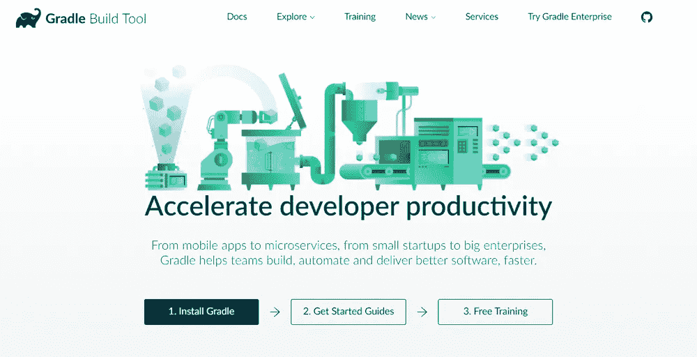

您的 DevOps 工具堆栈将需要一个可靠的构建工具。Apache Ant 和 Maven 主导了自动化构建工具市场很多年，但是 [Gradle](https://gradle.org/) 在 2009 年出现，从那以后它的受欢迎程度稳步增长。Gradle 是一个令人难以置信的多功能工具，它允许你用 Java、C++、Python 或其他语言编写代码。流行的 ide 也支持 Gradle，比如 Netbeans、Eclipse 和 IntelliJ IDEA。如果这还不能说服你，知道谷歌也选择它作为 Android Studio 的[官方构建工具](https://developer.android.com/studio/build/)可能会有帮助。

Maven 和 Ant 使用 XML 进行配置，而 Gradle 引入了基于 Groovy 的 DSL 来描述构建。2016 年，Gradle 团队还发布了基于 [Kotlin 的 DSL](https://github.com/gradle/kotlin-dsl) ，所以现在你也可以用 Kotlin 编写你的构建脚本了。这意味着 Gradle 确实有一些学习曲线，所以如果你以前使用过 Groovy、Kotlin 或其他 JVM 语言，它会有很大帮助。此外，Gradle 使用 Maven 的存储库格式，因此如果您以前有使用 Maven 的经验，那么对依赖管理应该很熟悉。您也可以[将您的 Ant 构建](https://docs.gradle.org/current/userguide/ant.html)导入 Gradle。

Gradle 最好的一点是[增量构建](https://blog.gradle.org/introducing-incremental-build-support)，因为它们节省了大量的编译时间。根据 Gradle 的[性能测量](https://gradle.org/gradle-vs-maven-performance/)，它比 Maven 快 100 倍。这部分是因为增量，但也是由于 Gradle 的[构建缓存](https://blog.gradle.org/introducing-gradle-build-cache)和[守护进程](https://docs.gradle.org/current/userguide/gradle_daemon.html)。构建缓存重用任务输出，而 Gradle 守护进程在构建之间将构建信息保存在内存中。

总而言之，Gradle 允许更快的运输，并提供了许多配置可能性。

# 2.饭桶

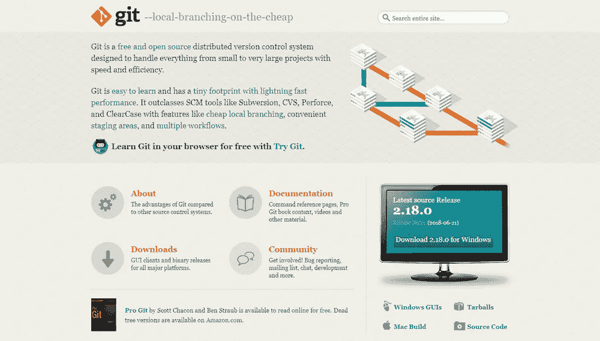

Git 是最流行的 DevOps 工具之一，广泛应用于整个软件行业。这是一个分布式 SCM(源代码管理)工具，深受远程团队和开源贡献者的喜爱。Git 允许您跟踪开发工作的进度。您可以保存源代码的不同版本，并在必要时返回到以前的版本。这对于实验来说也是很棒的，因为你可以创建单独的分支，并且只有在它们准备好的时候才合并新的特性。

要将 Git 与您的 DevOps 工作流集成，您还需要托管存储库，团队成员可以在其中推进他们的工作。目前，两个最好的在线 Git 回购托管服务是 [GitHub](https://github.com/) 和 [Bitbucket](https://bitbucket.org/) 。GitHub 的知名度更高，但是 Bitbucket 为小团队(最多五个团队成员)提供了免费的无限私有回购。有了 GitHub，你只能免费访问公开回购——这对许多项目来说仍然是一个很好的解决方案。

GitHub 和 Bitbucket 都有很棒的集成。例如，您可以将它们与 Slack 集成在一起，这样每当有人提交新的提交时，团队中的每个人都会得到通知。

# 3.詹金斯

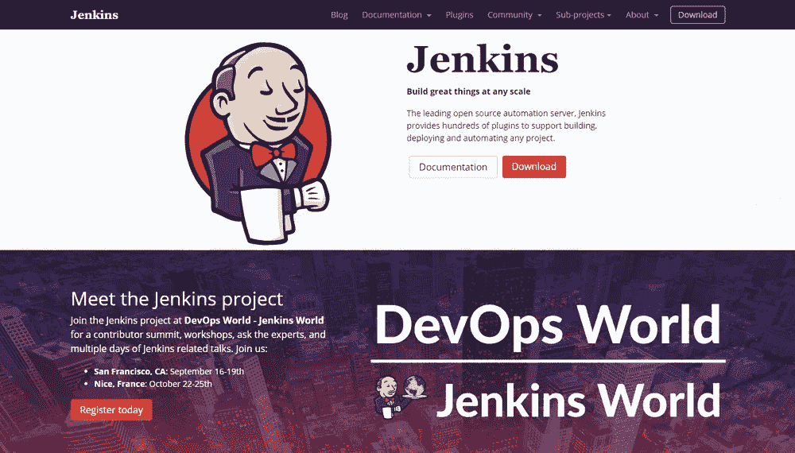

Jenkins 是许多软件开发团队的首选 DevOps 自动化工具。这是一个开源的 CI/CD 服务器，允许您自动化交付管道的不同阶段。Jenkins 受欢迎的主要原因是其庞大的插件生态系统。目前，它提供了超过 1000 个插件，因此它可以集成几乎所有的 DevOps 工具，从 Docker 到 Puppet。

借助 Jenkins，您可以根据自己的需求设置和定制 CI/CD 渠道。我在[詹金斯文档](https://jenkins.io/doc/book/pipeline/)中找到了以下例子。而且，这只是可能性之一。

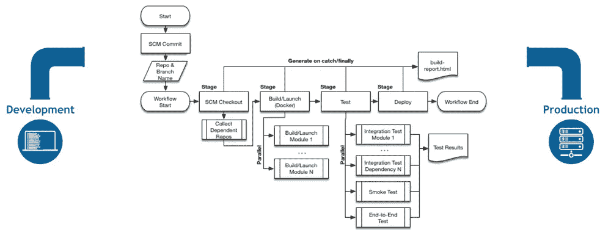

很容易[开始使用 Jenkins](https://jenkins.io/download/) ，因为它可以在 Windows、Mac OS X 和 Linux 上开箱即用。你也可以用 Docker 轻松[安装。您可以通过 web 界面设置和配置 Jenkins 服务器。如果是第一次使用，可以选择用常用插件安装。但是，您也可以创建自己的自定义配置。](https://wiki.jenkins.io/display/JENKINS/Installing+Jenkins+with+Docker)

有了 Jenkins，您可以尽可能快地迭代和部署新代码。它还允许您衡量管道中每一步的成功程度。我听到有人抱怨 Jenkins 的 UI“丑陋”且不直观。然而，我仍然可以毫无困难地找到我想要的一切。

# 4.竹子

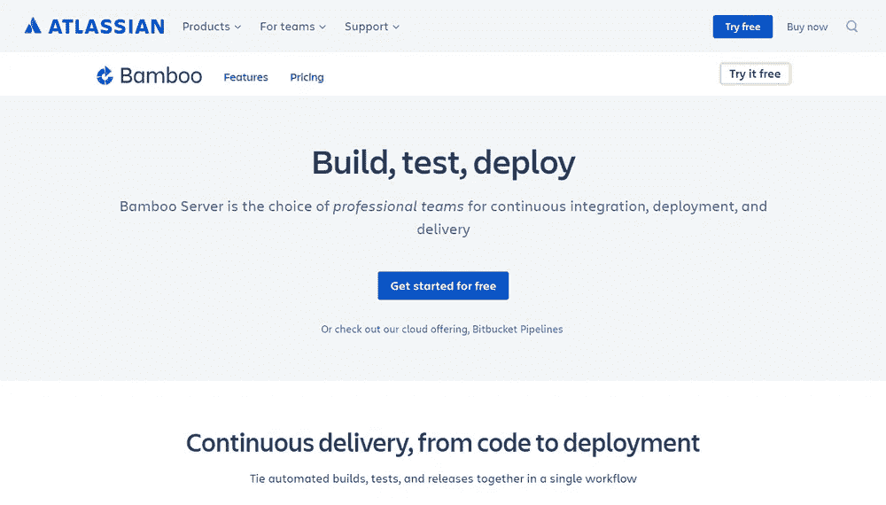

[Bamboo](https://www.atlassian.com/software/bamboo) 是 Atlassian 的 CI/CD 服务器解决方案，与 Jenkins 有许多相似的功能。这两个都是流行的 DevOps 工具，允许您自动化您的交付管道，从构建到部署。然而，虽然 Jenkins 是开源的，但 Bamboo 是有价格标签的。所以，这里有一个永恒的问题:如果有免费的替代品，选择专有软件值得吗？这取决于你的预算和目标。

Bamboo 有许多预建的功能，你必须在 Jenkins 中手动设置。这也是 Bamboo 插件少的原因(相对于 Jenkins 的 1000+，100 左右)。事实上，Bamboo 不需要那么多插件，因为它可以做很多开箱即用的事情。

Bamboo 与其他 Atlassian 产品无缝集成，如吉拉和 Bitbucket。您还可以访问内置的 Git 和 Mercurial 分支工作流和测试环境。总而言之，竹子可以帮你节省很多配置时间。它还带有一个更直观的 UI，带有工具提示、自动完成和其他方便的功能。

# 5.码头工人

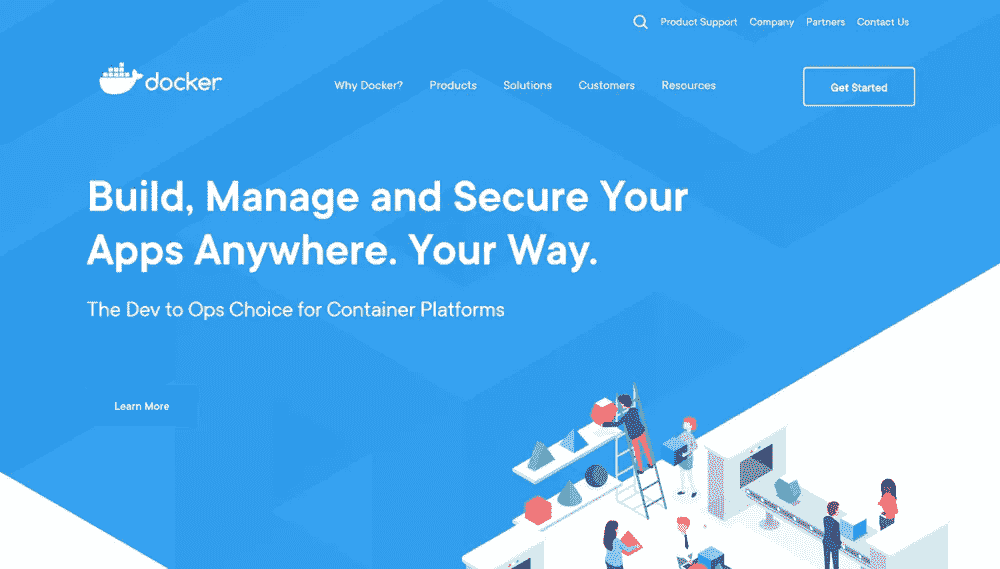

[Docker](https://www.docker.com/) 自 2013 年推出以来一直是排名第一的集装箱平台，并且还在继续提升。它也被认为是最重要的 DevOps 工具之一。Docker 使容器化在技术世界中流行起来，主要是因为它使分布式开发成为可能，并使应用程序的部署自动化。它将应用程序隔离到单独的容器中，因此它们变得可移植且更安全。Docker 应用也是独立于操作系统和平台的。你可以用 Docker 容器代替 VirtualBox 之类的虚拟机。

我最喜欢 Docker 的一点是，你不用担心依赖管理。你可以将所有的依赖项打包到应用程序的容器中，并作为一个独立的单元进行运输。然后，您可以在任何机器或平台上运行该应用程序，而不会感到头痛。

Docker 与 [Jenkins](https://jenkins.io/solutions/docker/) 和 [Bamboo](https://confluence.atlassian.com/bamboo/getting-started-with-docker-and-bamboo-687213473.html) 也融合在一起。如果您将它与这些自动化服务器一起使用，您可以进一步改进您的交付工作流程。除此之外，Docker 对于云计算也很棒。近年来，所有主要的云提供商如 AWS 和 Google Cloud 都增加了对 Docker 的支持。因此，如果您正在计划云迁移，Docker 可以为您简化这一过程。

# 6.库伯内特斯

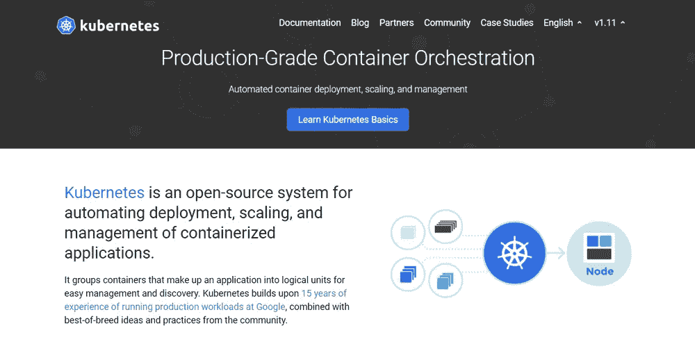

今年，每个人都在谈论 [Kubernetes](https://kubernetes.io/) 。这是一个容器编排平台，将容器化推向了一个新的高度。它可以很好地与 Docker 或它的任何替代品一起使用。Kubernetes 还是很新的；它的第一版于 2015 年发布。它是由几个谷歌工程师创建的，他们想找到一个大规模管理容器的解决方案。使用 Kubernetes，您可以将容器分组为逻辑单元。

如果您只有几个容器，您可能不需要容器编排平台。然而，当你达到一定的复杂程度并需要扩展你的资源时，这是下一个合乎逻辑的步骤。Kubernetes 允许您自动化管理数百个容器的过程。

有了 Kubernetes，你不必将你的容器化应用程序绑定到一台机器上。相反，您可以将其部署到计算机集群。Kubernetes 在整个集群中自动分发和调度容器。

Kubernetes 集群由一个主节点和几个工作节点组成。主节点实现您预定义的规则，并将容器部署到工作节点。Kubernetes 关注一切。例如，当一个工作节点关闭时，它会注意到，并在必要时重新分配容器。

# 7.傀儡企业

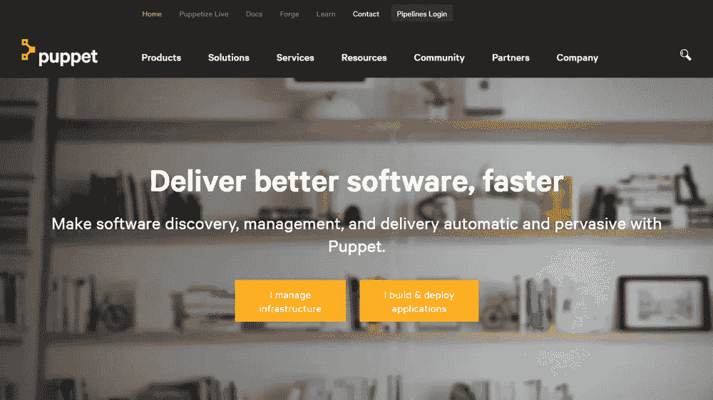

[傀儡企业](https://puppet.com/products/puppet-enterprise)是一个跨平台的配置管理平台。它允许您将基础设施作为代码来管理。由于它自动化了基础设施管理，您可以更快、更安全地交付软件。Puppet 还为开发人员提供了一个用于小型项目的[开源工具](https://puppet.com/download-open-source-puppet)。但是，如果您正在处理更大的基础设施，您可能会发现 Puppet Enterprise 的[额外功能](https://puppet.com/products/why-puppet/puppet-enterprise-and-open-source-puppet)的价值，例如:

*   实时报告
*   基于角色的访问控制
*   节点管理

使用 Puppet Enterprise，您可以管理多个团队和数以千计的资源。它会自动理解您的基础架构中的关系。它处理依赖性，并巧妙地处理故障。当遇到失败的配置时，它也会跳过所有相关的配置。关于 Puppet 最好的一点是它有[超过 5000 个模块](https://forge.puppet.com/)并且集成了[许多流行的 DevOps 工具](https://puppet.com/products/managed-technology)。

# 8.Ansible

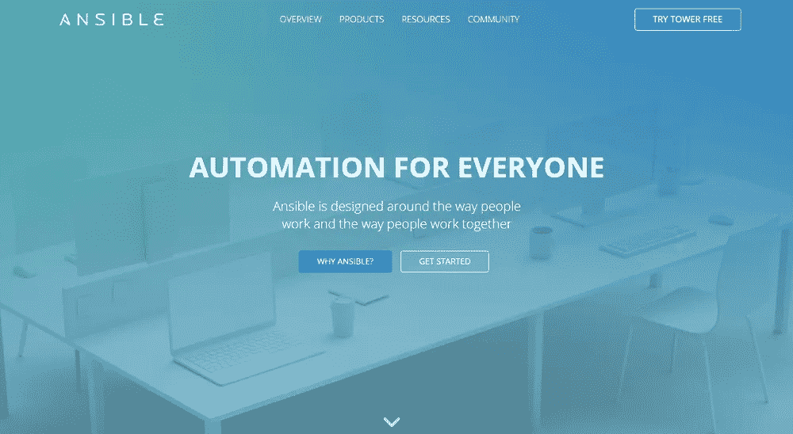

[Ansible](https://www.ansible.com/) 是一个配置管理工具，类似于 Puppet 和 Chef。您可以使用它来配置您的基础架构和自动化部署。与其他类似的 DevOps 工具相比，它的主要卖点是简单易用。Ansible 遵循与 Puppet 相同的代码基础设施(IAC)方法。然而，它使用超级简单的 YAML 语法。使用 Ansible，您可以在 YAML 中定义任务，而 Puppet 有自己的声明性语言。

无代理架构是 Ansible 的另一个经常提到的特性。由于没有后台运行的守护进程或代理，Ansible 是一个安全、轻量级的配置管理自动化解决方案。与 Puppet 类似，Ansible 也有[几个模块](https://docs.ansible.com/ansible/latest/modules/modules_by_category.html)。

如果你想更好地理解 Ansible 是如何融入 DevOps 工作流的，看看红帽博客的这篇文章。它展示了如何在 Jenkins 管道中使用 Ansible 进行环境供应和应用程序部署。

# 9.纳吉奥斯

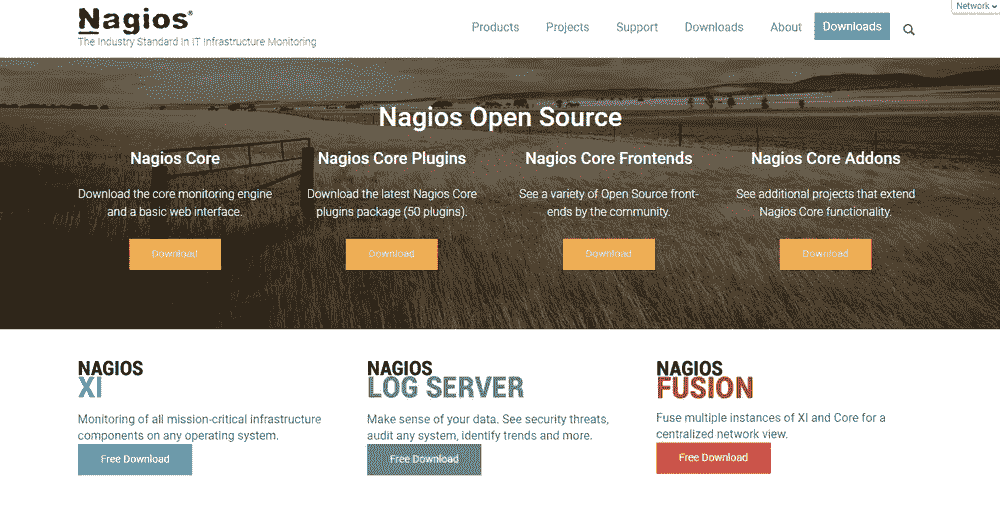

Nagios 是最流行的免费开源 DevOps 监控工具之一。它允许您监控您的基础设施，以便您可以发现并修复问题。使用 Nagios，您可以记录事件、中断和故障。您还可以借助 Nagios 的图表和报告来关注趋势。这样，您可以预测停机和错误，并检测安全威胁。

尽管有许多 DevOps 工具用于基础设施监控，Nagios 因其丰富的[插件生态系统](https://exchange.nagios.org/)而脱颖而出。Nagios 已经存在了一段时间(从 2002 年开始)，它周围有一个巨大的社区。除了插件，他们还制作插件、教程、翻译和其他好东西——全部免费。

Nagios 提供了四种开源监控解决方案:

1.  Nagios 核心
2.  纳吉奥斯·Xi
3.  Nagios 日志服务器
4.  纳吉奥斯聚变

**Nagios Core** 是一个命令行工具，拥有所有的基本功能。您还可以选择带有基于 web 的 GUI 和监控向导的 Nagios XI。Nagios 写了一个方便的关于他们能力的比较。

**Nagios 日志服务器**允许您搜索日志数据并设置关于潜在威胁的警报。并且， **Nagios Fusion** 允许您同时监控多个网络。

总的来说，Nagios 为 DevOps 团队提供了一个基础设施监控解决方案。但是，设置它并使其与您的环境兼容可能需要一段时间。

# 10.射线枪

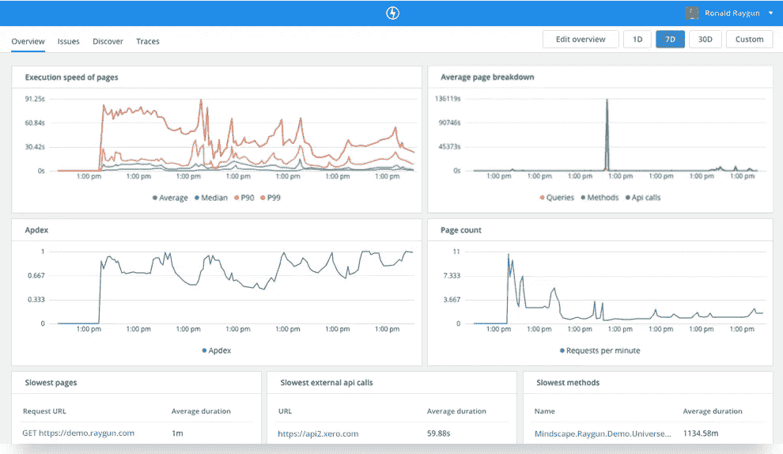

[Raygun](https://raygun.com/) 是世界级的错误监控和崩溃报告平台。[应用性能监控](https://raygun.com/platform/apm) (APM)是其最新产品。Raygun 的 DevOps 工具可以帮助您诊断性能问题，并追踪到确切的代码行、函数或 API 调用。APM 工具也非常适合 Raygun 的错误管理工作流程。例如，它会自动识别您的最高优先级问题，并为您创建问题。

Raygun APM 可以帮助您充分利用其他 DevOps 工具，因为您总是会收到有关问题的通知。由于它自动将错误链接回源代码，Raygun 通过为整个团队提供错误和性能问题原因的真实来源，将开发和运营结合在一起。

# 哪些 DevOps 工具适合您的团队？

找到最好的 DevOps 工具需要一些测试和实验。设置和配置开源工具通常需要更多的时间。大多数商业 DevOps 工具都带有免费试用版，允许您免费测试和评估它们。这一切都归结于你的需求和目标。