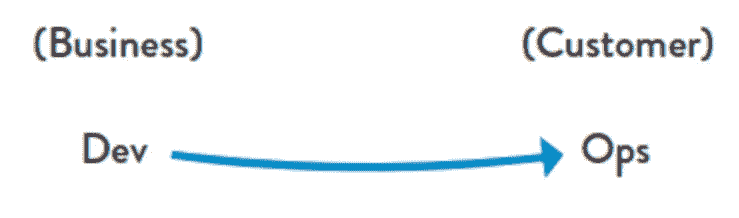
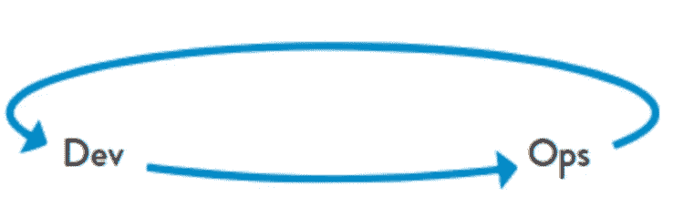
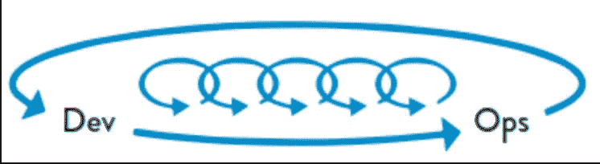

# DevOps 到底是什么？

> 原文：<https://levelup.gitconnected.com/what-is-devops-anyways-a80f9a4858b5>

乔恩·泰森在 [Unsplash](https://unsplash.com/s/photos/question?utm_source=unsplash&utm_medium=referral&utm_content=creditCopyText) 上的照片

去年冬天，我参加了一个软件会议，该会议被宣传为专门讨论 DevOps 主题的会议。

DevOps 是我最喜欢的软件主题之一，我觉得这个会议很有趣，但不是我参加过的最好的会议之一。大多数讲座(如果不是全部的话)是由软件开发人员举办的，他们的标题中带有“DevOps”一词，但大多数讲座与软件会议上的其他讲座没有什么不同。

我很想知道是否有任何初级与会者对会议中的 DevOps 有了深入的了解。

这让我更加相信，对 DevOps 的理解充其量是被误导了。随着“DevOps 工程师”职位的频繁出现，这似乎是一个定义 DevOps 是什么的绝佳机会。

# **什么是 DevOps？**

我的一个自称为“DevOps 助产师”的好朋友，首先从 DevOps 不是什么开始，帮助我理解了 DevOps 是什么:

DevOps 不是一份你能胜任的工作……它是一种哲学和思维方式

DevOps 不是一种可以买到的服务……它是一种需要诞生和成长的文化

devo PS**不是基础设施工具**…它是非技术性的。

[当问维基百科什么是 devo PS](https://en.wikipedia.org/wiki/DevOps)时，它给出了如下回答:

> “DevOps 是一种软件工程**文化和实践**，旨在统一软件开发(Dev)和软件运营(Ops)…。DevOps 运动的主要特征是强烈提倡在软件构建的所有步骤中进行自动化和监控，从集成、测试、发布到部署和基础设施管理。DevOps 旨在缩短开发周期、提高部署频率、发布更可靠的版本，并与业务目标紧密结合。”

[另一篇维基百科文章调用 DevOps:](https://en.wikipedia.org/wiki/Site_Reliability_Engineering)

> “跨团队同理心和业务一致性的哲学”

# **三种方式**

在我之前的一篇文章中，我总结了几本很棒的软件书籍，从中我学到了很多软件开发的经验。

其中一本是吉恩·金的《T2 凤凰计划》。在其中，DevOps 被定义为“三种方式”的结果

## 方式一:流动原理

图片来自 DevOps 手册

这是指工作流程是一个长流程，经过多个环节，但实际上是一个大系统。DevOps 寻求一种思维方式，其中定义了公司成功的定义，然后持续改进流程以实现成功。

这是通过将公司视为一台大型机器来实现的，该机器需要能够自主运行，并通过其许多部分的协作来实现，同时公开解决问题并找到解决方案，而不是指责或羞辱。

## 方式二:反馈原则

图片来自 DevOps 手册

DevOps 的第二个原则强调快速可靠的反馈回路的重要性。

在开发软件时，为了提高反馈循环的速度，团队应该采取小步骤并做出小的改变，同时努力保持产品状态的透明度和度量。

利益相关者和企业所有者也应该能够积极地、经常地向开发团队分享他们的反馈。

## 方式 3:持续学习和实验的原则

图片来自 DevOps 手册

DevOps 的最后一个原则是推动一种开放的文化，在这种文化中，鼓励实验，接受失败是正常的，理解失败快的团队能够并且将会快速恢复，并从错误中学习。

它推动团队寻找改进的空间，并庆祝它成功的领域。这就引出了 Jez Humble 的名言*“如果疼，就多做一次”*

这三个原则导致了 DevOps 的三个要点:

## 简单

复杂的想法和系统应该从大的想法分解成小的、可实现的工作，这些工作可以有效地划分范围并分配给团队

## 反馈

软件系统中反馈的主要提供者是它的测试套件，这使得测试的质量至关重要。拥有大量优秀的测试允许更快、更有价值的反馈循环，这导致更大的透明度和对公司的直接价值。

## 自动化

使用工具(如构建管道或基础设施供应)来自动化经常重复且容易出现人为错误的任务，可以提高弹性，同时让开发人员能够将精力集中在其他更复杂的重要任务上。

当我看到所有这些 DevOps 工程师职位时，我希望提供这些职位的公司不要指望 DevOps 是他们可以随便雇佣的。相反，我希望工程师被视为团队的一员，通过倡导以下内容来推动进步:

*   微小的渐进变化
*   自动化
*   减少公司中的孤岛和壁垒
*   与软件相关的一切的测量
*   接受失败的环境

DevOps 很棒，在我见过的所有团队中，这种文化都在成长和繁荣，成功和快乐也随之而来。遵循以上几点，成功也属于你。

资源:

*   [凤凰计划](https://www.amazon.com/Phoenix-Project-DevOps-Helping-Business/dp/0988262509)
*   [devo PS 手册](https://www.amazon.com/DevOps-Handbook-World-Class-Reliability-Organizations-ebook/dp/B01M9ASFQ3)
*   [Thoughtworks 技术雷达中的 devo PS](https://www.thoughtworks.com/de/radar/techniques/devops)