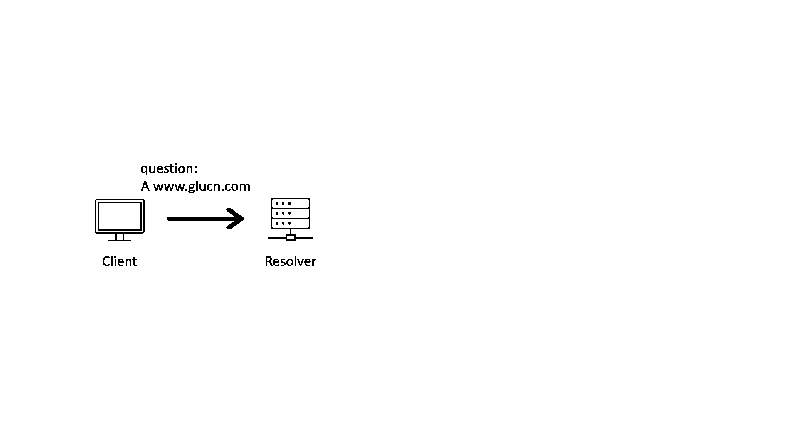
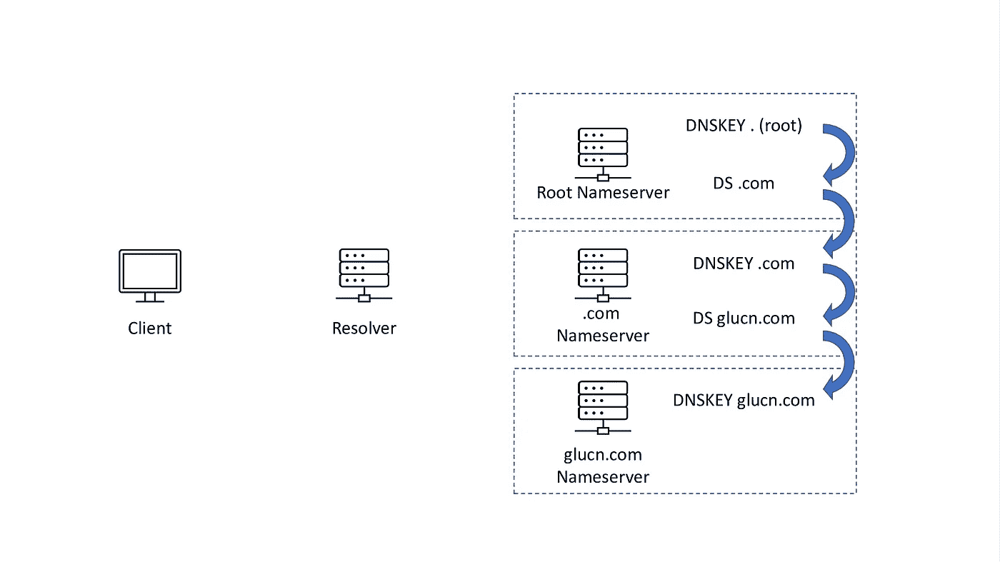
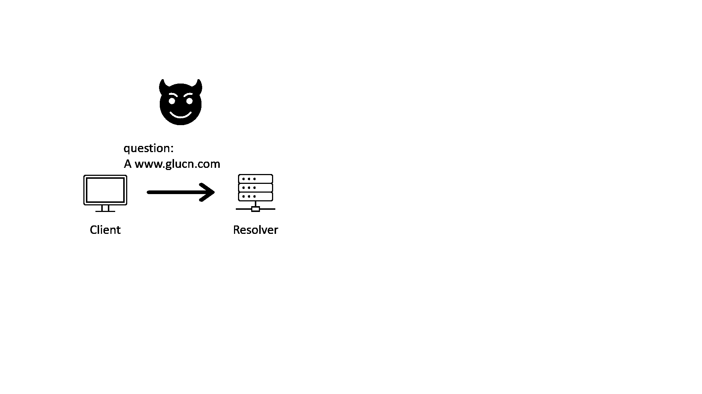

# DNSSEC 解释道

> 原文：<https://levelup.gitconnected.com/what-is-dnssec-90b89671c1dd>

## 什么是 DNSSEC，什么不是？

[布雷特·乔丹](https://unsplash.com/@brett_jordan?utm_source=medium&utm_medium=referral)在[号航天飞机](https://unsplash.com?utm_source=medium&utm_medium=referral)上拍摄的照片

DNSSEC 代表域名系统安全扩展。通过在响应中添加一些附加记录，DNSSEC 可以保证 DNS 查询由经过身份验证的来源回答，从而保护 DNS 的数据完整性。在详细介绍 DNSSEC 之前，我们先来了解一下为什么需要对 DNS 进行“安全扩展”。

# 为什么我们需要 DNSSEC？

要解释我们为什么需要 DNSSEC，我们可以从 DNS 是如何工作的开始。

当我们查询域名的地址时，我们通常会与递归 DNS 解析器对话。递归解析器将递归地查询多个名称服务器，从上到下遵循委托链的层次结构。下面的 GIF 说明了这个过程。

DNS 如何工作(GIF)

作为最古老的网络协议之一，DNS 存在许多问题。例如，域名系统查询和响应没有加密，并且响应没有携带足够的信息来表明它来自应该回答查询的人。

有了这些问题，坏的参与者可以利用解析器和名称服务器之间的对话，并向解析器发送伪造的答案。伪造的答案会将客户引向恶意目的地。这被称为“中间人”(MITM)攻击。

中间人攻击危及 DNS 进程

DNSSEC 协议可以抵御这种攻击。

# DNSSEC 是如何运作的？

DNSSEC 引入了以下几种新类型的 DNS 记录:

*   RRSIG
*   DNSKEY
*   鐽
*   (我跳过了 NSEC 和所有类型的负面回应，它们值得一篇独立的博客文章)

RRSIG 记录本质上包含另一个 DNS 记录的加密签名。并且 DNSKEY 记录包含公钥的信息。(如果您不熟悉密码签名或数字签名，请在[维基](https://en.wikipedia.org/wiki/Digital_signature)上阅读更多)

通过 RRSIG 记录和 DNSKEY 记录，解析器可以验证 RRSIG 覆盖的 DNS 记录没有被其他 DNS 记录更改。但是这里又出现了另一个问题，解析器如何知道 DNSKEY 记录是可信的？

在 RFC“认证链”中输入“信任链”或其正式名称

之前，我提到过 DS 记录。DS(委托签名者)记录包含公钥(DNSKEY)的哈希摘要。当 DNSKEY 记录在一个区域中时，其相应的 DS 记录应该在父区域中。对于 DS 记录，解析器可以验证它是否可以信任 DNSKEY 记录。我认为下面的图片可以说明“信任链”的概念

信任链

因此，为了让 DNSSEC 完全发挥作用，一个区域需要发布 DNSKEY 记录(让我们在另一篇博客文章中讨论 KSK 和 ZSK)，并用 RRSIG 记录签署该区域中的所有记录。此外，父区域需要有 ds 记录。

综上所述，下面的 GIF 展示了 DNS 如何在解析器上启用 DNSSEC 验证，并在授权链的所有区域中启用 DNSSEC 签名的情况下工作:

启用 DNSSEC 签名和验证后，DNS 如何工作

# DNSSEC 不是什么？

DNSSEC 可以防止 MITM 袭击的风险，但它不是包治百病的灵丹妙药。这里有两个 DNSSEC 无法解决的例子。

## 1.DNSSEC 不保护 DNS 的隐私

尽管 DNSSEC 涉及加密密钥，但它不加密任何 DNS 查询或响应信息。有了 DNSSEC，DNS 流量的内容对于一些想要从中窃取信息的攻击者来说仍然是可见的。

还有一些其他协议，如 TLS 上的 DNS(DoT)和 HTTPS 上的 DNS(DoH)，它们可以使 DNS 流量更加安全，因为内容将被加密。但是 DNSSEC 不能保护你。

## 2.DNSSEC 的“最后一公里”安全问题

在上面的 GIF 图片中，我们可以看到解析器用 DNSSEC 验证了响应后，它会将响应发送给客户端。但是如果在客户端和解析器之间有一个攻击者呢？

“最后一英里”安全问题

如果客户机和解析器是同一台机器上的两个应用程序，或者是同一防火墙内的两台机器，那么这个“最后一英里”问题就不是问题了。然而，对于互联网上的大多数客户来说，DNSSEC 本身并不防范这个问题。有一些提议，比如使用 TSIG 记录在客户端和解析器之间进行认证，但是这通常仍然是一个公开的问题。

# 我现在可以开始用 DNSSEC 了吗？

这个问题没有简单的答案。

尽管 DNSSEC 提供了各种保护，但它也带来了一些运营负担。虽然大多数大型 DNS 提供商，如 AWS、Google、Cloudflare，将承担大部分运营负担，但仍有许多事情需要注意。我想用另一篇博文来讨论运营负担的细节。所以，让我在这里给出一些快速的答案。

如果你在做一些需要符合政府标准的生意，比如 FedRamp，那么答案肯定是肯定的。

如果你正在创建一个新网站，答案可能是肯定的。

如果你的网站已经有成千上万甚至上百万的用户，不。你需要阅读的不仅仅是这篇博文。

# 结论

DNSSEC 是一种可以将 DNS 安全性提升到更高水平的协议。启用 DNSSEC 签名后，具有安全意识的解析器可以验证响应来自经过身份验证的来源。

然而，DNSSEC 不能保护 DNS 流量的隐私。还有“最后一英里”的安全问题，这需要进一步的工作。

关于我们是否应该开始使用 DNSSEC，我没有想出一个答案。我打算多写几篇关于 DNSSEC 的文章，希望它们能回答你可能有的更多问题。感谢您的阅读！

## 资源

*   [RFC4033 DNS 安全介绍和要求](https://datatracker.ietf.org/doc/html/rfc4033)
*   [DNS 安全扩展的 RFC4034 资源记录](https://datatracker.ietf.org/doc/html/rfc4034)
*   [针对 DNS 安全扩展的 RFC4035 协议修改](https://datatracker.ietf.org/doc/html/rfc4035)