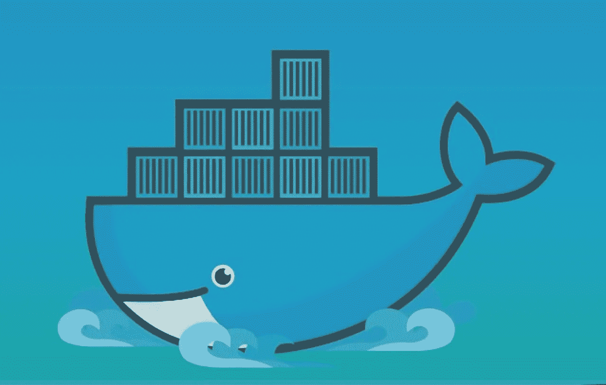

# 什么是 Docker 系列:第 1 部分

> 原文：<https://levelup.gitconnected.com/what-is-docker-series-part-1-1e419c28f951>

## 解决“它能在我的机器上工作”的问题。


[来源](https://hipwallpaper.com/view/7qMgZu)

你听说过这个叫做“集装箱化”的奇妙概念吗？

大家说说吧。

> **集装箱化:** :将大量物料(如商品)装入大型标准化集装箱
> [——韦氏词典](https://www.merriam-webster.com/dictionary/containerization)的一种运输方式

嗯，是的，这是“集装箱化”在实物商品方面的定义。但是我想回到计算机行业的语境中来讨论这个术语。

摘自 [IBM 文章](https://www.ibm.com/cloud/learn/containerization):

> 容器化已经成为软件开发的一个主要趋势，作为虚拟化的替代或伴生物。

我认为我们还需要更多的东西来理解什么是集装箱化。

集装箱化可以被认为是将设备装入集装箱。每当客户端请求时，克隆并发送的容器。

您只需将运行程序和创建图像所需的一切打包到容器中。这个映像就是容器，而这个容器是由客户机构建(解包)的。

只要主机启用了虚拟化，您就可以在任何环境下编写任何语言并运行它。

那是码头工人站在 2000 米的高度。一旦你开始掌握它的基本技术，你就有很多其他的选择和机会。

现在，让我们从运行启动 Docker 容器开始，并从那里分解它。

## 你的第一个码头集装箱



[来源](https://hipwallpaper.com/view/Lri417)

首先安装[对接引擎](https://docs.docker.com/engine/install/)。它可以在 Windows、macOS 和某些版本的 Linux 上运行(参见下载页面)。

安装并运行后(如果您在运行时遇到问题，重新启动可能会解决问题),继续在控制台中检查版本:

`$ docker --version`

您应该以以下形式获得最新版本:

`Docker version X.X.X, build XXXXXXX`

现在我们将运行示例容器:

`$ docker run hello-world`

由于引擎无法在本地找到该版本，它将提取它在引用的存储库中找到的容器(在这种情况下，从 [DockerHub](https://hub.docker.com) 上的 Docker，但您也可以将其更改为 [GitHub Packages](https://github.com/features/packages) )。

然后，它将开始把映像拖到您的本地机器上，构建并运行容器。

您应该会看到类似这样的内容:

```
Unable to find image 'hello-world:latest' locally
latest: Pulling from library/hello-world
ca4f61b1923c: Pull complete
Digest: sha256:ca0eeb6fb05351dfc8759c20733c91def84cb8007aa89a5bf606bc8b315b9fc7
Status: Downloaded newer image for hello-world:latest

Hello from Docker!
This message shows that your installation appears to be working correctly.
...
```

您已经正式运行了您的第一个容器！

但是你刚才运行容器到底做了什么？

当您调用`docker run`时，Docker 在图像上初始化一个可写的容器(如果没有找到图像，就从包管理器中取出)，并使用指定的命令运行它。

映像上的可写容器层是可以保存容器状态的地方。


卢卡斯·范·奥尔特在 [Unsplash](https://unsplash.com?utm_source=medium&utm_medium=referral) 上的照片

这是 Docker 的入门。实际上，您可以只通过拉取和运行几个示例容器来开始试验，只需一个命令就可以开始了:`docker run [container]`

这里有几个容器可以开始使用:

*   [nginx](https://hub.docker.com/_/nginx)
*   [wordpress](https://hub.docker.com/_/wordpress)
*   [java 8 se(服务器 jre)](https://hub.docker.com/_/oracle-serverjre-8)
*   [ubuntu](https://hub.docker.com/_/ubuntu)
*   [节点](https://hub.docker.com/_/node)
*   [阿尔卑斯山](https://hub.docker.com/_/alpine)

有如此多的其他环境，你可以开始玩，并创造更多！

接下来的几篇文章将是我正在做的 Docker 系列的一部分。虽然我可能不会按顺序发布它们，但它们将为您提供开始开发 Docker 并将其集成到您的工作流中的踏脚石；希望是为了追求伟大的事业。

我期待着与您一起继续深入 Docker，为共同学习干杯。

祝一切顺利，保持安全——斯潘塞