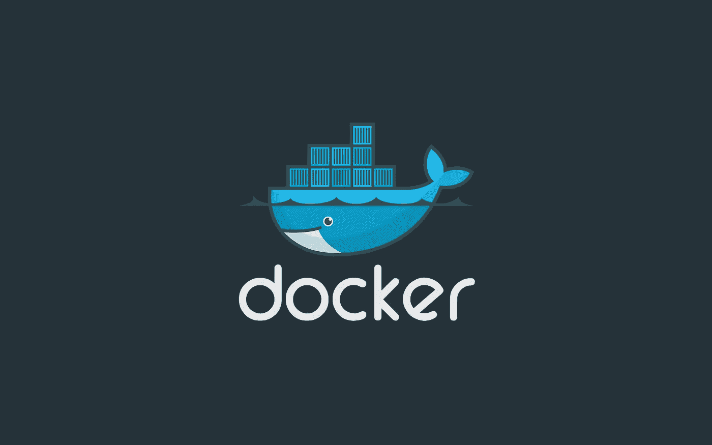

# 什么是 Docker 系列:第 2 部分—图像和 Docker 文件

> 原文：<https://levelup.gitconnected.com/what-is-docker-series-part-2-images-and-dockerfiles-141c15eaca0f>

## 你能跑什么和你需要什么开始。



图像是 Docker 包含并运行在计算机上的内容。这是容器在数据持久化或发生变化之前运行的基础。运送给客户的每个集装箱都从这个基础映像开始。Docker 的基础是在每个主机操作系统上拥有相同的环境。

让我们回顾一下，讨论一下 Docker 是如何运行它的容器和进程的。

## 概观

Docker 是以客户机-服务器的方式设计的。客户机(每个 Docker 容器)与服务器(Docker 守护进程)进行对话，服务器负责提取、构建和运行容器。

## 守护进程

Docker 守护进程(`dockerd`)可以在主机上运行，也可以将 Docker 客户端连接到远程守护进程。守护程序/客户端通信使用 UNIX 套接字或网络接口通过 REST API 进行对话。

## 客户

Docker 客户端(`docker`)是开发人员直接与守护进程交互的方式。Docker 命令使用 Docker API，可以与多个守护进程通信。


摘自[码头工人概述](https://docs.docker.com/get-started/overview/)。

# Docker 对象

## 形象

图像是一个只读模板，包含创建容器的说明。有时候这个图像是从另一个图像延伸出来的。一个真正的起点。

要创建一个图像，你需要创建一个`Dockerfile`(更多内容见下文)。

## 容器

这些是图像的可运行实例。您可以使用“Docker 容器”来构建、启动、停止、移动或删除容器。

一个容器可以和其他容器一起添加到网络中，否则，它就和系统完全隔离了。此外，除非数据在容器被移除或停止时在系统上是持久的，否则所有数据都将丢失。

## 服务

服务赋予 Docker 跨多个守护进程扩展的能力，然后这些守护进程在一个集群中通过网络相互通信。群中的每个成员都是一个守护进程，都与 Docker API 通信。

现在我们已经讨论了 docker 的概念，让我们来看看一些图像、Docker 文件和 docker-compose 文件，看看我们可以运行什么，以及我们可以在哪里创建自己的文件。


奥斯卡·伊尔迪兹在 [Unsplash](https://unsplash.com?utm_source=medium&utm_medium=referral) 上的照片

# 码头文件

在我的 GitHub Actions 帖子([链接](/how-to-write-github-actions-30b54ddf6f52))中，我举了一个类似`Dockefile`的例子:

```
FROM python:3
COPY script_name.py /script_name.py
ENTRYPOINT ['python', 'script_name.py
```

这个映像表示我们正在从`python`映像`:(tag)3`中提取，将文件`script_name.py`复制到映像中的`/script_name.py`，然后运行`python` CLI 并使用脚本。

在另一个使用 NodeJS 和 NPM 的项目中，我想仅通过 SSH 克隆 repo，因此将一个网络密钥传递到将运行的映像的`id_rsa`密钥中，因此在构建映像的任何时候都可以克隆 repo(主要是在运行 GitHub 动作来测试`npm test`输出的结果时)。

```
FROM alpine/git:latest as clone
MAINTAINER Spencer Pollock "[spencer@spollock.ca](mailto:spencer@spollock.ca)"WORKDIR /rootRUN mkdir /root/.ssh/
ADD id_rsa /root/.ssh/id_rsa
RUN chmod 600 /root/.ssh/id_rsa
RUN touch /root/.ssh/known_hosts
RUN ssh-keyscan -t rsa github.com >> /root/.ssh/known_hosts
RUN chown -R root:root /root/.sshRUN git clone --progress --verbose [git@github.com](mailto:git@github.com):srepollock/typescript-bootstrap.git > /dev/null#FROM node:13.8.0-alpine
MAINTAINER Spencer Pollock "[spencer@spollock.ca](mailto:spencer@spollock.ca)"WORKDIR /rootCOPY --from=clone /root/typescript-bootstrap/ /root/RUN npm i && \
    npm run bundle && \
    npm run test
```

最后，我们可以得到一个 Ubuntu 20.04 容器，您可以通过以下步骤与它交互并运行:

创建一个`Dockerfile`:

```
FROM ubuntu:20.04
RUN apt-get update
RUN apt-get install -y
CMD ["/bin/bash"]
```

在`Dockerfile`的文件夹中建立镜像:

`docker build -t [dockerhub_username]/ubuntu-20_04 .`

运行映像直到停止:

`docker run -d [dockerhub_username]/ubuntu-20_04 sleep inifinitly`

获取容器 ID:

`docker ps`

使用 ID 在 Docker 容器中交互运行以下命令:

`docker exec -it [container_id] bash`

现在你有一个正在运行的 Ubuntu 实例可以玩了！存储不是持久的，但我们会谈到这一点。

无论如何，在你自己的工作流程中尝试一下。要开始使用它们，将`Dockerfile`中的行添加到项目根文件夹中，运行`docker build -t [dockerhub_username]/[project_name] .`就可以构建容器了。然后运行`docker run [dockerhub_username/proejct_name]`，您将开始运行图像！所有的`stdout`文本都会出现在你的控制台上。


Anthony Tori 在 [Unsplash](https://unsplash.com?utm_source=medium&utm_medium=referral) 拍摄的照片

既然我们已经有了三个不同的`Dockerfiles`示例，并且还有更多关于[hub.docker.com](https://hub.docker.com)的示例供您使用，在本系列的下一部分，我们将使用 Docker Compose 添加另一个层次的复杂性。

> 走出去，用你刚刚获得的知识做些事情。建造一些有用和伟大的东西！

# 什么是 Docker 系列:

*   [第一部分](/what-is-docker-series-part-1-1e419c28f951)

感谢您抽出时间阅读。我希望您在这个过程中对 Docker 有了更多的了解。在接下来的几天里，我会继续写这些帖子。

祝一切顺利，保持安全——斯潘塞

## 参考文献

许多参考资料都取自于[码头工人](https://www.docker.com/) [文档资料](https://docs.docker.com/) [发现](https://docs.docker.com/reference/) [这里](https://docs.docker.com/engine/reference/builder/#run)。