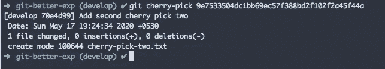
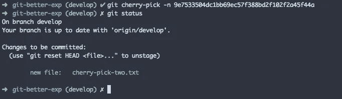
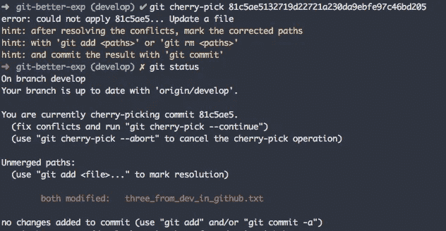
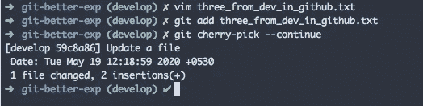

# 什么是 git cherry-pick 以及如何有效地使用它

> 原文：<https://levelup.gitconnected.com/what-is-git-cherry-pick-and-how-to-use-it-effectively-665247192442>


git cherry-pick 是 git 中有用的命令之一，它可以帮助您将提交从一个分支复制、粘贴到另一个分支。简单。

请注意，cherry-pick 将复制提交，以便原始提交仍然存在于源分支中。

大多数开发人员会认为挑选是一种不好的做法，会导致在多个分支中重复提交、搞乱 git 历史等问题。但是，精选是最强大的工具之一，如果你明白它是如何工作的，如果小心使用，那么它会非常有用。

挑选的一些用例是，您可能在错误的分支中有一些提交，您可以将它们挑选到正确的分支。像你这样的其他用例不需要合并整个分支(因为它可能已经过时了)但是你只需要特定的提交。然后你可以挑选那些提交到你的分支。

## 如何挑选樱桃

```
git cherry-pick <commit hash>
```

如您所知，您可以从`git log`或其他地方获得提交散列。

上述命令将复制带有相应散列的提交，并将其粘贴到您所在的当前分支中。



在上图中，您可以看到我已经精心挑选了一个提交，并且它已经被应用到当前分支`**develop**`。

考虑下面的提交历史。

```
A - B - C - D - E - F (Branch A)
     \         
      G - H - I (Branch B)
```

如果我们要从分支 B 中挑选出 **I** ，那么提交历史会如下所示发生变化

```
A - B - C - D - E - F - I
     \         
      G - H - I
```

你可以看到 **I** 现在出现在两个分支中。

在某些情况下，您还不需要提交更改。你只需要复制所有的修改。

```
git cherry-pick -n <commit hash>
```

在这种情况下，git 将复制提交，然后它将暂存所有的更改，但不会提交当前分支中的更改。您可以自己提交变更，也可以取消其中的一部分，或者做其他任何事情。



在上面的图像中，您可以看到精心挑选的更改已经准备好了，但是还没有提交。

## 有冲突的 git 精选

如果你挑选时发生了冲突。Git 将暂停挑选樱桃。您必须解决冲突，并要求 git 继续进行挑选。



在上面的例子中，我试图挑选一个特定的提交，但是它导致了一个冲突。你可以在上图中看到这种冲突。所以我们必须解决冲突，然后继续挑选。

解决冲突后，您可以使用下面的命令继续进行挑选。

```
git cherry-pick -continue
```

如果您决定中止有冲突的精选，您可以使用

```
git cherry-pick -abort
```



在上面的示例中，我已经解决了冲突，然后暂存了文件。在那之后，我继续挑选樱桃。

## git 挑选一系列提交

```
git cherry-pick A..B
```

在上面的命令中，A 和 B 是提交散列。

上面的命令将包括从 A 到 B 的所有提交，不包括 A。记住 **A 应该比 B 老。**

```
git cherry-pick A^..B
```

该命令将包括从 A 到 B 的所有提交，包括 A。

## git 精选一个合并提交

挑选合并提交有点棘手。当合并时，包含两个分支。父 B 分支被合并到父 A 分支中。

所以当你挑选一个合并提交时，你必须指定你是需要挑选父 A 分支还是父 B 分支。

```
A - B - C - E - F (branch A)
     \     /
      G - H - I (branch B)
```

在上面的例子中， **E** 是合并提交。如果你运行`**git cherry-pick E**` ，git 将抛出一个警告。你必须提到母分公司的号码。

你能做到

```
git cherry-pick -m 1 E
```

这将获取来自 **C — E** 的所有提交。

或者你可以

```
git cherry-pick -m 2 E
```

这将接受来自 **G — H — E** 的提交。

但是在挑选合并提交时，总是要小心谨慎。很有可能你会搞乱历史。因此，您必须在给定的情况下决定挑选一个合并提交是好是坏。

## 我发现的其他有用的命令

```
git cherry-pick <branch-name>
```

该命令将只复制来自给定分支的最新提交，并将其应用于当前分支。只记住给定分支中的最新提交。

```
git cherry-pick ..<branch-name>
```

该命令将从给定分支获取比您所在的当前分支更早的所有提交，并将其应用于当前分支。

假设您有分支 A 和 B。如果您从分支 A 应用这个命令，那么来自 B 的比分支 A 更早的所有提交都将应用到分支 A。

## 要记住的要点

1.  **git cherry-pick<commit-hash>**从另一个分支中挑选提交。
2.  **git cherry-pick-n<commit-hash>**来挑选提交，但是它不会提交更改。它将只展示所有的变化。
3.  **git cherry-pick-continue**或 **git cherry-pick -abort** 当你在挑选过程中遇到冲突时。
4.  **git cherry-pick -m** 在您挑选合并提交时提及父分支号。
5.  git 精选 A..B 挑选一系列提交。

感谢您的阅读:)

如果您有任何疑问、反馈或任何问题，可以留下评论:)

**你可以在这里找到我的其他 git 相关文章**

```
1\. [Automate repetitive tasks in Git](/automate-repetitive-tasks-with-custom-git-commands-76a4b71d262f)2\. [Useful tricks of git fetch and git pull](/how-to-use-git-fetch-and-git-pull-effectively-c6a4becfbc16)3\. [A very basic intro of Git](https://medium.com/@srebalaji/a-very-basic-intro-of-git-b9cab0e64153)
```

**本帖原载于我的简讯**[**GitBetter**](https://gitbetter.substack.com/)**。如果你已经来了这么久，那么我想你会对 Git 非常感兴趣。可以订阅**[**Git better**](https://gitbetter.substack.com/)**获取 Git 的招数、技巧、高级话题。**