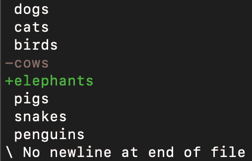

# 什么是 Git Diff，我们如何读取输出？

> 原文：<https://levelup.gitconnected.com/what-is-git-diff-and-how-do-we-read-the-output-69f5b2036186>

## git diff 命令输出的逐行分解

照片由[hkon grim stad](https://unsplash.com/@grimstad?utm_source=medium&utm_medium=referral)在 [Unsplash](https://unsplash.com?utm_source=medium&utm_medium=referral) 拍摄

Git 是开发人员需要的最重要的技能之一。

当我开始做前端开发人员的第一份工作时，我很快意识到 Git 是一项非常重要的技能，我希望我能学习更多。你可以在下面的文章中了解更多我的经历。

 [## 我希望在开始我作为开发人员的第一份工作之前多学习一点

### 对此有更深入的了解会让我现在的生活轻松很多

blog.devgenius.io](https://blog.devgenius.io/the-one-thing-i-wish-i-studied-more-before-starting-my-first-job-as-a-developer-edcc14f54e5) 

在过去的一个月里，我学习了很多关于 Git 和如何使用不同命令的知识。我经常使用的一个命令是`git diff`。

当我第一次在命令行中使用 git diff 时，理解发生了什么是一个挑战。在本文中，我们将研究 git diff 命令，并逐行检查输出。到本文结束时，您应该对如何读取 git diff 有了更好的理解。

# 什么是 git diff？

根据官方 Git [文档](https://git-scm.com/docs/git-diff)，git diff 用于:

> 显示工作树和索引或树之间的更改、索引和树之间的更改、两个树之间的更改、合并导致的更改、两个 blob 对象之间的更改或磁盘上两个文件之间的更改

基本上，git diff 命令用于查看更改。这可能包括提交、分支、文件、工作目录或许多其他情况之间的变化。

像大多数 git 命令一样，在使用 git diff 时，我们可以添加许多选项。但是，不带任何选项的基本 git diff 将列出工作目录中不在临时区域中的更改。

例如，我有一个名为`animals.txt`的文件，其中包含动物列表。在我的工作区，我将文本*“奶牛”*替换为*“大象”*。

如果我在命令行中键入`git diff`,而没有将更改添加到暂存区，我会看到下面的屏幕。这个屏幕显示了已经发生的变化。

但是，如果我将这个更改添加到临时区域并再次运行`git diff`，我们将看不到任何更改。这是因为 git diff 只显示尚未暂存的更改。

# 如何读取 git diff？

让我们回顾一下 git diff 命令的输出，并逐行分解。

第一行向我们展示了正在比较的文件。这通常是同一文件的不同版本。`a/animals.txt`和`b/animals.txt`代表文件的不同版本。

下一行向我们展示了一些文件元数据。前两个数字，`530ff27`和`b52bb24`代表被比较文件的哈希值。最后一个数字，`100644`，代表文件的模式。这个特定的数字意味着这是一个普通的文件。

接下来的两行是标记。`--- a/animals.txt`表示第一个文件将用一个`—`符号表示。`+++ b/animals.txt`表示第二个文件将用一个`+`符号表示。

最后一部分称为组块。区块显示文件中被修改的部分。可以显示多个块，这取决于进行了多少更改。

块的第一行是标题。第一组数字，`-1, 7`表示在第一个文件中，从第 1 行开始显示 7 行。第二组数字，`+1, 7`表示在第二个文件中，从第 1 行开始显示了 7 行。

最后，我们可以看到组块的变化。白色文本表示未被更改的文本。`-cows`显示来自第一个文件的行。`+elephants`显示来自第二个文件的行。

# 结论

感谢阅读！我希望这篇文章有助于您更好地理解 git diff 命令以及如何从命令行读取输出。

对于刚开始学习 Git 的人来说，阅读 git diff 更简单的方法是使用文本编辑器或 GUI。请继续关注下一篇文章中对 GitKraken GUI 的介绍。

如果您想了解另一个有用的 Git 命令 git stash，请查看下面的文章。

 [## 什么是 Git Stash，我们如何使用它？

### 作为开发人员，使用 git stash 来改进您的工作流程

blog.devgenius.io](https://blog.devgenius.io/what-is-git-stash-and-how-do-we-use-it-7cc04fecd3c4)