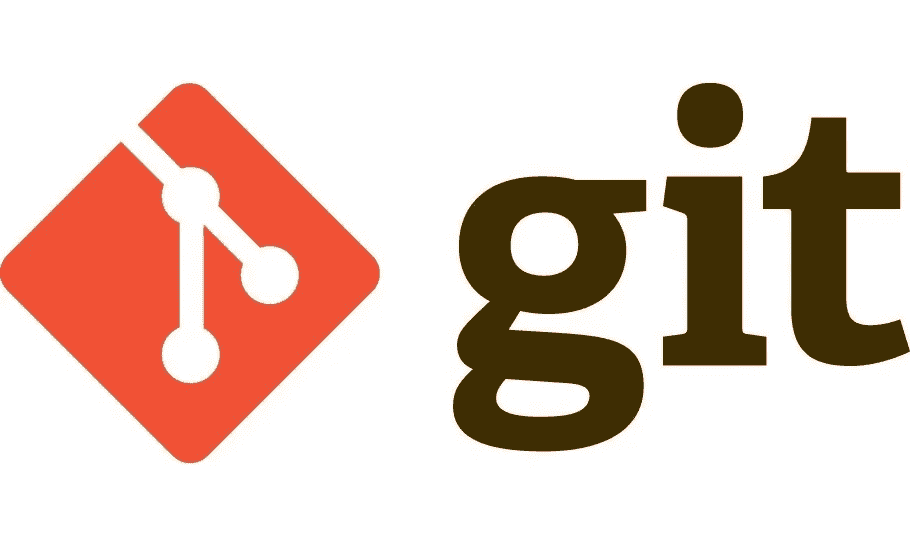
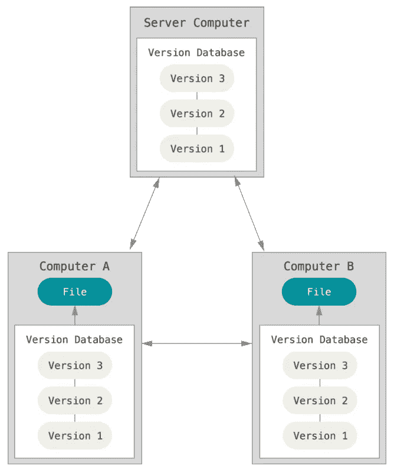
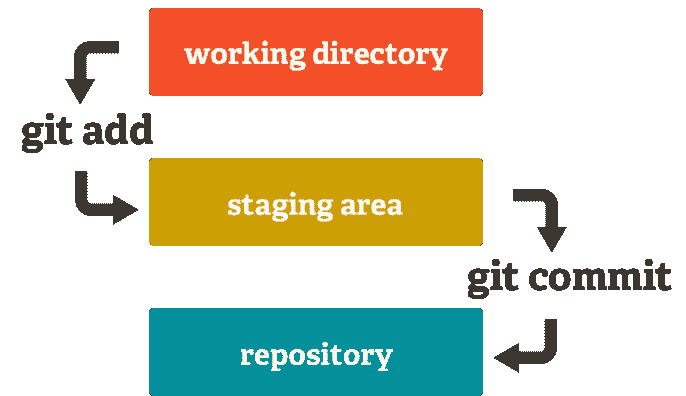
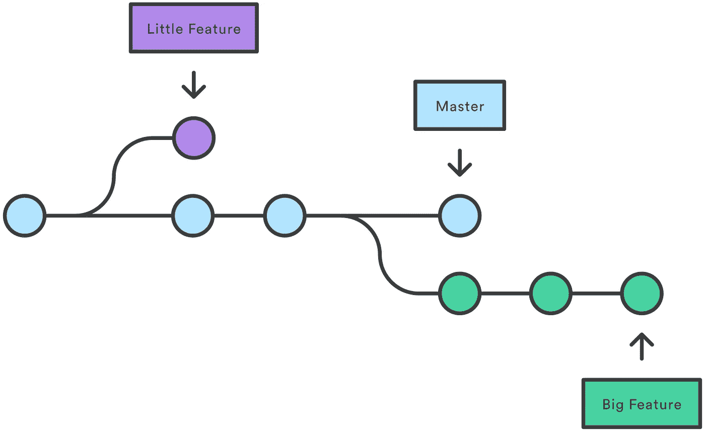
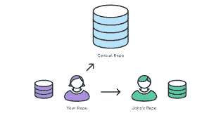
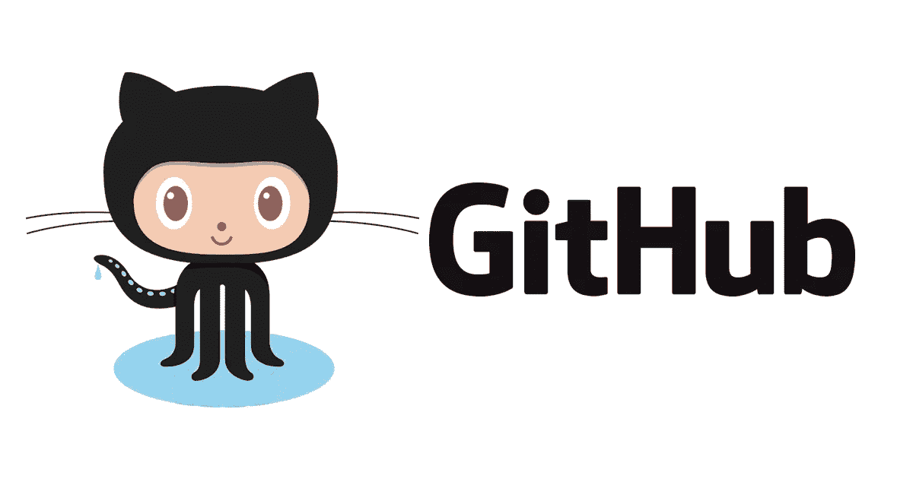

# Git 是什么？Git 概述以及为什么应该使用它

> 原文：<https://levelup.gitconnected.com/what-is-git-how-to-use-it-why-to-use-it-explained-in-depth-76a5066abaaa>

在这篇文章中，我将向您解释什么是 Git，以及如何快速入门。你们中的许多人可能听说过 Git，但是从来不知道它到底是什么意思以及如何使用它——你们偶然发现了正确的地方。



Git 是一个**分布式版本控制系统(VCS)** ，最初由 Linus Torvalds(Linux 的创建者)于 2005 年开发，并且是开源的，即可以免费使用。它是目前最流行和最常用的版本控制工具。

让我们理解版本控制在这里意味着什么:

***版本控制系统*** *:是一类软件工具，帮助软件团队管理源代码随时间的变化。版本控制软件在一种特殊的数据库中跟踪对代码的每一次修改* *。如果出现错误，开发人员可以使用 rollback 或 revert 返回时钟，并比较代码的早期版本，以帮助修复错误，同时最大限度地减少对所有团队成员的干扰。*



分布式版本控制系统。

# 让我们快速开始使用 Git

首先让我们快速从官方网站获取 git，这是 Git SCM[https://git-scm.com/](https://git-scm.com/)

从这里安装后，打开您的终端并键入

```
git --version
```

它将显示安装在本地机器上的 Git 版本。现在继续创建一个文件夹并初始化一个 Git 存储库。

```
mkdir git-sample-repo && cd git-sample-repogit init
```

`git init`命令将本地 Git 存储库添加到项目文件夹中。

现在在你的文件夹中创建一个简单的`Hello-World.txt`，并在其中添加一些内容。

```
touch Hello-World.txt
```

# 准备和提交变更

与其他系统不同，Git 有一个称为“暂存区”或“索引”的东西。这是一个中间区域，在完成提交之前，*提交可以在这里被格式化* *并被检查*。

Git 区别于其他工具的一点是，它可以快速地 ***存放一些文件*** 并提交它们，而无需提交工作目录中所有其他修改过的文件，也不必在提交期间在命令行中列出它们。



```
git add .

        ORgit add Hello-World.txt
```

命令`git add *`添加暂存区中的所有文件。

现在让我们来`commit`一下我们所做的改变。

```
git commit -m "Added the First Commit"
```

“添加第一个提交”是这里的提交消息。当`-am`为选项时，输入相关的提交消息。

`Staging & Committing is`的速记版

```
git commit -am "Initial Commit"
```

# Git 状态和 Git 日志和差异

现在通过添加几行来修改`Hello-World.txt` 文件。

## 状态

使用`git status`找出关于哪些文件被修改以及暂存区中有哪些文件的信息。

```
git status
```

状态显示`Hello-World.txt`已修改，还不在暂存区。

```
git add Hello-World.txt
git commit -m "Added Some Content in File"
```

# 原木

使用`git log`打印出到目前为止已经完成的所有提交。

```
git log
```

该日志显示了每次提交的作者、提交日期和提交消息。

# 差异工具

使用`git diff`来显示你的索引和工作目录之间未分级的变化。这是一个多用途的 Git 命令，在执行时对 Git 数据源运行一个 diff 函数。这些数据源可以是提交、分支、文件等等。`git diff`命令通常与`git status`和`git log`一起使用，以分析 Git repo 的当前状态。

```
git diff
```

# 分支

Git 的特性真正使它从几乎所有的 SCM 中脱颖而出的是它的分支模型。到目前为止，我们还没有在 Git 中创建任何分支。默认情况下，Git 提交进入主分支。

## 什么是分支？

***Git 分支是一个有效的指向你的变化快照的指针*** 。当您想要添加一个新特性或修复一个 bug 时——无论大小——您可以生成一个新的分支来封装您的更改。所以目前主分支是指向第二次提交`“Added Some Content in File”`的指针。下图显示了主分支。我们总是为项目中的特性创建分支。



## 创建新分支

使用以下命令创建一个名为 **sample** 的新分支:

```
git branch sample
```

该命令创建`sample`分支。

我们仍然在主分支的上下文中。以便切换到`sample`分支。使用以下命令:

```
git checkout sample
```

现在我们在`sample`分部。

您可以使用以下命令列出本地的所有分支:

```
git branch
```

## 让我们在新的分支中进行一些提交

通过添加以下代码片段修改`Hello-World.txt`:

```
Hello World 
Adding some Content 
Adding some Content from sample Branch. Seems Nice!!
```

现在，使用以下命令转移并提交:

```
git commit -a -m "Sample Branch Commit"
```

这个提交是在`sample`分支中完成的，现在`sample`分支领先`master`1 个提交。`sample`分支还包括来自主分支的 2 个提交。

您可以使用以下命令验证样本分支中的提交历史:

```
git log
```

# 合并

`git merge`命令可以让你获得由`git branch`创建的独立开发线，并将它们集成到一个单独的分支中。目前，`sample`分支领先`master`1 个提交。假设现在我们希望将`sample`中的所有代码带回`master`分支。这就是`git merge`非常有用的地方。它将把多个提交序列组合成一个统一的历史。

首先，回到主分支:

```
git checkout master
```

然后运行`merge`命令:

```
git merge sample
```

运行这两个命令后，合并应该会成功。在本例中，没有冲突。

然而，在实际项目中，当合并正在进行时，可能会有冲突。这意味着在每个分支中相同的代码行被更改，Git 不知道哪一行是真正的更改。解决冲突是需要经验的，所以随着你更多地使用 Git，你将能够找到解决冲突的窍门。

现在运行`git log` ，您会注意到主服务器也有 3 次提交。

# 远程 Git 存储库

到目前为止，我们一直只在本地存储库中工作。每个开发人员将在他们的本地存储库中工作，但是最终，他们将把代码推到远程存储库中。一旦代码在远程存储库中，其他开发人员就可以看到并修改代码。



这里我们将使用 **GitHub** 它就像你的 Google Docs，除了你可以创建&离线保存你的代码版本，然后再用**推送**在线保存。比特桶等替代方案是可用的。



# 设置远程存储库。

前往[https://github.com/](https://github.com/)创建一个账户。

在 GitHub 主页注册后，点击**开始一个项目**来创建一个新的 Git 仓库。为存储库命名，然后单击“创建存储库”

命名为`git-sample-repo` 这将在 GitHub 中创建一个远程存储库。

在终端上输入这个命令，并导航到存储本地项目的目录。

```
git remote add 
```

`git remote add`命令有两个参数:

*   远程名称，例如`origin`
*   远程 URL，例如`https://github.com/Jatin-8898/git-sample-repo.git`

```
# Set a new remote
git remote add origin https://github.com/Jatin-8898/git-sample-repo.git # Verify new remote
git remote -v
origin  https://github.com/Jatin-8898/git-sample-repo.git(fetch)
origin  https://github.com/Jatin-8898/git-sample-repo.git(push)
```

# 取得

`git fetch`命令将提交、文件和引用从远程存储库下载到本地存储库中。抓取是当你想看到其他人都在做什么的时候你要做的事情。`git pull`和`git fetch`命令可用于完成任务。您可以将`git fetch`视为这两个命令的“安全”版本。它将下载远程内容，但不会更新您的本地回购的工作状态，保持您当前的工作不变

```
Syntax: git fetch <remote> <branch>
Example: git fetch origin sample
```

# 拉

`git pull`命令用于从远程存储库获取和下载内容，并立即更新本地存储库以匹配该内容。在基于 Git 的协作工作流中，将远程上游变更合并到本地存储库中是一项常见的任务。`git pull`命令实际上是另外两个命令的组合，`git fetch`后跟`git merge`。

```
Syntax : git pull <remote> <branch>
Example: git pull origin master
```

# 推

`git push`命令用于将本地存储库内容上传到远程存储库。推送是将提交从本地存储库转移到远程存储库的方式。

```
Syntax : git push <remote> <branch>
Example: git push origin master
```

**注意:**如果您在创建新的存储库时创建了一个 **Readme.md** 文件，那么请确保您首先创建了`pull`，然后创建了`push`。

# 附加命令

# 克隆

`git clone`是一个 Git 命令行实用程序，用于定位现有的存储库，并在您的系统中创建目标存储库的克隆或副本。

```
git clone <url>
```

# 配置

`git config`命令是一个方便的函数，用于在全局或本地项目级别上设置 Git 配置值。

```
git config --global user.email "your_email@example.com"
```

# 删除目录

从项目文件夹中移除导演。使用此命令

```
git remove -r dir
```

# 责备

`git blame`命令用于逐行检查文件的内容，并查看每一行的最后修改时间以及修改的作者。

```
git blame <filename>
```

# 重置

重置临时区域以匹配最近的提交，但保持工作目录不变。

```
git reset
```

重置临时区域和工作目录以匹配最近的提交，并覆盖工作目录中的所有更改。

```
git reset --hard
```

# **回复**

git revert 命令可以被认为是“撤销”类型的命令

```
git revert
```

当您希望应用项目历史记录中提交的反向操作时，应该使用恢复。例如，如果您正在跟踪一个 bug，并且发现它是由一次提交引起的，那么这可能是有用的。您可以使用`git revert`自动完成所有这些工作，而不是手动进入、修复并提交新的快照。

这是一个向前移动的撤消操作，提供了一种安全的撤消更改的方法。还原操作不会删除或丢弃提交历史记录中的提交，而是会创建一个新的提交来反转指定的更改

# 恭喜🎉🎉

现在您已经知道了如何使用 Git 的基本知识，所以请继续深入探索吧！

如果你真的喜欢这篇文章，请给这篇文章打 50 分👏 👏👏

请随时联系我的 LinkedIn 账户:[https://linkedin.com/in/jatin-varlyani](https://www.linkedin.com/in/jatin-varlyani/)

您也可以通过 GitHub ✌与我联系

[](https://github.com/Jatin-8898) [## Jatin-8898 -概述

### 全栈 Web 开发人员|应用程序开发人员|热爱探索新技术✨ - Jatin-8898

github.com](https://github.com/Jatin-8898)