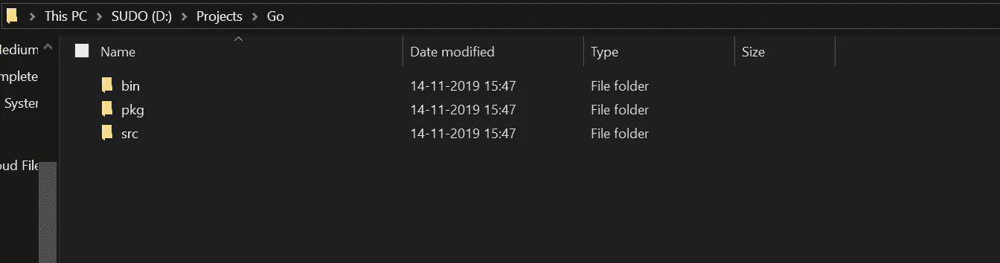

# Golang 是什么，如何安装

> 原文：<https://levelup.gitconnected.com/what-is-golang-and-how-to-install-it-2275236fe657>


Go 通常也称为 Golang，是一种编程语言，旨在找到性能、控制和开发人员体验之间的最佳平衡。它的开发始于 2007 年的谷歌，第一次公开发布是在 2009 年。

据[golang.org](http://golang.org):

> Go 是一种开源编程语言，可以轻松构建简单、可靠、高效的软件。

# 历史

让我们回到几年前，这种语言的创造者[罗伯特·格里斯默](https://www.wikiwand.com/de/Robert_Griesemer)、[罗布·派克](https://www.wikiwand.com/en/Rob_Pike)和[肯·汤普森](https://www.wikiwand.com/en/Ken_Thompson)是谷歌的首席开发人员。他们的主要目标是将“*无关的垃圾*”从 C 和 C++等语言中排除，同时仍然能够应对公司复杂系统的主要挑战。


这种语言的开发者主要是被他们对 C++的共同憎恨所驱使，这导致他们创造了一种混合了不同编程元素和概念的语言。

例如:

*   静态类型和运行时效率(如 [C++](https://www.wikiwand.com/en/C%2B%2B) )
*   可读性和可用性(如 [Python](https://www.wikiwand.com/en/Python_(programming_language)) 或 [JavaScript](https://www.wikiwand.com/en/JavaScript)
*   高性能网络和多处理

# 为什么要学 Golang？

当你写 Go 代码时，你必须非常小心缩进和使用的空格数。该语言要求其声明的变量或导入的库没有一个是未使用的，并且所有的 return 语句都是强制的。产生以下特性:

*   超级简单易学
*   易于使用的界面
*   外面有很多工作机会
*   用来解决实际问题的真正的语言
*   您可以将它用于 web 开发
*   目前许多顶尖的应用程序都是用 Go 编写的


根据很多关于“人们选择的语言是什么？”结果令人吃惊，因为 Golang 轻而易举地胜过了许多其他编程语言。

# 在 Windows 上安装

要在你的系统中安装 Go，你需要遵循这个逐步指南。这样做将确保您已经在系统中成功安装了 GoLang。

**第一步:**你首先需要一个 Git 版本控制系统( [*下载*](https://git-scm.com/downloads) )因为有了 Go 你会用到很多开源的库。

**第二步:**去[golang.org](https://golang.org/dl/)下载最新的 **64 位 Go MSI** 可分发并安装。为了简单起见，您可以将默认安装路径保持在`C:\Go`


**步骤 3:** 现在您已经在系统中安装了 Go，为了能够实际使用它，您需要确保 Go 二进制文件(通常在`Your_Installed_Directory:\Go\bin`中)已经成功添加到您的环境路径变量中。


要检查这一点，打开您的环境变量。一个快速的方法就是在开始菜单中输入“env ”,然后选择第一个选项。

然后只需点击右下角的 ***环境变量…*** 按钮。

打开`User Variables`下的`Path`，应该会有一个指定为`%USERPROFILE%\go\bin`的路径，如果没有，那么点击**新建**添加相同的路径。简单地说，这一步确保您的 Go 二进制文件可以被您的系统访问。

为了确认您已经成功完成上述所有步骤，以**管理员**的身份打开**命令提示符**并键入`go version`:


Go 版本

您应该会看到您系统中运行的 Go 的当前版本。

# 是时候设置您的工作空间了

任何 Go 项目在你的根目录中都应该有三个非常重要的文件。

```
bin\
pkg\
src\
```

对于我来说，我想在`D:\Projects\Go`中设置我的项目目录。随意选择自己的目的地位置。在项目文件夹中，创建这三个文件夹。



项目结构

现在最重要的步骤，你要创建你的`GOPATH` 环境变量。无论何时运行 go 项目，这都将是系统的目标位置。


再次打开环境变量框，选择`System variables`下的**新建**

将变量名设置为`GOPATH`，并将值设置为 Go 工作空间路径。

要检查您是否已经成功地将您的`GOPATH` open 命令行设置为管理员，并键入`echo %GOPATH%`，您的项目工作区应该会突出显示。


回声工作区

## 干得好，你快到了。现在有趣的部分来了。


# 编写你的第一个 Hello World 程序

因为 Go 严重依赖开源，所以让我们甚至不用写一行代码就能构建我们的第一个程序。

打开命令行，输入以下命令，从 GitHub 获取开源库:

```
go get github.com/golang/example/hello
%GOPATH%/bin/hello 
```

如果成功，您将看到以下结果:


戈朗的 Hello World


# 瞧

**现在就去**震撼世界。

🤩 ✌️