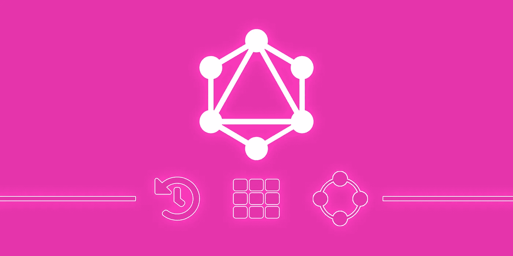

# 什么是 GraphQL:历史、组件和生态系统

> 原文：<https://levelup.gitconnected.com/what-is-graphql-87fc7687b042>

RESTful web 服务多年来一直为简单查询结构提供基本支持。然而，这些服务不提供对数据的细粒度控制，这种控制允许开发人员在不创建大量不必要的调用的情况下行使灵活性。

最初由脸书创建的 GraphQL 是一种 API 查询语言，它让开发者 T2 选择他们想要的请求类型，并在一个请求中接收他们需要的信息。

在本文中，我将解释[什么是 GraphQL](https://blog.back4app.com/2019/08/08/what-is-graphql/) ，它是如何开始的，以及它是如何成为开发人员构建 API 的重要工具的。我们还将介绍 GraphQL 的关键组件以及 GraphQL 生态系统中的主要参与者。

我们开始吧！

# GraphQL 是什么？

最简单的形式是，GraphQL 是一种用于从客户端应用程序查询数据库的开源语言。

" *GraphQL 是一种用于 API 的查询语言，它改变了客户端和服务器之间的契约，允许服务器说‘这些是我公开的功能’,并允许客户端以某种方式描述他们的需求，最终使产品开发人员能够构建他们想要创建的产品。*”—丹·斯查费， [GraphQL 的联合创始人](https://www.youtube.com/watch?v=mRgvbtNuCZY)

在幕后，它告诉 API 如何将检索到的数据呈现给客户端。这使得开发人员能够提出精确的数据请求，这样他们就能得到他们所需要的东西——不多也不少。

以下是 GraphQL 为开发人员提供的主要优势:

*   准确地声明他们需要服务器提供什么，并以可预测的方式接收请求的数据。
*   在单个请求中从服务器检索许多资源。
*   它是强类型的，也就是说，它允许 API 用户知道(1)什么数据是可用的，以及(2)它以什么形式存在。

GraphQL 查询本质上是一个字符串，当发送到服务器时，它将 JSON 返回给客户机。这些查询反映了它们的响应，这使得**预测运行查询返回的数据**的形状变得容易。如果开发人员知道他们的应用程序需要什么样的数据，他们也可以很容易地编写查询。

与 RESTful 服务或 SQL 中复杂的 join 语句不同，GraphQL 是分层的。这意味着它遵循对象之间的关系，这对于分层用户界面使用的图形结构数据来说很好。

GraphQL 利用现有的代码，而不是指定或提供数据存储库。它是**自省的**，这意味着 GraphQL 服务器可以被查询它们支持的类型，这使得工具很容易在这些信息的基础上构建。

使用 GraphQL，返回的数据的形状完全取决于客户端的查询。因此，可以很容易地向服务器添加额外的字段(例如，在添加新产品功能时)，而不会影响现有的客户端。反之亦然。因此，当您淘汰旧功能时，相应的服务器字段将继续工作，即使它们已经过时。通过这种方式，GraphQL 带来了一个向后兼容的过程，不再需要增加**版本号**。

现在我们对 GraphQL 有了更好的了解，让我们快速看一下它是如何开始的。

## **用数据库** **构建一个** [**即时 GraphQL API，并开始探索这项技术是如何工作的。**](https://www.back4app.com/graphql-database)

# 这一切是如何开始的

那么，GraphQL 是怎么入门的呢？在 GraphQL 出现之前，开发人员使用的是什么？它对他们有什么限制？让我们来了解一下！

## GraphQL 是如何起步的？

## 向移动的转变

GraphQL 的起源故事可以追溯到行业向移动的转变。当时，脸书的移动战略(即在移动设备上采用 HTML5)由于网络使用率高的问题而未能奏效。因此，脸书决定使用本地技术从头开始重建 iOS 应用程序。

脸书的*新闻推送*在手机上实现的主要问题。这不仅仅是检索一个故事，谁写的，它说了什么，评论列表，以及谁喜欢这个帖子这么简单。每个故事都是相互联系、嵌套和递归的。现有的 API 并不允许开发人员在移动设备上展示丰富的、类似新闻提要的体验。它们没有层次结构，不允许开发人员选择他们需要的内容，也不具备显示异构提要故事列表的能力。

2012 年，脸书决定他们需要建立一个新的新闻订阅 API 来构建脸书移动应用。这是 GraphQL 开始成形的时候，8 月中旬，iOS 5.0 版的脸书发布了新的 GraphQL 技术。它允许开发者通过利用其数据获取能力来减少网络使用。在接下来的一年半时间里，GraphQL API 的应用范围扩大到了脸书 iOS 应用的大部分，除了新闻提要。2015 年，GraphQL 规范与 JavaScript 中的参考实现一起首次发布。

## 传统 REST APIs 的局限性

传统 REST API 的主要问题是速度慢，需要硬编码。加快速度的一个可能的解决方案是创建多个端点。然而，当您将此推断为涵盖应用程序需要的所有数据源和 API 客户端时，就会遇到 REST APIs 的局限性。

让我试着用一个类比来解释传统 REST APIs 的局限性。

比方说，你有一台自动售货机。使用传统的 REST，你按下自动售货机上的一个按钮，就可以得到一样东西。所以，你必须一次按很多个按钮才能得到你需要的一切。这个过程很慢。

但是如果你有特殊用途的按钮，你可以一次得到多个东西。例如，你可以按下一个特殊用途的按钮，从自动售货机里得到四样东西。

这两种方法的结合就是拥有一台自动售货机，在那里你可以按下你想要的按钮组合，然后一次性得到你需要的一切。这就是 GraphQL 所做的。

GraphQL 旨在通过拥有一个“智能”端点而不是许多“哑”端点来解决这些问题。这里的主要好处是，智能端点能够接受复杂的查询，并根据客户端的要求调整数据输出。

本质上，GraphQL 层存在于客户端和数据源之间。它的工作是接收客户机请求，并根据客户机的要求获取必要的数据。简单地说，GraphQL 查询方法解决了大范围的大规模应用程序开发问题。

# GraphQL 是如何流行起来的

正如您可能想象的那样，行业中已经存在对 GraphQL 这样的解决方案的需求，这就是它迅速流行的原因。在最初的六个月里，不同的编程语言都实现了 GraphQL，包括 PHP、JavaScript、Scala、Python 和 Ruby。

当新公司和业余爱好者开始建造它时，它很快变得流行起来。最终，这项技术被更大的公司采用，从 2016 年的 GitHub 开始，后来被 Twitter、Yelp、纽约时报、Airbnb 等公司采用。

# GraphQL 关键组件

实际上，GraphQL API 使用三个主要组件:

*   **查询。**一个[查询](https://graphql.org/learn/queries/)是客户端发出的请求。查询字段可以指向数组并支持参数。
*   **解决者。除非您告诉 GraphQL 服务器，否则它不知道如何处理收到的查询。这是使用[分解器](https://graphql.org/learn/execution/#root-fields-resolvers)完成的。简单地说，解析器告诉 GraphQL 如何(以及在哪里)获取与特定字段相对应的数据。使用 GraphQL，您使用的 API 模式和数据库模式是分离的。这允许您将它们用作变异解析器来修改数据库的内容。**
*   **图式。**一个 [GraphQL 模式](https://graphql.org/learn/schema/)描述了客户端一旦连接到 GraphQL 服务器就可以使用的功能。模式中的核心构建块被称为*类型*。

# GraphQL 生态系统

在这里，我们将快速浏览一下 GraphQL 生态系统中的主要参与者。

# GraphQL 服务器

因为 GraphQL 只是一个规范，所以您需要一些 GraphQL 服务器实现来开始。

*   [**GraphQL-JS**](https://github.com/graphql/graphql-js)**是 graph QL 的原始参考实现，可以和 [Express](https://github.com/graphql/express-graphql) 一起使用。**
*   **[**GraphQL-Server**](https://www.apollographql.com/docs/apollo-server/)是 Apollo 的一体化 graph QL 服务器实现，正在迅速获得关注。可以从任何 GraphQL 客户端查询它。**
*   **[**graph QL-server less**](https://www.back4app.com/docs/parse-graphql/graphql-getting-started)是 Back4App instant GraphQL API 完全集成了数据库(MongoDB)和云功能。在这里，您可以访问提供 GraphQL APIs 的后端服务。**
*   **[**GraphQL Yoga**](https://github.com/prisma/graphql-yoga) 是 Prisma 在 Express 和 Apollo 服务器上搭建的服务器实现。**

# **GraphQL 客户端**

**虽然您可以直接查询您的 GraphQL API，但是拥有一个专用的客户端库肯定会使事情变得更容易。**

*   **[**Relay**](https://facebook.github.io/relay/)**是脸书利用 GraphQL 构建 React 应用的 JavaScript 库。****
*   ****[**阿波罗客户端**](http://www.apollodata.com/) 缓存请求并归一化数据，节省网络流量。它还支持分页、预取数据以及数据层与视图层之间的连接。****

# ****GraphQL 网关****

****也许最流行的 GraphQL 网关是 [**阿波罗引擎**](https://www.apollographql.com/platform/) 。具有查询执行跟踪、查询缓存、错误跟踪、API 性能趋势分析等功能。****

# ****开源应用和工具****

****以下是一些利用 GraphQL 的开源应用:****

*   ****在 GraphQL 的支持下， [**Gatsby**](https://www.gatsbyjs.org/docs/) 能够从多个 GraphQL APIs 获取数据，并利用它来创建一个静态的、客户端专用的 React 应用程序。****
*   ****[**VulcanJS**](http://vulcanjs.org/) 利用 GraphQL 让用户快速构建 CRUD 应用。****
*   ****[**GraphQL Playground**](https://github.com/prisma/graphql-playground)**是一个强大的 IDE，它为 graph QL 查询、变异、订阅、验证等功能打包了一个编辑器。它允许开发人员可视化模式的结构。******
*   ******[**graph QL**](https://github.com/facebook/graphql/)**是一个浏览器内 IDE，可以与 GraphQL APIs 交互，支持数据查询，执行变异，以及自动完成查询。********

# ******结论******

******虽然 GraphQL 是为了解决脸书的 iOS 应用新闻订阅 API 的一个非常具体的问题而构建的，但它很快扩展到解决脸书内部的更多问题，并最终开源成为更大公司使用的社区工具。******

******你认为 GraphQL 会在未来几年成为行业标准吗？请在下面的评论区告诉我。******