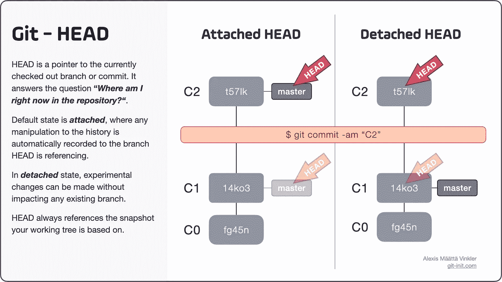

# Git 中的 HEAD 是什么

> 原文：<https://levelup.gitconnected.com/what-is-head-in-git-4459b811ad40>

HEAD 回答了这个问题:我现在在存储库中的什么位置？它是一个指向当前检出分支或提交的指针！


照片由[法伦·迈克尔](https://unsplash.com/@fallonmichaeltx?utm_source=ghost&utm_medium=referral&utm_campaign=api-credit) / [Unsplash](https://unsplash.com/?utm_source=ghost&utm_medium=referral&utm_campaign=api-credit) 拍摄

*原载于 2021 年 7 月 10 日 https://blog.git-init.com*[](https://blog.git-init.com/what-is-head-in-git/)**。**

*`HEAD`回答问题: ***我现在在存储库中的什么位置？*** 它是一个指向当前已签出的分支或提交的指针，其中包含在给定时间你的整个代码库的[不可变快照](https://blog.git-init.com/immutable-snapshot-in-git/)。无论提交`HEAD`是直接引用(使用散列)还是通过引用(使用分支)，它总是任何本地更改所基于的提交。*

*好吧，但这一切到底意味着什么？在这篇文章中，我会用插图更详细地解释上面的陈述，展示`HEAD`是如何运作的。*

# *连接和分离状态*

*首先，必须知道`HEAD`指针可以有两种状态: ***附着*** 或 ***脱离*** 。默认状态是 ***附属*** ，历史的任何操作都会自动记录到`HEAD`当前引用的分支。在 ***分离*** 状态下，可以在不影响任何现有分支的情况下进行实验性改变，因为`HEAD`直接引用底层提交，并且不“附加”到特定分支。*

*还是，迷惑？放心吧！下图以并列比较的方式展示了这两种状态。注意，我们的历史只包含两个提交(***C0***&***C1***)和一个分支( ***主*** )及其远程对应(***o/主*** )。*

**

*左侧为头部处于连接状态的历史，右侧为头部处于分离状态的历史。在连接状态下，通过本地主分支引用 C1，而在分离状态下，直接通过其哈希“14ko3”引用。*

*在左侧，`HEAD`处于默认状态，任何变化都会自动记录到分支；在这个特例中，本地的`master`分支。在右边，`HEAD`处于稍微不常见的状态，直接使用它的惟一散列`14ko3`引用提交。*

*重要的是要明白，不管底层提交是如何被引用的(直接还是通过引用)，其内容在签出时都会自动解包并镜像到您的本地*工作树*(例如，您计算机上的文件和文件夹)。在上面的例子中，本地*工作树*在两种情况下是相同的，包含`14ko3`的快照。*

*既然我们知道了`HEAD`如何直接或通过引用指向提交；让我们看看，如果我们通过在*之上创建一个新的提交( ***C2*** )来操纵历史，会发生什么。同样，为了便于比较，这两个状态是并排的。**

****

**在左侧，C2 以附加状态提交，主分支自动跟随。在右边，C2 承诺在分离状态，让所有其他分支保持原样。**

**正如您在上面看到的，新的提交 ***C2*** 在两种情况下都是通过`commit`操作创建的。主要区别在于，在 ***附加*** 状态下，变化自动记录在`master`分支中。相比之下，在 ***分离*** 状态下，变更不会影响任何现有分支，并且`master`仍然引用*。***

***如果使用回滚操作，类似的事情也会发生，比如`reset`，但是这种情况适合在以后的博客文章中讨论！***

***现在，让我们看看如何知道`HEAD`当前引用的是什么。***

# ***HEAD 指的是什么？***

***如上所述，大多数时候你的`HEAD`引用将指向一个分支，因此处于附加状态。每当在分支上创建新的提交时，`HEAD`将自动跟随。但是，在某些情况下，在某些过程中，您会发现自己与`HEAD`处于分离状态，它直接引用提交而不是分支。***

***例如，每次您使用提交的散列显式地签出提交，或者如果您签出标签，`HEAD`将进入分离状态。还有其他操作，如互动`rebase`可能会让你与`HEAD`分离。***

***无论何时你想知道`HEAD`当前处于哪个状态以及它引用了什么，最简单的方法就是在你的终端中输入`$ git status`。然后 Git 会让您知道整个*工作树的状态，*包括*索引*(暂存区)，还有`HEAD`的状态。***

**下面是一个简短的序列，展示了 Git 如何总是试图通知您`HEAD`的当前状态。在这个例子中，首先使用它的散列(`t57lk`)检查提交，让`HEAD`分离。**

```
**$ git checkout t57lk
Switching to 't57lk', you are now in 'detached HEAD' state.

$ git status
HEAD detached at t57lk**
```

**检查`HEAD`指向什么的另一个简单方法是使用命令`$ git show HEAD --oneline`。它会告诉您`HEAD`当前引用的是什么，但也会列出所有其他也引用相同提交的分支；注意下面最后一行括号内的`HEAD -> master`，表示`HEAD`指向`master`——因此间接表示`HEAD`处于附着状态。**

```
**$ git checkout master
Switched to branch 'master'

$ git show HEAD --oneline
t57lk (HEAD -> master, o/master) C2**
```

# **你处于‘分离的头’状态**

**许多 git 初学者认为消息`You are in 'detached HEAD' state`是一个错误，但实际上，正如我们刚刚看到的，它只是描述了你的`HEAD`指针的状态。从分离的`HEAD`状态中“恢复”很简单:切换回一个现有的分支，或者从您当前所在的位置创建一个新的分支。**

# **显式检查头指针(过度)**

**如果你想明确地看到`HEAD`引用的是什么，你总是可以检查`.git/HEAD`文件，这是 git 内部用来管理`HEAD`的实际文件。根据`HEAD`是否分离，文件包含分支或提交散列的名称。**

**显式检查`HEAD`通常是你永远不会做的事情，但是出于教育目的，知道这一点是有好处的。在下面的例子中，使用了 [cat](https://en.wikipedia.org/wiki/Cat_(Unix)?ref=the-pragmatic-git) ，但是您可以使用常规的文本编辑器来查看该文件。**

```
**$ cat .git/HEAD
ref: refs/heads/master**
```

**的内容。git/HEAD 文件当处于 ***附加*** 状态时，在这种情况下引用主分支。**

```
**$ cat .git/HEAD
t57lk60b4b4aece5915caf5c68d12f560a9fe3e4**
```

**的内容。git/HEAD 文件当处于 ***分离*** 状态时，在这种情况下显式引用提交散列。**

## **@ —新的头像别名**

**从 Git 的`1.8.4`版本开始，为了方便起见，`@`符号可以和`HEAD`互换使用。例如，不要输入`$ git show HEAD --oneline`，你可以改为写`$ git show @ --oneline`。**

# **结论**

**那么，为什么理解`HEAD`两种状态的概念如此重要呢？**

**对`HEAD`指针有了很好的理解，您可以快速浏览您的存储库的历史，并执行您认为合适的操作。您再也不会迷失在时间中，或者将信息误解为错误！**

**下面是一个简短的备忘单，说明了`HEAD`的概念；下载吧！=)**

****

**说明 HEAD 概念的备忘单，突出显示两种状态:连接和分离。**

**为了充分理解`HEAD`的工作原理，还必须理解`HEAD`、*工作树*和*索引*(暂存区)之间的关系。对这种相互关系的深入探究将在以后的文章中发表！**

**既然您已经知道了什么是`HEAD`以及它是如何操作的，我希望您在浏览您的存储库的历史时会更有信心。**

**感谢您的阅读，祝您好运，提高您的源代码管理技能！**

**📫如果你想要更多这样的文章，请访问实用 Git 博客并注册新闻订阅！**

**你会在收件箱里直接看到有趣的 Git 主题，并访问会员专用的内容。**

**☝️:有任何问题或建议，试着在推特上联系我— [@Stjaertfena](https://twitter.com/Stjaertfena?ref=the-pragmatic-git)**