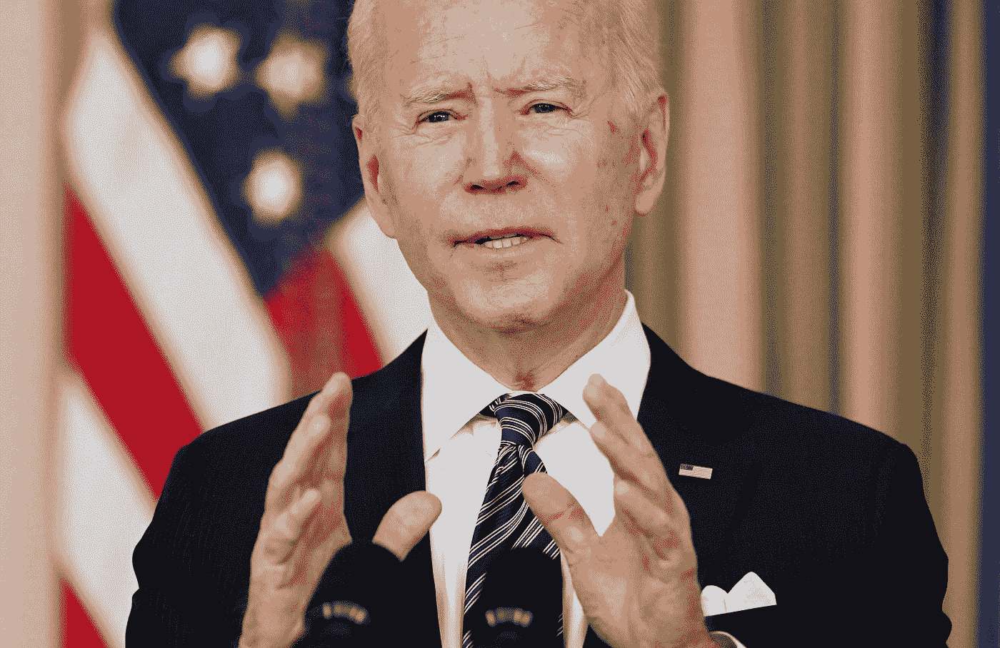

# 拜登提议的 3 万亿美元基础设施法案包括什么

> 原文：<https://levelup.gitconnected.com/what-is-in-bidens-proposed-us-3-trillion-infrastructure-bill-97b847a2cf90>

这出现在[千禧年的来源](https://themilsource.com/2021/03/24/what-is-in-bidens-proposed-us3-trillion-infrastructure-bill/)

拜登和他的团队在过去几周举行了多次两党会议，以推动他们认为必要的立法，改善国家的基础设施，并在经济上与中国等国家竞争。

3 月 22 日星期一，拜登政府宣布了一项 3 万亿美元的一揽子支出计划，重点关注一系列问题，致力于促进高薪就业，更新摇摇欲坠的基础设施，增加财富和种族平等。

拜登和他的团队在过去几周举行了多次两党会议，以推动他们认为必要的立法，改善国家的基础设施，并在经济上与中国等国家竞争。

然而，政府面临着艰巨的任务，因为拜登和他的团队平衡了共和党人和进步民主党人的希望和需求。

# 提案里有什么？

拜登政府希望实现其“重建得更好”的竞选承诺。拜登的竞选网站承诺“调动美国人的聪明才智，建设现代化的[基础设施和公平、清洁的能源未来](https://joebiden.com/clean-energy/)”等等。

在庞大的[冠状病毒刺激法案](https://themilsource.com/2021/03/08/senate-vote-on-us1-9-trillion-covid-19-relief-bill-explained/)通过国会签署成为法律仅仅几个星期后，拜登的团队发布了一对解决基础设施、教育和气候变化的提案。第一部分几乎是在刺激法案出台后立即出台的，重点是重建国家的基础设施。德克萨斯州的极端停电反映了全国范围内更广泛的改善需求，许多人认为这是更新传统基础设施的时候了。

该法案中的 1 万亿美元将用于基础设施建设，包括传统的道路、桥梁、铁路线、港口和学校的建设和改善，同时改善电网。

除了这些更传统的基础设施项目，该计划还寻求解决现代问题，以改善平等和应对气候变化。当务之急是普及宽带互联网的发展，它填补了美国农村的一个空白。此外，该计划将培训数百万工人。

白宫认为，这两项条款是保持与海外大国竞争力的关键。在竞选期间，拜登团队预测，这些投资不仅会挽回因疫情而失去的工作岗位，还会增加 500 万个工作岗位。

支出计划的第二部分旨在解决种族和性别平等问题，这是拜登的另一项竞选承诺。这部分资金将用于教育和旨在提高女性劳动力参与率的项目。此外，该法案将扩大对中低收入美国人购买医疗保险的补贴，以及由救助法案引入的儿童税收抵免。

# 有哪些挑战？

应对基础设施系统老化的挑战和创造就业机会都是两党的目标。然而，如何实现这些目标是有争议的。

共和党人希望参与到对话中来，但是一项被右翼人士所认同的法案对于进步人士来说可能还不够。如果拜登政府希望获得两党的支持，它必须小心谨慎。

其中一个主要问题是法案的成本以及联邦政府计划如何支付。财政部长珍妮特·耶伦相信，如果他们重新调整税收结构，政府可以找到资金。

耶伦说:“我们预计将审查税收政策的变化，以及解决一些长期以来抑制美国生产率和劳动力供应的问题的计划。”“我们将解决基础设施、气候变化带来服装风险、教育和培训等问题。”

[参议员乔·曼钦](https://themilsource.com/2021/02/09/who-is-joe-manchin/)，一位来自西弗吉尼亚州的温和派民主党人，说他不会对该法案投票，除非获得跨党派的支持。

“在我们开始尝试之前，我不会通过一项法案将他们完全排除在外，”[他告诉 Axios](https://www.axios.com/joe-manchin-infrastructure-bill-c8408e99-17f3-4477-b5df-8e3d537c0bd9.html) 。曼钦还表示，该计划需要通过增税来支付。

税法的改变并不为共和党人所接受。

在三月早些时候的新闻发布会上，参议院少数党领袖米奇·麦康奈尔表达了他的反对意见。

“我认为特洛伊木马将被称为基础设施。但特洛伊木马内将是参议员(里克)斯科特和其他人一直在谈论的所有增税措施。”

尽管如此，民主党人仍然在国会参众两院占据多数席位，无论多么微弱，并且可以在没有两党支持的情况下通过法案。

拜登的交通部长皮特·布蒂吉格乐观地看待基础设施带来的挑战。

“不是每一代人都能真正重建和塑造自己的未来，”他周一在推特上写道。“但是今天生活在美国的几代人有这个机会。这是一个思考基础设施的季节。”

*原载于 2021 年 3 月 24 日*[*【https://themilsource.com】*](https://themilsource.com/2021/03/24/what-is-in-bidens-proposed-us3-trillion-infrastructure-bill/)*。*