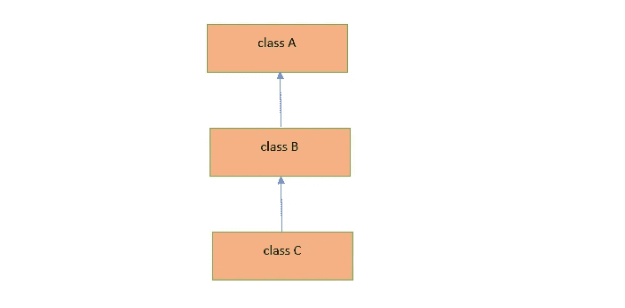
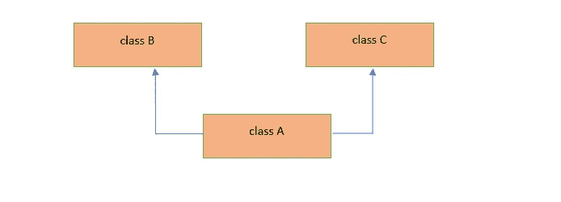
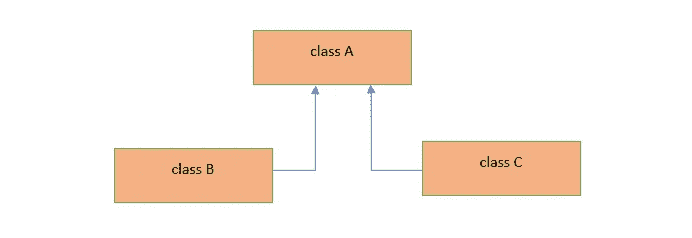
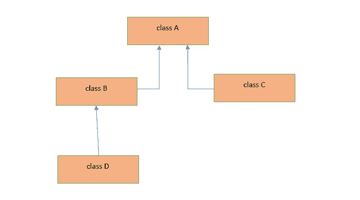

# 什么是 Java 中的继承和组合——检查区别

> 原文：<https://levelup.gitconnected.com/what-is-inheritance-and-composition-in-java-check-the-differences-updated-37b8fe54cf80>

## 面向对象编程

## 两个最广泛使用的面向对象编程特性——继承和组合。


**照片由** [**肖恩·林**](https://unsplash.com/@seanlimm?utm_source=unsplash&utm_medium=referral&utm_content=creditCopyText) **上** [**下**](https://unsplash.com/s/photos/programming?utm_source=unsplash&utm_medium=referral&utm_content=creditCopyText)

通过这篇文章，我将介绍 java 编程中的继承和组合的概念。阅读完本文后，您将对这两个 java 特性有了很好的了解。

# Java 中的继承是什么？

**继承**是使用已经定义的类定义一个新类的过程，这样新定义的类可以使用已经定义的类的数据成员(属性)和成员函数(方法)。

*已经定义的类称为* ***父类*** *或* ***基类*** *或* ***超类*** *。*

*一个新定义的类叫做* ***子类*** *类或者* ***派生的*** *类或者* ***子类*** *。*

# 继承有什么好处？

使用继承的优点如下:

1.  新创建的类可以使用已经定义的类 ***的属性(实例变量)和方法(实例方法)，而无需在子类*中重新定义。*这种方式提高了代码的可重用性。***
2.  一个子类可以有***自己的实例变量(字段)和方法。***
3.  子类可以 ***覆盖父类的实例方法。***

> 注 1:当子类继承父类时，根据父类中实例变量和方法使用的访问修饰符(**private/default/protected/public**)，所有实例变量和实例方法都可以用子类对象访问。
> 
> 为了便于理解，我们可以说父类的变量和方法的一个副本是在子类中创建的。
> 
> 注意 2:当父类的实例变量和方法有公共的或受保护的访问修饰符时，那么子类**对象**可以直接访问它们，但是如果它们被声明为私有的，那么子类的对象将不能直接访问它们，因此这种私有变量需要公共的 getters 和 setters。
> 
> 注 3:类似地，当父类的字段和方法用包私有访问级别声明时，那么子类对象不能在声明父类的包之外访问这些字段和方法。

> 私有变量对声明它们的类是可见的。

# 继承的语法:

```
public class Parent {
    //instance variables
    //instance methods
}
public class Child extends Parent {
    //instance variables
    //instance methods
    //Overridden methods of Parent class.
}
```

让我们看一个例子来理解继承。

将**动物**类视为父类:

动物类作为父类

考虑将 **Dog** 作为继承 Animal 类的子类:

狗作为一个孩子类的动物类

Main 作为驱动程序类来测试继承:

主驱动程序类

在上面的例子中，**动物**是父类，而**狗**是子类。现在我们可以说父类的所有实例变量(属性)和实例方法也是子类的一部分。因此我们可以说每一只**狗**都是一只**动物**。

*所以在继承的情况下，子类和超类之间总有一个****【IS-A】关系*** *。*

# 构造函数如何处理继承？

当一个子类对象被创建时，它调用它自己的类*构造函数*，并且这个构造函数使用 ***超级*** 关键字调用它的父类构造函数。这个父类构造函数调用是由编译器隐式完成的。让我们看一个例子来理解这一点。

具有构造函数和继承的父级和子级

## 输出:

```
Parent constructor called!!!
Child constructor called!!!
```

您可以看到，当创建一个子类对象时，调用了子类的无参数构造函数，但是注意，在内部，该构造函数中的第一条语句是对父类构造函数的 super()调用，它是隐藏的。

因此，首先加载父类，并执行其构造函数，之后加载子类，并由 JVM 中的类加载器执行其构造函数。

# 有哪些不同类型的继承？

1.  单一遗传
2.  多级遗传
3.  多重遗传
4.  分层继承
5.  混合遗传

## 1.单一继承:

一个类扩展了另一个类。


单一遗传

## 2.多级继承:

在这种类型的继承中，B 类扩展 A 类，C 类扩展 B 类。



多级遗传

## 3.多重继承:

在这种类型的继承中，一个类 A 扩展了两个类 B 和 c。



多重遗传

> 注意:Java 不支持多重继承。

## 4.分层继承:

在这种类型中，多个类扩展同一个父类。



分层继承

## 5.混合遗传:

将上述两种或两种以上的继承结合起来就是混合继承。



混合遗传

现在我们来了解一下构图。

# Java 中的 Composition 是什么？

组合是 Java 中的另一个 OOP 特性(如**继承**、**多态**、**封装**和**抽象)**，类 之间存在*****【HAS-A】关系。*****

**比方说，我们有两类汽车和发动机。然后在汽车和引擎类之间有一个关系**‘HAS-A’**，因此我们可以说 ***汽车有一个引擎*** 。**

> **所以会有两个类**汽车**和**引擎**和**汽车**类会有一个**引擎**类的实例变量。**

**让我们看一个程序来理解这个概念。**

**发动机等级:**

**引擎等级**

**汽车等级:**

**汽车等级**

**主 as 驱动程序类:**

**输出:**

```
Car Object is : Car{brandName=’Honda’, color=’Silver’, engine=Engine{fuelType=’Petrol’, cc=1498, maxTorque=98, maxPower=200}, model=’2020'}
```

> **使用组合的好处是我们可以控制 Car 类中实例变量“engine”的可见性/可访问性。**

> **注意**继承和组合都提高了代码的可重用性。****

# **继承和作曲有什么区别？**

1.  ****继承是子类和父类之间的“是-A”关系**，而**组合是两个类之间的“有-A”关系**。**

**2.在继承的情况下，子类可以覆盖父类实例方法，但是这不适用于组合的情况。**

***本文到此为止。希望你喜欢这篇文章。***

# **类似内容可以关注[维克拉姆古普塔](https://medium.com/u/2c3b611409dc?source=post_page-----37b8fe54cf80--------------------------------)。**

# **分级编码**

**感谢您成为我们社区的一员！在你离开之前:**

*   **👏为故事鼓掌，跟着作者走👉维克拉姆·古普塔**
*   **📰查看更多内容请参见[升级编码出版物](https://levelup.gitconnected.com/?utm_source=pub&utm_medium=post)**
*   **🔔关注我们:[Twitter](https://twitter.com/gitconnected)|[LinkedIn](https://www.linkedin.com/company/gitconnected)|[时事通讯](https://newsletter.levelup.dev)**

**🚀👉 [**加入升级达人集体，找到一份惊艳的工作**](https://jobs.levelup.dev/talent/welcome?referral=true)**