# 互动动画

> 原文：<https://levelup.gitconnected.com/what-is-interactive-animation-1c0e080d1077>

## 什么是 an

## 我们如何制造一个？

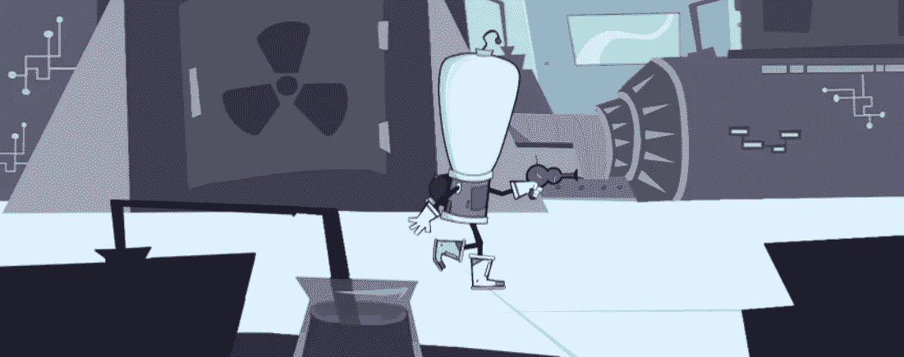

与 ZIM 在 HTML 画布上的互动动画

交互式动画是一种可以由某人控制的动画，而不仅仅是开始和停止动画。当然，这足够宽泛，可以涵盖游戏。也许这种模糊性是这个短语相当晦涩的一个原因。

尽管如此，这个短语作为一种视觉还是很有用的——主要是在我们与鼠标、手指或游戏手柄交互的网络上。一个用例是信息图表。

> 交互式信息图表可以被称为信息活动

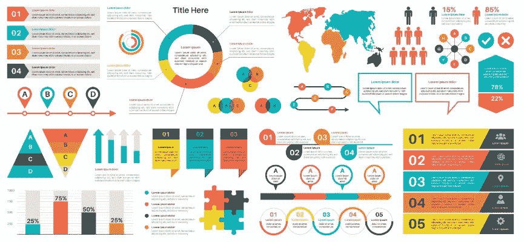

信息图表示例

上图是一张普通的信息图。现在，假设用户将各个部分制作成动画，以显示流程中时间或步骤的变化。一些例子可以在 [ZIM 信息活动](https://zimjs.com/infoactives.html)部分找到。

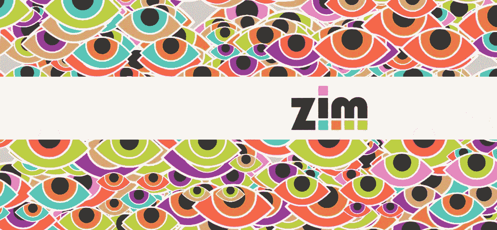

滑动 ZIM 标志显示普通人看到网站

另一个用途是在滚动网页或选择选项时娱乐或增加视觉趣味。这些通常是在视差场景中，前景比背景移动得快。

尝试在 ZIM 上滚动视差演示页面。

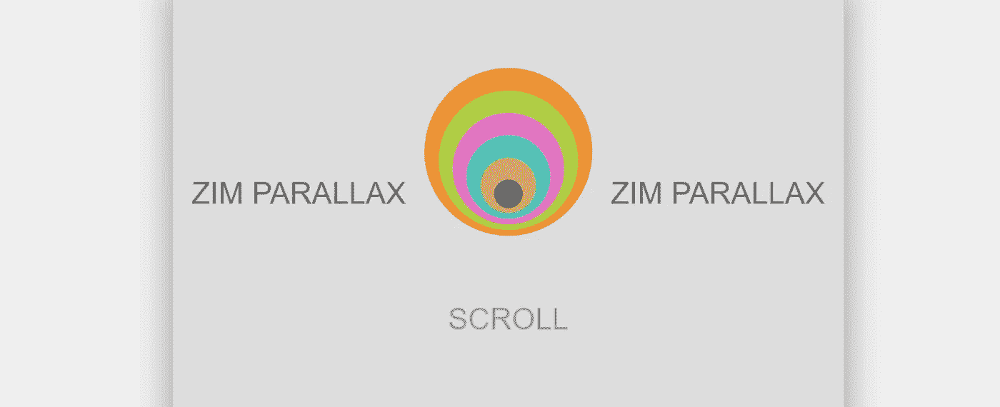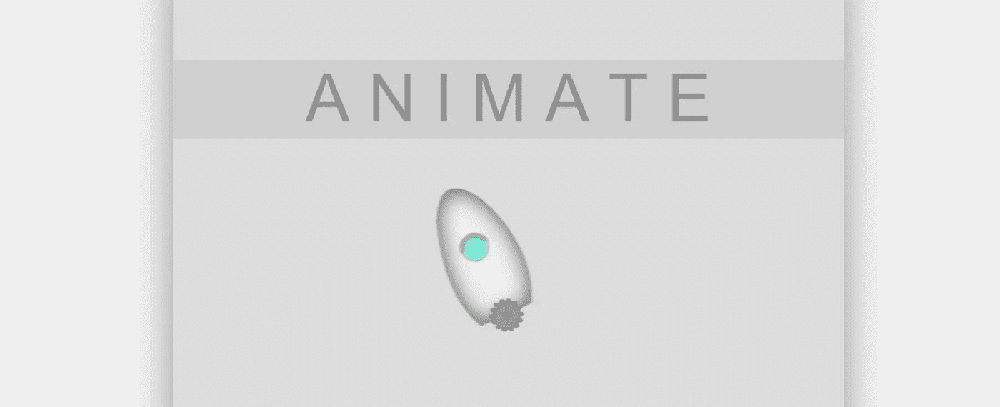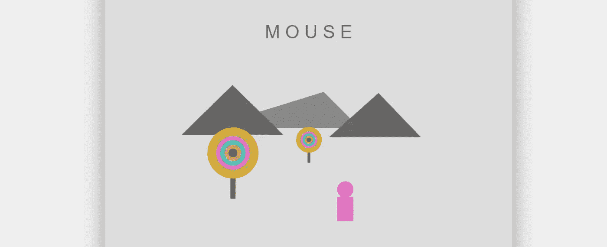

这里是一个展示 ZIM 虚拟现实的迷你网站，使用基于网页滚动播放的动画。

# 制作互动动画

利润被用来制作图像动画。精灵是由精灵片组成的，精灵片是一种图片，通常将动画的所有帧打包在一起以节省大小。

动画师将使用动画软件来制作帧，然后可以使用 [TexturePacker](https://www.codeandweb.com/texturepacker) 等工具将其导出并打包到一个页面中。还有一个[免费版](https://www.codeandweb.com/free-sprite-sheet-packer)。

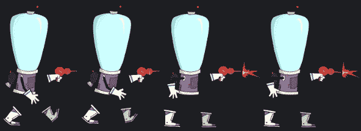

SpriteSheet 的一部分，用于制作 Sprite

下面是使用 [ZIM JavaScript 画布框架](https://zimjs.com)在 HTML 画布上制作动画精灵的 JavaScript 代码。

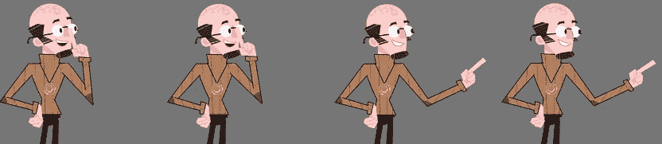

安东尼奥·卡吉亚诺为 ZIM 制作的精灵

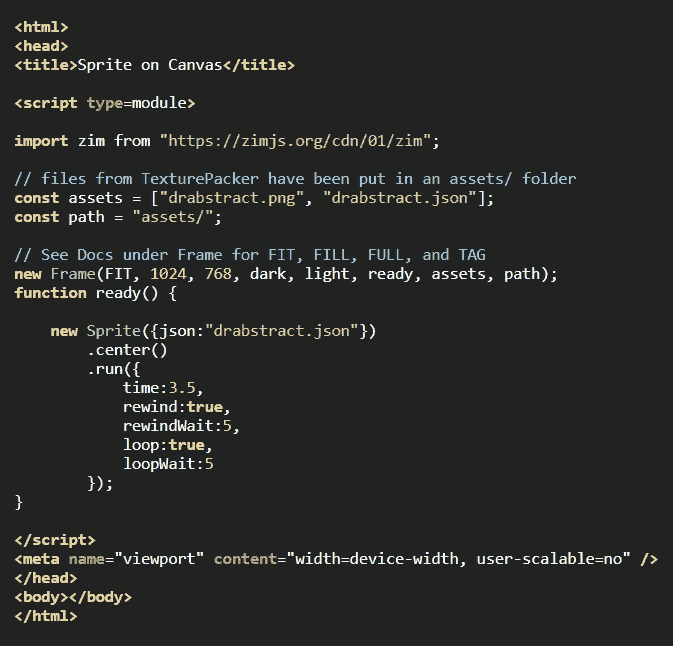

[代码可以在这里找到](https://zimjs.com/interactiveanimation.html)

上面我们把 SpriteSheet png 文件和 json 数据文件放在一个名为 assets/的文件夹中。您可以从 TexturePacker 下载 png 和 json 文件。[下面是一个使用默认 TexturePacker Sprite 的例子](https://zimjs.com/sprite)。你可以用 CTRL 或⌘ U 查看源代码。

> 这里有一个详细的[信息页面](https://zimjs.com/interactiveanimation.html)以及资产的 ZIP 文件和上面和下面的例子。

## 相互作用的

为了使精灵互动，ZIM 提供了以下功能:

*   **Sprite** —动画，通常以指定的速度运行
*   **发电机** —让精灵以不同的速度运行
*   **滚动条** —处理滚动背景
*   **加速器** —以百分比速度运行所有动画
*   **运动控制器** —用鼠标、按键或游戏手柄控制

这里有一个[互动动画场景](https://zimjs.com/ia/example.html)，可以用于艺术家安东尼奥的作品集。或者它可能是一个游戏的宣传片或网站横幅上的一个小特写。

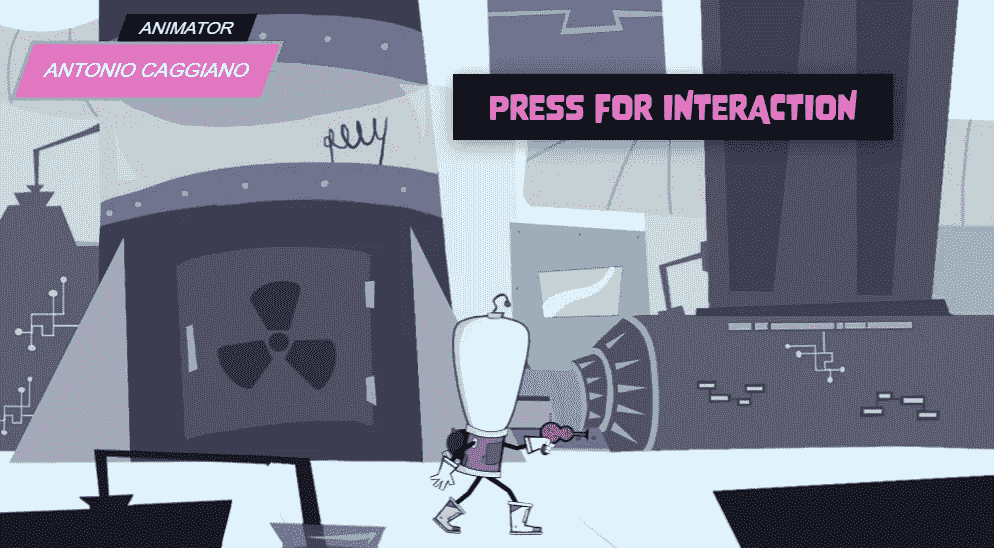

[https://zimjs.com/ia/example.html](https://zimjs.com/ia/example.html)

你可以移动鼠标到左边让太空人向左移动，或者移动到右边让他向右移动。越靠近中间，动画速度越慢。现场按会让太空佬开枪。因此，我们动画拍摄周期，而不是步行周期。背景部分和前景在视差中移动，整个场景由加速器上运行的运动控制器控制，因此是同步的。

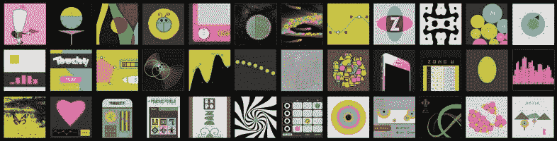

# 齐姆

ZIM 是一个制作互动媒体的免费 JavaScript 画布框架。在 Medium 上有一个 12 部分的指南:

◎ [你在画布上编写创意代码的指南](https://drabstract.medium.com/your-guide-to-coding-creativity-on-the-canvas-ada0996298f6)

ZIM 的目标是成为最完整而简单的画布框架。下面是一些[与其他框架](https://zimjs.com/zim/comparison.html)的对比。我们希望你喜欢制作互动动画。请加入我们关于[懈怠](https://zimjs.com/slack)或[不和谐](https://zimjs.com/discord)的讨论，我们很乐意帮忙。

抽象博士

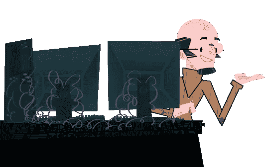

> *在推特上关注我们在* [*ZIM 学习*](https://twitter.com/zimlearn) *这里是在 YouTube 上学习* [*ZIM 学习*](https://www.youtube.com/zimlearn) *！*