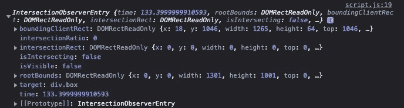
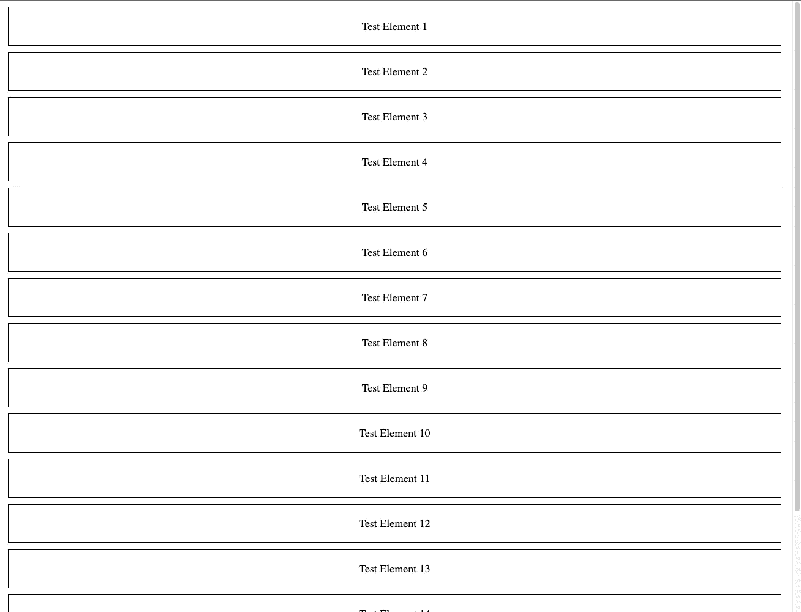
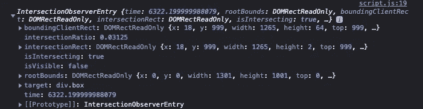

# 什么是交叉点观察器 API，它有什么用处？

> 原文：<https://levelup.gitconnected.com/what-is-intersection-observer-api-and-how-is-it-useful-1e91a14579df>


克里斯托夫·高尔在 [Unsplash](https://unsplash.com?utm_source=medium&utm_medium=referral) 上拍摄的照片

交叉点观察器 API 是一个浏览器 API，可用于观察和监听与视口相交的变化。例如，您可以使用这个 API 来检测某个元素何时出现在屏幕上，并在出现时对其进行处理。

该 API 的使用案例包括但不限于:

1.  无限滚动
2.  惰性装载
3.  平滑动画过渡

让我们从一个实现原始无限滚动的例子开始。我们这里有一个基本的 HTML:

这个 HTML 在容器中包含 16 个测试元素。这就是我们想要实现无限滚动的逻辑:当我们检测到倒数第二个元素从我们的视窗底部出现时，我们知道我们需要获取更多的内容来显示。在这个例子中，我们创建了更多的 div 元素来填充模拟内容(假设我们从一些 API 或数据库中获取内容)。

首先，让我们选择倒数第二个孩子和元素的容器(我们需要将新创建的元素添加到容器中)。

```
*let* secondLastChild = document.querySelectorAll(".box:nth-last-child(2)")[0];*let* boxes = document.querySelector(".boxes")
```

接下来，我们想要创建观察者对象。我们不需要导入任何东西，因为这是一个浏览器 API。

```
*let* observer = new *IntersectionObserver*((*entries*) *=>* {
    console.log(entries[0]);
}, {});observer.observe(secondLastChild)
```

我们来分解一下。这个 IntersectionObserver API 接受两个参数:一个回调函数和一个选项对象。让我们关注第一个参数，回调函数。这个回调函数将接收一个名为 entries 的参数，这是一个观察者条目的数组。

让我们打印出入口对象(我们的倒数第二个子对象)来看看里面是什么。



您可以探索所有的属性，但是我们在这里要关注的是“isIntersecting”和“target”。这个“isIntersecting”属性基本上指示所观察的条目当前是否在屏幕上可见。它当前被设置为假，因为测试元素 15 现在在视口之外。



当我们向下滚动，测试元素 15 出现在屏幕上时，观察者将再次被调用并打印出入口对象。



该对象现在将 isIntersecting 设置为 true。另一个有用的属性是 target，它将目标 HTML 元素存储在 entry 对象中。您可以使用此目标属性来操作元素的类或其他类。

让我们实现 JavaScript:

总结一下上面的脚本:

当我们检测到现有盒子列表的倒数第二个元素时，我们想要创建更多的盒子(现实世界中的内容)并添加到列表中。我们还希望观察新的倒数第二个子节点，以便当新的倒数第二个子节点出现在屏幕上时，它可以再次运行该函数。这是一个非常原始的实现，但是希望它足够简单，可以让你理解 API 的基本用例。

这是[代码笔](https://codepen.io/ohdylan/pen/ZExqKzx)演示:

您可以在 [MDN Web 文档中进一步了解实施和选项属性。](https://developer.mozilla.org/en-US/docs/Web/API/Intersection_Observer_API)(不是懒惰，而是决定让我的文章可读性强，容易理解)

好吧！文章到此为止。请关注我关于编程、开发人员生产力和更多主题的未来文章！干杯。

# 分级编码

感谢您成为我们社区的一员！在你离开之前:

*   👏为故事鼓掌，跟着作者走👉
*   📰查看更多内容请参见[升级编码刊物](https://levelup.gitconnected.com/?utm_source=pub&utm_medium=post)
*   🔔关注我们:[Twitter](https://twitter.com/gitconnected)|[LinkedIn](https://www.linkedin.com/company/gitconnected)|[时事通讯](https://newsletter.levelup.dev)

🚀👉 [**加入升级人才集体，找到一份神奇的工作**](https://jobs.levelup.dev/talent/welcome?referral=true)