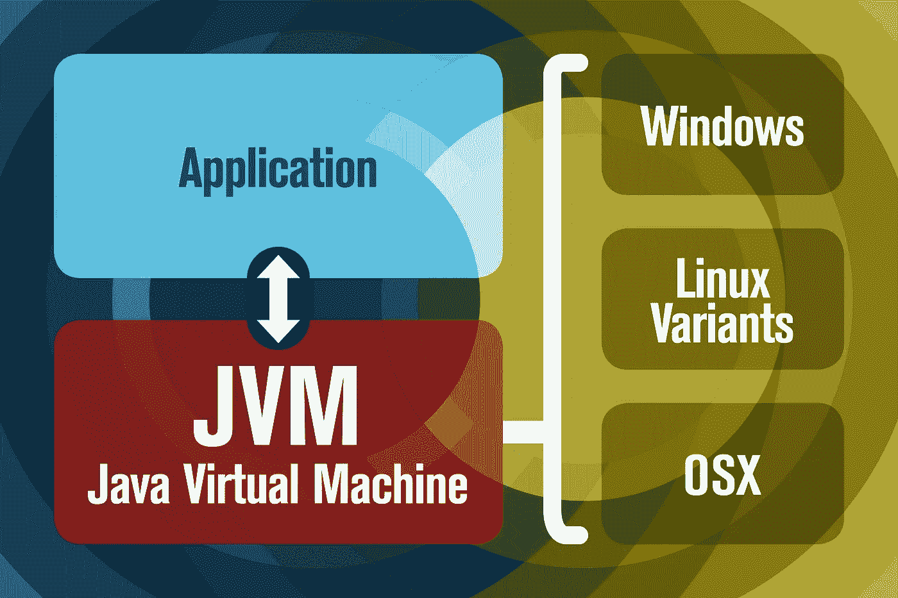

# Java 是什么？JDK、JRE 和 JVM。

> 原文：<https://levelup.gitconnected.com/what-is-java-the-jdk-jre-and-jvm-a16f490cc84b>

## 理解 java 工作原理的核心基础。

沙哈达特·拉赫曼在 [Unsplash](https://unsplash.com?utm_source=medium&utm_medium=referral) 上拍摄的照片

作为一名全栈软件开发人员，我参加了为期 12 周的培训计划。在培训过程中，我被问到了一些与 Java 和其他服务相关的基础和高级问题。难住我和我的一些同事的一个问题是，“什么是 Java？”。几乎每个在计算机科学相关领域工作过的人都知道 Java。有些人已经学会了如何使用与 Java 相关的编程语言。尽管 Java 在我的领域里是如此的普遍。我震惊地意识到我对这个问题只能给出一个肤浅的回答。所以，我做了些调查。

如果你问和 java 打过交道的人“java 是什么”？他们会告诉你类似这样的话，“Java 是一种高级的、基于类的、面向对象的编程语言”。如果你像我一样，你会认为这就是全部。事实上，Java 是一种用于创建应用程序的语言。但经过我的研究，我了解到这种解释是非常浅薄的。它没有公平对待 Java 的创造者们所取得的成就

如果你曾经上过计算机科学课程或者参加过面试。您很可能听说过 JDK、JRE 和 JVM。这三个工具几乎可以在每台运行 Java 的机器上找到。它们允许您创建、编译和运行您的 java 应用程序。如果你想了解什么是 Java。您需要了解这些工具如何有助于创建您的应用程序。

# JDK

让我们从 JDK 开始。JDK 代表 Java 开发工具包。顾名思义，JDK 提供了创建 java 应用程序所需的工具。它获取 java 源代码，并将其转换成 JRE 和 JVM 可以理解的格式。它带有调试器，当我们试图编译代码时，它会通知我们错误。以及编译器本身，它将我们的代码转换成 JRE 和 JVM 可以理解的格式。

# JRE

接下来，我们有 JRE。JRE 代表 Java 运行时环境。JRE 赋予我们的机器运行 java 程序的能力。它包括为我们的 java 应用程序提供某些功能的库。比如存储和管理数据的 JDBC。JRE 还附带了 Java 启动器和 JVM。Java 启动器允许我们将 Java 应用程序与 JVM 一起运行。

# JVM

最后，我们有 JVM。JVM 代表 Java 虚拟机。但在继续前进之前。理解其他传统的计算机编程语言是如何工作的很重要。这将帮助我们更好地理解 JVM 是如何工作的。让我们以流行的面向对象编程语言 C++为例。当你试图运行一个 C++程序时，它使用 C++编译器。然后这个编译器将你的 C++代码转换成你的处理器可以理解的格式。例如，如果您要在 intel 机器上运行 C++代码。编译器会以英特尔机器可以理解的格式输出你的代码。它会在你使用的任何机器上重复这个过程。比如 PowerPC 和 Mac，或者 Linux 和 AMD

# 了解 JVM

图片来源:JavaWorld

这是因为大多数处理器不共享一个公共的机器代码。机器代码用于控制计算机的中央处理器或 CPU。如果你有英特尔机器的机器代码，然后给 AMD 机器同样的指令。它不知道该拿它们怎么办。C++今天在后台为你做了这些。在 C++、Java 和其他现代高级语言之前。个人或公司会购买许多编译器在不同的机器上运行相同的代码。这有时会造成兼容性问题，而且编译器并不便宜。Java 试图使用 JVM 来解决这个问题。JVM 驻留在你的 RAM 中([为什么 RAM 如此重要？(reference.com)](https://www.reference.com/world-view/ram-important-9c91f15ab155f890)，它获取 Java 编译器创建的代码，对其进行处理，并将其转换为适当的机器代码。这个过程消除了对许多编译器的需求。

C++和 Java 的区别在于。不像 C++那样直接给你的处理器指令。Java 必须通过 JVM，然后到达处理器。这个过程在过去会使 Java 比 C++慢，因为 Java 需要一个额外的步骤来运行相同的代码。今天，凭借我们计算机的能力和速度，这种速度差距在很大程度上已经无关紧要了。

这是 JDK、JRE 和 JVM 的基础。如果你想进一步解释，或视频格式来听。这里有一些帮助我理解这些概念的链接。你也可以在文章中留下评论，我会尽我所能做出回应。还有，期待以后有更多这样的文章。请留意未来这些概念的视频格式。

祝您愉快！

[什么是 Java？— Java 编程教程— YouTube](https://www.youtube.com/watch?v=2Xa3Y4xz8_s&t=3s)

[JDK、JRE、JVM:他们是什么，他们的区别是什么？— YouTube](https://www.youtube.com/watch?v=BXFHuaQNnLo)