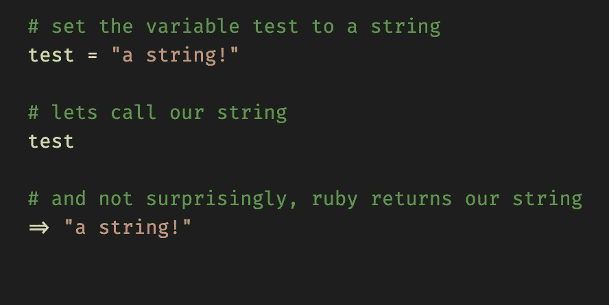
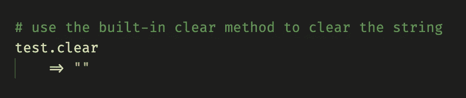
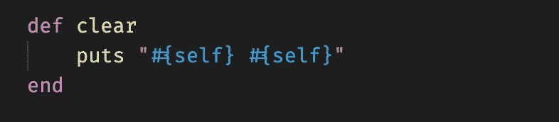
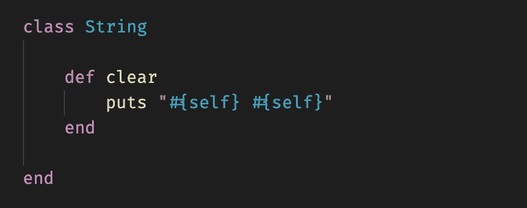
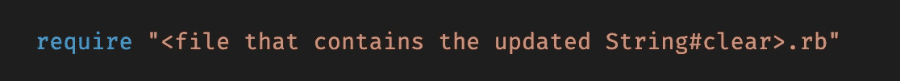
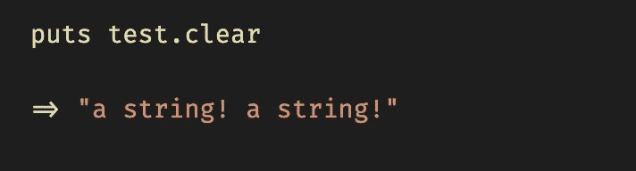
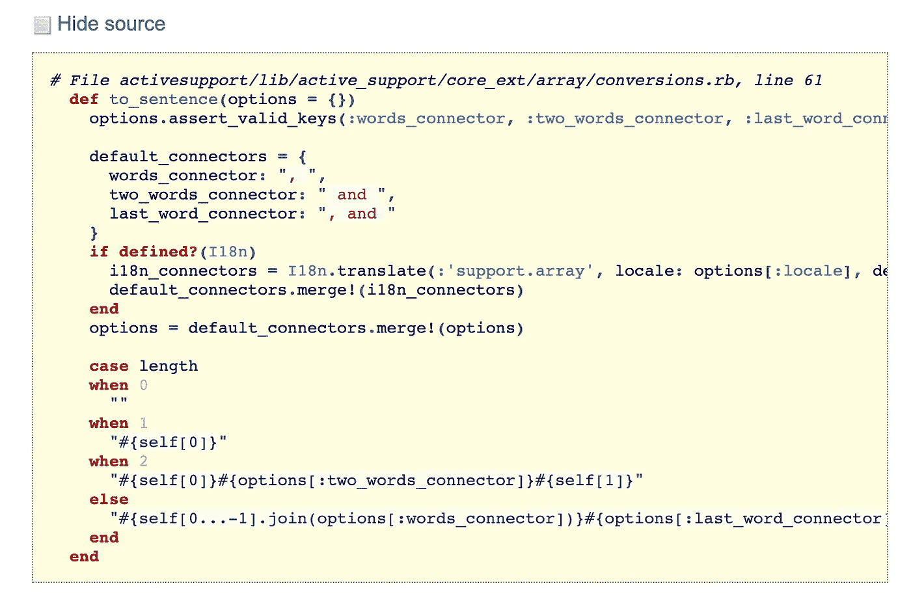

# Ruby 中的 Monkey 补丁简介

> 原文：<https://levelup.gitconnected.com/what-is-monkey-patching-a4fd58bb8d39>

[Monkey Patching](https://en.wikipedia.org/wiki/Monkey_patch) 包括“在运行时对类或模块的动态修改，其动机是修补现有的第三方代码，作为对未按预期运行的 bug 或功能的变通办法”，因此，Monkey 补丁不会改变软件本身，而只会改变运行时的本地副本。

在日常生活中，monkey patching 会在运行时改变类方法(内置的或用户创建的)的行为。对于刚开始学习编程的人来说，这似乎需要消化很多东西，但事实并非如此(我保证)！

Ruby 中的每个类都有自己的内置方法列表。例如，一个字符串有一个完整的方法列表:包括#reverse，它将反转字符串的顺序，#count，它将计算字符串中有多少个字符，#empty？它会通过返回 true 或 false 来告诉你字符串是否为空，等等…

您明白了 Ruby 有许多内置方法。我们试着用猴子修补这些内置的字符串方法之一，来展示猴子修补实际上是多么简单和强大，怎么样？让我们先回顾一下我们所知道的:

很简单的东西，对吧？现在让我们调用#clear 函数…

正如预期的那样，字符串被清除，*测试*现在包含一个空字符串。但是如果我们可以改变 String#clear 方法的工作方式会怎么样呢？让它打印一个重复的新字符串，而不是清除数组。

现在，我们如何让 string 类访问这个新的 String#clear 方法呢？你可能认为我们可能需要花大量的时间来整理你系统上的 Ruby 库，并改变这个方法，对吗？不对！

我们只需要创建一个新的 String 类并放入我们的方法。

这个新的 String#clear 方法将覆盖我们系统上现有的内置于 Ruby 中的 String#clear 方法，只要它包含在我们当前正在进行的项目中。

这意味着这不是一个会影响我们任何其他项目的永久更改——只有当文件包含在 Ruby 项目中时，通过显式编写以下内容，它才可用:

我们现在已经有了新的 String#clear 方法，让我们试一试。

#clear 方法不再执行其默认行为。很神奇，是吧？您不仅可以更改现有方法的行为，还可以创建自己的方法在类上执行。

例如，Rails 有一个 array 方法，它扩展了 array 类，将一个数组转换成一个句子( [Array#to_sentence](https://apidock.com/rails/Array/to_sentence) )。如果您真的想使用这种方法，但不一定需要 Rails 提供的其余部分，该怎么办？

只需从 Rails 文档中复制该方法的源代码，将其放入一个数组类中，就像我们对上面的 String 类所做的那样，瞧！

数组#to_sentence 的来源来自 apidock.com

综上所述，monkey patching 是我们很少使用或手动实现的东西(Rails monkey 为我们将方法修补到默认的 Ruby 库中)。在一些语言中，也就是 Python，非常不鼓励猴子打补丁。Ruby 似乎比其他人更喜欢它，但是你应该知道它也有自己的缺陷。

改变方法的默认行为会产生意想不到的难以解决的错误。改变一个内置的 Ruby 方法的行为(即使是很小的改变)都会产生灾难性的结果，尤其是在团队开发的时候。

想象一下，如果在一个基于 1 的系统中使用 Array#count enumerate，而不是默认的基于 0 的系统，其他开发人员会遇到什么样的错误。一个可笑的例子，但你明白了。

在某些情况下，尽管它可能是最干净的选择，或者是对尚未被该框架的开发者更新的错误的临时修复，但它不应该是你对一个棘手问题的修复；这是一个你可以随意使用的工具，但是应该谨慎使用。

引用[菲利普·布朗](https://culttt.com/2015/06/17/what-is-monkey-patching-in-ruby/)的博客帖子帮助我更好地理解了这个概念，“Ruby 就像一把锋利的刀，它可以非常有效，但如果你割伤了自己，那通常是你自己的错。”