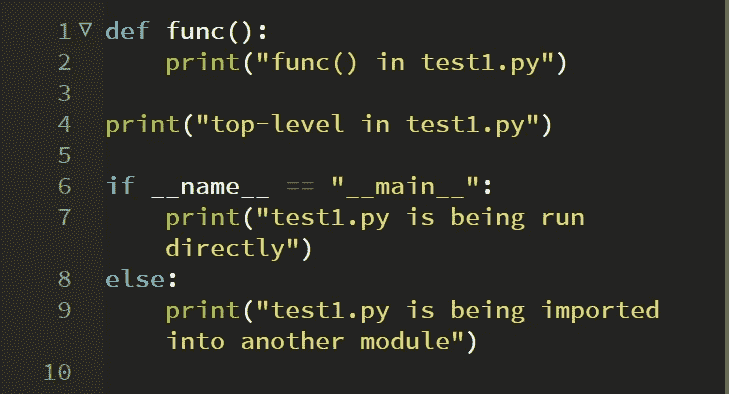
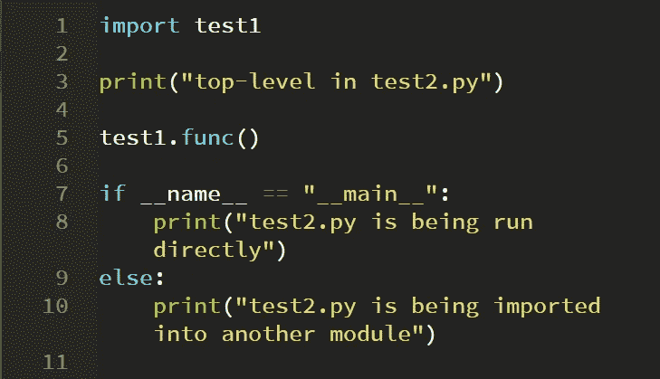
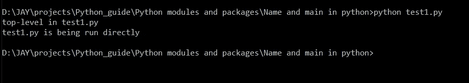
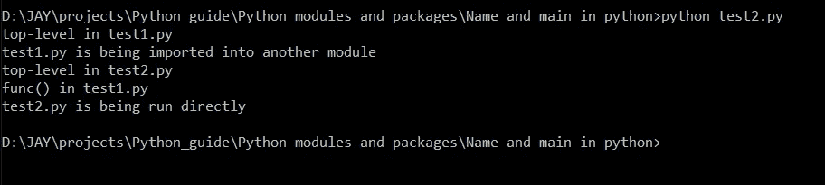

# Python 中的“__name__”和“__main__”是什么？

> 原文：<https://levelup.gitconnected.com/what-is-name-and-main-in-python-354375d9a480>

## 揭开 Python 代码 __name__ 和 __main__ 背后奥秘的指南

这行代码是什么意思？

> if __name__ == "__main__ ":

这一行代码背后的整个思想是，当你从一个模块导入时，你想知道一个模块的函数是否被用作导入，或者你是否使用原始的函数。py”文件。在这种情况下，我们使用上面的行。

通过将脚本作为命令传递给 Python 解释器来运行脚本时:

> python myscript.py

缩进级别为 0 的所有代码都会被执行。定义了函数和类，但是它们的代码都没有运行。与其他语言不同，没有自动运行的 main()函数——main()函数隐含了顶层的所有代码。

__name__ 是一个内置变量，其计算结果为当前模块的名称。根据我们运行实际脚本的方式，这个变量被赋予一个字符串。

如果模块是直接运行的(如上面的 myscript.py 所示)，则 __name__ 改为设置为字符串“__main__”。因此，您可以通过测试来测试您的脚本是直接运行还是由其他东西导入

`if __name__ == “__main__”:`

如果代码被导入到另一个模块中，那么各种函数和类的定义都会被导入，但是 main()代码不会运行。

为了更好地理解它，创建两个 python 文件“test1.py”和“test2.py”。在 test1 中，我们定义了一个函数，在 test2 中，我们导入了 tes1 脚本。

test1.py(来源:作者)

test2.py(来源:作者)

现在，当我们直接从命令行运行 test1 脚本时，我们得到下面的输出，从中我们可以看出，当我们直接运行脚本时 __name__ 被分配了字符串 __main__。

test1.py 输出(来源:作者)

现在，当我们运行 test2 脚本时，test1 脚本通过导入它而被间接调用，因此“else”语句运行并显示它正被导入到另一个模块中。然而，test2 脚本是直接运行的，所以它打印的是直接运行的。

test2.py 输出(来源:作者)

## 学习 Python 可以参考的入门书籍:

 [## Python 速成班，第二版:基于项目的编程入门实践

### 世界上最畅销的 Python 书籍的第二版。一个快速的，没有废话的 Python 编程指南…](https://amzn.to/3yDY4To)  [## 艰难地学习 Python:一个非常简单的介绍可怕的美丽世界…

### 你会学习 Python！Zed Shaw 完善了世界上最好的学习 Python 的系统。遵循它，你会…](https://amzn.to/3vtvQZv)  [## 思考 Python，2e:如何像计算机科学家一样思考

### 思考 Python，2e:如何像计算机科学家一样思考](https://amzn.to/3urluYI) 

## 学习 Python 可以参考的高级书籍:

 [## 编程 Python:强大的面向对象编程

### 如果你已经掌握了 Python 的基础，你就可以开始使用它来完成真正的工作了。编程 Python 将…](https://amzn.to/3fMzVBn)  [## 高级 Python 编程:使用以下工具构建高性能、并发和多线程应用

### 关键特性使用 Dask 和 PySpark Master 技能在集群上设置和运行分布式算法，以准确地…](https://amzn.to/34oFFMl) 

> 联系我: [LinkedIn](https://www.linkedin.com/in/jayashree-domala8/)
> 
> 看看我的其他作品: [GitHub](https://github.com/jayashree8)