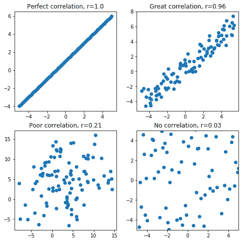
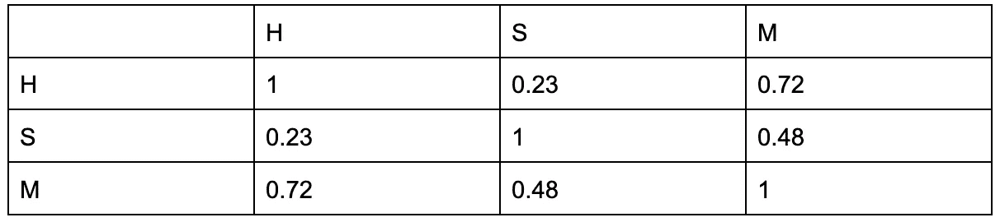

# Python 中的 NumPy 关联是什么&如何创建关联矩阵？

> 原文：<https://levelup.gitconnected.com/what-is-numpy-correlation-in-python-how-to-create-a-correlation-matrix-d062cc7deda4>

# 介绍

Python 编程在过去几年变得非常流行。它使复杂的任务变得相当容易完成。其快速增长的需求背后的一个原因是它比大多数其他编程语言更容易学习和实现。

Python 编程的流行在很大程度上可以归功于为这种多功能编程语言添加了内置功能的多个库。Python 编程中的一个这样的库是 NumPy。NumPy 是一个用于在 Python 中进行复杂数学运算的库。

让我们在下一节中详细了解一下。除此之外，在接下来的章节中，我们还将尝试使用 Python 中的 NumPy 来处理相关性，这是一种数学运算。

# Python 中的 NumPy 是什么？

Python 的开发目的并不是为了进行科学计算。在早期，由 Python 程序员吉多·范·罗苏姆组成的团队设计了一个数组计算包。Rossum 扩展了这个包，加入了 Python 编程语法。

这就是科学计算和 Python 编程第一次找到融合点的原因。随着时间的推移，Python 已经发展成为驱动复杂科学数学计算的领先工具。

Python 编程领域的这种进步是在多个库的帮助下实现的，这些库为轻松执行复杂的数学计算提供了支持。

[NumPy](/getting-started-with-numpy-learn-the-basics-in-minutes-5f896074e13f) 就是这样一个由 Python 编程语言支持的库。NumPy 是作为 SciPy 项目的一部分由 Travis Oliphant 开发的。

NumPy 用于处理多维矩阵或数组，并对它们执行复杂的数学运算。NumPy 的一些主要特性可以列举如下:

1.  NumPy 由于其简化和可读的语法，使用和学习起来既快又容易。
2.  NumPy 支持对于轻松执行多维数组计算非常有效。
3.  NumPy 附带了极其强大的数值计算工具，例如高度复杂的数学函数、随机数生成、傅立叶变换、线性代数例程等。
4.  NumPy 是可互操作的，也就是说，它兼容广泛的硬件选项，并且可以跨多个计算平台很好地工作。
5.  NumPy 是一个开源工具，让外面的每个人都可以轻松访问它。

NumPy 可以用来完成复杂的任务，但是这并不意味着它不能用来完成简单的任务。

让我们看一些这样的例子，以便更好地理解如何用 Python 编程实现 NumPy。

**例 1** :基本数组生成

**代码:**

> **> > >** 导入 numpy 作为 np
> 
> **>>>**arr = NP . array([1，2，3，4，5])
> 
> **> > >** 打印(arr)

**输出:**

> [1, 2, 3, 4, 5]

**说明**:

1.  NumPy 是以别名“np”导入的
2.  然后使用“array()”方法创建一个名为“arr”的包含 5 个数字的一维数组。

**例 2** :生成 0-50 范围内的随机整数

**代码**:

> **> > >** 从 numpy 随机导入
> 
> **>>>**num = random . randint(50)
> 
> **> > >** 打印(数字)

**输出**:

27

**解释:**

1.  从 NumPy 库中导入“随机”模块。
2.  然后，使用“randint()”方法生成一个范围在 0 到 50 之间的随机整数，该整数存储在变量 num 中，稍后打印。

# 什么是相关性？

[相关性](/pearson-coefficient-of-correlation-using-pandas-ca68ce678c04)是一种统计数据，用于量化两个变量之间的关系，例如，它们是如何线性相关的。

相关性是进行预测的一个重要量，因为它探索了两个实体之间的关系。

计算两个变量之间相关性的一种方法是借助皮尔逊相关系数(表示为“r”)。

这个系数(r)的数值介于-1 和 1 之间。根据这个值，可以推断出各个变量是如何相互关联的。

**如果值为**

1.  -1，它表示变量之间完全负相关
2.  在-1 和 0 之间，它表示变量之间的负相关
3.  0，它表示变量之间没有相关性
4.  在 0 和 1 之间，它表示变量之间的正相关
5.  1，它代表变量之间完全正相关。

当远离 0 向-1 或 1 移动时，变量之间的关系更强。

我们也可以用散点图来确定两个变量之间的相关性。

作为参考，当使用散点图绘制两个变量之间的关系时，正相关、负相关和无相关可能表示如下。

[图像来源](https://codingwithmax.com/)

让我们在 Python 中 NumPy 库的帮助下更仔细地看看相关性是如何工作的。

# 什么是相关矩阵？

相关矩阵是不同变量之间相关系数值的表格表示。相关矩阵中的每个单元格都包含两个变量之间的相关性。

相关矩阵也称为方差-协方差矩阵、自协方差矩阵或离散矩阵。让我们看一个相关矩阵的例子。在下面的相关矩阵中，我们将探讨三个变量之间的相关性:

*   学习时间(H)，
*   睡眠时间，以及，
*   一组学生获得的分数(M)。

从上面的相关矩阵中，可以推导出:

1.  花在学习上的时间(H)和花在睡觉上的时间(S)之间的相关性是 0.23，这表明与其他变量之间的关系相比，这两个变量之间的关系并不密切。它们彼此之间没有太大的影响，尽管它们可能会有轻微的影响，因为这是一种微弱的正相关。
2.  学习时间(H)与获得的分数(M)之间的相关系数为 0.72，显示出比其他变量之间更强的正相关。这意味着它们实际上是紧密相连或相互关联的。因为该值为正，所以一个值的增加代表另一个值的增加。
3.  睡眠时间(S)与得分(M)之间的相关系数比 H 与 S 之间的相关系数更正，但比 H 与 M 之间的相关系数小
4.  这意味着 S 和 M 相互影响，但不如 H 影响 M 那样强烈(反之亦然)，但仍强于 H 影响 S 的程度(反之亦然)。该值为正值意味着睡眠时间的增加也会导致分数的增加，但仍低于学习时间的增加对分数的增加。

# 如何在 Python 中使用 NumPy 创建关联矩阵？

Python 编程中借助 NumPy 库创建相关矩阵的主要步骤如下:

1.  首先，我们需要导入所需的库。对于这个例子，我们将导入 NumPy 库。Python 中也有一些其他的库可以用来计算相关矩阵，比如 pandas。然而，在本文中，我们将只使用 NumPy 示例。
2.  接下来，我们需要定义两个数组，这两个数组包含要计算相关性的变量的数据。
3.  借助 NumPy 中的 corrcoef()方法，我们将提取步骤 2 中定义的变量之间的最终相关矩阵。

现在让我们看一下作为 Python 编程的一部分，使用 NumPy 库计算相关矩阵的相关示例。

## **例 1:** 让我们为头发长度(以厘米为单位)和每月使用的洗发水数量(以毫升为单位)之间的关系创建一个相关矩阵

**涉及步骤:**

**1-** 首先，我们将导入必要的库来执行所需的操作。这里，NumPy 是在以下命令的帮助下导入的:

> **导入 numpy 作为 np**

**2-** 接下来，让我们将两个[数组变量](https://www.scaler.com/topics/array-in-python/)定义为 L，用于存储以厘米为单位的头发长度数据，S，用于存储以毫升为单位的每月使用多少洗发水的数据。我们可以使用以下命令来实现这一点:

*   **L = [10，12，15，20，14，28，49，35，16，27，40]**
*   **S = [30，36，33，41，34，50，75，63，36，43，73]**

**3-** 最后，我们将使用 corrcoef()方法获得变量 L 和 S 之间存在的相关性的相关矩阵，如上所述。这可以通过以下方式实现:

*   **corr_mat = np.corrcoef(L，S)**

**4** 。打印使用以下命令获得的结果矩阵:

> 打印(更正 _ 材料)

**完成代码:**

> 将 numpy 作为 np 导入
> 
> L = [十，十二，二十，十四，二十八，四十九，三十五，十六，二十七，四十]
> 
> S = [30，36，41，34，50，75，63，36，43，73]
> 
> corr_mat = np.corrcoef(L，S)
> 
> 打印(更正 _ 材料)

**输出:**

> [[1\. 0.97364586]
> 
> [0.97364586 1\. ]]

**解释**:

在这种情况下，我们可以看到上面的相关矩阵，变量 L 和 S 之间具有非常高的正相关系数值(~0.97)，这表明随着 L 或头发长度的增加，S 或每月使用的洗发水量也会增加。

## 例 2:让我们用 NumPy 库的“随机”模块找出两个随机向量之间的相关矩阵

**涉及的步骤:**

**1。首先，和以前一样，我们将简单地使用“np”作为别名来导入 NumPy。这是导入 NumPy 的最标准方式。如果需要，可以改变所使用的别名；但是，建议使用“np”。该命令如下所示:**

> **导入 numpy 为** **np**

**2。**接下来，我们需要定义要比较的两个变量。在这种情况下，变量是负相关的两个随机生成的向量(vect_a 和 vect_b)。为了达到同样的目的，我们可以写下面的语句:

*   **vect_a = np.random.randint(0，100，500)**
*   **vect _ b =(100-vect _ a)+NP . random . randint(0，50，500)**

**3。**然后，我们将使用“corrcoef()”方法确定“vect_a”和“vect_b”之间的相关矩阵。同样的命令如下:

*   **corr _ mat = NP . corrcoef(vect _ a，vect_b)**

**4。**最后，我们将使用 Python 编程中的“print”命令打印上一步获得的结果。

> 打印(更正 _ 材料)

**完成代码:**

> 将 numpy 作为 np 导入
> 
> vect_a = np.random.randint(0，100，500)
> 
> vect _ b =(100-vect _ a)+NP . random . randint(0，50，500)
> 
> corr_mat = np.corrcoef(vect_a，vect_b)
> 
> 打印(更正 _ 材料)

**输出:**

> [[ 1\. -0.89891262]
> 
> [-0.89891262 1\. ]]

**解说:**

这里，得到的相关系数(~ -0.899)为负。这意味着随机生成的两个向量(vect_a 和 vect_b)是负相关的。

这仅仅表明 vect_a 值的减小可能导致 vect_b 值的增加，由于该值非常接近-1，这表示两个变量之间有很强的关系或相关性。

# 结论

在本文中，我们看了一下 Python 编程对于科学计算应用程序已经变得多么重要。我们研究了 Python 编程如何发展成为复杂数学运算(如多维矩阵计算)的首选编程语言。

除此之外，我们还学习了 Python 编程中使用的 NumPy 库，它被广泛用于处理这种计算。更具体地说，我们探索了统计运算相关性的基础，并详细了解了相关矩阵。

最后，在 NumPy 和 Python 编程的帮助下，我们实现了我们所学到的相关性。在多个方面，我们研究了相关的例子，以便更全面地理解 Python 编程中的 NumPy 相关性。

本文的目的是简要介绍 Python 编程如何为轻松完成复杂的数学任务定下基调。研究 NumPy 类似于研究 Python 支持的许多其他库。

因此，人们可以容易地熟悉各种其他库来执行计算相关矩阵的相同任务或一些其他任务。这就把我们带到了文章的结尾。

编程快乐！

# 分级编码

感谢您成为我们社区的一员！在你离开之前:

*   👏为故事鼓掌，跟着作者走👉
*   📰查看更多内容请参见[升级编码刊物](https://levelup.gitconnected.com/?utm_source=pub&utm_medium=post)
*   🔔关注我们:[Twitter](https://twitter.com/gitconnected)|[LinkedIn](https://www.linkedin.com/company/gitconnected)|[时事通讯](https://newsletter.levelup.dev)

🚀👉 [**加入升级人才集体，找到一份神奇的工作**](https://jobs.levelup.dev/talent/welcome?referral=true)