# 什么是 OAuth，OAuth 是如何工作的

> 原文：<https://levelup.gitconnected.com/what-is-oauth-and-how-does-oauth-work-742bb923c91f>

## OAuth 2.0 的解释

迈克尔·沙孔在 [Unsplash](https://unsplash.com?utm_source=medium&utm_medium=referral) 上的照片

# 正常登录流程

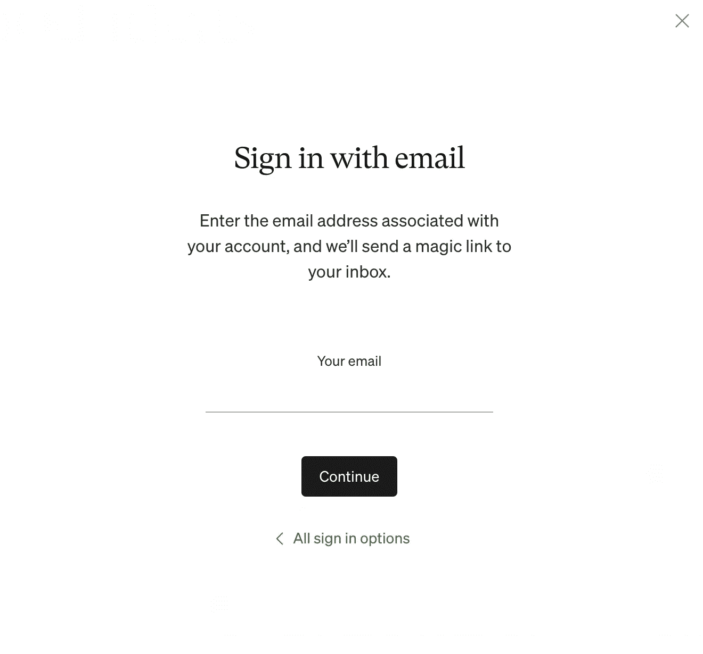

登录网站最简单的方法是输入帐户名和相应的密码。然后，服务器获取这些信息，并在数据库中查找与给定 ID 和 PW 匹配的信息。如果所有给定的信息都与数据库中的凭证信息匹配，服务器将返回 200，即 4xx，5xx。很简单也很容易。因为连接是在最终用户和服务器之间。

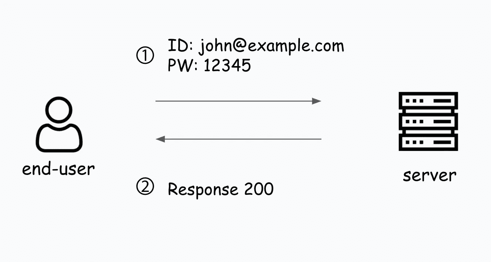

然而，你应该怎么做才能让用户阅读并带来他们的 Google 日历日程呢？当然，最简单的方法是询问他们的谷歌登录信息。但这是一种非常危险的方式，也不推荐使用。

这是 OAuth 进来的时候。

# OAuth 是什么？

根据[搜索架构](https://searchapparchitecture.techtarget.com/definition/OAuth#:~:text=OAuth%20(Open%20Authorization)%20is%20an,based%20authorization%20on%20the%20internet.&text=It%20acts%20as%20an%20intermediary,account%20information%20to%20be%20shared.)，他们对 OAuth 的描述如下。

> OAuth(开放授权)是一个开放的标准授权框架，用于互联网上基于令牌的授权。OAuth 发音为“oh-auth”，它允许第三方服务(如脸书和谷歌)使用最终用户的帐户信息，而不会将用户的帐户凭据暴露给第三方。

简单地说，OAuth 使用户可以使用第三方服务的功能成为可能。例如，当用户登录到 Medium 并试图带来在 Google Calander 中注册的事件时，用户被要求登录到 Google，而不是在 Medium 中。登录成功后，用户现在就可以获得时间表。这就是 OAuth。

# 条款

由于 OAuth 的术语和概念在任何服务中都是相同的，为了支持 OAuth 2.0，我们需要检查在 OAuth 2.0 规范 [RFC-6749](https://tools.ietf.org/html/rfc6749#section-1.1) 中使用的正确术语。

👇下面的特性显示了我将在这篇文章中解释 OAuth 如何工作时使用的图标。

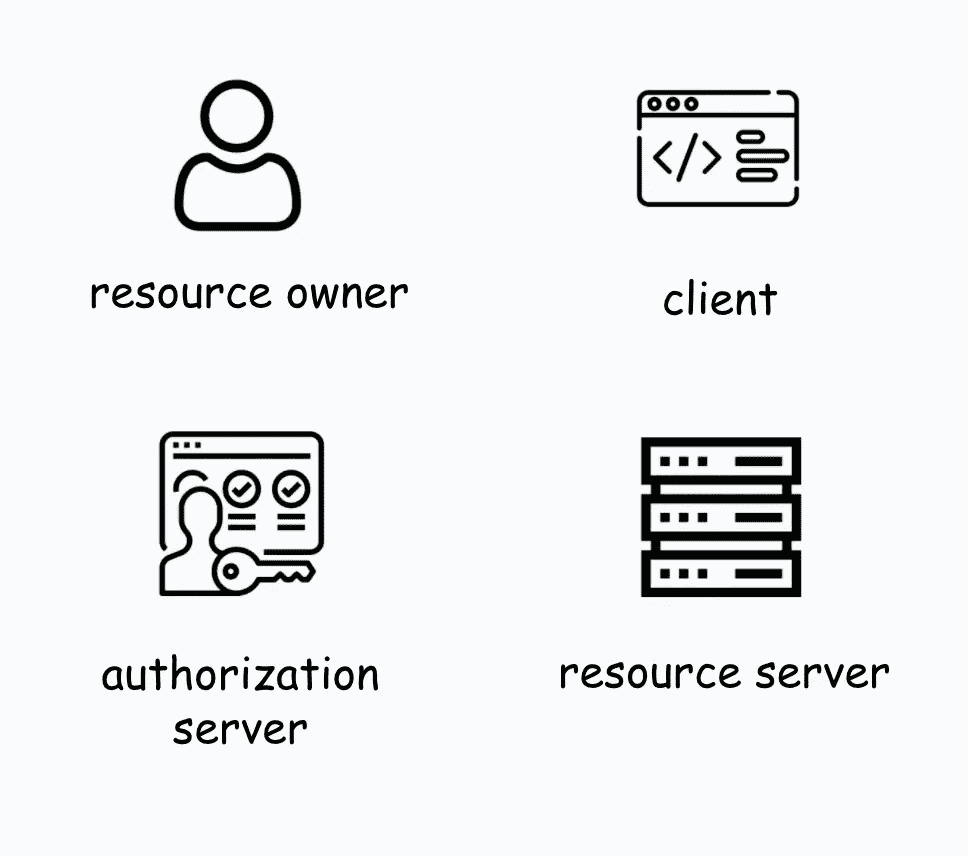

*   资源所有者:通常是拥有使用所提供的服务所需的信息(包括登录信息)的人，例如使用该服务的任何用户。
*   客户端:提供受保护资源的应用程序，例如图像、内容或类似的东西，例如，在前面的示例中，Medium 是客户端。
*   资源服务器:托管资源的服务器。它可能是给你日历资源的谷歌服务器。
*   授权服务器:服务器为客户机提供一个访问令牌，这是使用更多 API 所必需的。

# OAuth 如何工作

你想用你的 Twitter ID 登录到 Medium，但是你并不真的想创建一个新账户。工作太多了，不是吗？

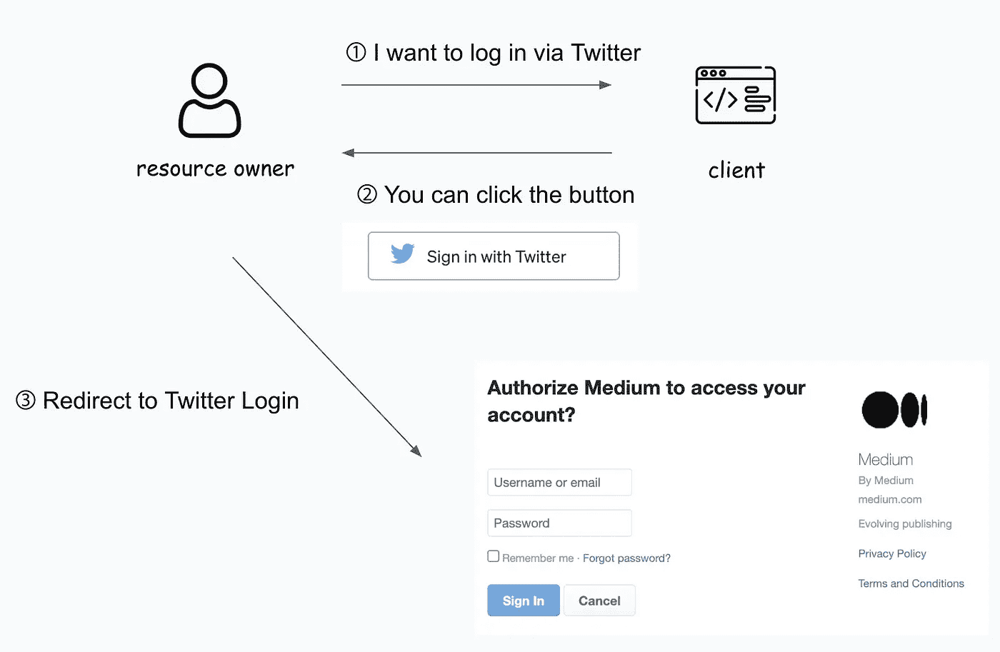

假设用户，即资源所有者，想要通过 Twitter 登录。然后大图会被视为上图。客户机，即您的应用程序，向资源所有者显示一个登录按钮。然后，资源所有者可以在单击该按钮后看到登录页面。

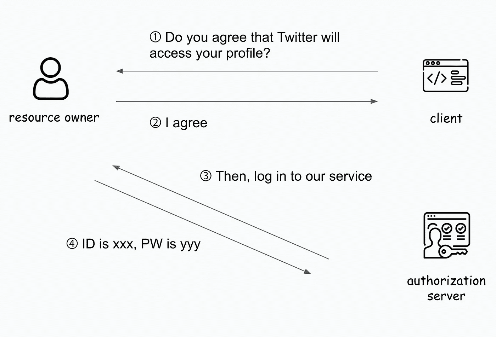

当资源所有者试图登录时，客户端必须询问资源所有者是否授权第三方服务可以访问照片、个人资料或类似的内容。如果资源所有者同意这一点，授权服务器会要求他们提供凭证，比如他们的帐户名和密码。

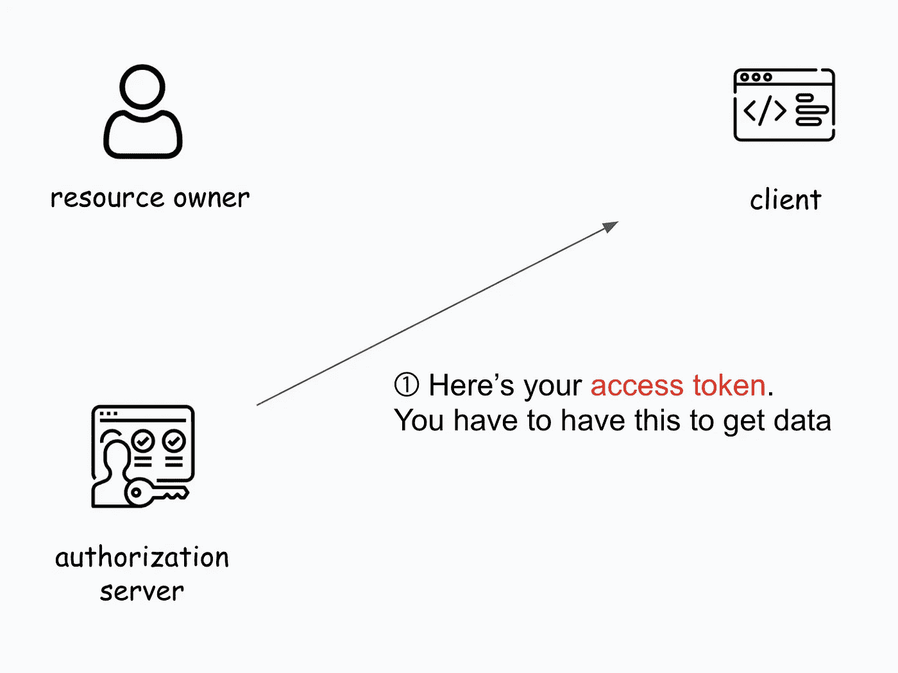

一旦资源所有者成功登录，授权服务器就向客户机返回一个访问令牌。这是获取 Twitter 中其他 API 所必需的(例如)。

大多数情况下，访问令牌都有一个过期时间(也许我可以称之为 TTL？)通常少于 60 分钟。一旦过期，客户端可以使用另一个名为刷新令牌的令牌获得新的访问令牌。当然，这个刷新令牌也有一天会过期，然后客户端必须采取相同的步骤，向资源所有者询问登录信息等等，以获得新的访问令牌。

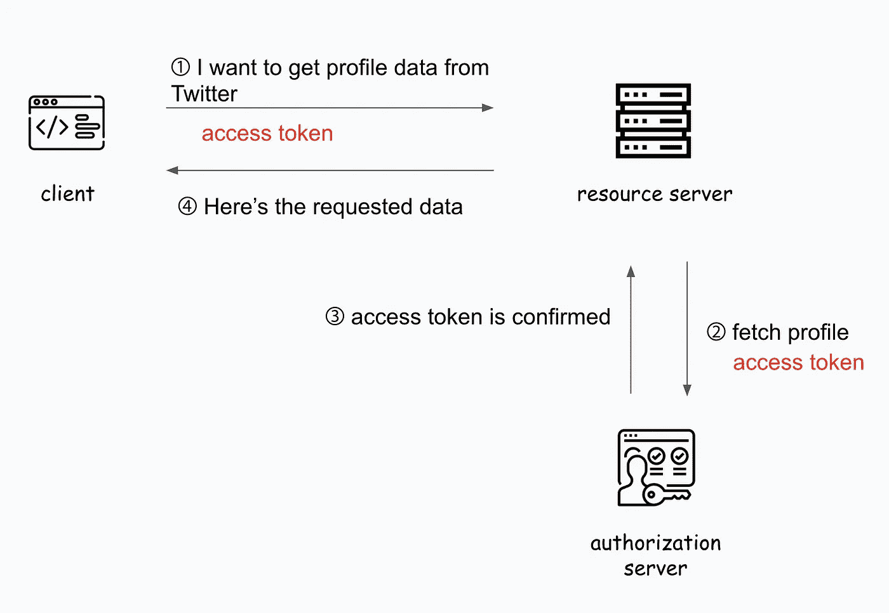

有了给定的访问令牌，客户机通过在头中发送访问令牌来获取 Twitter 的 API。然后，资源服务器要求授权服务器检查该访问令牌对于该用户是否有效。一旦授权服务器对资源服务器说“是的，没问题”，它就将请求的数据返回给客户机。

# 稍微深入一点

让我们深入了解这种流动是如何工作的。要获取访问令牌，您应该提前在第三方服务中注册您想要使用的应用程序。

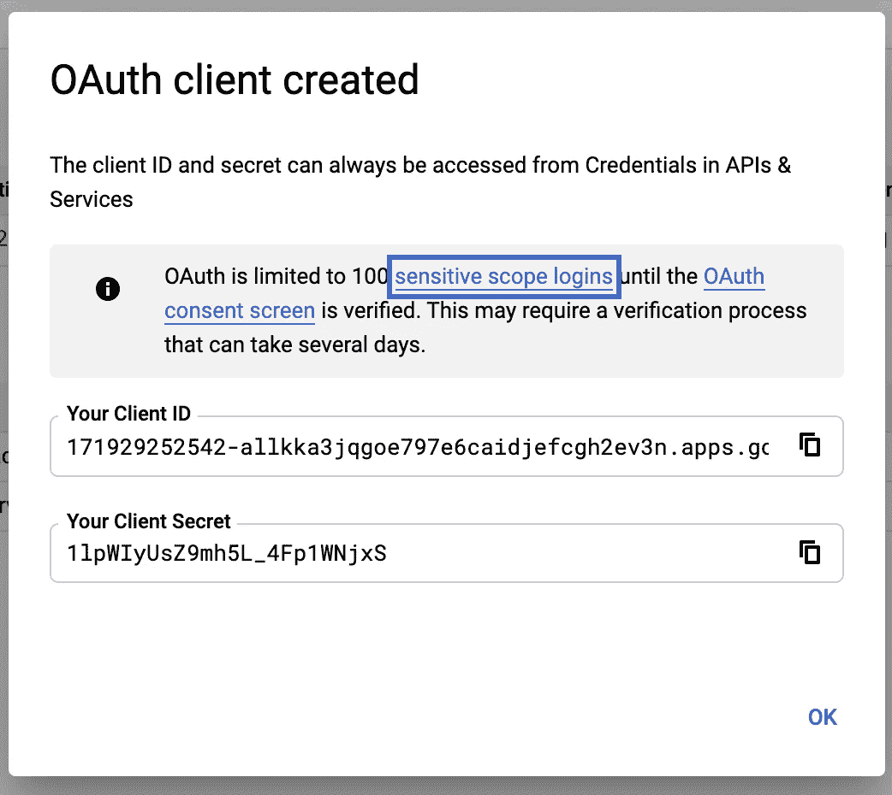

谷歌应用控制台

例如，当您在 Google APIs 中创建一个项目时，您可以获得两个凭证，客户端 ID 和客户端机密。请注意，在您的实际项目中，无论如何都不能泄露这些密钥，尤其是要非常小心保密密钥。

还有一些需要知道的事情，那就是授权服务器在授权访问后将页面发送到的重定向 URL 和作用域。OAuth 上下文中的范围指的是客户端想要访问多少功能。

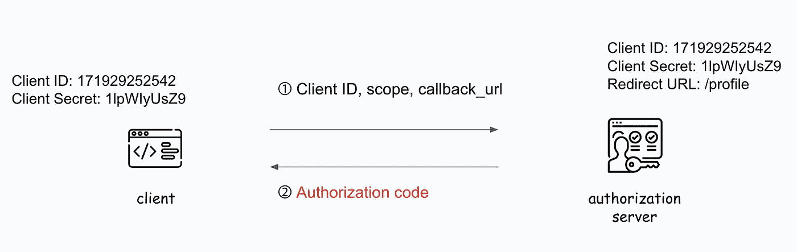

客户端通过发送客户端 ID、范围信息和回调 URL(重定向 URL)请求从授权服务器获取授权代码。授权服务器检查它接收的每个信息是否与它保存的信息相同。如果有任何不同，就不会返回授权码。

假设 Twitter APIs 包括个人资料、发布、消息和喜欢。如果您的客户端范围只包含个人资料和喜好，那么授权服务器会给您一个授权码，只允许您访问个人资料和喜好。

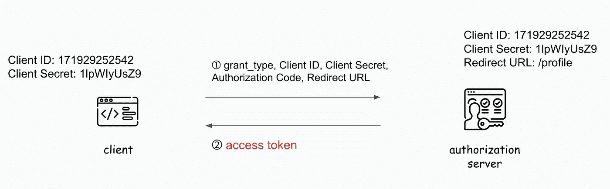

然后，客户端通过发送授权类型、客户端 ID、客户端秘密、授权代码和重定向 URL，最终请求授权服务器获得访问令牌。授权类型是“授权码”、“隐式”、“资源所有者密码凭证”和“客户端凭证”中的一种。客户端机密是在创建项目时返回的密钥。

授权服务器检查给定的授权码是否与其拥有的授权码匹配。如果匹配，则授权服务器用存储授权码的相同的两个密钥检查客户秘密和客户 ID。

如果所有信息都正确匹配，授权服务器将向客户端返回一个访问令牌。

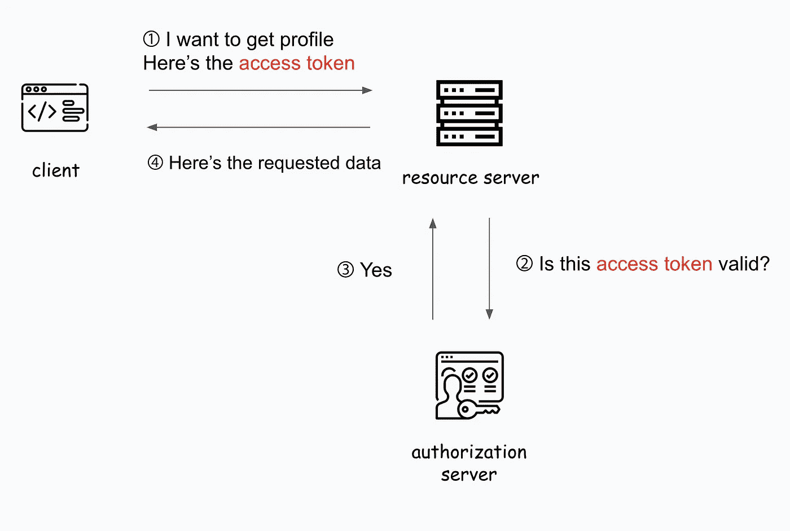

客户端可以用访问令牌获取 Twitter APIs。

# 结论

OAuth 认证比有状态服务器中使用的认证更强大。因为在有状态服务器中，他们必须在内存中保存关于登录的会话，所以如果用户数量很大，不仅会很繁重，而且当有多个服务器时，与其他服务器进行通信也会更加困难。

然而，使用 OAuth，服务器不必担心与其他服务器就认证问题进行通信。嗯，仍然需要在某个地方保存访问令牌的信息。

因此，还有另一种身份认证方式，称为 JWT。我以后会试着写一篇关于它的文章。

无论您使用何种支持 OAuth 的服务，OAuth 的流程和概念几乎总是相同的。因此，一旦你理解了整个流程，你就不会再困惑了。

# 资源

*   [https://tools.ietf.org/html/rfc6749](https://tools.ietf.org/html/rfc6749)
*   【https://tools.ietf.org/html/rfc6750#section-6.1.1 号
*   [什么是 OAuth-search apparchitecture](https://searchapparchitecture.techtarget.com/definition/OAuth#:~:text=OAuth%20(Open%20Authorization)%20is%20an,based%20authorization%20on%20the%20internet.&text=It%20acts%20as%20an%20intermediary,account%20information%20to%20be%20shared.)