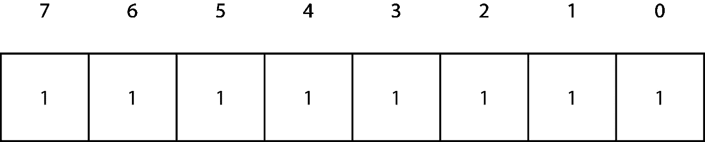
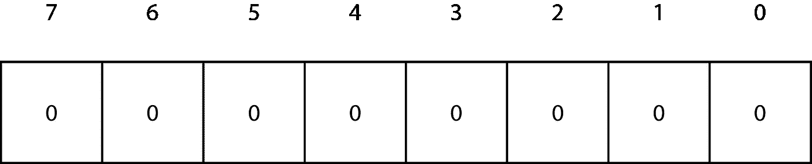

# 什么是溢出？

> 原文：<https://levelup.gitconnected.com/what-is-overflow-5a2f36d17dc7>

## 是的，StackOverflow 是一个网站。这和那个无关。

溢出经常被提及，但是如果对正在发生的事情没有一些基本的了解，您如何期望避免那些恼人的错误呢？

这正是这篇文章的主旨。


由[乔安娜·科辛斯卡](https://unsplash.com/@joannakosinska?utm_source=unsplash&utm_medium=referral&utm_content=creditCopyText)在 [Unsplash](https://unsplash.com/s/photos/overflow?utm_source=unsplash&utm_medium=referral&utm_content=creditCopyText) 上拍摄的照片

难度:**初学者** |简单|普通|挑战

# 先决条件:

*   一个都没有，但是出于实用的目的，能够产生一个“你好，世界！”应用程序，并能够在变量中存储一个值
*   对二进制的一些理解(此处指南)
*   了解零索引如何应用于数组(此处的指南[为](https://medium.com/swlh/zero-indexed-arrays-f752a47abf65))

# 术语

数组:同一类型的有序对象序列

比特:计算机系统中信息的基本单位

字节:8 位

编译程序:把指令转换成机器代码或低级形式的程序，这样它们就可以被计算机读取和执行

整数:没有小数部分的数字，即小数点后没有数字

溢出:当一个数太大而无法存储时

# 形势

看似简单。计算机存储你的代码，并用数字来表示你的工作(数字是给那些知道内情的人的)。

不幸的是，有两种方法可以耗尽空间(无限存储尚未发明)。你可能无法存储你想要的东西的数量(所以你可能只有 100 个变量的空间，这意味着第 101 个变量不能被存储)，或者你无法表示你想要存储的数字的**大小**。

因此，当某样东西太大而无法储存时，我们就要冒 T1 的风险。本文将对此进行详细介绍，并为您提供理解这些重要的计算机科学原理的方法。

# 整数溢出

大多数现代机器都是 64 位的，这意味着最大表示值是 2^264 1 = 18，446，744，073，709，551，615。

这是一个相当大的数字——所以让我们看看一个老式的 8 位整数所能代表的最大值。信不信由你，8 位整数仍在使用，并且特别便于节省空间(作为参考，8 位被称为一个**字节**)。

在下面的图中，我对数组进行了零索引，甚至颠倒了索引的顺序。

当`Array`达到最大容量时，它存储可由 8 位表示的最大数。也就是 255。



我们可以通过传统的`Binary`数字位置相加来解决这个问题。

128 + 64 + 32 + 16 + 8 + 4 + 2 + 1 = 255



同样，当所有位都设置为零时，可以存储在零中的最小可能值。结果值为零，因为

0 + 0 + 0 + 0 + 0 + 0 + 0 + 0 = 0

因此，有 256 个可能的值可以存储在 8 位中。

问题是，当可以存储的最大可能数字是 255 时，我们如何存储数字 256？

即(标记基数 2)

256₂ + 1₂能否存储在一个 8 位中，当你尝试时会发生什么？

# 语言泛滥

根据您选择的语言，`Compiler`对`Overflow`的处理会略有不同。在每种情况下，我们都会将最大值存储在一个 8 位的`Integer`中，然后看看当我们给它加 1 时会发生什么。

## 迅速发生的

```
var largestInt: UInt8 = UInt8.max // Assign the largest storable Integer to a variable, largestInt
largestInt = largestInt + 1 // Add one
```

给出的错误是

错误:执行中断，原因:EXC _ 坏 _ 指令(代码=EXC_I386_INVOP，子代码=0x0)。

该进程已被留在中断点，使用“线程返回-x”返回到表达式求值之前的状态。

## Java 语言(一种计算机语言，尤用于创建网站)

我们不能像上图一样使用`Integer`。这是由于 Java 处理一个`Integer`数字的正负符号的方式。因此，我们在这里使用的字节类型的范围是-128 到 127(尽管您可以算出，这与上面的可能值数量相同)。

```
public class Main {
    public static void main(String[] args) {
         byte b1 = 127
         b1 = b1 + 1
    }
}
```

给出的错误是:

线程“main”Java . lang . runtime 异常:不可编译的源代码—错误的树类型:<any>at com . my company . maven project 1 . main . main(main . Java:16)</any>

## Java Script 语言

在我们的 **script.js** 文件中，我们添加了以下内容:

```
const arr = Uint8Array.of(255);
++arr[0];
console.log(arr[0]);
```

结果是零。这可能是意料之外的，但是一旦溢出发生(在数组的第一个元素中)，我们就返回到零。

JavaScript 避免了溢出错误(在某种程度上很好，但在某种程度上也很可怕)。

## 计算机编程语言

由于 Python 整数在纯 Python 中具有任意精度，所以不能以这种方式溢出。

Python 中的任意精度意味着`Integer`的大小受限于系统上可用内存的大小，而不是`Integer`类型的精度。可以用第三方库来看`Overflow`，但是这里我们参考的是*纯* Python 和 3.6 版本来引导。

# 为什么溢出很重要

在某些情况下(比如上面的 JavaScript ),有一个值的环绕。也就是说，编译器只是从零开始，而不是导致错误。这可能会导致安全问题，或者可能会有其他问题，即在满足`Overflow`条件的已签名的`Integer`中没有正确表示符号。

# 结论:

溢出是计算机科学中的一个重要概念，也是你需要知道的。预先警告是预先准备好的，我希望这篇文章能帮助你理解这个`Overflow`想法的重要性。而且，没错，StackOverflow 大概就是`Overflow`。

# Twitter 联系人:

有什么问题吗？你可以在这里和我[取得联系](https://twitter.com/profile)