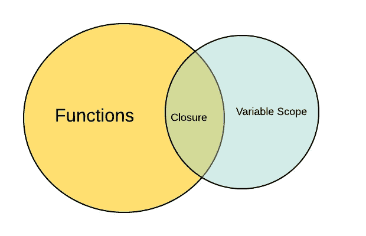

# JavaScript 闭包到底有什么特别之处？

> 原文：<https://levelup.gitconnected.com/what-is-really-so-special-about-javascript-closures-5701f8e4229f>



*原载于*[*https://edward-huang.com*](https://edward-huang.com/tech/javascript/closure/functional-programming/programming/2020/02/13/what-is-really-so-special-about-javascript-closure/)

"你能给我解释一下什么是结束吗？"

如果你是全栈、前端、后端或者用 JavaScript 做任何事情的人，你可能听说过术语闭包。如果你正在面试一个软件工程师的角色，你可能会遇到一个问题，要求你解释什么是闭包。

上述问题很容易回答——只要记住闭包的定义并给出几个例子。

这个术语的问题不在于理解闭包的定义，而是理解为什么您可能想要在您的项目中使用它。

在我们深入探讨 JavaScript 中闭包有多坚固之前，让我们先了解一下什么是闭包。

闭包是一个可以访问它所定义的“外部”作用域的函数。因此，即使封闭函数终止，它也可以访问外部范围中的值。

以此为例:

```
function takeOne() {
  let i = 0;
  return function incrementFunction() {
    return i++;
  }
}
```

上面的代码表示一个函数返回另一个函数。然而，当你调用`takeOne`并得到`incrementFunction`后，`incrementFunction`会记住`takeOne`的局部变量，即使`takeOne`已经终止。

# 关闭的好处

闭包的第一个好处是在范围内保留局部变量。由于 JavaScript 函数是一等公民，开发人员经常会遇到名称冲突，这会导致一些意外的输出。使用闭包有助于将命名空间作为私有变量保留在该范围内。你可以在过去的 jQuery 代码中看到很多这样的例子，其中定义了一个 click 方法。

```
$(function() {
  var selections = []
  $(".something").click(function() { *// this closure has access to the outer variable selections*
    selections.push("something") *// this are able to get the outer function selections*
  })
})
```

虽然这确实是闭包的用例之一，但它可能会让您思考，“这真的是闭包的目的吗？”您可能仍然会质疑闭包的一般用例是什么。

第二个好处更像是一个通用用例，它在异步环境中很有用。

想象一下，如果您需要遍历数组中的一个值:

```
for(var i = 0 ; i< 3; i++) {
  setTimeout(() => console.log(i), 3000)
}
```

这个程序的输出会是什么？

它打印`3`三次。由于`setTimeout`是异步的，到循环结束的时候，外部作用域`i`也变成了 3，循环过程中对`setTimeout`的后续调用每次都会触发回调并打印`3`。

你会怎么解决这个问题？

有很多方法，包括使用 ES6 语法`let`而不是`var`在块级别定义它的范围并解决问题。然而，如果他们想让你不使用任何 ES6 特性来解决这个问题，你的答案就是一个闭包。

```
function printSomething(i) {
  setTimeout(() => console.log(i), 3000)
}

for(var i = 0; i<3; i++) {
  printSomething(i)
}
```

通过在`setTimeout`之外创建另一个外部函数，您定义了一个闭包。即使在`printSomething`终止后,`i`值仍然保留。然后回调将`0 1 2`打印到控制台。

这就是闭包是一个强大的 JavaScript 特性的原因。在异步环境中，可以使用闭包来保留外部变量的范围。

# 另一个例子

让我们想象另一个例子，您需要创建一个函数，该函数需要调用第三方 API，并聚合结果并将其返回给调用者。

```
function getAPI(cb) {
    setTimeout(() => cb("a"), 3000)
}

function getAPIB(cb) {
    setTimeout(() => cb("b"), 2000)
}

function getAPIC(cb) {
    setTimeout(() => cb("c"), 1000)
}

function aggregateValue() {
  var aggregateData = []

  *// your implementation here*
}
```

在您继续阅读解决方案之前，暂停一秒钟，想想如何在没有承诺或 async/await 的情况下解决这个问题。

我们可以利用闭包的力量来保留函数的作用域，并通过使用回调来阻止`aggregateValue`提前返回。

```
function aggregateValue(cb) {
  var aggregateData = []
  var numberAPICalledSoFar = 0

  function callback(value) {
    aggregateData = [...aggregateData, value]
    if(numberAPICalledSoFar < 2) {
      numberAPICalledSoFar++;
    }else {
      cb(aggregateData)
    }
  }
  getAPI(callback)
  getAPIB(callback)
  getAPIC(callback)
}
```

由于`getAPI`、`getAPIB`、`getAPIC`都使用了回调函数，所以可以创建一个回调函数来递增到目前为止调用的 API 的计数。一旦调用的 API 数量超过 2，调用返回回调值。

上面的代码再次利用闭包的能力，在封闭函数被触发时保留它的局部变量。当`getAPI`完成其调用并调用回调函数时，回调函数访问外部作用域`aggregateValue`以增加 API 完成执行的计数。然后`aggregateData`从外部`aggregateValue`返回一个回调函数，该函数需要来自所有第三方 API 的所有聚合数据。

运行此功能:

```
aggregateValue((ans) => ans.foreach(console.log))
```

# 外卖食品

*   虽然闭包是在 javaScript 的第一堂课上讲授的，但它们是 JavaScript 的一个更“高级”的特性。
*   ClosureClosure 难的问题不是它的概念，而是它的好处，以及为什么你需要理解它的用例。
*   闭包的一般用例是在异步环境中解决计算问题。

本教程所有的源代码都是[这里](https://github.com/edwardGunawan/Blog-Tutorial/tree/master/ClosureTutorial)。

## 感谢阅读！如果你喜欢这篇文章，请随意[订阅](https://edward-huang.com/subscribe/)我的时事通讯，接收关于科技职业的每周文章、有趣的链接和内容！

你可以关注我，也可以关注我在[媒体](https://medium.com/@edwardgunawan880)上的更多帖子。