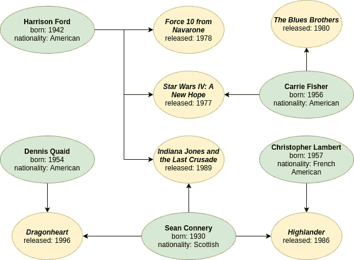

# 什么是 RedisGraph，你有什么选择来运行它？

> 原文：<https://levelup.gitconnected.com/what-is-redisgraph-and-what-are-your-options-for-running-it-af37574ea76>


IOD 专家丹尼尔·达戈斯蒂诺

图形数据库是 NoSQL 存储引擎的一个类别，它使得表示和查询高度关联的数据变得容易。虽然 SQL 数据库当然可以用来表示关系，但是对于大量具有复杂关系的数据，它们的性能无法与图形数据库相媲美。图形数据库在模式方面也更加灵活，几乎可以立即回答关于数据关系模式的问题。

虽然我们很多人习惯于使用 SQL 数据库做任何事情，但图数据库的适用性也非常广泛。示例应用的范围可以从世俗的(例如，书籍及其作者)到不同种类的大规模社交网络(例如，在脸书上表示朋友和关系，或者在 LinkedIn 上表示职业关系)。近年来，“巴拿马文件”使用图形数据库来分析和揭露涉嫌金融犯罪的人。甚至像冠状病毒这样的疾病的传播也可以使用图形数据库进行建模。

虽然主流图形数据库比 SQL 数据库更新，但它们肯定不是什么新东西。图形数据库空间已经有点拥挤，有几个著名的参与者(例如 Neo4j、TigerGraph、ArangoDB 等。)、云产品(例如 Amazon Neptune)，甚至最近添加了某种级别的图形支持的 SQL 数据库(例如 SQL Server)。

RedisGraph 是一个相当新的图形数据库，作为 Redis 的一个模块而构建。它拥有出色的性能，支持 Cypher 查询语言(用于 Neo4j 等其他图形数据库)，并且非常容易上手。在这篇文章中，我会给你一个 RedisGraph 如何工作以及你可以用它做什么的高层次概述。

# RedisGraph 如何工作

RedisGraph 使用一个名为 GraphBLAS 的库，这个库允许它以一种非常紧凑的方式存储图形数据，并以极快的速度进行查询。结果，[基准测试](https://redislabs.com/blog/new-redisgraph-1-0-achieves-600x-faster-performance-graph-databases/)显示 RedisGraph 的表现超过了它的几个最成熟的竞争对手，这是非常令人惊讶的，因为 Redis 是众所周知的单线程。但是当你更好地理解它背后的[技术](https://redislabs.com/redis-enterprise/technology/redisgraph/)，原因就变得清晰了。

虽然传入的请求使用 Redis 的单线程，但它们随后被传递到 RedisGraph 的内部线程池，该线程池可以并发执行不同的查询。在任何给定时间，一个查询只能在一个 RedisGraph 线程上运行(尽管 GraphBLAS 可以根据需要使用额外的线程)，这与竞争图形数据库不同，在竞争图形数据库中，相同的查询分布在机器的所有核心上。虽然这可能看起来违反直觉，但它更适合处理高吞吐量和低延迟的场景，因此提供了更好的性能。

# 设置重划

[再贴现主页](https://oss.redislabs.com/redisgraph/)讲解如何快速试用再贴现。到目前为止，最简单的方法是使用 Docker:

```
sudo docker run -p 6379:6379 -it --rm redislabs/redisgraph
```

上面的命令将运行最新的稳定版本，但是如果您想要访问最新的特性和修复，您可能需要使用 edge 标记:

```
sudo docker run -p 6379:6379 -it --rm redislabs/redisgraph:edge
```

如果您对 RedisGraph 满意，并且希望在适当的环境中更认真地使用它，您也可以将它作为一个模块安装在自托管的 Redis 实例中。或者，对于更大的场景，您可以将其作为 Redis 企业云的一部分。

# 与 RedisGraph 交互

我们可以使用一种叫做 Cypher 的语言在 RedisGraph 中存储和查询数据。最初由竞争对手 Neo4j 创建，后来在 [openCypher](https://www.opencypher.org/) 项目中开发，Cypher 使用一种 ASCII 艺术形式以及类似 SQL 的子句来提供对图形数据的访问，我们很快就会看到。

为了展示一些基本的查询，我们将使用图 1 所示的简单例子。方向箭头定义了演员(绿色节点)和电影(黄色节点)之间的关系。例如，肖恩·康纳利出演了《T4》中的《高地人》。为了简明起见，这只是每部电影的演员阵容或每个演员的电影记录的一个子集，但这些数据足以执行一些有趣的查询。



图 1: *演员和电影关系的例子*

# 加载示例数据

通过我们用于任何其他 redis 命令的相同 redis-cli 客户端工具，我们可以向 RedisGraph 发出命令。让我们从创建演员开始:

```
GRAPH.QUERY FilmIndustry "CREATE (:Actor { name: 'Harrison Ford', born: 1942, nationality: 'American' } )"GRAPH.QUERY FilmIndustry "CREATE (:Actor { name: 'Carrie Fisher', born: 1956, nationality: 'American' }) "GRAPH.QUERY FilmIndustry "CREATE (:Actor { name: 'Sean Connery', born: 1930, nationality: 'Scottish' } )"GRAPH.QUERY FilmIndustry "CREATE (:Actor { name: 'Dennis Quaid', born: 1954, nationality: 'American' } )"GRAPH.QUERY FilmIndustry "CREATE (:Actor { name: 'Christopher Lambert', born: 1957, nationality: 'French American' } )"
```

这看起来可能有点奇怪，因为我们实际上是在 Redis 命令中发送 Cypher 查询。您需要将每个命令理解为:GRAPH。查询 redis _ key“cypher _ QUERY”。在每个 Cypher 查询中，我们都创建了一个 Actor 类型的节点，其属性包括姓名、出生日期和国籍。

以类似的方式，我们可以添加电影节点，每个节点都具有名称和发行日期的属性:

```
GRAPH.QUERY FilmIndustry "CREATE (:Film { name: 'Force 10 from Navarone', released: 1978 } )"GRAPH.QUERY FilmIndustry "CREATE (:Film { name: 'Star Wars IV: A New Hope', released: 1977 } )"GRAPH.QUERY FilmIndustry "CREATE (:Film { name: 'Indiana Jones and the Last Crusade', released: 1989 } )"GRAPH.QUERY FilmIndustry "CREATE (:Film { name: 'The Blues Brothers', released: 1980 } )"GRAPH.QUERY FilmIndustry "CREATE (:Film { name: 'Dragonheart', released: 1996 } )"GRAPH.QUERY FilmIndustry "CREATE (:Film { name: 'Highlander', released: 1986 } )"
```

最后，我们可以创建演员和电影之间的关系:

```
GRAPH.QUERY FilmIndustry "MATCH (actor:Actor { name : 'Harrison Ford' }), (film:Film { name : 'Force 10 from Navarone' }) CREATE (actor)-[:actedIn]->(film)"GRAPH.QUERY FilmIndustry "MATCH (actor:Actor { name : 'Harrison Ford' }), (film:Film { name : 'Star Wars IV: A New Hope' }) CREATE (actor)-[:actedIn]->(film)"GRAPH.QUERY FilmIndustry "MATCH (actor:Actor { name : 'Harrison Ford' }), (film:Film { name : 'Indiana Jones and the Last Crusade' }) CREATE (actor)-[:actedIn]->(film)"GRAPH.QUERY FilmIndustry "MATCH (actor:Actor { name : 'Carrie Fisher' }), (film:Film { name : 'Star Wars IV: A New Hope' }) CREATE (actor)-[:actedIn]->(film)"GRAPH.QUERY FilmIndustry "MATCH (actor:Actor { name : 'Carrie Fisher' }), (film:Film { name : 'The Blues Brothers' }) CREATE (actor)-[:actedIn]->(film)"GRAPH.QUERY FilmIndustry "MATCH (actor:Actor { name : 'Sean Connery' }), (film:Film { name : 'Indiana Jones and the Last Crusade' }) CREATE (actor)-[:actedIn]->(film)"GRAPH.QUERY FilmIndustry "MATCH (actor:Actor { name : 'Sean Connery' }), (film:Film { name : 'Dragonheart' }) CREATE (actor)-[:actedIn]->(film)"GRAPH.QUERY FilmIndustry "MATCH (actor:Actor { name : 'Sean Connery' }), (film:Film { name : 'Highlander' }) CREATE (actor)-[:actedIn]->(film)"GRAPH.QUERY FilmIndustry "MATCH (actor:Actor { name : 'Dennis Quaid' }), (film:Film { name : 'Dragonheart' }) CREATE (actor)-[:actedIn]->(film)"GRAPH.QUERY FilmIndustry "MATCH (actor:Actor { name : 'Christopher Lambert' }), (film:Film { name : 'Highlander' }) CREATE (actor)-[:actedIn]->(film)"
```

虽然这里看起来有很多，但其实挺简单的。我们不是重新创建演员和电影节点，而是定位我们已经拥有的节点，按名称匹配每个节点，然后建立它们之间的关系。在每种情况下，关系语法看起来都是这样的:(actor)-[:actedIn]-->(film)。Cypher 使用一种语法，其中节点用圆括号表示，而边用方括号表示，中间的符号表示关系方向的箭头。

# 下一步是什么

到目前为止，我已经解释了什么是 RedisGraph 以及 GraphBLAS 库如何支持它。我还讨论了运行 RedisGraph 的选项。最后，我展示了一个很小但很实用的涉及演员和电影的图表示例，并展示了如何通过 Cypher 语言将该图表的数据加载到 RedisGraph 中。

然而，当看到它的查询能力时，RedisGraph 的能力是最容易理解的。所以请继续关注第 2 部分，在那里我们将介绍 RedisGraph 中的 Cypher 查询，并进一步讨论将数据加载到 RedisGraph 中的选项。

*本文原载于* [*IOD 博客*](https://iamondemand.com/blog/) *。IOD 每周发布与技术相关的操作方法、观点和产品比较——全部由从业者撰写。如果这个内容对你有意思或者有帮助，可以看看我们。我们也一直在寻找新的技术专家为我们写博客！*