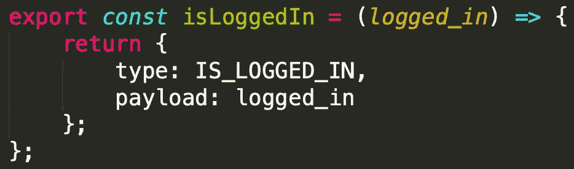
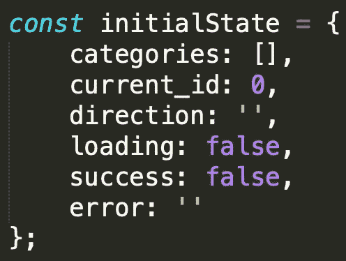
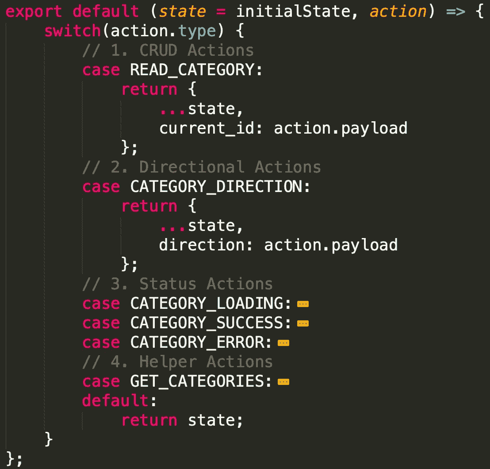
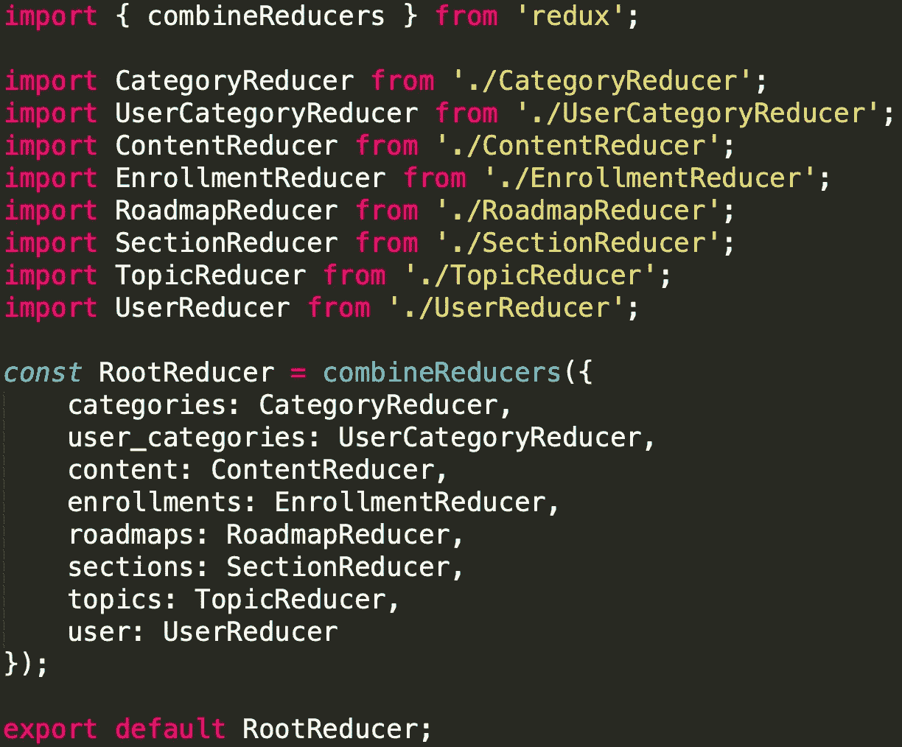
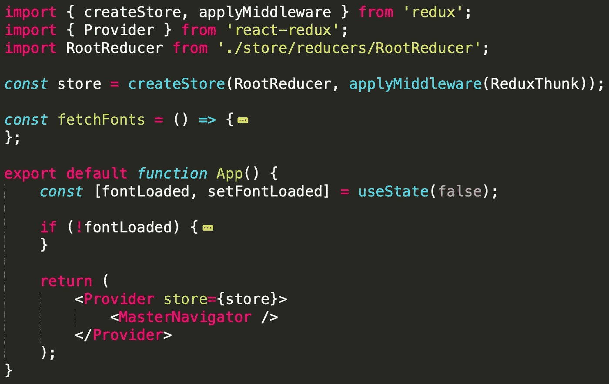
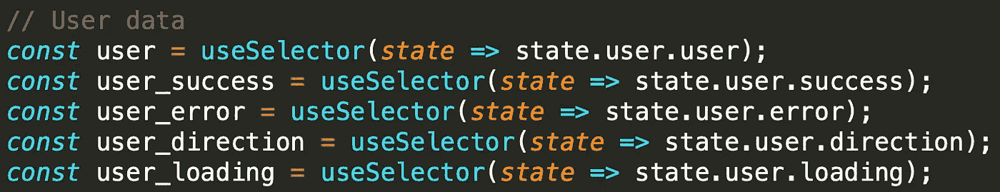
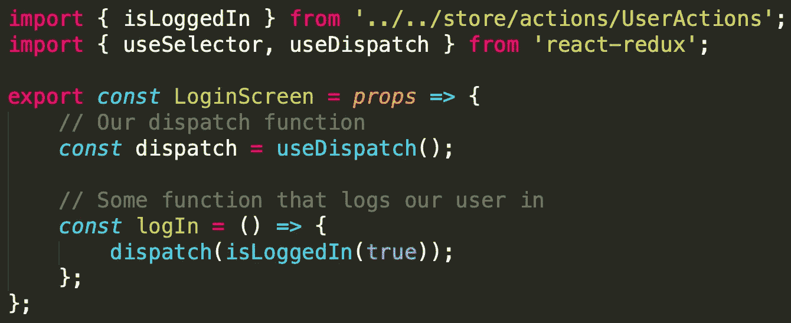

# React 中的 Redux 是什么？用简单的英语快速解释

> 原文：<https://levelup.gitconnected.com/what-is-redux-in-react-a-quick-explanation-using-simple-english-b298579e5898>

在本文中，我将使用最少的技术术语来解释 Redux 是什么。对 Redux 的直观理解将有助于您在下一个 React 或 React Native 项目中更好地使用它。

让我们开始吧。

# 状态容器

在 Redux 官方网站上，你首先看到的是“Redux 是 JavaScript 应用的可预测状态容器。”我们来分析一下。

首先，状态容器基本上是保存应用程序状态的东西。例如，状态可以是用户是否登录。应用程序的状态可以是用户登录的状态，也可以是来宾状态。所以 Redux 是一个状态容器，它保存了应用程序可以拥有的所有状态。

需要注意的是，状态不是可变的。基本上这意味着你不能直接改变状态。然而，如果在某个状态下进行某些操作，您可以返回一个新的状态。例如，如果用户进行登录操作，您不会更改当前状态的变量来跟踪用户是否登录。您必须用修改后的变量创建一个新的状态并返回它。它本质上取代了旧的状态。

由此，状态容器的可预测性意味着什么。让我们考虑一下重力。如果你在一个高度拿着一个球，你相信一旦你放开球会发生什么？它会掉下来。会发生什么是可以预料的。此外，我们可以采取抓住球的动作，将它举到一定高度，然后让它自由下落，以获得球下落的同样可预测的结果。

同样，如果您的应用程序从相同的状态采取相同的操作，您将总是得到相同的结果。就像落球的例子。

例如，用户可以注销，我们的状态可以表示我们处于“来宾模式”。如果用户登录，我们总是可以预测我们的状态将处于“用户模式”。从那里，如果用户注销，我们总是可以预测我们的状态将回到“来宾模式”。

综上所述，我们有一种方法来存储应用程序的状态，如果我们可以从某个状态采取一些动作，我们将总是以相同的结束状态结束。

# 动作和减速器

现在我们知道 Redux 持有一个您的应用程序可以使用的状态，下一步是理解我们如何为 Redux 生成一个新的状态。

这就是行动和减速器发挥作用的地方。

## 什么是行动？

动作只是返回普通对象的函数。需要注意的是，要求您的操作返回一个普通对象。你不能像一个 API 请求那样异步地返回一些东西。

动作之所以需要返回一个普通对象，是因为 Redux 把动作当成了“事实”。当你向一个 API 发出请求时，你是*想要*得到一些数据。数据还没有被返回，还不是一个“事实”。所以你必须从你的操作中返回普通的对象。如果你想学习如何在你的动作中从 API 返回一些数据，你可以看看[这篇](https://medium.com/@SunnyChopper/using-the-redux-thunk-middleware-to-quickly-send-api-requests-in-react-native-88302b44e963)文章，它讨论了如何从你的 API 返回数据到 Redux。快速预览一下，您实际上是在应用一些中间件，这些中间件执行一些异步代码，然后可以代表您分派一个动作。如果您有兴趣在 Redux 中使用 API，请查看一下。

从 action 函数返回的每个对象都有一个强制的“type”字段，它基本上告诉 Redux 发生了什么。例如，假设您想要更改用户是否登录，发生的动作的“类型”可以标记为“is_logged_in”。这告诉 Redux 发生了什么。

从那里，您可以返回一些与操作相关的数据。惯例是创建一个包含该数据的“有效载荷”字段。

下面是一些简单动作函数的示例代码。

## 什么是减速器？

用简单的英语来说，reducers 只是接受通过动作传入的数据，并为 Redux 返回一个新状态。我们从动作中传递的“类型”是我们如何知道要更新状态的哪一部分。

为了避免写一堆 if 语句，我们总是在 reducer 文件中使用 switch 语句。

我们还可以定义一个初始状态，当应用程序启动时，Redux 处于其初始状态时，我们可以使用这个初始状态。为了做到这一点，我们创建一个初始状态对象来保存我们想要跟踪的所有关键点。下面是一个初始状态的例子，我用它来保存我的用户的状态数据。

下面是一个 reducer 文件以及如何使用 switch 语句的例子。我藏了一些箱子，让图像更符合。

您可以定义多个 reducer，以便将您的 reducer 分解成可管理的文件。如果您有一个大的 reducer 文件，随着时间的推移，它可能很难维护。然而，当您创建 Redux 存储时，您需要一个可以访问的 reducer 文件。当您有多个减速器时，这被称为根减速器。

下面是一个根减速器的例子。它只是将所有不同的减速器组合在一起，创造出一个单一的减速器。Redux 为你提供了一个功能来做到这一点。通过使用' combineReducers '函数，您可以创建一个根缩减器并将其导出。

# 访问 Redux

既然已经有了可以为 Redux 返回新状态的 actions 和 reducers，我们需要知道如何访问我们的状态。如果我们无法访问一个状态，那么拥有它还有什么意义呢？

## 注册商店

在访问 Redux 状态之前，您必须将其注册到您的应用。为此，我们使用“createStore”方法来创建一个商店。这就是我们的 Redux 对象。从那里，我们可以使用一个叫做 Provider 的东西，它可以让我们在整个应用程序中访问 Redux 对象。

下面是一个例子，说明我如何使用根归约器创建一个存储变量。不要担心中间件，因为如果您想在 Redux 操作中使用 API 获取，就会用到中间件。我返回一个 Provider 对象，其中包含我的主 Navigator 对象，实际上是我的主应用程序。

## 使用选择器

从这里，我们可以使用“useSelector”钩子函数访问 Redux 状态中的任何变量。这使我们能够获得数据。

首先，您必须确保从“react-redux”导入 useSelector 函数。下面是您要导入的内容。useDispatch 返回一个调度函数，我们可以用它来调用我们的操作。我很快会谈到这一点。
`import { useSelector, useDispatch } from ‘react-redux’;`

下面是如何使用 useSelector 的示例:

在这里，我们可以使用 React 中的“useEffect”钩子来检测 Redux 变量中的值发生的任何变化。

## 使用调度

useDispatch 函数返回一个调度函数，您可以使用该函数从代码中的任何位置调用操作函数。下面是您将用来获得您的调度变量。
`const dispatch = useDispatch();`

从这里，您可以导入您已经定义的任何操作，并将它们传递到 dispatch，以便调用该操作。例如，如果您想更改用户是否登录。您可能在动作文件中定义了一个名为 isLoggedIn 的函数。然后，您可以从该文件导入该函数，并将其传递给 dispatch 以使用该操作。

# 结论

简而言之，这几乎是多余的。现在 Redux 变得更加复杂，因为你可以应用中间件等等。但是，了解什么是 Redux，什么是动作和 reducers，如何在应用程序中注册 Redux，如何获取 Redux 数据和调度动作，这些知识将有助于您开始使用 Redux。

如果你喜欢这个内容，或者如果它帮助你更好地理解 Redux，请放下一些掌声。我的目标是每天写一篇关于 React/React Native 的文章，你们的掌声为我提供了下一步该写什么的反馈。

如果您对 Redux 有任何疑问，请随时联系我。我在几乎所有社交媒体上的用户名都是 SunnyChopper。如果你更喜欢在 Xbox 上玩游戏，并且想在那里聊天，请添加我，它是 xSunnyChopper。让我们来谈谈一些使命召唤:战区。