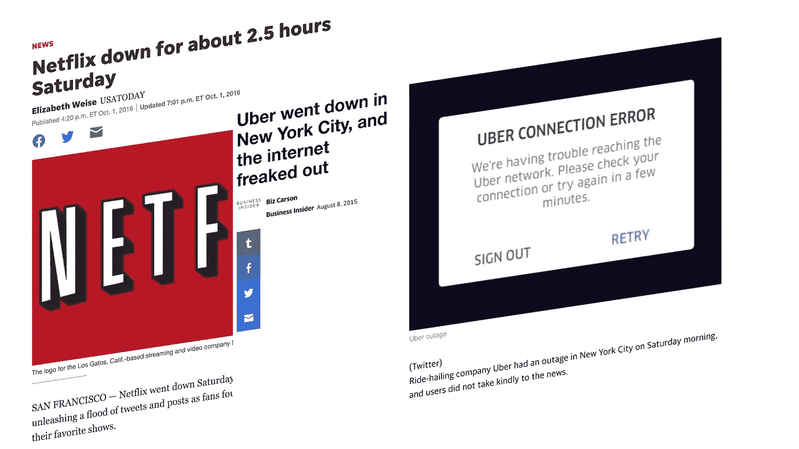
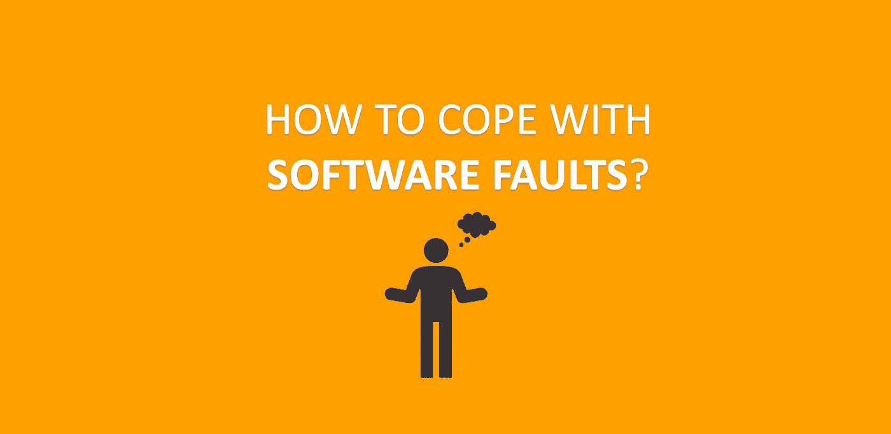
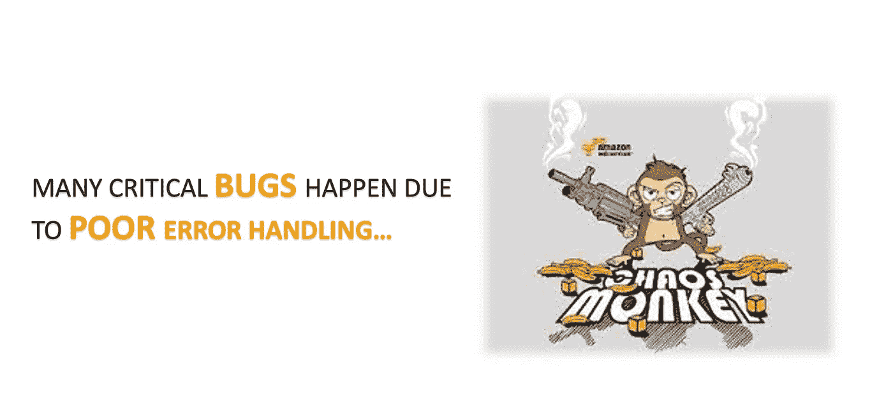

# 什么是“可靠”的服务？

> 原文：<https://levelup.gitconnected.com/what-is-reliability-80de95ee731b>

当你在构建一个软件应用或服务时，我肯定你听说过这些大词:**可伸缩性**、**可维护性**和**可靠性**。每个人都谈论它。

每个人都只是把这些词扔给对方，并不真正知道每个词的真正含义。今天我们将深入探讨可靠性到底意味着什么，这样当面试官问你这样的问题时，你就不会愣住了:那么“你如何做出一份可靠的申请？”

# 什么是可靠性

我们可以确定一件事。我们知道什么时候服务不可靠:

> -当你想看电影或电视节目时，网飞无法正常工作
> -当你需要请求搭车时，优步无法正常工作。

不可靠的服务会产生糟糕的用户体验，有时甚至会导致疯狂的用户体验。

以下是对可靠服务的一些典型期望:

*   执行用户期望的功能
*   容忍用户犯错或以意想不到的方式使用软件。
*   在预期的负载和数据量下提供良好的性能(例如，良好的延迟)
*   防止任何未经授权的访问或滥用。

> 这基本上意味着即使出现问题，服务或应用程序也应该继续正常工作！

# 什么会出错？

可能出错的东西被称为故障，主要有三种不同类型的故障。

*   硬件故障
*   软件故障
*   人类的错误

## 硬件故障

我们通常认为硬件故障是随机的，彼此独立:一台机器的磁盘出现故障并不意味着另一台机器的磁盘也会出现故障。

可能存在微弱的相关性(例如，由于共同的原因，如服务器机架中的温度)，但除此之外，大量硬件组件不太可能同时发生故障。

以下是不同类型的硬件故障

*   RAM 可能会出现故障
*   有人拔错了网线
*   电网停电

> 据报道，硬盘的平均故障时间约为 10 至 50 年。因此，在拥有 100000 个磁盘的存储集群上，我们预计平均每天会有 10 个磁盘死亡**。**

我们的第一反应通常是为单个硬件组件增加冗余，以降低系统的故障率。例如，您可以拥有:

*   磁盘的 RAID 配置
*   电池和柴油发电机作为备用电源
*   双电源
*   热插拔 CPU

这种方法不能完全防止硬件故障导致故障，但它确实降低了故障的概率。然而，随着数据量的显著增加，更多的应用程序开始使用大量的机器，这相应地增加了硬件故障率。因此，业界开始优先使用**软件容错技术**或将其与硬件冗余结合使用。

## 软件故障

软件故障通常更难预测，并且会对整个系统或应用程序造成更大的损害，因为它们在节点之间是相互关联的。

以下是不同类型的软件故障:

*   一种软件错误，当给定一个特定的错误输入时，会导致应用服务器的每个实例崩溃
*   级联故障，其中一个组件的小故障会触发另一个组件的故障。
*   破坏共享资源(例如，CPU、内存、磁盘空间或网络带宽)的软件错误
*   系统依赖的服务变慢、变得无响应或开始返回损坏的响应。

当程序员对软件环境做了某种假设，但由于某种原因突然不再正确时，大多数错误就产生了。

这样的问题没有快速的解决方法。许多小事情都有帮助:

*   仔细思考假设和互动
*   全面测试(单元测试、集成测试、负载测试)
*   进程隔离
*   监视
*   警报

## 人类的错误

人类设计、构建和操作软件系统。即使他们有最好的意图，人类也是不可靠的。例如，一项针对大型互联网服务的研究发现，运营商的配置错误是导致服务中断的主要原因。

最小化人为错误的唯一方法是以最小化出错机会的方式设计系统。

*   让 API 或管理界面容易做“正确的事情”和阻止“错误的事情”
*   在所有级别进行彻底的测试，这样即使出现人为错误，我们也可以在错误进入生产之前检测出来。
*   允许从人为错误中快速轻松地恢复。
*   尽可能自动化手工工作

好了，我们研究了所有三种不同类型的断层。在我们结束之前，我想再提一件事。

为了增加当故障自然发生时将被正确处理的信心，许多公司开始有意地诱发故障，以确保容错机制被不断地运用和测试。

混沌猴来自网飞，它是这种方法的一个例子。

我们完了！我希望你现在明白可靠性意味着什么。这不是一个简单的概念。一定要把内容再看一遍，让它成为你的。

如有任何问题，欢迎在下方留言！

干杯。

 [## 编写面试问题

### 掌握编码面试的过程

技术开发](https://skilled.dev)