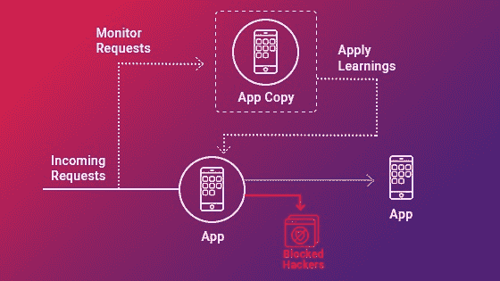
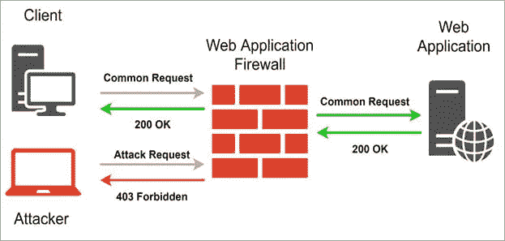

# 什么是运行时保护，如何确保它

> 原文：<https://levelup.gitconnected.com/what-is-runtime-protection-and-how-to-ensure-it-b0a40d2fbb2a>

[照片](https://unsplash.com/photos/FlPc9_VocJ4)由[约翰·施诺布里奇](https://unsplash.com/@johnschno?utm_source=unsplash&utm_medium=referral&utm_content=creditCopyText)在 Unsplash 上拍摄

对于试图进入公司的网络掠夺者来说，应用程序已经成为一个有吸引力的目标。对此有一个合理的解释。黑帽意识到，如果他们能够识别并利用应用程序的漏洞，他们成功犯下数据违规的几率将超过三分之一。此外，发现应用程序漏洞的几率相当大。

据 Contrast Security 称，由于 90%的应用在开发和质量保证阶段没有进行漏洞评估，因此更多的应用在生产过程中没有受到保护。

网络卫士很难抵御对公司正在使用的许多易受攻击的应用程序的攻击。一个想法是让**应用通过实时识别和击退攻击来保护自己**。RASP 技术，通常被称为运行时保护，就是这样做的。

# 什么是运行时保护？

RASP 是一种基于服务器的技术，在应用程序启动时激活。它旨在立即识别对应用程序的攻击。它是最重要的[应用安全工具](https://www.mend.io/resources/blog/application-security/)之一。当应用程序启动时，RASP 可以通过检查应用程序的行为和行为的上下文来防御恶意输入或活动。通过允许应用程序持续监控自己的活动，可以在没有人工参与的情况下快速检测和消除攻击。

在运行应用程序的服务器上的任何地方， [RASP](https://techbeacon.com/security/what-runtime-application-self-protection-rasp) 集成了安全性。它通过拦截应用程序对系统的所有调用来确保安全性，并验证应用程序内部的数据请求。RASP 可以保护 web 和非 web 程序。因为 RASP 的检测和保护功能在应用程序运行的服务器上工作，所以技术对应用程序的设计没有影响。

[来源](https://www.appsealing.com/rasp-security-runtime-application-self-protection/)

# 确保运行时保护

当一个应用发生安全事件时，RASP 会接管该应用并处理问题。RASP 只有在诊断模式下出现问题时才会通知您。在防御模式下，它会试图阻止它。例如，它可以阻止对数据库执行命令，这似乎是 SQL 注入攻击的一部分。

RASP 还可以通知用户或安全专家，结束用户的会话，停止程序的执行，或者终止用户的连接。

开发人员可以通过几种方法将 RASP 付诸实践。通过利用应用程序源代码中的[函数调用](https://docs.microsoft.com/en-us/cpp/c-language/function-calls?view=msvc-170)，他们可以访问该技术。或者，他们可以将完成的软件包装在一个支持一键式应用安全的容器中。由于开发人员可以挑选他们想要保护的程序功能(包括登录、数据库查询和管理操作),第一种方法更加专业。

不管 RASP 使用什么策略，结果都相当于将 web 应用程序防火墙与程序的运行时环境结合起来。这种紧密的联系可能允许 RASP 进行修改，以更好地适应应用程序的安全需求。

# 提高应用安全性

[来源](https://www.softwaretestinghelp.com/rasp-tutorial/)

RASP 在某些方面类似于传统的防火墙。例如，它可以结束会话并检查流量和内容。另一方面，防火墙是边界技术，无法观察边界内发生的情况。他们不知道应用程序中发生了什么。移动设备的激增和云计算的发展也使边界变得更容易渗透。因此，通用防火墙和 web 应用程序防火墙(waf)都不再有效。

# 自卫

RASP 的好处是，一旦攻击者突破了外围保护，它就能够保护系统。它提供了对应用程序设置、数据事件流和应用程序逻辑的可见性。这意味着锉刀可以有效地阻止攻击。这使得网络防御人员可以花更多的时间来解决实际问题，而不是花更少的时间来搜寻无法解决的数字安全秘密，因为它可以区分实际攻击和有效的信息请求。这减少了误报。

此外，由于数据可以自我保护，因此保护会从数据创建开始一直延续到消失。由于自我保护的数据对数据窃贼毫无用处，这对于必须遵守法规的公司尤其有用。监管机构偶尔不会要求报告数据泄露。

# 更好的 BYOD 技术

移动设置也可以受益于 RASP。对于依赖移动操作系统的企业来说，保护应用程序免受攻击是一项充满风险的任务。通过使用 RASP 进行保护，BYOD 可以减少 IT 部门的安全问题。

不利的一面是，RASP 部署会影响应用程序的性能。RASP 的怀疑者和支持者正在讨论它能产生多大的影响。RASP 的动态特性和自我保护机制都可能导致应用程序运行缓慢。在公司内部，如果人们开始注意到这种缓慢，抱怨无疑会接踵而至。然而，性能问题的严重性不会变得明显，直到更多的应用程序开始在它们的操作中使用 RASP。

重要的是要记住锉刀是一个盾牌。即使使用了 RASP，有缺陷的应用程序也会继续有缺陷。此外，RASP 无法防御所有类型的漏洞。因此，虽然它将为应用程序提供相当大的保护，但它不会使应用程序像安全自始至终集成到程序中一样安全。出于这些原因，一些安全专家建议将该技术与其他应用程序安全措施结合使用。

# 摘要

RASP 被认为能够克服其缺点，成为应用程序安全的未来，因为它仍然是一项相对较新的技术。

另一方面，RASP 想要击败的许多威胁会出现在应用程序的源代码中。如果在开发过程的早期就开始集成安全性，那么在你的新应用中就不再需要 RASP 了。然而，保护旧的应用程序仍然是有用的。