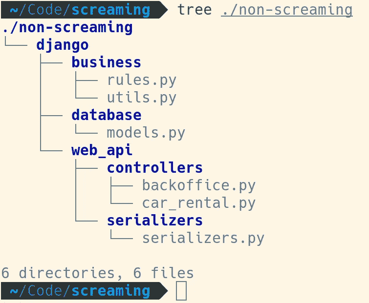
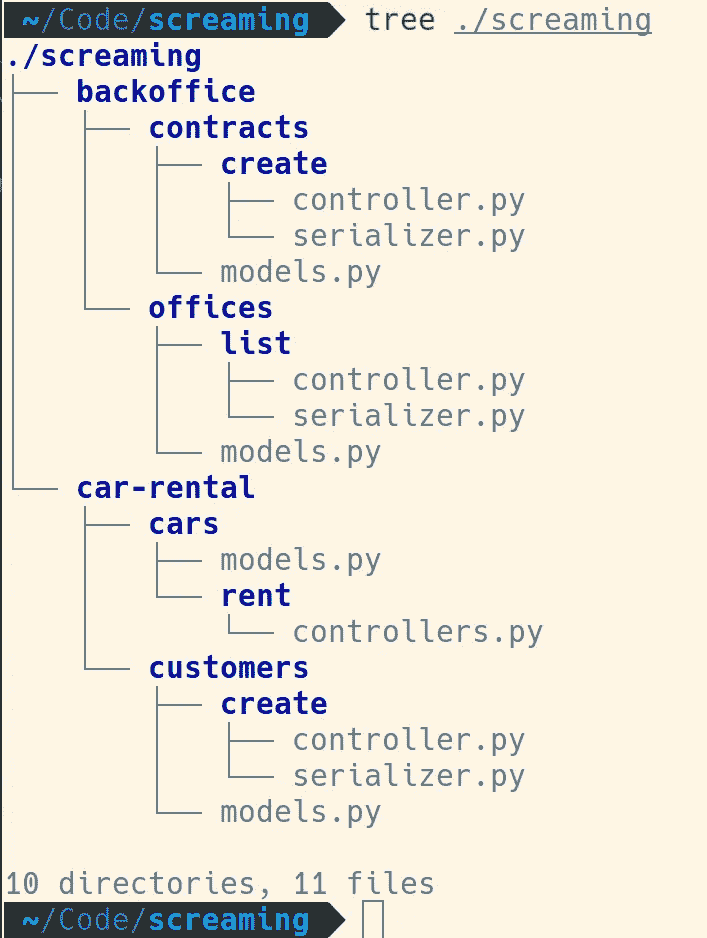

# 什么是尖叫的建筑？

> 原文：<https://levelup.gitconnected.com/what-is-screaming-architecture-f7c327af9bb2>

## 在软件中，架构应该谈论系统背后的领域，而不是实现细节。

在 [Unsplash](https://unsplash.com/s/photos/scream?utm_source=unsplash&utm_medium=referral&utm_content=creditCopyText) 上由 [Marthijn Brinks](https://unsplash.com/@brinks?utm_source=unsplash&utm_medium=referral&utm_content=creditCopyText) 拍照

作为开发人员，我们花了大量的时间查看其他人写的代码。大多数时候，这些代码属于我们目前正在进行的项目，所以我们可以说我们非常了解它。但有时，我们会关注一个全新的项目。这就是为什么一个令人尖叫的建筑让我们的工作变得更加容易。

术语“令人尖叫的架构”是当我们可以，仅仅通过看一眼一个新项目，就可以得到这个项目做什么和它是关于什么的核心思想时使用的。这个术语是罗伯特·c·马丁创造的，也就是鲍勃大叔，你可以在这里[读到它。它与我们如何构建我们的项目有关，因此我们可以在导航的早期看到有价值的信息，同时将实现细节留给“更难达到”的部分。就像向新成员描述项目一样。我们如何在入职培训中解释这一点？我们是否可以通过我们的项目结构来创造这个故事或旅程？](https://blog.cleancoder.com/uncle-bob/2011/09/30/Screaming-Architecture.html)

这座建筑在几英里之外就发出了“机场”的尖叫。尼古拉斯·杰利

我们用一个例子来解释这个。假设我们有一个**汽车租赁**业务，我们有一个软件产品对这个领域的几个方面进行建模，以便提供汽车租赁服务。理想情况下，我们会尝试在项目结构的高层文件夹中，明确“汽车”、“订单”、“合同”、“客户”、“办公室”、“后勤”等名称。同样，这与编程语言、架构类型或项目类型无关。通过例如文件结构中的文件夹，使这些概念具体化的项目结构将是一个令人尖叫的架构。另一方面，如果我们看到像“Angular”、“Django”这样的框架名称，或者像“items”这样的通用名称，我们并没有解释任何关于领域、关于应用程序目的的东西。

尖叫架构的一大好处是它使得项目的进入曲线不那么陡峭。现在项目的启动容易多了，因为在软件的结构中*明确*了软件是关于什么的；解决什么问题，我们正在建模的领域的不同概念组件是什么。另一个好处是，一旦我们进入项目，我们可以推理某个特定的特性去哪里，或者软件的哪个部分可能更容易受到 bug 的影响。这变得更容易，因为影响系统特定部分的逻辑包含在一些边界内，这些边界在软件结构中是*显式的*。

那么，我们怎样才能设计出令人尖叫的建筑呢？这不是关于我们在项目中实现什么类型的架构，而是关于我们“如何”构建它。当然，必须有一项工作是*对领域建模*，然后*设计*系统。这实际上是需要软件设计师经验的工作，我们可以在另一篇文章中介绍大量的方法。举一些具体的例子，让我们看看这两个项目:

作为一个新的开发人员，我不明白这个应用程序做什么

如果我们看一看“不尖叫”这个项目，我们能从第一眼看出什么？这个项目结构是否告诉了我们很多关于它正在解决的业务的信息？我们看到它使用了 Django，所以我们看到了一个框架。我们还可以看到它使用了一个数据库，并且有一些模型，通过了解 Django，我们认为它有构成应用程序数据的实体。我们还看到它有一个 web API，因此这可能会向某个前端公开一个 API。我们可以猜测，在名为“业务”的文件夹中有一些应用程序逻辑，其中包含一些业务规则和一些实用程序。在 web API 中，我们最多只能看到 controllers 文件夹中的汽车租赁和后勤办公室文件。现在让我们来看看一个更令人尖叫的项目结构。

轻松点。我一眼就能想象出所有的概念

如果我们看第二个例子，这个名为“尖叫”的项目在设计它的结构上有一个不同的方法。现在我们看不到对框架、语言或技术(如数据库或 web APIs)的引用。我们快速浏览后看到的是业务实体和可能发生的行为。在第一层，我们看到两个部分:一个“后勤办公室”，我们可以假设它是某种管理部门，和一个“汽车租赁”。后勤部门有合同(可能是可用的合同类型)和办公室(可能是企业的物理办公室)。在汽车租赁中，我们有汽车和客户，然后我们有业务中发生的*行动*。所以一个概念是“租车”，另一个概念是“创造客户”。从项目的结构中可以清楚地看到这些。同样，这是一个说明性的例子，因为在现实世界中，构建一个项目并不容易，因为有太多的事情需要考虑，除了业务知识和软件设计专业知识之外，还需要很多思考。

# 结论

戴着这副眼镜看软件开发，可以更容易地推理软件背后的业务，从而减少软件随着时间的推移将获得的意外复杂性。我希望这是一个好的概念，如果你还不知道的话，如果你知道的话，可能会带来一些想法。一如既往，我很高兴看到你是如何设计你的软件的。你的建筑尖叫够了吗？或者它们可以更吵一点吗？快乐大厦！