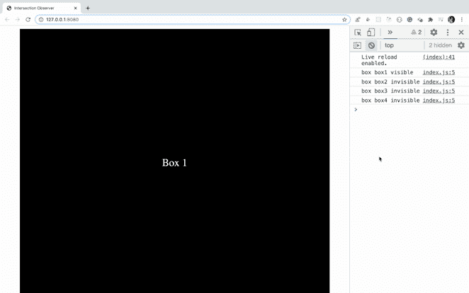
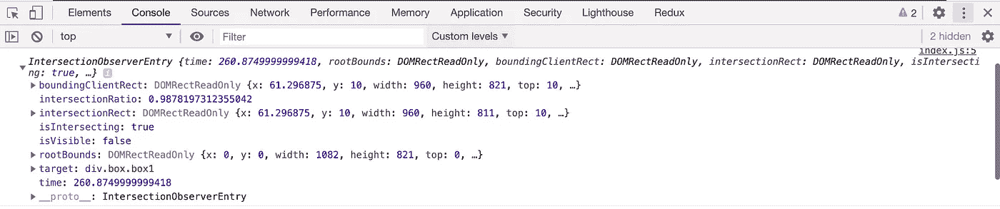
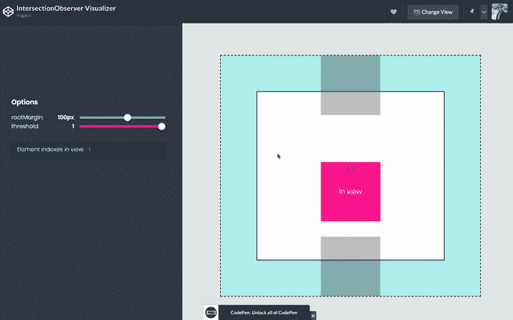
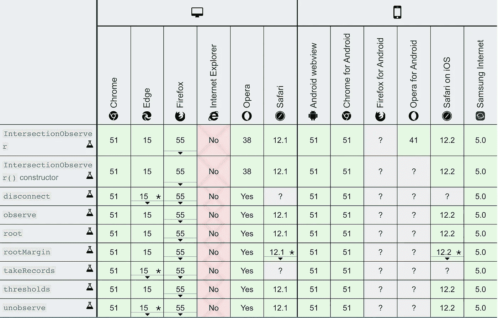

# JavaScript 中的交叉点观察器 API 有什么特别之处

> 原文：<https://levelup.gitconnected.com/what-is-so-special-about-intersection-observer-api-in-javascript-f2430a159fa7>

## 了解这个神奇的应用编程接口，轻松加载图像，滚动播放动画，播放或暂停视频。


Julien Pouplard 在 [Unsplash](https://unsplash.com?utm_source=medium&utm_medium=referral) 上拍摄的照片

> 交叉点观察器 API 提供了一种异步观察目标元素与祖先元素或顶级文档的视口的交叉点变化的方法。

简而言之，`Intersection Observer`提供了一种方法来观察页面上的任何元素，并在部分显示、完全显示或即将显示时做一些事情。

这在各种情况下都很有用，例如

1.开始或停止滚动动画
2。滚动时惰性加载图像
3。滚动时自动播放或暂停视频
4。分析广告是否显示以及被浏览的次数
5。识别什么时候从视窗中显示或隐藏某些东西

可能性是无穷的，因为你现在只需使用`Intersection Observer`就可以轻松完成许多困难的事情。

# 创建交叉点观察点

为了创建一个`Intersection Observer`，我们通过提供两个参数来调用构造函数

*   观察到元素时要执行的回调函数
*   指定何时调用回调的可选选项

```
const observer = new IntersectionObserver((entries, observer) => {

}, options);
```

然后我们添加我们想要观察的页面元素

```
observer.observe(element);
```

看看下面的演示



演示

如您所见，在页面加载时，只有 box1 可见，因此 box1 的`visible`和其他 box 的`invisible`显示在控制台中。

当您滚动页面时，第二个框一显示出来，控制台中就会显示`visible`，如果您继续滚动，没有显示的框就会显示出来。

看一下上面演示的代码。

```
const boxes = document.querySelectorAll(".box");const observer = new IntersectionObserver((entries, observer) => {
  entries.forEach((entry) => {
    console.log(
      entry.target.getAttribute("class"),
      entry.isIntersecting ? "visible" : "invisible"
    );
  });
});boxes.forEach((box) => {
  observer.observe(box);
});
```

这里，最初，我们选择页面上的所有框。

```
const boxes = document.querySelectorAll('.box');
```

然后我们通过传递一个回调函数作为第一个参数来创建一个`Intersection Observer`。

最后，我们添加我们想要观察的单个元素

```
boxes.forEach((box) => {
 observer.observe(box);
});
```

所以现在，每当任何元素在 viewport ( `which is a browser by default`)上显示或隐藏时，回调处理程序将被调用，回调函数的`entries`参数将是包含每个被观察元素的信息的数组。

如果在控制台中打印条目，可以看到每个元素中包含的值。

```
const observer = new IntersectionObserver((entries, observer) => {
  entries.forEach((entry) => {
    console.log(entry);
  });
});
```



条目信息

输出中最有用的属性是`isIntersecting`、`target`和`intersectionRect`

*   `isIntersecting`:当元素与默认根元素相交时，这将是真的，默认根元素在我们的例子中是 viewport
*   `target`:这将是我们将要观察的页面上的实际元素
*   `intersectionRect` : `intersectionRect`告知元素的多少部分可见。这将包含关于元素的信息，它的高度，宽度，它在视图中的位置，等等

`options`对象是`Intersection Observer`构造函数的第二个参数，它有三个属性

*   `root`:用作检查目标可见性的视口的元素(如果未指定或指定为空，则默认为浏览器)
*   `threshold`:该值的范围为 0 到 1。它是一个`single number or an array of numbers`,指示回调应该在目标可见性的多少百分比上执行。如果只想检测可见性何时超过 50%标记，可以使用值 0.5。如果您希望每次可视性超过 25%时都运行回调，那么您应该指定数组`[0, 0.25, 0.5, 0.75, 1]`。threshold 的默认值是`0`(意味着只要有一个像素可见，就会执行回调)。值`1`意味着直到每个像素都可见时才认为通过了阈值。
*   `rootMargin`:指定根部周围的边距。类似于 CSS 的 margin 属性，例如`"10px 20px 30px 40px"`(上、右、下、左)。这些值可以是百分比。默认值为`0px`。注意，如果以像素为单位指定值，则不能省略`px`关键字，因此
    `"10px 0 30px 40px"`无效。你必须添加`px`关键字，否则它将无法工作。

让我们添加`options`对象，它是`Intersection Observer`构造函数的第二个参数。

# 阈值选项

```
const options = {
  threshold: 0.1
};
```

10%阈值演示

正如你在上面的演示中看到的，当 box2 的一部分滚动显示时，回调函数不会被触发，但是当 box2 的 10%滚动显示时，由于阈值的原因，回调函数会被触发。

# 根保证金期权

```
const options = {
 rootMargin: '10px'
};
```

这里，我们在选项中指定了`rootMargin`,对于顶部、右侧、底部和左侧为`10px`,因此视口将在每一侧移动`10px`,这意味着视口和目标元素之间的交集将在每一侧扩展`10px`。所以在 box2 的例子中，当 box2 在视窗上显示之前到达顶部`10px`时，回调将被调用。

如果我们将`rootMargin`指定为`-10px`，那么视口将下移`10px`，因此当 box2 元素的`10px`部分显示时，回调将被触发。

# 根选项

```
const options = {
 root: document.querySelector('#root')
};
```

这与上面的演示是一样的，唯一的区别是浏览器不是视窗，id 为`root`的 div 将成为子元素的视窗。

大多数时候`root`没有被指定，所以它将默认为浏览器视窗。

为了更好地理解`threshold`和`rootMargin`，请查看下面由[米歇尔·巴克](https://michellebarker.co.uk/)制作的可视化演示

演示以清楚了解根界限和阈值

在上面的可视化中，黑色虚线边框指定了`rootMargin`，顶部和底部的两个浅色框指定了`threshold`值。

当您滚动页面时，哪些元素会显示在左侧部分。



让我们从`Intersection Observer`的一些实际应用开始

# 滚动时延迟加载图像

这是`Intersection Observer`最有用的功能之一。如果网站显示了大量图像，那么当浏览器一个接一个地下载图像时，显示这些图像需要一些时间。

因此，我们可以只下载显示区域上的图像，并在用户滚动时下载更多的图像，而不是一次下载页面的所有图像。这将节省带宽，也将更快地加载页面。

如果用户永远不会滚动页面，那么下载页面的所有图片就没有意义。使用延迟加载可以避免用户在移动设备上浏览时下载额外的数据。

这种按需下载的概念被称为`lazy loading`

让我们看看如何使用`Intersection Observer.`轻松实现它

为了延迟加载图像，我们需要一个可以观察的部分，它将触发新图像的加载。

```
<div class="container"></div>
<div class="loading">Loading...</div>
<footer>Footer content</footer>
```

这里，我们将加载`container` div 中的图像，当`loading` div 在视口中可见时，我们将调用一个函数来下载更多的图像并将其附加到`container` div 中。

```
const sectionToWatch = document.querySelector(".loading");
const container = document.querySelector(".container");
const MAX_IMAGES_TO_LOAD = 40;const loadMoreData = () => {
  fetch("./[images.json](https://gist.githubusercontent.com/myogeshchavan97/2202735a1c3d63a16800b91f38921e14/raw/02326380aff81fbae3321426eed19e3cfb83907b/images.json)")
    .then((response) => response.json())
    .then((result) => {
        const images = result.images; images.forEach((image) => {
          const imageDiv = document.createElement("div");
          imageDiv.classList.add("image");
          const img = document.createElement("img");
          img.src = image.source;
          imageDiv.appendChild(img);
          container.appendChild(imageDiv);
       });
    });
};const observer = new IntersectionObserver((entries, observer) => {
  const [end] = entries; // get the first element from entries and store it in variable with name end if (end.isIntersecting) {
    loadMoreData();
  }
  if (container.querySelectorAll(".image").length === MAX_IMAGES_TO_LOAD) {
    observer.unobserve(end.target);
    sectionToWatch.parentNode.removeChild(sectionToWatch);
  }
});observer.observe(sectionToWatch);
```

一旦我们达到了要加载的图像数量，我们将通过观察加载 div 并删除加载 div 来停止加载更多的图像

```
if (container.querySelectorAll(".image").length === MAX_IMAGES_TO_LOAD) {
    observer.unobserve(end.target);
    sectionToWatch.parentNode.removeChild(sectionToWatch);
  }
```

延迟加载图像

# 滑入图像动画

为了在卷轴上实现滑入动画，我们将为所有需要滑入的图像创建 CSS 动画。

```
.image img {
  width: 250px;
  height: 250px;
  margin-right: 20px;
  transform: translateX(-100%);
  transition: all 1s;
}.image img.slide-in {
  transform: translateX(0);
}
```

然后在`Intersection Observer`中，我们将添加或删除`slide-in` CSS 类

```
const observer = new IntersectionObserver((entries, observer) => {
  entries.forEach((entry) => {
    if (entry.isIntersecting) {
      entry.target.classList.add('slide-in');
    } else {
      entry.target.classList.remove('slide-in');
    }
  });
}, options);
```

使用交叉点观察器的滑入动画

如果您不想每次都在卷轴上滑动图像，您可以在图像滑入后取消观察。

```
observer.unobserve(entry.target);
```

# 滚动播放或暂停视频

假设，我们的页面上正在播放一个视频，当视频因为我们滚动了页面而没有显示在屏幕上时，我们可以暂停视频，并在滚动到显示视频的视图时播放它。

我们可以通过添加 html5 视频标签和提供视频源来实现这一点

```
<div class="video-section">
  <video id="endgame_trailer" width="400" controls muted="muted">
    <source src="[https://www.dropbox.com/s/y3guaolykymubxr/video.mp4?dl=1](https://www.dropbox.com/s/y3guaolykymubxr/video.mp4?dl=1)" type="video/mp4" />
    Your browser does not support HTML5 video.
  </video>
</div>
```

然后在代码中，使用播放或暂停方法

```
const video = document.querySelector('#endgame_trailer');

const options = {
  threshold: 0.1
};const observer = new IntersectionObserver((entries, observer) => {
  entries.forEach((entry) => {
    if (entry.isIntersecting) {
      if (video.paused) {
        video.play();
        console.log('playing video');
      }
    } else {
      video.pause();
      console.log('video paused');
    }
  });
}, options);
```

# **浏览器支持:**

> 除 Internet Explorer 之外，所有浏览器都支持交叉点观察器 API。



来源:[https://developer . Mozilla . org/en-US/docs/Web/API/Intersection _ Observer _ API # Browser _ compatibility](https://developer.mozilla.org/en-US/docs/Web/API/Intersection_Observer_API#Browser_compatibility)

> 要添加对 Internet Explorer 的支持，您可以使用此处的[中的 polyfill](https://github.com/w3c/IntersectionObserver/tree/master/polyfill)

因此，正如你所看到的`Intersection Observer` Javascript API 是如此的神奇，你可以在任何 Javascript 框架或库中使用它，如 React、Angular、Vue 等。

今天到此为止。我希望你学到了新东西。

**别忘了订阅我的每周简讯，里面有惊人的技巧、窍门和文章，直接在这里的收件箱里** [**。**](https://yogeshchavan.dev/)