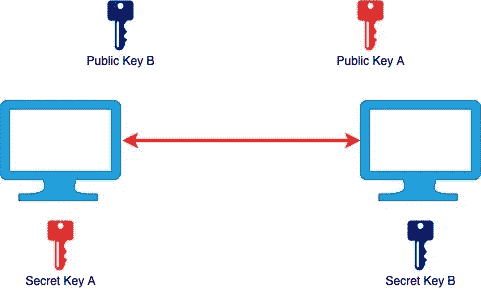

# 什么是宋承宪？

> 原文：<https://levelup.gitconnected.com/what-is-ssh-103f89e3e4b8>

## 安全外壳简介

SSH 或 Secure Shell 是一种网络协议，它允许一台计算机通过不安全的网络(如互联网)安全地连接到另一台计算机，共享如何通信的协议。SSH 是一个[应用层](https://en.wikipedia.org/wiki/Application_layer)协议，它是 [OSI 模型](https://en.wikipedia.org/wiki/OSI_model)的第 7 层。

SSH 非常有用，因为您不必物理访问另一台机器；你可以简单地通过互联网连接到它。这允许我们远程控制服务器。

SSH 最早出现在 90 年代中期，被设计用来替代 [Telnet](https://en.wikipedia.org/wiki/Telnet) ，后者也是一种不加密传输数据的应用层协议。在没有加密的情况下，数据以明文形式在互联网上传输。任何在你和远程机器之间有数据包嗅探器的人都可以看到你传输的所有数据和你做的所有事情。

可以看到纯文本传输的数据

加密是一种隐藏数据的方法，除非您知道如何解码或解密数据，否则无法读取数据。SSH 是作为一种安全的通信方式创建的，它通过隧道对数据进行加密，因此在传输过程中不良行为者无法检索数据。使用 SSH，您仍然可以看到正在传输的数据以及传输了多少数据，但是您看不到数据是什么。

加密的数据不能被中间人读取

SSH 通常使用**客户机-服务器模型**来实现。一台计算机被称为 **SSH 客户端**，另一台计算机充当 **SSH 服务器**，或**主机**。

[**HTTPS**](https://en.wikipedia.org/wiki/HTTPS) ，即超文本传输协议 Secure，也是另一种加密数据的协议。那么宋承宪和 HTTPS 的区别是什么呢？HTTPS 允许网络浏览器与服务器通信来显示网站。SSH 允许[外壳](http://linuxcommand.org/lc3_lts0010.php)实现两个设备之间的数据交换或通信，而不仅仅是浏览器和服务器。Shells 允许您与操作系统对话。

当您连接到 SSH 服务器时，您将进入一个 shell。这个 shell 可以是 Linux 终端 shell 或 Windows 命令提示符 shell，您可以在所连接的机器上执行命令。当您使用终端或命令行时，您是在与您的操作系统对话。使用 SSH，您也可以与远程操作系统对话。

## 用 SSH 可以传输什么？

SSH 可用于传输:

*   数据
*   命令
*   文本
*   文件(使用 SFTP:安全文件传输协议，基本上是 FTP 的加密版本，使得中间人攻击是不可能的)

# SSH 是如何工作的？

SSH 将数据分解成一系列数据包。像任何数据包传输一样，开头有几个字段。

一包

在顶部，**数据包长度**告诉你数据包有多大。之后，你有另一个字节，**填充量**，告诉你有多少填充。然后你有你的数据，**有效载荷**。在有效载荷之后，你有**填充**。这些填充是随机字节，没有任何意义，但与有效载荷一起加密，使检测数据更加困难，因为您已经加入了这些随机的额外数据。最后，您有一个**消息认证码**，这样您就可以确保数据没有被篡改。

有效载荷也可以使用标准压缩算法进行压缩。整个包，不包括长度和认证码，然后被加密。

加密的数据包

然后数据包被发送到服务器。服务器解密数据包并解压缩有效载荷以提取数据。对通过连接发送的每个数据包执行相同的过程。

为了保证 SSH 的安全，SSH 在传输的不同阶段使用三种不同类型的数据操作技术。SSH 中使用的三种技术是:

1.  对称加密
2.  不对称加密
3.  散列法

## 对称加密

对称加密是一种加密类型，其中一个密钥可用于加密发送到目的地的消息，也可用于解密目的地收到的消息。这种加密方案也被称为 ***共享秘密加密*** ，或者 ***共享密钥加密*** 。

图 1:对称加密

两台设备使用相同的密钥来加密发送的数据和解密接收的数据。秘密密钥是特定于每个 SSH 会话的。这是用于加密整个 SSH 连接的加密类型，以防止中间人攻击读取数据，因为他们没有这个密钥。

出现的一个问题是初始密钥交换。如果第三方在密钥交换过程中监听，他们现在就会知道密钥，并能够解密我们所有的消息。防止这种情况的一种方法是使用密钥交换算法。

**密钥交换算法**是一种不被拦截的交换密钥的安全方式。这是通过两台计算机交换公共数据，然后独立处理这些数据以获得密钥来实现的。为了实现密钥交换算法，我们需要非对称加密。

## 不对称加密

不对称加密是通过使用两个单独的密钥进行加密和解密的加密，一个公钥和一个私钥。公钥可以与任何人共享，但私钥永远不会被共享。一个公钥和一个私钥组成一个 ***密钥对*** 。用机器的公钥加密的消息只能用它的私钥解密。公钥存储在 SSH 服务器上，私钥存储在 SSH 客户机上。

图 2:不对称加密

如果我给你我的公钥，你可以用我的公钥加密给我发消息。然后我就可以用我的私钥解密来阅读它。

图 3:非对称加密密钥交换

即使第三方设法获得了公钥，他们也无法解密任何消息，因为他们没有私钥。只要私钥不被发送出去，并且在你的设备上是安全的，你的信息就不能被解密。

SSH 在一些地方使用非对称加密，比如用于设置对称加密的密钥交换算法。非对称加密也用作不使用密码就可以通过 SSH 进入服务器的密钥。我们交换算法来生成用于加密和解密消息的密钥(图 1 中的黄色密钥)。

两个设备都生成临时公钥和私钥，并共享它们各自的公钥。然后，它们独立生成一个新的对称密钥，两台设备都将使用该密钥来加密和解密消息。这个生成是使用 [**Diffie Hellman 密钥交换**](https://en.wikipedia.org/wiki/Diffie%E2%80%93Hellman_key_exchange) 完成的。

在 Diffie Hellman 密钥交换开始时，两个设备需要就它们将用于密钥交换的几个参数达成一致:

*   **发电机**
*   **质数**质数`**n**`

每个设备将使用`**g**`和它们的私钥来生成一个公钥。

如果你想知道 Diffie Hellman 背后的数学，请观看这个视频。

一旦建立了安全的对称通信，服务器就使用客户端的公钥生成一个**挑战**，并将其发送给客户端进行认证。如果客户机能够成功地解密这个挑战，这意味着它拥有连接所需的私钥，SSH 会话就开始了。

## 散列法

哈希是另一种加密形式，用于保护外壳连接。哈希允许您创建一组信息的签名或摘要。这是一个单向过程，哈希数据永远不会被解密。但是这有什么用呢？

如果第三方设法欺骗客户端和主机，他们可以篡改消息。SSH 使用[**【HMAC】**](https://en.wikipedia.org/wiki/HMAC)(**基于哈希的消息认证码**)。HMACs 确保发送的消息以完整且未经修改的形式被接收。

使用散列函数，传输的每条消息都必须包含一个称为 MAC 的东西。此 MAC 是根据对称密钥、数据包序列号和发送的消息内容生成的哈希。将这三个元素组合起来作为哈希函数的输入，这个哈希函数将输出一些没有意义的字符串。这个字符串，或 ***签名*** ，被发送到主机。

现在，主机如何检查消息是否被篡改？

因为主机拥有相同的信息(对称密钥、数据包序列号和消息内容)，所以它们也可以使用相同的哈希函数来生成哈希。如果生成的哈希与接收到的哈希匹配，则验证客户端的 ***签名*** 。

这是可行的，因为如果数据以任何方式改变，即使是像大写字母这样的小事，哈希也会完全不同。

我希望这个快速概述能让您对 SSH 有更好的理解。如果您感兴趣，我列出了以下参考资料，可以用来更深入地研究 SSH。

感谢阅读！

## 参考

 [## SSH 协议

### 这个页面是关于 SSH 协议的。背后的公司，看 SSH 通信安全。对于使用 Linux…

www.ssh.com](https://www.ssh.com/ssh/protocol)  [## SSH 初学者教程——SSH 是如何工作的

### SSH 或 Secure Shell 是一种远程管理协议，允许用户控制和修改他们的远程服务器…

www.hostinger.com](https://www.hostinger.com/tutorials/ssh-tutorial-how-does-ssh-work)