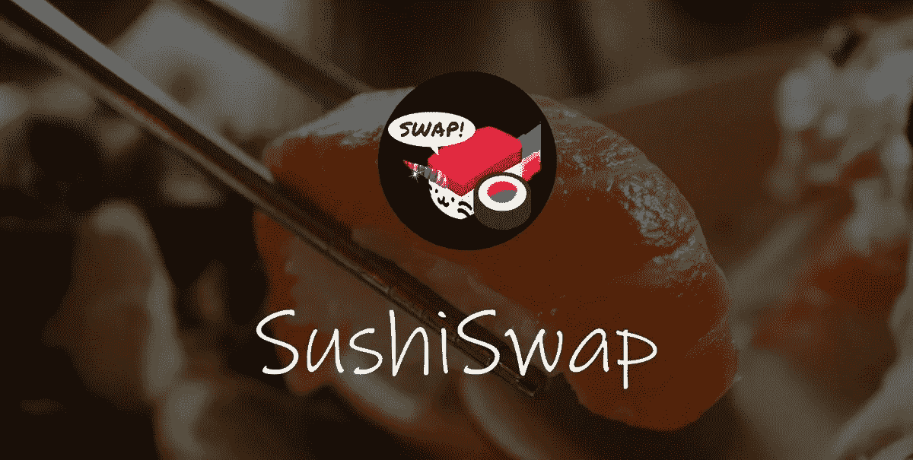

# 什么是 SushiSwap:日本熟食店如何成为 UniSwap 杀手

> 原文：<https://levelup.gitconnected.com/what-is-sushiswap-how-japanese-deli-could-become-a-uniswap-killer-ba21c14e8bc7>

在 UniSwap 成立以来的两年中，分散式交易所巩固了其作为 DeFi 领域中流砥柱的地位。与此同时，它的协议设计本身已经成为一个标准，许多项目都从这个标准中派生出它的机制。SushiSwap 接受了 UniSwap 的一切都是开源的事实。

SushiSwap 认为自己是进化的下一步。从 Uniswap 优雅的核心设计开始，他们增加了面向社区的功能，以帮助改进协议的设计，并为相关的利益主体提供进一步的好处。但这真的是迄今为止最成功的 DEX 的严重竞争对手吗？

找出 SushiSwap 是什么，它是否真的对 UniSwap 构成威胁，以及种植寿司代币是如何工作的。

# SushiSwap 是什么？

SushiSwap 是 Uniswap 的一个分支，有一些关键的不同，最明显的是它的本地寿司令牌。该令牌在发布时有两个功能:它赋予持有者行使治理的权利，以及对部分协议费用的要求权。简而言之，寿司持有者“拥有”该协议的股份。

作为一种有效的代币发行方法，流动性挖掘(产量耕作)的兴起导致了过多新的 DeFi 代币发行。这些措施旨在为所有参与者创造一个公平的竞争环境，

*   没有先决条件，
*   创始人很少或没有拨款
*   并根据所提供的资金进行平均分配。

然后，通过这些流动性激励措施发行的代币授予持有者治理权。此外，我们已经知道寿司持有人也有权获得一部分支付给交易商协议的费用。

令牌持有者还可以提交所谓的 SushiSwap 改进提案(sip ),这要归功于他们的治理权限。这些提议由所有寿司业主投票决定，并在必要时被采纳。这些可能是对 SushiSwap 协议的较小甚至较大的更改。因此，SushiSwap 的未来发展掌握在社区手中。

因此，社区是 SushiSwap 成功的两大支柱之一。另一个支柱是加密团体愿意为协议提供足够的流动性。

SushiSwap 通过激励流动性提供者而得分。许多人首先想到的第一个问题是:为什么有人想在 SushiSwap 而不是 UniSwap 上提供流动性？毕竟，UniSwap 无疑是一个已经建立的、声誉极佳的交易所。那么，为什么会有人想冒险进入未经测试的新领域呢？

通过 Uniswap，流动性提供者只有在积极提供流动性时，才能赚取资金池的交易费。一旦他们从资金池中取出自己的份额，他们就不再获得这种被动收入。此外，如果该协议获得支持，即使它们在早期是流动性提供者，它们也有可能随着风险基金、交易所、矿业集团等(更大、更富有的)利益相关者带着巨额资本加入该协议而被稀释回报。

有了 SushiSwap，人们还可以给池子增加一些流动性，并获得寿司代币奖励。然而，与 Uniswap 不同，这些寿司代币还使您有权继续赚取寿司中累积的一部分协议费，即使您决定停止参与流动性供应。因此，作为促进提供商流动性的早期采用者，您成为了协议的股东。

您从下注中获得的收益与您在协议中下注的流动性池(LP)令牌数量相对于下注的 LP 令牌总量成比例。所以，如果你的贡献是总资金池的 5%，你也将获得其中分配的 5%的代币。

# 寿司的制作和养殖

当然，SushiSwap 的开发者意识到许多现有的流动性提供者已经活跃在 Uniswap 资金池中。为此，他们设计了令牌分发机制，使现有的 Uniswap 流动性提供商尽可能容易地转换到他们的协议。

# SushiSwap 安全吗？

截至 2020 年 9 月 2 日，SushiSwap 的协议尚未接受专业审核。将资金存入智能合约总是会带来出错的风险，即使是在经过审计且声誉良好的项目中。SushiSwap 背后的开发者也是匿名的，所以这个协议可以被认为是更危险的。考虑到这一点，SushiSwap 开发者邀请了几位审计员来审计他们的合同。审计是昂贵的，但是我们已经在其他社区项目中看到，比如 YAM，用户愿意为他们相信的计划提供审计资金。

如果你把 SushiSwap 当成一个实验，那会有所帮助，但是无论如何，你都不应该存下超过你愿意失去的价值。由于以太坊的天然气成本有时非常高，资金较少的农民可能不得不在行动转化为利润之前下注很长时间。所以要时刻关注当前的油费。

# 如何为 SushiSwap 提供流动资金？

如果你决定种植寿司。尽管有风险，还是进行交换。我们现在将向您展示如何正确地做这件事。只要按照这个简单的步骤指南。

首先，决定你想参加哪个池。要做到这一点，去寿司。交换网站，在“菜单”下选择你喜欢的泳池如果你想知道哪个泳池目前最赚钱，你可以去寿司。Zippo.io 并看看当前的 APY(计算的年回报率)。它甚至会显示出你目前每 1000 美元的 LP 代币每小时可以获得多少寿司，所以你可以很好地知道如果你在相应的池中存入 X 数量的寿司，你将会收获多少寿司。

同样清楚的是，你的钱包里需要有两个必要的代币。因为这些是 50/50 池，所以您只能堆叠令牌 1 和令牌 2 的等值。让我们用一个例子来具体说明整个事情:

假设你决定在寿司/ETH 池中养殖，因为这个池目前承诺在寿司方面有最丰厚的回报。当然，你已经购买了寿司和 ETH，你现在钱包里有 200 美元的寿司和 150 美元的 ETH。

在这种情况下，您将无法堆叠最大数量的两种代币。您将只能在寿司中堆叠 150 美元，在 ETH 中堆叠 150 美元(请记住，您还需要额外的 ETH 来支付交易的汽油费)。该比率必须始终保持平衡，即 50/50。

# 结论

SushiSwap 是一个令人兴奋的实验，它挑战了已经成功的 Defi 协议 Uniswap 的竞争优势。SushiSwap 是 Uniswap 的一个分支，主要区别是社区治理。

目前，近 12 亿美元已经存入 SushiSwap，使其成为现场最大的 DeFi 项目之一。然而，SushiSwap 的真正考验将在最初的两周分发期结束后开始。只有到那时，才会清楚 SushiSwap 能否继续成功吸引足够的流动性，与 UniSwap 展开激烈竞争。

无论 SushiSwap 最终有多成功，这表明没有一种产品或服务在 DeFi 中具有不可否认的优势，这是一件好事，因为竞争推动创新。

我在每月的[时事通讯中分享了更多私密的想法，你可以在这里查看](https://mailchi.mp/bf8f8e8ed697/keep-in-touch-with-lukas)。请在评论中告诉我，并在各种社交媒体平台上加入我:

[推特](https://twitter.com/WiesfleckerL) ● [Instagram](https://www.instagram.com/lukaswiesflecker/) ● [脸书](https://www.facebook.com/lukaswiesfleckerr)●[Snapchat](https://www.snapchat.com/add/luggooo)●[LinkedIn](https://www.linkedin.com/in/lukas-wiesflecker-1b11251a5/)

无论你做什么，都要带着爱和激情去做！