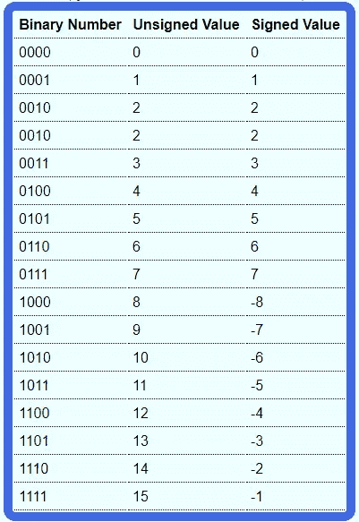

# 什么是二进制补码？

> 原文：<https://levelup.gitconnected.com/what-is-the-2s-complement-d185800bcdab>

由[马库斯·斯皮斯克](https://unsplash.com/@markusspiske)在 [Unsplash](https://unsplash.com/) 上拍摄的照片

二进制补码是对二进制数的数学运算，也是大多数数字系统存储数字的方式。
NB。在进一步阅读之前，你应该对二进制数字系统有一个很好的理解。

# 如何取 2 的补码

## 方法一

要得到一个数的二进制补码，只需对每个位进行补码，然后加 1。

**例子**

二进制中的数字`6`为`0110`，取 2 的补码，对每一位进行补码:`1001`，加 1: `1010`

## 方法二

另一种取二进制补码的方法是从右边的位开始，向左移动，直到找到第一个`1`，然后对其后的每个位进行补码。

**例子**

二进制中的数字 10 是`01010`，右边的位是`0`，所以我们保留它，下一个位是`1`，所以在它之后的每一位都向左补。
于是我们有了`10110`。

# 二进制补码和负数表示

如果你取一个正数的二进制补码，你就得到这个数的负表示，反之亦然。

**示例**

如果你取`5` ( `0101`)的 2 的补码，你得到`1011`这就是你如何表示`-5`。
如果取-5 的 2 的补码(`1011`，得到`0101`，也就是`5`。

怎么知道`1011`是`-5`，还是`11`？
负数使用二进制补码结合所谓的“有符号数表示法”进行存储。
用有符号数表示，最高有效位(MSB)，即左边的数，用来表示该数是正(`0`)还是负(`1`)。这个位被称为“符号位”。只要遵循二进制补码方法，并记住 MSB 是符号位，您可以使用任意位数来表示+ve 或–ve 数。

**示例**

数字`6`可以表示为`0110`，那么–ve 的表示就是`1010`。
我们可以在`0110`前面放置任意数量的`0`，那么如果用`00110`你会如何表示`6`？只要按照 2 的补码:
`00110` ->-

我们可以看到，只要记住 MSB 代表符号位，就可以使用任意位数。

**示例**

要用有符号数表示法表示`6`，不能写`110`。由于 MSB 是`1`，所以这个数字实际上代表的是`-2`。

# 那么我们可以用 n 位表示什么数呢？

先说个例子。

**示例**

不关心 2 的补码或有符号数表示，用`n = 4`位可以有什么组合？
通过`n = 4`，可以有`2⁴ = 16`的组合，如下表所示:

# 1000 的二进制补码呢？

有趣的是，如果取`1000`的 2 的补码，就得到`1000`！
记住`1000`是`-8`，而不是`+8`，因为 MSB 是`1`。
也不是`-0`，因为`0`和`-0`相等，`0`已经用`0000`表示了。一个数字没有必要有两种表示。为了表示`+8`，你需要一个额外的位(`01000`)。
这让很多人困惑，但是如果你坚持取 2 的补码，你会发现`1000`等于`-8`。

# 公式

有了`4`位，就可以有无符号数`0`到`15` (NB。`15 = 2⁴-1`)，这总共给我们提供了`16`(或`2⁴`)个数字。
使用带符号的数字表示法，你可以有`-8`(或`-2⁴–1`)到`+7`(或(`2^(4–1))–1`)(总共`16`个数字)。
这为我们提供了如下公式:
用`n`位，我们可以表示有符号数`–2^(n-1)`到`2^(n-1)–1`，
用`n`位，我们可以表示无符号数`0`到`2^(n-1)`。
在这两种情况下，我们仍然有相同数量的数字(`2^n`)，只是带符号的数字向左移动了一半，用负数替换了较高的+ve 数字。

# C#中的整数溢出

如果你再看一下上表，注意当你不断加 1 时，数字会变得更高，直到你到达`7`。从`7`开始，如果你加 1，你会得到一个“溢出”，你会得到最大的负数。这就是在 C#中发生的事情，当你给一个已经是最大值的 int(或其他数据类型)加 1，当这发生时，抛出一个`System.OverflowException`。
现在你已经了解了整数是如何在幕后工作的，你现在可以理解为什么在添加`1`时，一个 int 会从`2147483647`(或`2³²–1`)变为`-2147483648` ( `-2³²`)(还记得公式吗？).

# 为什么 Int32？MaxValue = 2，147，483，647？

很多程序员都知道一个 int 可以存储的最大值是`2,147,483,647`，但是实际上很少有人知道为什么。
现在你知道了 2 的补码和有符号数表示，你就能理解为什么`Int32.MaxValue` = `2,147,483,647`了！
顾名思义，`Int32`整数是用`32`位存储的。第一位(或 MSB)是符号位，接下来的`31`位代表数字。
记住这一点，看看`2,147,483,647`是如何使用二进制存储在内存中的:
`0111 1111 1111 1111 1111 1111 1111 1111`(或十六进制的`0x7FFFFFFF`)
每个半字节(`4`位)之间的间距只是为了可读性。
如你所见，这是使用`32`位有符号数表示法可以存储的最大数。
如果你试图将这个数增加`1`，你会得到一个进入 MSB 的进位，这会将符号位设置为`1`，并将所有其他位设置为`0`，那么这个数就是`-2,147,483,648`。想了解更多信息，请看一看 MSDN。